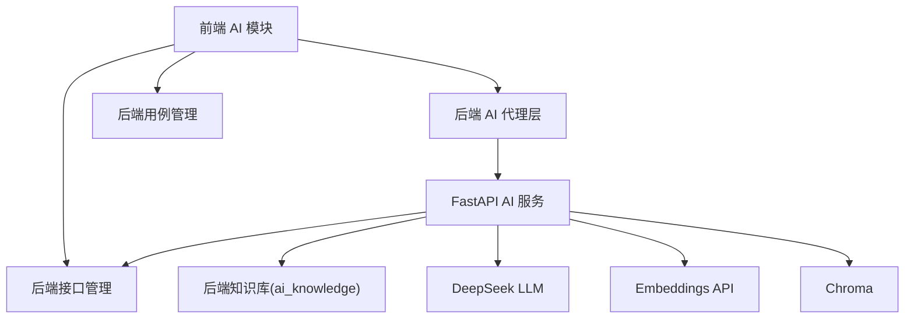

# AI 相关模块 MVP 实施方案（待办）

## 需求分析

### 需求总览（按优先级）

#### P0：必须满足

- 知识库管理不嵌入左侧边栏，改为弹窗管理界面（目录树 + 文档 CRUD + 索引/重建索引/删除）。
- 对话必须是真 SSE 流式输出（token 级）；前端必须实时渲染（Markdown/Mermaid）且不出现“非流式”体验。
- 用例生成必须以接口 ID 为核心：
  - 仅允许对项目已存在接口生成用例；
  - 生成的用例结构严格对齐后端新增用例数据结构（`CaseRequest`），步骤中必须是 `caseApis[].apiId`；
  - 预览必须可编辑，复用“用例管理-新增用例（API）”组件；
  - 保存必须真实调用后端保存接口，禁止伪成功提示。
- RAG 必须走向量检索链路；Embedding 必须可用；索引/检索必须可观测；修复 Windows Embedding DLL 失败。
- 路由切换到其他页面不得自动中断对话（默认策略），避免“切页面就断”。
- 修复前端偶发报错：`relativeURL.replace is not a function`。
- Langchain支持React框架逻辑，支持Rag，支持Memory记忆对话

#### P1：应尽量满足（不引入大改动）

- 预留“离开确认并中断”策略（与默认不断策略互斥）。
- 用例生成：对“不存在接口”的需求，先触发接口生成并复用接口新增组件渲染，让用户确认保存后再生成用例。

### 模块依赖关系

### 核心痛点与难点说明

- “非流式”的根因通常是服务端假流式（先生成后切片），必须从 AI 服务源头改为 LLM 真 stream。
- Windows Embedding 失败属于环境/依赖问题（torch DLL），最小风险方案是改用远端 Embeddings API，避免本地模型加载。
- 用例生成的真实落库依赖“接口已存在并有 ID”；因此必须把“接口生成/保存”与“用例生成”拆成可控的两段式流程。
- 复用既有组件（接口新增、用例新增）是最小改动且最不易引入回归的策略，但需要设计好“弹窗/抽屉承载 + 数据灌入”方式。

## 设计实现

### 总体实施策略（最小改动、开闭原则）

- AI 模块内部重构为“入口/弹窗/复用组件”三层：
  - AI 助手页仅负责对话与入口按钮，不承载知识库与复杂表单；
  - 知识库、用例生成、接口生成分别由弹窗承载；
  - 表单编辑复用既有 caseCenter/interfaceManage 组件，不改动其业务逻辑，仅做“以 props/事件方式托管”。

### 详细设计与实施要点

#### 1) 知识库：从侧栏嵌入改为弹窗管理

- 前端
  - 左侧“知识库”Tab 仅保留按钮：打开知识库管理；
  - 弹窗内：目录树 + 操作按钮（新建目录/新建文档/查看/编辑/重建索引/删除）。
- 后端
  - 维持现有知识库 CRUD 与 `parentId` 存储；
  - 删除目录前校验子节点数量；
  - 索引接口返回明确结构：`indexed`、`degraded`、`errorMessage`、`vectorCount`。
- AI 服务
  - 索引时：目录不索引；文档索引必须以向量入库成功为“成功条件”；
  - 增加 `rag-status`：Embedding 可用性、最近错误、当前向量库/回退库状态。

#### 2) RAG：Embedding 修复与“强制向量检索”

- Embedding 方案
  - 采用 OpenAI 兼容 Embeddings API（与现有 `langchain-openai/openai` 依赖匹配），配置 DeepSeek `base_url` 与 embedding model；
  - 删除/禁用 `sentence-transformers` 的强依赖路径作为默认分支（保留为可选后备，但不作为 MVP 默认）。
- 关键行为
  - 索引接口若 Embedding 不可用：返回 degraded，并禁止标记“已索引”；
  - 检索接口若向量不可用：返回 degraded 并明确提示“向量不可用，无法满足RAG要求”，避免静默回退误导。

#### 3) 对话：真流式 + 页面切换不断

- FastAPI（源头）
  - 改造 `chat_stream` 为真 stream：直接从 LLM 流中读 delta，立刻 `yield data:{type:'content',delta}`；
  - 结束条件：显式发送 `type=end`；
  - 客户端断开：捕获取消/写入异常并终止生成器，避免无意义资源消耗。
- SpringBoot（代理）
  - 继续使用 `SseEmitter` 转发；
  - 在 emitter 发送失败时中断下游读流任务，避免线程挂起。
- Vue（消费）
  - 保持 fetch+reader 的 SSE 解码，按事件增量拼接 assistant 内容并立即渲染；
  - 路由切换时默认不 abort：移除“离开即 abort”的行为，或用 keep-alive 承载 AIAssistant 页面状态。

#### 4) 用例生成：接口ID驱动 + 复用用例新增组件 + 真保存

- AI 服务输出结构（强约束）
  - 输出必须是 `CaseRequest`，并保证：
    - `projectId`、`type='API'`、`moduleId/moduleName`、`name/level/description`、`commonParam` 等字段完整；
    - `caseApis[]` 每项包含 `apiId`（接口ID）、`index`、`description`、以及 header/query/rest/body/assertion/relation/controller 的合法结构。
- 接口存在性规则
  - AI 服务生成前必须从后端拉取/校验 `apiId` 归属项目且存在；
  - 若用户需求涉及不存在接口：返回 `missingApis[]`，触发前端进入“接口生成”弹窗流程。
- 前端交互
  - 用例生成第 3 步展示不再使用 JSON `<pre>`；
  - 改为挂载 `apiCaseEdit.vue`（或抽取可复用组件）并把生成 JSON 解析填充到 `caseForm`；
  - 用户编辑后点击保存，前端调用既有 `/autotest/case/save`，并以真实返回决定提示文案。

#### 5) relativeURL.replace 报错修复

- 定位原则：仅修复 AI 模块内部调用链（buildApiUrl / fetch / ajax wrapper），不改全局 axios 行为。
- 目标：保证 AI 模块所有 URL 输入始终为 string，避免非 string 进入 replace/拼接逻辑。

### 关键接口与数据结构对齐（用于提示词与校验）

- 后端新增用例结构：`CaseRequest`、`CaseApiRequest`（核心字段：`caseApis[].apiId`）。
- 后端接口列表：`/autotest/api/list/{goPage}/{pageSize}`（用于 AI 服务拉取项目接口）。
- 后端保存接口：`/autotest/case/save`、`/autotest/api/save`（复用，不新增新保存接口为优先）。

### 单元测试与联调策略

- FastAPI：新增/完善 `tests/`（独立目录）覆盖：
  - RAG：embedding 可用性、索引成功/降级、检索返回结构；
  - 对话：SSE 事件格式、end 事件、取消行为；
  - 用例生成：输出结构强校验、apiId 校验、missingApis 分支。
- SpringBoot：在 `src/test/java` 补充 AI 相关测试：
  - 知识库目录删除保护；
  - AI 代理接口鉴权与参数透传；
  - 用例保存接口在 AI 流程中真实落库的最小冒烟测试（可用 Testcontainers 或本地 MySQL 连接）。
- 端到端：启动三端，按验收清单进行手工与脚本验证（对话流式、RAG 命中、用例生成与保存）。
