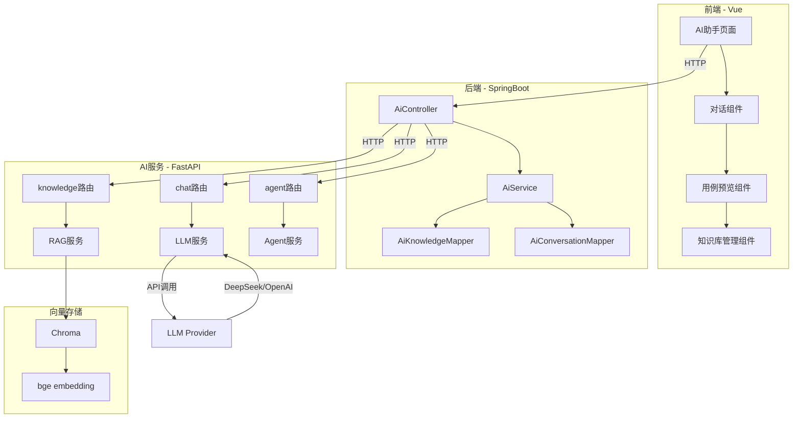
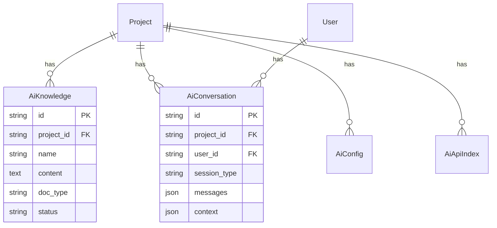
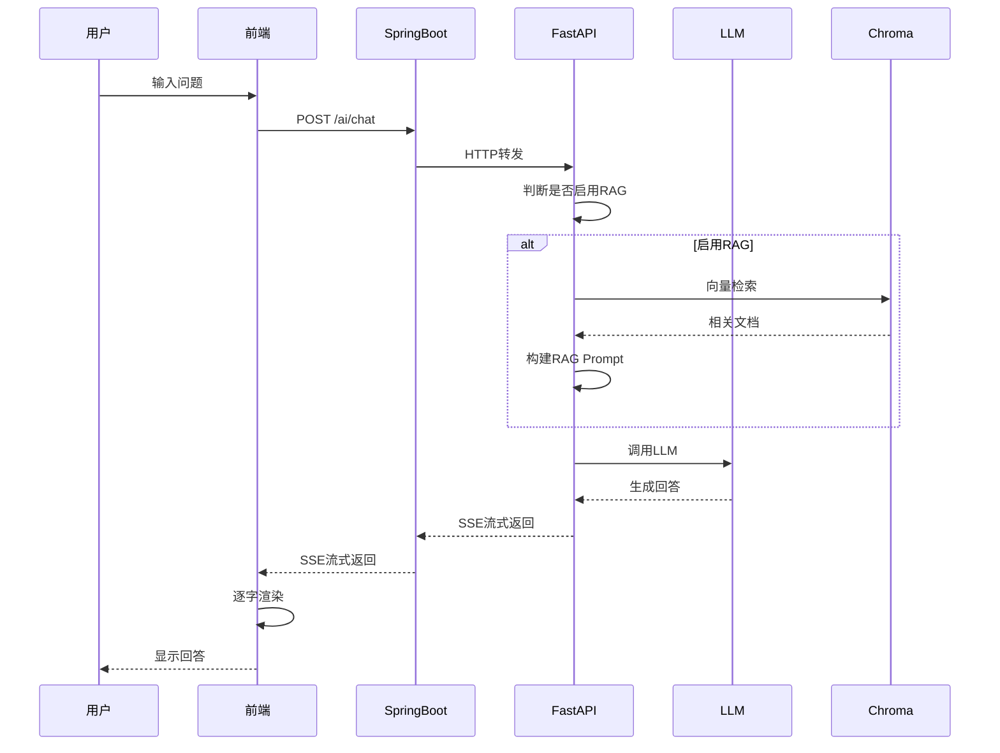
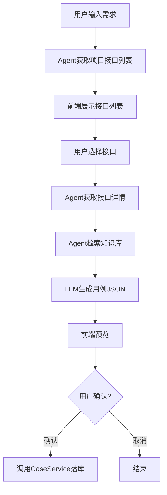

# AI 智能测试助手 - 实现方案说明书

## 一、需求分析

### 1.1 背景说明

流马自动化测试平台是一个成熟的分布式 API/Web/App 自动化测试平台，采用 SpringBoot + Vue 架构。平台支持用例管理、接口管理、定时任务、分布式执行等功能。随着 AI 技术的发展，拟为平台增加 AI 智能测试助手功能，提升测试效率。

### 1.2 需求分析

#### 1.2.1 业务需求确认

| 需求项         | 确认内容                                                                              |
| -------------- | ------------------------------------------------------------------------------------- |
| 对话历史存储   | SpringBoot 数据库（Flyway 管理）                                                      |
| 知识库隔离     | 按项目隔离                                                                            |
| 用例生成流程   | 用户输入需求 → AI 查询项目接口列表 → 用户选择接口 → AI 生成用例 → 前端预览 → 确认落库 |
| 接口数据集成   | 自动将项目接口文档加入知识库                                                          |
| 对话界面       | 独立页面（左侧导航"AI 助手"入口）                                                     |
| 输出方式       | SSE 流式输出                                                                          |
| Agent 数据获取 | FastAPI 直接调用 SpringBoot REST API                                                  |

#### 1.2.2 核心功能需求

**功能一：AI 对话助手**

- 基于 RAG 技术的项目知识库问答
- 支持 SSE 流式输出
- 会话历史管理

**功能二：智能用例生成**

- 自动获取项目接口列表
- 用户选择接口后 AI 生成测试用例
- 前端预览确认后落库

**功能三：知识库管理**

- 文档上传与管理
- 自动索引与向量存储
- 项目接口自动同步

### 1.3 目标说明

1. 实现低代码 AI 辅助测试，降低测试用例编写门槛
2. 保持 SpringBoot 后端低复杂度，AI 服务独立部署
3. 支持多项目知识库隔离
4. 提供 SSE 流式输出，提升用户体验

---

## 二、设计实现

### 2.1 实现方案

#### 2.1.1 技术选型

| 组件           | 选型              | 理由                                   |
| -------------- | ----------------- | -------------------------------------- |
| AI 服务框架    | FastAPI           | 轻量、异步支持好、与 Python 生态集成佳 |
| Agent 框架     | LangChain         | 主流 LLM 开发框架、工具调用支持        |
| 向量数据库     | Chroma            | 轻量、Python 原生、适合 MVP            |
| Embedding 模型 | bge-small-zh-v1.5 | 33M 参数、效果不错、速度快             |
| LLM            | DeepSeek          | 国产性价比高、API 稳定                 |

#### 2.1.2 架构模式

采用**前后端分离 + AI 服务独立部署**模式：

- SpringBoot 后端：业务控制器，仅负责 HTTP 请求转发和数据持久化
- FastAPI AI 服务：独立进程，负责 LLM 调用、RAG 检索、Agent 推理
- Vue 前端：新增 AI 助手页面

#### 2.1.3 数据流转

```
┌─────────────┐    HTTP     ┌─────────────┐    HTTP     ┌─────────────┐
│   Vue前端   │ ──────────▶ │ SpringBoot  │ ──────────▶ │  FastAPI   │
│  (AI页面)   │             │   后端      │             │  AI服务    │
└─────────────┘             └──────┬──────┘             └──────┬──────┘
       │                            │                            │
       │                            │ HTTP                      │
       │◀──────────────────────────┘                            │
       │                                                       │
       │                        ┌───────────────────────────────┘
       │                        │ HTTP调用
       ▼                        ▼
┌─────────────┐         ┌─────────────┐         ┌─────────────┐
│  SSE流式   │         │   MySQL     │         │   Chroma    │
│  输出      │         │  (数据库)    │         │  (向量库)   │
└─────────────┘         └─────────────┘         └─────────────┘
```

### 2.2 系统整体架构



### 2.3 模块详情结构

#### 2.3.1 后端模块

| 模块                 | 职责           | 关键类                         |
| -------------------- | -------------- | ------------------------------ |
| AiController         | HTTP 请求入口  | 处理对话、知识库、用例生成 API |
| AiService            | 业务逻辑处理   | 协调 AI 服务和数据持久化       |
| AiKnowledgeMapper    | 知识库数据访问 | CRUD 操作                      |
| AiConversationMapper | 会话数据访问   | CRUD 操作                      |

#### 2.3.2 AI 服务模块

| 模块           | 职责         | 关键类                  |
| -------------- | ------------ | ----------------------- |
| chat 路由      | 对话 API     | SSE 流式响应            |
| knowledge 路由 | 知识库 API   | 索引、检索              |
| agent 路由     | 用例生成 API | Agent 编排              |
| LLM 服务       | 大模型调用   | LangChain LLM           |
| RAG 服务       | 向量检索     | Chroma + Embedding      |
| Agent 服务     | Agent 推理   | LangChain Agent + Tools |

### 2.4 数据模型设计

#### 2.4.1 数据库表

```sql
-- 知识库文档表
CREATE TABLE ai_knowledge (
    id VARCHAR(32) PRIMARY KEY,
    project_id VARCHAR(32) NOT NULL,
    name VARCHAR(255) NOT NULL,
    content TEXT,
    doc_type VARCHAR(32) DEFAULT 'manual',
    source_type VARCHAR(32) DEFAULT 'manual',
    status VARCHAR(16) DEFAULT 'active',
    create_time BIGINT,
    update_time BIGINT,
    create_user VARCHAR(32),
    update_user VARCHAR(32),
    INDEX idx_project (project_id)
);

-- 会话历史表
CREATE TABLE ai_conversation (
    id VARCHAR(32) PRIMARY KEY,
    project_id VARCHAR(32) NOT NULL,
    user_id VARCHAR(32) NOT NULL,
    session_type VARCHAR(32) DEFAULT 'chat',
    title VARCHAR(255),
    messages JSON,
    context JSON,
    use_rag TINYINT(1) DEFAULT 1,
    status VARCHAR(16) DEFAULT 'active',
    create_time BIGINT,
    update_time BIGINT,
    INDEX idx_project_user (project_id, user_id)
);

-- AI配置表
CREATE TABLE ai_config (
    id VARCHAR(32) PRIMARY KEY,
    config_key VARCHAR(64) NOT NULL,
    config_value VARCHAR(500),
    is_global TINYINT(1) DEFAULT 0,
    project_id VARCHAR(32),
    status VARCHAR(16) DEFAULT 'active',
    create_time BIGINT,
    update_time BIGINT,
    UNIQUE KEY uk_key_project (config_key, project_id)
);

-- 接口索引表
CREATE TABLE ai_api_index (
    id VARCHAR(32) PRIMARY KEY,
    project_id VARCHAR(32) NOT NULL,
    api_id VARCHAR(32) NOT NULL,
    api_name VARCHAR(255),
    api_path VARCHAR(500),
    api_method VARCHAR(16),
    api_info TEXT,
    indexed_status VARCHAR(16) DEFAULT 'pending',
    create_time BIGINT,
    update_time BIGINT,
    INDEX idx_project (project_id)
);
```

#### 2.4.2 实体类关系



### 2.5 核心业务流程

#### 2.5.1 AI 对话流程



#### 2.5.2 用例生成流程



### 2.6 异常处理机制

| 场景                         | 处理方式                       |
| ---------------------------- | ------------------------------ |
| LLM API 调用失败             | 返回友好提示，记录日志         |
| 向量检索失败                 | 降级为纯 LLM 对话              |
| SpringBoot 调用 FastAPI 超时 | 熔断返回，默认 30s 超时        |
| SSE 连接断开                 | 前端自动重连机制               |
| 知识库索引失败               | 状态标记为 error，记录错误信息 |

### 2.7 关键接口设计

#### 2.7.1 AI 对话接口

```java
// 请求
POST /autotest/ai/chat
{
    "project_id": "项目ID",
    "message": "用户消息",
    "use_rag": true,
    "conversation_id": "会话ID"
}

// 响应 (SSE)
data: {"type": "content", "delta": "你好"}
data: {"type": "content", "delta": "，我是"}
data: {"type": "end"}
```

#### 2.7.2 用例生成接口

```java
// 请求
POST /autotest/ai/generate/case
{
    "project_id": "项目ID",
    "user_requirement": "测试用户登录接口",
    "selected_apis": ["api_id_1", "api_id_2"]
}

// 响应
{
    "case_name": "用户登录测试",
    "case_apis": [
        {
            "api_id": "接口ID",
            "header": "{}",
            "body": "{\"username\":\"{{username}}\"}",
            "assertion": "[...]"
        }
    ]
}
```

### 2.8 技术架构说明

#### 2.8.1 目录结构

```
TestPlatform/
├── platform-backend/
│   └── src/main/java/com/autotest/
│       ├── controller/AiController.java    # 新增
│       ├── service/AiService.java          # 新增
│       ├── domain/AiKnowledge.java         # 新增
│       ├── domain/AiConversation.java       # 新增
│       └── mapper/AiKnowledgeMapper.java    # 新增
│   └── src/main/resources/db/
│       └── V1.26__init_ai.sql              # 新增
│
├── platform-frontend/
│   └── src/views/
│       └── aiAssistant/                    # 新增
│           ├── index.vue
│           ├── chatWindow.vue
│           └── casePreview.vue
│
└── ai-service/                             # 新增
    ├── app/
    │   ├── main.py
    │   ├── config.py
    │   ├── routers/
    │   │   ├── chat.py
    │   │   ├── knowledge.py
    │   │   └── agent.py
    │   └── services/
    │       ├── llm_service.py
    │       ├── rag_service.py
    │       └── agent_service.py
    └── requirements.txt
```

#### 2.8.2 技术栈清单

| 层级       | 技术              | 版本    |
| ---------- | ----------------- | ------- |
| 后端框架   | SpringBoot        | 2.6.0   |
| 后端 ORM   | MyBatis           | 2.2.0   |
| 前端框架   | Vue               | 2.7.16  |
| AI 服务    | FastAPI           | 0.109.0 |
| Agent 框架 | LangChain         | 0.1.4   |
| 向量库     | Chroma            | 0.4.22  |
| Embedding  | bge-small-zh-v1.5 | -       |
| LLM        | DeepSeek          | -       |

---

## 三、核心难点说明

### 3.1 SSE 流式输出

- 前端使用 EventSource 或 fetch+ReadableStream 接收
- 后端使用 SseEmitter(SpringBoot)或 StreamingResponse(FastAPI)
- 需要处理连接断开和重连

### 3.2 项目数据隔离

- 所有查询必须带 project_id 过滤
- Chroma 使用 collection 隔离，命名规范：project\_{project_id}

### 3.3 Agent 工具调用

- LangChain Agent 需要调用 SpringBoot REST API 获取数据
- 需要封装平台 API 客户端，处理认证和超时

### 3.4 用例生成准确性

- LLM 生成的用例 JSON 需要与现有 CaseService 兼容
- 需要设计 Prompt 模板，确保输出格式正确

---

## 四、实施检查要点

- [ ] 数据库 Flyway 脚本正确执行
- [ ] FastAPI 服务可正常启动
- [ ] SSE 流式输出正常
- [ ] 项目数据隔离正常
- [ ] 用例生成可正确落库
