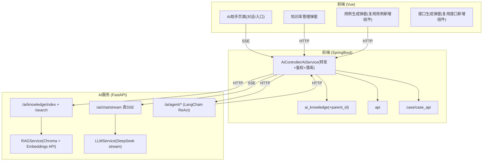
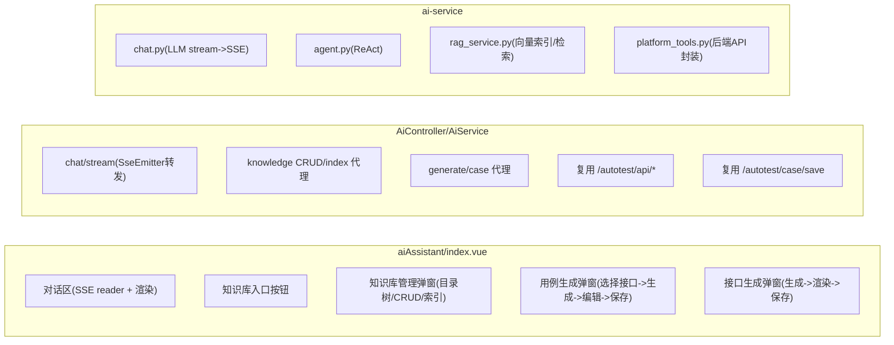
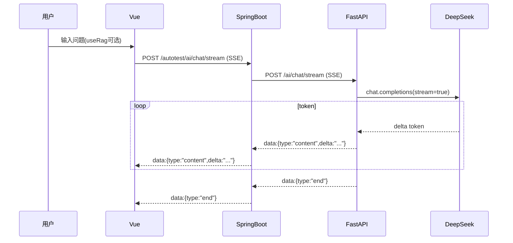
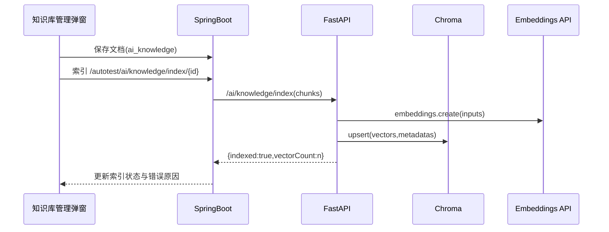
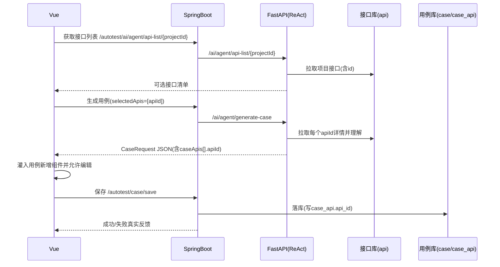

# AI 相关模块 MVP 规格说明（待办）

## 需求分析

### 背景说明
- 平台为 SpringBoot + Vue 的自动化测试平台；AI 模块为新增：SpringBoot 通过 RPC/HTTP 转发调用 FastAPI AI 服务。
- 目标是在不影响现有稳定模块的前提下，把 AI 对话、知识库、用例生成三条链路打到“可用、可测、可回归”的 MVP。

### 目标说明（MVP）
- AI 对话：SSE 真流式输出（token 级增量），支持 Markdown/Mermaid 渲染；切换页面不自动中断（默认策略）。
- 知识库：知识文档管理不嵌入左侧边栏；以弹窗作为管理界面，支持目录树/CRUD/索引状态/重建索引/删除保护。
- RAG：强制使用向量库检索链路；Embedding 必须可用；索引成功/降级必须可观测。
- 用例生成：仅对项目中已存在接口生成；输出严格对齐后端新增用例数据结构；预览可编辑；保存真实落库且 `case_api.api_id` 为接口 ID。

### 范围与约束
- 仅修改新增 AI 相关模块：
  - 前端：`platform-frontend/src/views/aiAssistant/*`
  - 后端：`platform-backend` 的 AI 控制器/服务/知识库表与相关接口
  - AI 服务：`ai-service/app/*`
- 不允许改动无关正常功能模块；允许“复用既有组件/既有接口”但不得改变其原有行为。
- 不允许“伪成功”提示：任何保存/索引/生成必须以真实后端结果为准。

### 需求分析（按功能域拆解）

#### 1) 知识库管理（UI/业务）
- 交互要求
  - 左侧只保留“知识库”入口与“打开知识库管理”按钮，不展示目录树/文档操作。
  - 弹窗中展示目录树与文档操作：新建目录/新建文档、查看、编辑、重建索引、删除。
- 业务规则
  - `docType=folder` 为目录，仅参与层级关系，不参与索引。
  - 删除目录前必须校验子节点数量为 0，否则拒绝。
  - 索引状态需明确区分：未索引/索引成功/索引失败/降级（Embedding 不可用）。

#### 2) 对话（SSE/体验）
- 必须是真流式：AI 服务对 LLM 使用 stream 模式并逐 token 产出，禁止“整段生成后切片假流式”。
- 对话页面切换行为
  - 默认：切换到其他页面不自动中断正在生成的对话（持续在后台生成，返回后可继续看到输出）。
  - 可选：提供“离开确认并中断”的策略开关（不作为 MVP 强制，但需预留设计位）。

#### 3) RAG（向量检索强制）
- 必须启用向量检索：向量入库与 query 检索都可验证（返回引用片段/来源元信息）。
- Embedding 运行环境稳定性
  - Windows 环境下 `sentence-transformers/torch` 可能出现 DLL 初始化失败（如 `c10.dll`），需采用不依赖本地 Torch 的 Embedding 方案（优先：OpenAI 兼容 Embeddings API）。
  - Embedding 不可用时不得静默降级并标记“已索引”；必须对外返回 degraded + error。

#### 4) 用例生成（接口ID驱动 + 复用既有组件）
- 前置约束
  - 项目用例与接口是 1 对多：新增用例提交步骤时提交的是 `api_id`（即 `caseApis[].apiId`）。
  - 用例生成只允许选择项目内存在的接口；不存在接口需先走“接口生成 -> 复用接口新增组件 -> 用户保存”。
- 输出要求
  - AI 服务返回的用例必须严格对齐后端新增用例结构（`CaseRequest`），其中步骤必须包含 `caseApis[].apiId`。
  - 预览不可使用纯 JSON `<pre>`；必须复用“用例管理-新增用例（API）”组件，解析 JSON 后灌入表单供用户编辑并保存。
- 异常处理
  - 生成 JSON 非法：服务端修复失败则报错；前端不进入“保存成功”分支。
  - 保存失败：前端展示后端错误 message，不弹成功。

### 非功能需求
- 安全：不打印/回显 DeepSeek API-Key；仅在服务端配置读取。
- 可观测：AI 服务提供诊断能力（RAG 状态、Embedding 错误）；后端与前端将关键错误呈现为可定位信息。
- 回归控制：AI 模块改动需有单元测试与端到端联调验证清单。

## 设计实现

### 技术架构说明（系统整体架构图）

### 模块详情结构图（目标模块内部拆分）

### 数据流转图（核心链路）

#### 1) 对话（真流式）

#### 2) 知识库索引与检索（向量优先）

#### 3) 用例生成（接口ID驱动 + 不存在接口先生成）

### 关键实现方案（最小改动优先）

#### 1) Embedding 与 RAG（修复 WinError 1114）
- Embedding 方案调整：优先使用 `langchain-openai` 的 Embeddings（OpenAI 兼容协议）并配置 DeepSeek `base_url`，避免本地 `torch` DLL 依赖。
- 可观测性：RAG 必须暴露 `available/degraded/last_error/vector_count`，索引接口返回 `indexed` 与原因，前端据此展示状态。

#### 2) 真流式输出
- FastAPI：对 LLM 走流式接口，逐 chunk 直接 yield SSE（`type=content`），结束 yield `type=end`。
- SpringBoot：只做 SSE 转发；若客户端断开，需尽快中断下游读流并回收资源。

#### 3) 知识库弹窗化
- 左侧知识库 Tab：只保留入口按钮；弹窗内放置目录树与所有操作。
- 目录树数据源：后端返回平铺列表（含 parentId），前端构建树；目录节点操作与文档节点操作不同。

#### 4) 用例生成“可编辑预览 + 真保存”
- 前端：用例生成第 3 步不再 `<pre>`，改为挂载 `apiCaseEdit` 复用组件（以“组件模式”打开并填充数据）。
- 后端：删除 `/autotest/ai/generate/case/save` 占位或改为真实调用 `/autotest/case/save`；成功提示由真实返回驱动。
- AI 服务：生成用例前必须查询接口 ID 列表并仅以 ID 组装；对不存在接口返回 `missingApis` 指示前端进入“接口生成”流程。

### 业务逻辑设计

#### 对话异常处理机制
- 下游 AI 服务不可用：SSE 推送 `type=error` 且 message 可定位（超时/鉴权/网络）。
- LLM 流中断：立即 push `type=error`，并在前端允许继续发送下一条。

#### RAG 异常处理机制
- Embedding 不可用：索引接口必须返回 `indexed=false` + `degraded=true` + `error`；检索接口必须返回 `degraded=true` 并阻断“向量检索成功”的误判。
- Chroma 数据损坏/collection 不存在：返回明确错误与自愈建议（重建索引）。

#### 用例生成异常处理机制
- 接口不存在：返回 `missingApis`（含 name/method/path 建议），前端触发接口生成弹窗并复用接口新增组件。
- 生成 JSON 不合法：返回错误，不进入“确认保存”步骤。

### 测试与验收（最小集）
- FastAPI 单测：RAG 状态、索引、检索、用例生成结构校验、对话流式格式校验。
- 后端单测：AI 代理接口鉴权/转发、知识库父子删除保护、用例保存结构校验（含 apiId 存在性校验）。
- 端到端：用真实项目接口与自建文档完成 RAG 命中、用例生成可编辑并真实落库。

