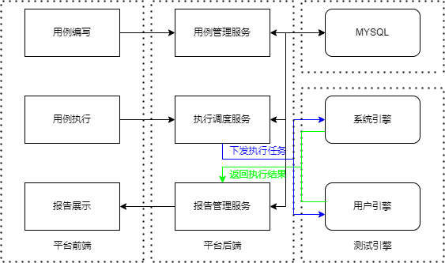
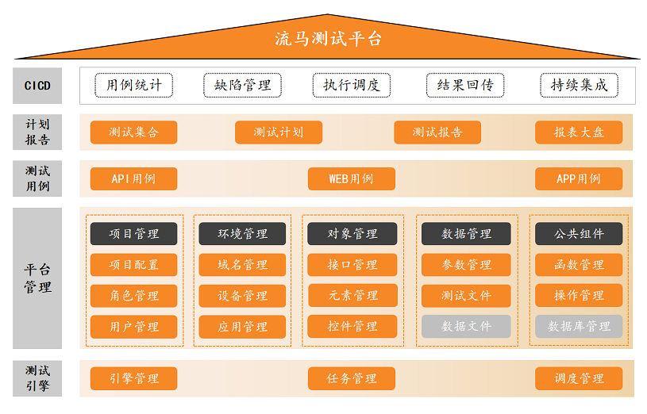

# 流马-自动化测试平台

## 一、个人介绍

#### 简单概述

1. 该项目是GitHub开源项目-流马测试平台，我只实现了API自动化测试相关的模块，WEB、APP、缺陷管理、持续集成并没有实现

2. 平台技术栈：前端VUE+ElementUI，后台Java+SpringBoot，测试引擎Python+Unittest

#### 框架图

#### 平台介绍

1. 平台目前包括：测试管理、公共组件、环境管理、用例中心、测试执行、测试追踪、配置中心等功能模块

2. 平台为支持API测试绝大多数复杂场景，提供了公共参数、自定义函数、文件、环境等管理，可满足绝大多数使用场景。而用例之上，支持测试集合和测试计划的配置，API用例。

#### 引擎介绍

1. 测试引擎由python语言开发，API测试使用requests进行接口请求
2. 平台将测试引擎独立出来的主要目的就是让测试执行更加灵活，不再受限于资源、网络等限制。比如有些软件系统需要在交付现场进行交付测试，传统方法要么手工测试，要么做了自动化测试但现场重新搭建测试执行依赖环境耗时过久。而本平台执行测试只需要在客户现场启动一个注册引擎，即可执行对应的自动化测试用例。
3. 同时，常见的接口测试平台很多受限于执行资源紧张，遇到用户执行并发较大时，测试执行只能等待。此时解决办法往往只能加服务器资源，而大多数时候其实用不了太多资源，从而造成资源浪费。但当我们把测试引擎变成注册制时，问题迎刃而解，用户只需要简单配置即可获取自己的执行资源，不再需要与别人抢资源。

## 二、官方介绍

### 架构图

### 介绍

流马是一款低代码自动化测试平台，旨在采用最简单的架构统一支持API/Web/App自动化测试。平台采用低代码设计模式，将传统测试脚本以配置化实现，从而让代码能力稍弱的用户快速上手自动化测试。同时平台也支持通过简单的代码编写实现自定义组件，使用户可以灵活实现自己的需求。

本项目分为平台端和引擎端，采用分布式执行设计，可以将测试执行的节点(即引擎)注册在任意环境的任意一台机器上，从而突破资源及网络限制。同时，通过将引擎启动在本地PC上，方便用户快速调试测试用例，实时查看执行过程，带来传统脚本编写一致的便捷。

### 相关网址

##### [演示平台](http://demo-ee.liumatest.cn)

我的账号和密码如下，也可自己注册

- user：13357709264
- password：123456

##### [流马官网](http://www.liumatest.cn)

### 相关文档

- [快速入门](http://www.liumatest.cn/briefDoc/)
- [产品手册](http://www.liumatest.cn/productDoc/)
