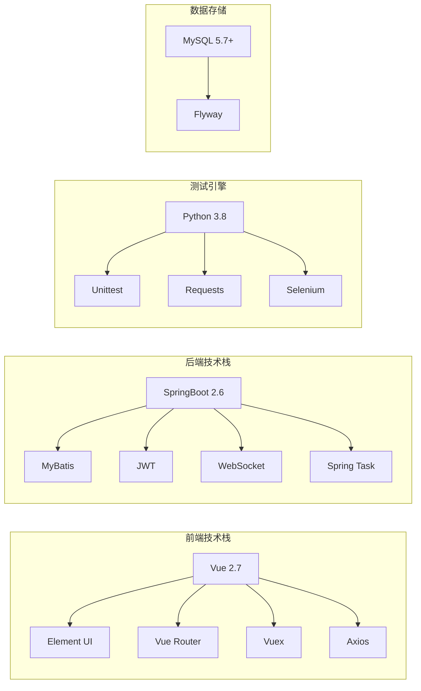
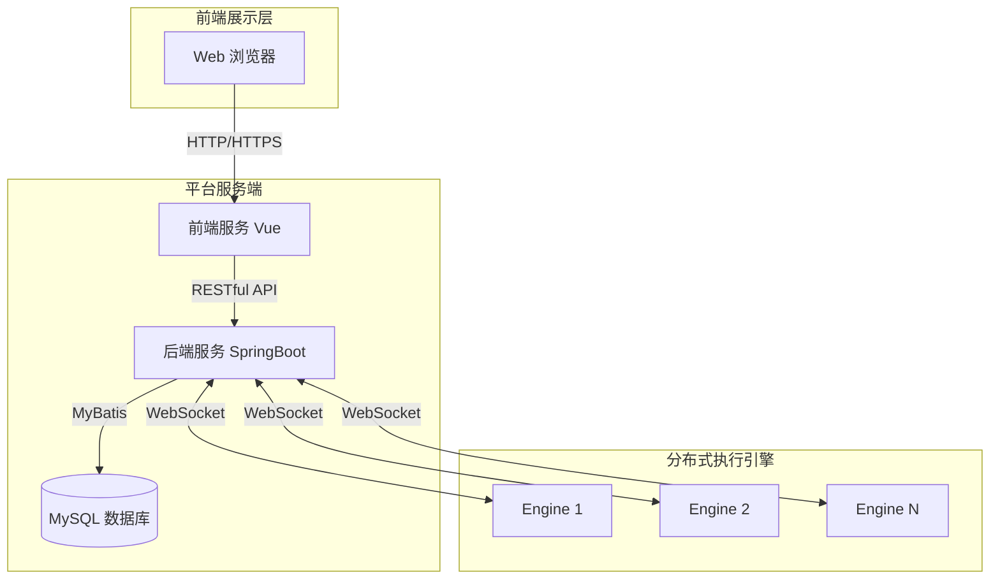
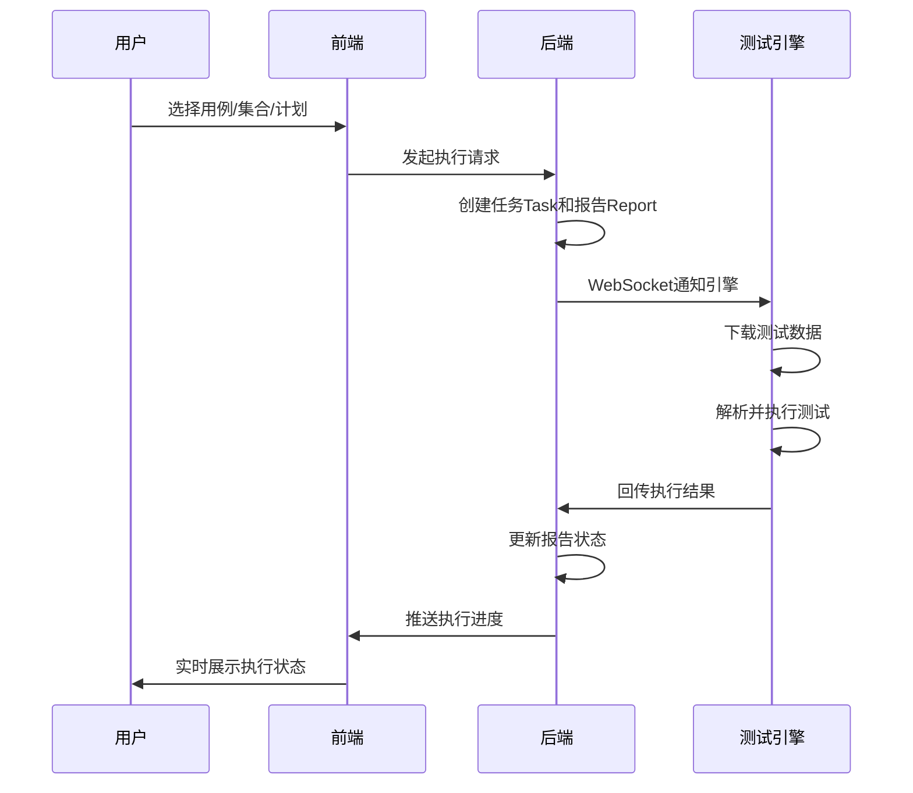
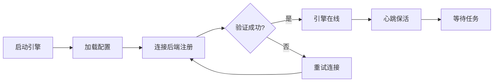

# 流马自动化测试平台

## 一、项目概述

### 1.1 项目简介

s

流马自动化测试平台（LiuMa AutoTest Platform）是一款**低代码**分布式自动化测试平台，旨在采用最简单的架构统一支持 **API / Web UI / App UI** 三种自动化测试类型。平台采用前后端分离设计，将传统测试脚本以**配置化**实现，让代码能力稍弱的用户也能快速上手自动化测试。同时平台支持通过简单的代码编写实现自定义组件，满足个性化需求。

> **项目定位**：作者在 GitHub 开源项目基础上，主要实现了 **API 自动化测试** 相关的核心模块，包含测试管理、环境配置、用例设计、定时计划、分布式执行引擎等核心功能。

### 1.2 核心特性

| 特性                 | 说明                                             |
| -------------------- | ------------------------------------------------ |
| **低代码配置** | 可视化配置测试用例，无需编写代码即可完成接口测试 |
| **分布式执行** | 测试引擎可注册到任意机器，突破资源与网络限制     |
| **前后端分离** | SpringBoot + Vue 分离架构，便于扩展和维护        |
| **实时通信**   | WebSocket 双向通信，任务实时推送与结果回传       |
| **多测试类型** | 支持 API 接口测试、Web UI 自动化、App 自动化     |
| **定时任务**   | 支持 Cron 表达式配置定时执行计划                 |
| **RBAC 权限**  | 基于角色的权限控制，支持多项目数据隔离           |

### 1.3 技术栈



| 层级        | 技术选型   | 版本    |
| ----------- | ---------- | ------- |
| 前端框架    | Vue        | 2.7.16  |
| UI 组件     | Element UI | 2.15.13 |
| 构建工具    | Vite       | 4.5.0   |
| 后端框架    | SpringBoot | 2.6.0   |
| ORM 框架    | MyBatis    | 2.2.0   |
| 数据库      | MySQL      | 5.7+    |
| 测试引擎    | Python     | 3.8+    |
| HTTP 客户端 | Requests   | -       |
| Web 自动化  | Selenium   | -       |

---

## 二、系统架构

### 2.1 整体架构图



### 2.2 核心设计思想

1. **测试编写与执行分离**

   - **平台端**：负责用例编写、管理、调度、报告展示
   - **引擎端**：负责测试数据下载、解析、执行、结果回传
2. **分布式执行架构**

   - 引擎采用**注册制**，可部署在任意环境的任意机器
   - 突破传统测试工具的执行资源限制
   - 支持本地调试，实时查看执行过程
3. **任务实时通信**

   - 平台通过 **WebSocket** 与引擎保持长连接
   - 利用 **ConcurrentHashMap** 管理引擎会话状态
   - 心跳机制检测引擎在线状态
4. **定时任务调度**

   - 基于 **Spring Task** 实现测试计划定时执行
   - 支持 Cron 表达式灵活配置执行时间

---

## 三、项目结构

```
TestPlatform/
├── platform-backend/          # 后端服务 (SpringBoot)
│   ├── src/
│   │   └── main/
│   │       ├── java/com/autotest/
│   │       │   ├── controller/   # 控制器层
│   │       │   ├── service/      # 业务服务层
│   │       │   ├── mapper/       # 数据访问层
│   │       │   ├── domain/       # 实体类
│   │       │   ├── dto/          # 数据传输对象
│   │       │   ├── job/          # 定时任务
│   │       │   ├── websocket/    # WebSocket配置
│   │       │   └── common/        # 公共组件
│   │       └── resources/
│   │           ├── mapper/        # MyBatis XML
│   │           └── application.yml
│   ├── assets/                   # 后端说明文档
│   └── pom.xml                   # Maven 配置
│
├── platform-frontend/        # 前端应用 (Vue)
│   ├── src/
│   │   ├── views/            # 页面视图
│   │   │   ├── caseCenter/   # 用例中心
│   │   │   ├── envCenter/    # 环境中心
│   │   │   ├── planCenter/   # 计划中心
│   │   │   ├── report/       # 测试报告
│   │   │   └── system/       # 系统管理
│   │   ├── router/           # 路由配置
│   │   ├── vuex/             # 状态管理
│   │   └── utils/            # 工具函数
│   ├── assets/               # 前端说明文档
│   └── package.json
│
├── TestEngin/              # 测试执行引擎 (Python)
│   ├── app/                 # 应用入口
│   ├── core/                # 核心执行器
│   │   ├── api/            # API测试执行器
│   │   ├── web/            # Web测试执行器
│   │   └── app/            # App测试执行器
│   ├── tools/               # 工具模块
│   ├── config/              # 配置文件
│   ├── assets/              # 引擎说明文档
│   └── requirements.txt
│
├── assets/                 # 项目级说明文档
│   └── project说明文档/
│       ├── 快速入门.md
│       ├── 产品手册.md
│       └── 部署文档.md
│
└── README.md               # 项目主文档
```

---

## 四、核心模块说明

### 4.1 后端服务 (platform-backend)

| 模块               | 职责                               |
| ------------------ | ---------------------------------- |
| **用户认证** | JWT Token 生成与验证，登录拦截器   |
| **项目管理** | 多项目数据隔离，RBAC 权限控制      |
| **环境配置** | 测试环境管理，域名配置，数据库连接 |
| **用例管理** | API/Web/App 用例 CRUD，步骤管理    |
| **接口管理** | 接口文档维护，Swagger 导入         |
| **计划调度** | 测试计划定时执行，Cron 表达式      |
| **任务执行** | 任务触发，引擎通知，设备占用       |
| **报告管理** | 测试报告生成，统计展示             |
| **引擎管理** | 引擎注册，心跳检测，状态监控       |
| **设备管理** | 移动设备在线控制，投屏操作         |

### 4.2 前端应用 (platform-frontend)

| 模块               | 功能                       |
| ------------------ | -------------------------- |
| **用例中心** | API/Web/App 用例可视化编辑 |
| **环境中心** | 环境、引擎、设备管理       |
| **计划中心** | 测试集合、测试计划配置     |
| **测试报告** | 执行结果查看，详情分析     |
| **系统管理** | 用户、角色、项目管理       |

### 4.3 测试引擎 (TestEngin)

| 组件               | 说明                         |
| ------------------ | ---------------------------- |
| **任务拉取** | 从平台下载测试数据压缩包     |
| **数据解析** | 解压并解析 JSON 格式测试数据 |
| **用例执行** | 按测试类型执行对应测试       |
| **结果回传** | 实时上传执行结果和截图日志   |
| **心跳保活** | 定时向平台发送心跳维持连接   |

---

## 五、核心流程

### 5.1 测试执行流程



### 5.2 引擎注册流程



---

## 六、快速开始

### 6.1 环境要求

| 环境    | 要求                 |
| ------- | -------------------- |
| JDK     | 1.8+                 |
| MySQL   | 5.7+                 |
| Node.js | 14+                  |
| Python  | 3.8+                 |
| Chrome  | 最新版（Web 测试用） |

### 6.2 启动步骤

**1. 初始化数据库**

```bash
# 创建数据库
CREATE DATABASE liuma DEFAULT CHARACTER SET utf8mb4;

# 项目使用 Flyway 自动迁移
```

**2. 启动后端服务**

```bash
cd platform-backend

# 编译打包
mvn clean package -DskipTests

# 启动服务
java -jar target/AutoTest-1.4.1.jar
```

**3. 启动前端服务**

```bash
cd platform-frontend

# 安装依赖
npm install

# 启动开发服务
npm run dev
```

**4. 启动测试引擎**

```bash
cd TestEngin

# 安装 Python 依赖
pip3 install -r requirements.txt

# 配置引擎参数（config/config.ini）

# 启动引擎
python3 startup.py
```

### 6.3 访问平台

- **本地访问**：http://localhost:5173
- **默认账号**：13357709264 / 123456

---

## 七、二次开发指南

### 7.1 添加新功能

1. **后端开发**

   - 定义实体：`platform-backend/src/main/java/com/autotest/domain/`
   - 创建 Mapper：`platform-backend/src/main/java/com/autotest/mapper/`
   - 编写 Service：`platform-backend/src/main/java/com/autotest/service/`
   - 创建 Controller：`platform-backend/src/main/java/com/autotest/controller/`
2. **前端开发**

   - 创建页面：`platform-frontend/src/views/`
   - 配置路由：`platform-frontend/src/router/index.js`
   - 封装 API：`platform-frontend/src/utils/`
3. **引擎扩展**

   - 自定义函数：`TestEngin/tools/funclib/provider/`
   - 添加断言：`TestEngin/core/assertion.py`

### 7.2 项目文档

| 文档路径                                  | 说明             |
| ----------------------------------------- | ---------------- |
| [后端 README](./platform-backend/README.md)  | 后端服务详细说明 |
| [前端 README](./platform-frontend/README.md) | 前端应用详细说明 |
| [引擎 README](./TestEngin/README.md)         | 测试引擎详细说明 |
| [assets/README](./assets/README.md)          | 项目文档索引     |

---

## 八、相关资源

### 8.1 在线资源

| 资源     | 地址                                        |
| -------- | ------------------------------------------- |
| 演示平台 | http://demo-ee.liumatest.cn                 |
| 官网地址 | http://www.liumatest.cn                     |
| 社区论坛 | http://community.liumatest.cn               |
| 快速入门 | http://www.liumatest.cn/briefDoc/           |
| 产品手册 | http://www.liumatest.cn/productDoc/         |
| B站教程  | https://www.bilibili.com/cheese/play/ss7009 |

### 8.2 项目地址

- **GitHub**：https://github.com/Chras-fu/Liuma-platform （平台端）
- **GitHub**：https://github.com/Chras-fu/Liuma-engine （引擎端）

---

## 九、版本信息

- **当前版本**：1.4.1
- **项目作者**：Chras-fu
- **开源协议**：AGPL

---

## 十、致谢

感谢流马开源项目团队提供的优秀自动化测试平台，本项目基于流马开源版本进行学习和二次开发，仅供学习交流使用。
