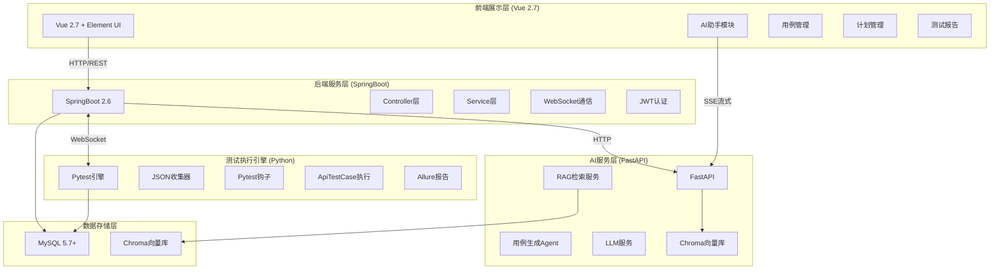
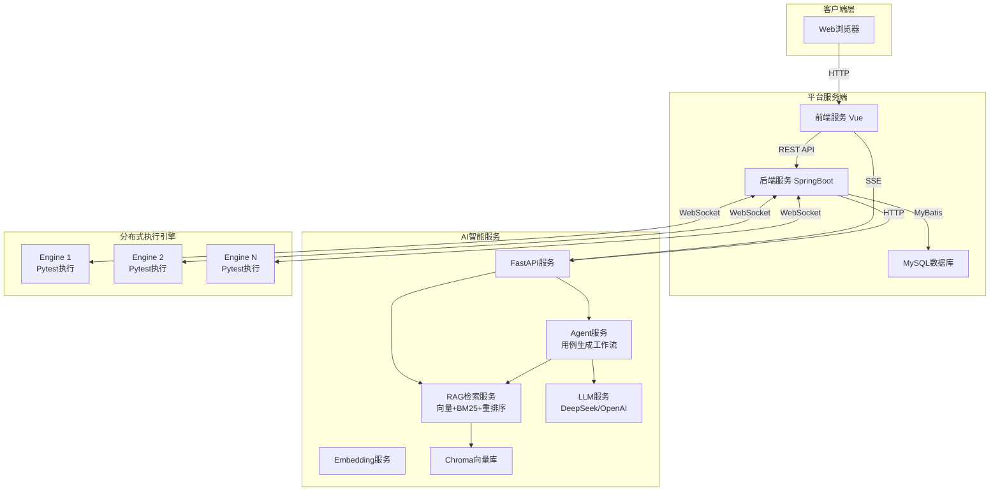
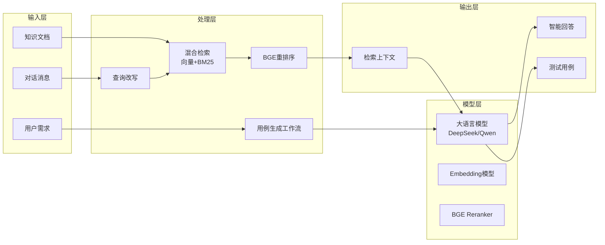
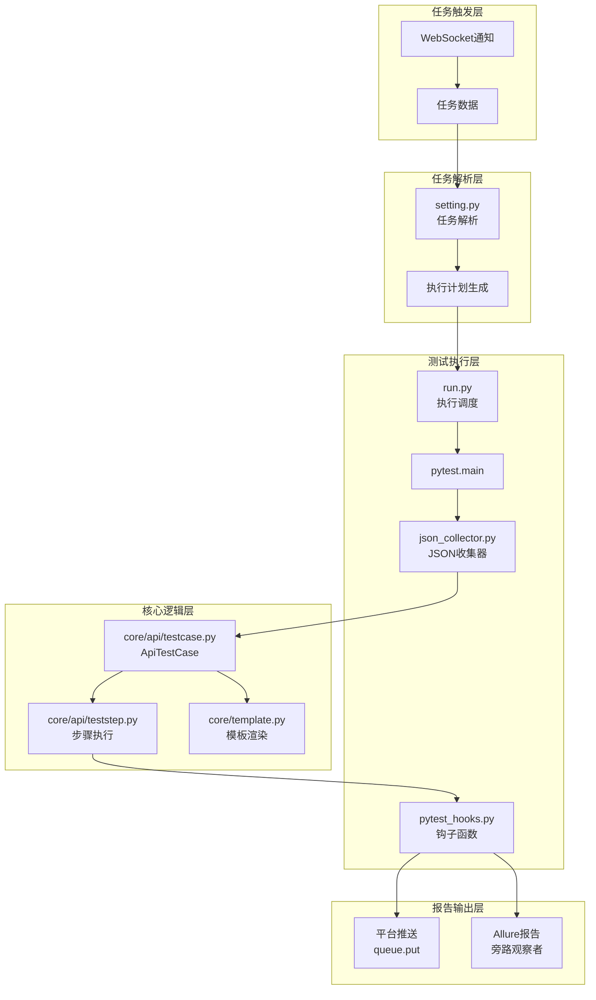
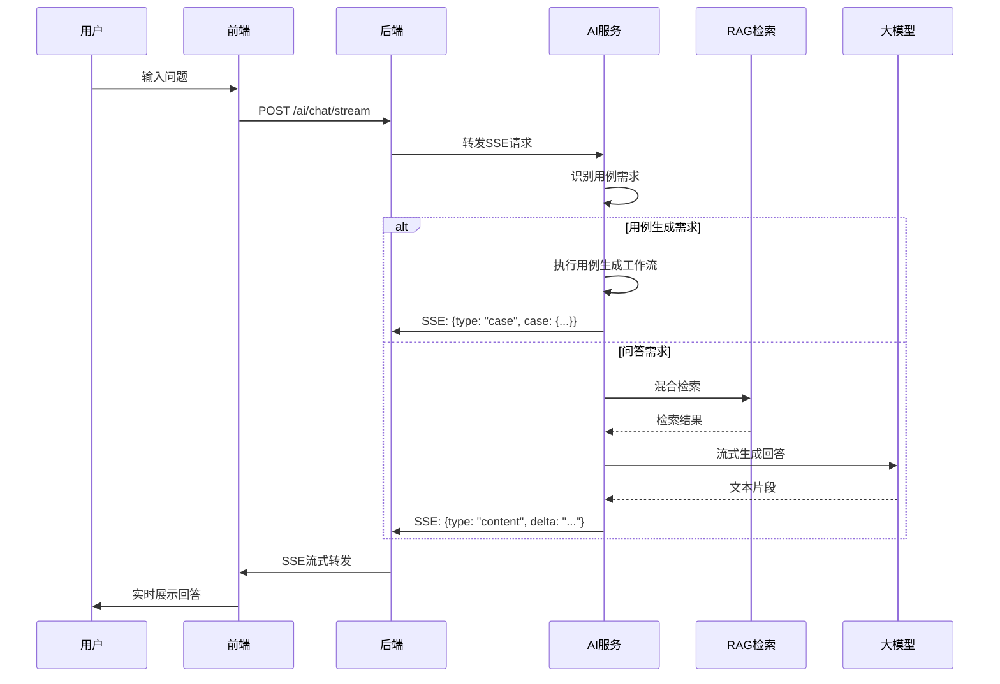
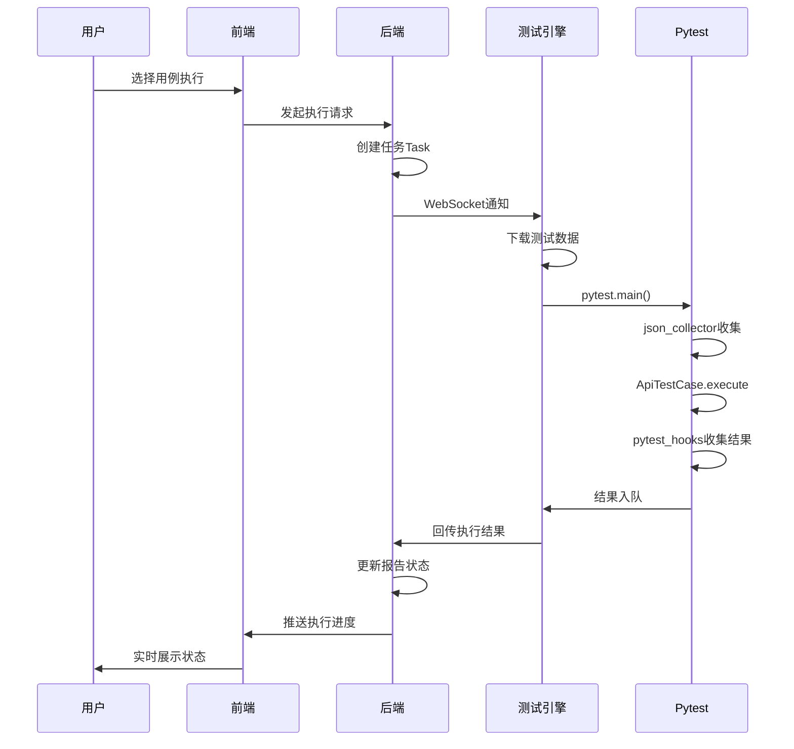
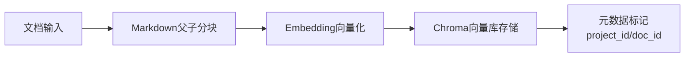
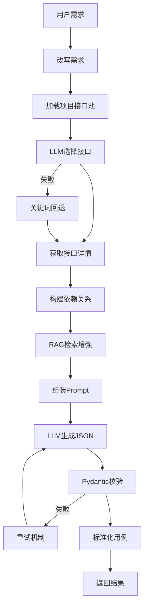

# AI智能接口测试平台

## 一、项目概述

### 1.1 项目定位

AI智能接口测试平台是一款基于 **LangChain + Pytest** 的低代码分布式接口自动化测试平台。平台采用前后端分离架构，通过可视化配置实现接口测试，同时集成AI智能助手，提供RAG知识库问答和智能用例生成功能。

### 1.2 核心特性

| 特性 | 说明 |
|------|------|
| **低代码配置** | 可视化配置测试用例，无需编写代码即可完成接口测试 |
| **AI智能助手** | 基于LangChain的RAG知识库问答和智能用例生成 |
| **分布式执行** | 测试引擎可注册到任意机器，突破资源与网络限制 |
| **Pytest引擎** | 基于Pytest的测试执行引擎，支持插件扩展 |
| **双通道报告** | 平台推送 + Allure报告，0业务侵入的观察者模式 |
| **前后端分离** | SpringBoot + Vue 分离架构，便于扩展和维护 |
| **实时通信** | WebSocket双向通信，任务实时推送与结果回传 |
| **定时任务** | 支持Cron表达式配置定时执行计划 |
| **RBAC权限** | 基于角色的权限控制，支持多项目数据隔离 |
| **CLI工具** | Agent友好的命令行工具，赋能Claude Code自动化操作 |

### 1.3 技术架构


```mermaid
flowchart TB
    subgraph 前端层["前端展示层 (Vue 2.7)"]
        VUE["Vue 2.7 + Element UI"]
        AI_CHAT["AI助手模块"]
        CASE_MGR["用例管理"]
        PLAN_MGR["计划管理"]
        REPORT["测试报告"]
    end

    subgraph 后端层["后端服务层 (SpringBoot)"]
        SB["SpringBoot 2.6"]
        CTRL["Controller层"]
        SVC["Service层"]
        WS["WebSocket通信"]
        AUTH["JWT认证"]
    end

    subgraph AI层["AI服务层 (FastAPI)"]
        FAST["FastAPI"]
        RAG["RAG检索服务"]
        AGENT["用例生成Agent"]
        LLM["LLM服务"]
        CHROMA["Chroma向量库"]
    end

    subgraph 引擎层["测试执行引擎 (Python)"]
        ENG["Pytest引擎"]
        COLLECT["JSON收集器"]
        HOOKS["Pytest钩子"]
        EXEC["ApiTestCase执行"]
        ALLURE["Allure报告"]
    end

    subgraph 存储层["数据存储层"]
        MYSQL["MySQL 5.7+"]
        CHROMA_DB["Chroma向量库"]
    end

    VUE -->|HTTP/REST| SB
    AI_CHAT -->|SSE流式| FAST
    SB -->|HTTP| FAST
    SB <-->|WebSocket| ENG
    FAST --> CHROMA
    RAG --> CHROMA_DB
    ENG --> MYSQL
    SB --> MYSQL
```

### 1.4 技术栈

| 层级 | 技术选型 | 版本 | 说明 |
|------|----------|------|------|
| 前端框架 | Vue | 2.7.16 | 渐进式前端框架 |
| UI组件 | Element UI | 2.15.13 | UI组件库 |
| 构建工具 | Vite | 4.5.0 | 前端构建工具 |
| 后端框架 | SpringBoot | 2.6.0 | 后端核心框架 |
| ORM框架 | MyBatis | 2.2.0 | ORM持久层框架 |
| AI服务 | FastAPI | - | 高性能异步Web框架 |
| LLM框架 | LangChain | 1.x | LLM应用开发框架 |
| 向量数据库 | Chroma | - | 轻量级向量数据库 |
| 测试引擎 | Python | 3.8+ | 测试执行引擎 |
| 测试框架 | Pytest | - | API测试框架 |
| CLI工具 | Typer + Rich | 0.9.0+ | Agent友好命令行工具 |
| 数据库 | MySQL | 5.7+ | 关系型数据库 |
| HTTP客户端 | Requests/httpx | - | HTTP请求处理 |

---

## 二、系统架构

### 2.1 整体架构图


```mermaid
flowchart TD
    subgraph 客户端["客户端层"]
        BROWSER["Web浏览器"]
    end

    subgraph 平台端["平台服务端"]
        FE["前端服务 Vue"]
        BE["后端服务 SpringBoot"]
        DB["MySQL数据库"]
    end

    subgraph AI服务["AI智能服务"]
        AI_API["FastAPI服务"]
        RAG_SVC["RAG检索服务<br/>向量+BM25+重排序"]
        AGENT_SVC["Agent服务<br/>用例生成工作流"]
        LLM_SVC["LLM服务<br/>DeepSeek/OpenAI"]
        EMB["Embedding服务"]
        VS["Chroma向量库"]
    end

    subgraph 引擎端["分布式执行引擎"]
        E1["Engine 1<br/>Pytest执行"]
        E2["Engine 2<br/>Pytest执行"]
        E3["Engine N<br/>Pytest执行"]
    end

    BROWSER -->|HTTP| FE
    FE -->|REST API| BE
    BE -->|MyBatis| DB
    FE -->|SSE| AI_API
    BE -->|HTTP| AI_API
    AI_API --> RAG_SVC
    AI_API --> AGENT_SVC
    RAG_SVC --> VS
    AGENT_SVC --> LLM_SVC
    AGENT_SVC --> RAG_SVC
    BE <-->|WebSocket| E1
    BE <-->|WebSocket| E2
    BE <-->|WebSocket| E3
```

### 2.2 AI服务架构


```mermaid
flowchart LR
    subgraph 输入层["输入层"]
        USER_REQ["用户需求"]
        CHAT_MSG["对话消息"]
        DOC["知识文档"]
    end

    subgraph 处理层["处理层"]
        QUERY_RW["查询改写"]
        HYBRID["混合检索<br/>向量+BM25"]
        RERANK["BGE重排序"]
        WORKFLOW["用例生成工作流"]
    end

    subgraph 模型层["模型层"]
        LLM["大语言模型<br/>DeepSeek/Qwen"]
        EMB["Embedding模型"]
        BGE["BGE Reranker"]
    end

    subgraph 输出层["输出层"]
        ANSWER["智能回答"]
        CASE["测试用例"]
        CONTEXT["检索上下文"]
    end

    USER_REQ --> WORKFLOW
    CHAT_MSG --> QUERY_RW
    DOC --> HYBRID
    QUERY_RW --> HYBRID
    HYBRID --> RERANK
    RERANK --> CONTEXT
    CONTEXT --> LLM
    WORKFLOW --> LLM
    LLM --> ANSWER
    LLM --> CASE
```

### 2.3 测试执行引擎架构


```mermaid
flowchart TD
    subgraph 触发层["任务触发层"]
        WS["WebSocket通知"]
        TASK["任务数据"]
    end

    subgraph 解析层["任务解析层"]
        SETTING["setting.py<br/>任务解析"]
        PLAN["执行计划生成"]
    end

    subgraph 执行层["测试执行层"]
        RUN["run.py<br/>执行调度"]
        PYTEST["pytest.main"]
        COLLECT["json_collector.py<br/>JSON收集器"]
        HOOKS["pytest_hooks.py<br/>钩子函数"]
    end

    subgraph 核心层["核心逻辑层"]
        TESTCASE["core/api/testcase.py<br/>ApiTestCase"]
        STEP["core/api/teststep.py<br/>步骤执行"]
        TEMPLATE["core/template.py<br/>模板渲染"]
    end

    subgraph 报告层["报告输出层"]
        PLATFORM["平台推送<br/>queue.put"]
        ALLURE["Allure报告<br/>旁路观察者"]
    end

    WS --> TASK
    TASK --> SETTING
    SETTING --> PLAN
    PLAN --> RUN
    RUN --> PYTEST
    PYTEST --> COLLECT
    COLLECT --> TESTCASE
    TESTCASE --> STEP
    TESTCASE --> TEMPLATE
    STEP --> HOOKS
    HOOKS --> PLATFORM
    HOOKS --> ALLURE
```

---

## 三、项目结构

```
TestPlatform/
├── platform-backend/          # 后端服务 (SpringBoot)
│   ├── src/main/java/com/autotest/
│   │   ├── controller/        # 控制器层 (含AiController)
│   │   ├── service/           # 业务服务层
│   │   ├── service/ai/        # AI相关服务
│   │   ├── mapper/            # 数据访问层
│   │   ├── domain/            # 实体类
│   │   ├── websocket/         # WebSocket配置
│   │   └── common/            # 公共组件
│   ├── src/main/resources/
│   │   └── mapper/            # MyBatis XML
│   └── pom.xml
│
├── platform-frontend/         # 前端应用 (Vue)
│   ├── src/
│   │   ├── views/
│   │   │   ├── caseCenter/    # 用例中心
│   │   │   ├── aiAssistant/   # AI助手模块
│   │   │   │   ├── components/
│   │   │   │   │   ├── AssistantChatPanel.vue
│   │   │   │   │   └── AssistantSidebar.vue
│   │   │   │   ├── utils/
│   │   │   │   │   └── sse.js
│   │   │   │   └── index.vue
│   │   │   ├── planCenter/    # 计划中心
│   │   │   └── report/        # 测试报告
│   │   ├── router/            # 路由配置
│   │   └── vuex/              # 状态管理
│   └── package.json
│
├── ai-service/                # AI智能服务 (FastAPI)
│   ├── app/
│   │   ├── main.py            # FastAPI入口
│   │   ├── config.py          # 配置管理
│   │   ├── routers/
│   │   │   ├── chat.py        # AI对话路由 (SSE)
│   │   │   ├── knowledge.py   # RAG知识库路由
│   │   │   └── agent.py       # 用例生成路由
│   │   ├── services/
│   │   │   ├── agent_service.py   # Agent核心服务
│   │   │   ├── llm_service.py     # LLM服务
│   │   │   ├── rag_service.py     # RAG检索服务
│   │   │   ├── case_workflow.py   # 用例生成工作流
│   │   │   └── retrieval/
│   │   │       ├── bm25.py        # BM25关键词检索
│   │   │       ├── query_rewrite.py  # 查询改写
│   │   │       └── reranker.py    # BGE重排序
│   │   ├── tools/
│   │   │   └── platform_tools.py  # 平台API客户端
│   │   ├── utils/
│   │   │   └── markdown_parent_child_chunking.py  # Markdown分块
│   │   └── prompts/
│   │       └── assistant_prompts.py
│   ├── config.yaml            # 配置文件
│   └── requirements.txt
│
├── TestEngin/                 # 测试执行引擎 (Python)
│   ├── app/
│   │   ├── start.py           # 引擎启动入口
│   │   ├── run.py             # 执行入口 (Pytest/Unittest双模式)
│   │   ├── json_collector.py  # Pytest JSON收集器
│   │   ├── pytest_hooks.py    # Pytest钩子函数
│   │   ├── ws.py              # WebSocket通信
│   │   └── setting.py         # 任务解析
│   ├── core/
│   │   └── api/
│   │       ├── testcase.py    # ApiTestCase核心执行
│   │       ├── teststep.py    # 步骤执行器
│   │       └── collector.py   # 数据收集器
│   └── config/
│       └── config.ini         # 引擎配置
│
├── cli/                       # CLI命令行工具 (Python)
│   ├── solution/              # CLI服务实现
│   │   ├── files/
│   │   │   ├── src/testplatform/
│   │   │   │   ├── main.py    # CLI入口
│   │   │   │   ├── config.py  # 配置管理
│   │   │   │   ├── commands/  # 命令模块
│   │   │   │   │   ├── auth.py      # 认证管理
│   │   │   │   │   ├── user.py      # 用户管理
│   │   │   │   │   ├── project.py   # 项目管理
│   │   │   │   │   ├── env.py       # 环境管理
│   │   │   │   │   ├── module.py    # 模块管理
│   │   │   │   │   ├── api.py       # 接口管理
│   │   │   │   │   ├── case.py      # 用例管理
│   │   │   │   │   ├── domain.py    # 域名服务
│   │   │   │   │   └── common_param.py # 参数管理
│   │   │   │   └── utils/
│   │   │   │       └── http_client.py # HTTP客户端
│   │   │   ├── pyproject.toml # 项目配置
│   │   │   └── Skill.md       # Agent技能文档
│   │   └── solve.sh           # 部署脚本
│   └── tests/                 # 测试验证
│       ├── test.sh            # 测试脚本
│       └── test_outputs.py    # 端到端测试
│
└── README.md                  # 项目主文档
```

---

## 四、核心模块说明

### 4.1 AI服务模块 ([ai-service/README.md](./ai-service/README.md))

AI服务是独立的FastAPI服务，为平台提供智能能力：

| 功能 | 说明 |
|------|------|
| **AI对话** | SSE流式对话，支持RAG知识库增强 |
| **知识库管理** | Markdown文档切片、向量索引、检索 |
| **用例生成** | ReAct Agent自动选择接口并生成测试用例 |

**RAG检索流程：**
```
查询输入 → 查询改写与扩写 → 并行向量检索+关键词检索 → RRF融合 → BGE重排序 → 返回Top-K
```

**用例生成流程：**
```
需求输入 → 改写用户需求 → 加载项目接口池 → 选择候选接口 → 获取接口详情 → RAG增强 → LLM生成 → Pydantic校验 → 返回用例
```

### 4.2 测试执行引擎 ([TestEngin/README.md](./TestEngin/README.md))

分布式测试执行引擎，支持多进程并发执行：

| 组件 | 说明 |
|------|------|
| **任务调度** | WebSocket接收任务，多进程执行 |
| **Pytest执行** | 自定义JSON收集器，复用ApiTestCase |
| **双通道报告** | 平台推送(核心) + Allure报告(可选) |
| **钩子机制** | pytest_runtest_makereport收集结果 |

**执行模式：**
- API测试：使用Pytest执行，支持插件扩展
- 结果回传：通过queue实时推送至平台

### 4.3 后端服务 ([platform-backend/README.md](./platform-backend/README.md))

SpringBoot后端服务，提供RESTful API：

| 模块 | 职责 |
|------|------|
| **AiController** | AI服务代理，SSE流式转发 |
| **RunService** | 任务触发、引擎通知 |
| **EngineService** | 引擎注册、心跳检测 |
| **WebSocket** | 与引擎实时通信 |

### 4.4 前端应用 ([platform-frontend/README.md](./platform-frontend/README.md))

Vue 2.7前端应用，提供可视化操作界面：

| 模块 | 功能 |
|------|------|
| **AI助手** | 智能对话、知识库管理、用例生成 |
| **用例中心** | API用例可视化编辑 |
| **计划中心** | 测试计划配置、定时任务 |
| **测试报告** | 执行结果查看、详情分析 |

### 4.5 CLI命令行工具 ([cli/README.md](./cli/README.md))

基于Typer + Rich构建的Agent友好CLI工具，赋能Claude Code等Agent自动化操作平台：

| 功能 | 说明 |
|------|------|
| **Agent赋能** | 通过Skill.md文档让Agent理解并调用平台接口 |
| **全链路管理** | 用户、项目、环境、模块、接口、用例完整生命周期 |
| **自动认证** | Token自动注入与刷新，Base64密码编码 |
| **场景用例** | 购物车等端到端场景用例一键生成 |

**核心命令：**
```bash
# 登录平台
testplatform login -a <account> -p <password>

# 项目管理
testplatform project create -n "项目名称"

# 购物车场景用例
testplatform case shopping-cart -p <project_id>
```

**Agent调用流程：**
```
用户需求 → Claude Code阅读Skill.md → 理解CLI命令 → 执行自动化操作 → 平台后端响应
```

---

## 五、核心流程

### 5.1 AI对话流程


```mermaid
sequenceDiagram
    participant U as 用户
    participant F as 前端
    participant B as 后端
    participant AI as AI服务
    participant RAG as RAG检索
    participant LLM as 大模型

    U->>F: 输入问题
    F->>B: POST /ai/chat/stream
    B->>AI: 转发SSE请求
    AI->>AI: 识别用例需求
    alt 用例生成需求
        AI->>AI: 执行用例生成工作流
        AI->>B: SSE: {type: "case", case: {...}}
    else 问答需求
        AI->>RAG: 混合检索
        RAG-->>AI: 检索结果
        AI->>LLM: 流式生成回答
        LLM-->>AI: 文本片段
        AI->>B: SSE: {type: "content", delta: "..."}
    end
    B->>F: SSE流式转发
    F->>U: 实时展示回答
```

### 5.2 测试执行流程


```mermaid
sequenceDiagram
    participant U as 用户
    participant F as 前端
    participant B as 后端
    participant E as 测试引擎
    participant P as Pytest

    U->>F: 选择用例执行
    F->>B: 发起执行请求
    B->>B: 创建任务Task
    B->>E: WebSocket通知
    E->>E: 下载测试数据
    E->>P: pytest.main()
    P->>P: json_collector收集
    P->>P: ApiTestCase.execute
    P->>P: pytest_hooks收集结果
    P->>E: 结果入队
    E->>B: 回传执行结果
    B->>B: 更新报告状态
    B->>F: 推送执行进度
    F->>U: 实时展示状态
```

### 5.3 RAG知识库索引流程


```mermaid
flowchart LR
    A[文档输入] --> B[Markdown父子分块]
    B --> C[Embedding向量化]
    C --> D[Chroma向量库存储]
    D --> E[元数据标记<br/>project_id/doc_id]
```

### 5.4 用例生成Agent流程


```mermaid
flowchart TD
    A[用户需求] --> B[改写需求]
    B --> C[加载项目接口池]
    C --> D[LLM选择接口]
    D -->|失败| E[关键词回退]
    D --> F[获取接口详情]
    E --> F
    F --> G[构建依赖关系]
    G --> H[RAG检索增强]
    H --> I[组装Prompt]
    I --> J[LLM生成JSON]
    J --> K[Pydantic校验]
    K -->|失败| L[重试机制]
    L --> J
    K --> M[标准化用例]
    M --> N[返回结果]
```

---

## 六、快速开始

### 6.1 环境要求

| 环境 | 要求 |
|------|------|
| JDK | 1.8+ |
| MySQL | 5.7+ |
| Node.js | 14+ |
| Python | 3.8+ |

### 6.2 启动步骤

**1. 初始化数据库**
```sql
CREATE DATABASE liuma DEFAULT CHARACTER SET utf8mb4;
```

**2. 启动后端服务**
```bash
cd platform-backend
mvn clean package -DskipTests
java -jar target/AutoTest-1.4.1.jar
```

**3. 启动前端服务**
```bash
cd platform-frontend
npm install
npm run dev
```

**4. 启动AI服务**
```bash
cd ai-service
pip install -r requirements.txt
python -m uvicorn app.main:app --reload --port 8001
```

**5. 启动测试引擎**
```bash
cd TestEngin
pip3 install -r requirements.txt
python3 startup.py
```

**6. 安装CLI工具（可选）**
```bash
cd cli/solution/files
pip install -e .
testplatform --help
```

### 6.3 访问平台

- **本地访问**：http://localhost:5173
- **AI服务文档**：http://localhost:8001/docs
- **默认账号**：13357709264 / 123456

---

## 七、核心亮点

### 7.1 AI服务亮点

1. **混合检索策略**
   - 向量检索 + BM25关键词检索并行执行
   - RRF融合算法综合排序
   - BGE重排序精排优化

2. **父文档检索策略**
   - Markdown父子分块，保持文档结构
   - 子块匹配，父块召回，提高上下文完整性

3. **用例生成工作流**
   - 固定工作流 + ReAct接口选择
   - Pydantic校验 + 失败重试机制
   - 接口依赖关系自动分析

4. **多模型支持**
   - 支持DeepSeek、Qwen、OpenAI等多种LLM
   - 支持Ollama本地Embedding
   - 降级策略保证服务可用性

### 7.2 测试引擎亮点

1. **Pytest重构**
   - 自定义JSON收集器识别平台测试文件
   - 复用原有ApiTestCase执行逻辑
   - 支持pytest插件生态

2. **双通道报告**
   - 旁路观察者模式，0业务侵入
   - 平台推送(核心功能) + Allure报告(可选)
   - 通过stash传递trans_list数据

3. **多进程架构**
   - 任务执行、结果上报、图片上传分离
   - WebSocket实时通信
   - 心跳保活机制

### 7.3 架构亮点

1. **服务解耦**
   - AI服务独立部署，通过HTTP通信
   - 引擎注册制，支持水平扩展
   - 项目级数据隔离

2. **LangSmith观测**
   - 全链路追踪
   - 调用链可视化
   - 性能监控

### 7.4 CLI工具亮点

1. **Agent赋能设计**
   - 通过Skill.md文档赋能Claude Code等Agent自动调用平台接口
   - 模块化命令设计，覆盖用户/项目/环境/接口/用例全链路管理
   - 端到端场景用例一键生成（如购物车场景）

2. **自动认证机制**
   - httpx客户端封装实现Token自动注入与刷新
   - Base64密码编码传输，配置状态持久化
   - Rich终端美化，表格/树形结构清晰展示

3. **测试验证体系**
   - 基于pytest的端到端测试，验证功能行为而非代码存在
   - P0/P1优先级分层测试，覆盖核心结构与功能
   - 可执行性验收，确保CLI可导入、可运行

---

## 八、相关文档

| 文档 | 路径 |
|------|------|
| AI服务文档 | [ai-service/README.md](./ai-service/README.md) |
| 测试引擎文档 | [TestEngin/README.md](./TestEngin/README.md) |
| 后端服务文档 | [platform-backend/README.md](./platform-backend/README.md) |
| 前端服务文档 | [platform-frontend/README.md](./platform-frontend/README.md) |
| CLI工具文档 | [cli/README.md](./cli/README.md) |

---

## 九、版本信息

- **当前版本**：1.4.1
- **开源协议**：AGPL

---

## 十、致谢

感谢开源社区提供的优秀工具和框架，本项目基于以下技术构建：
- LangChain - LLM应用开发框架
- Pytest - Python测试框架
- FastAPI - 高性能Web框架
- SpringBoot - Java后端框架
- Vue - 前端框架
- Typer - CLI框架
- Rich - 终端美化
