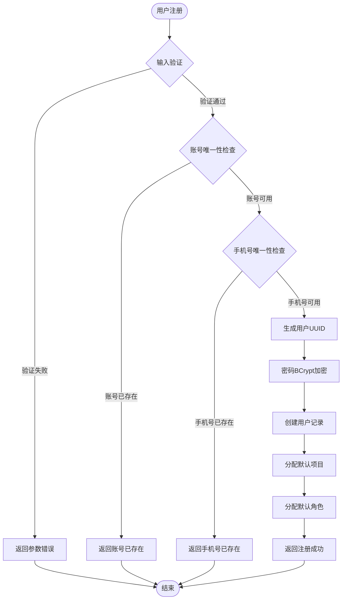
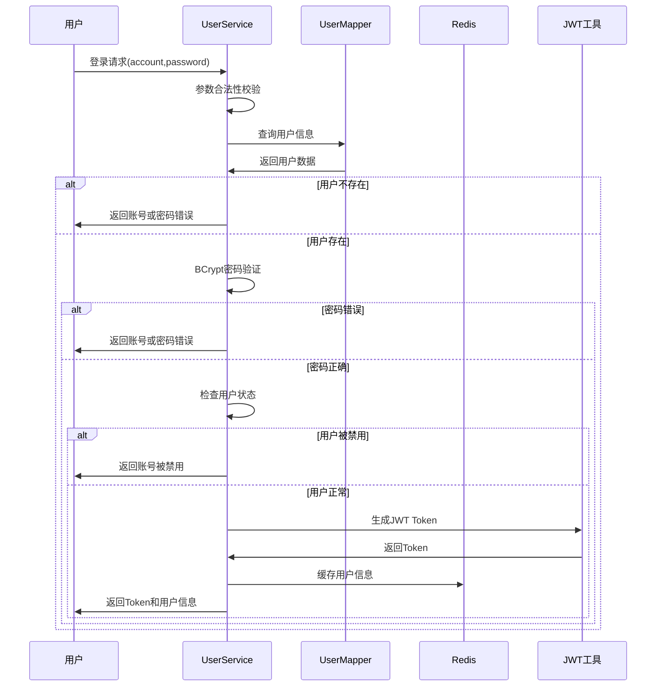
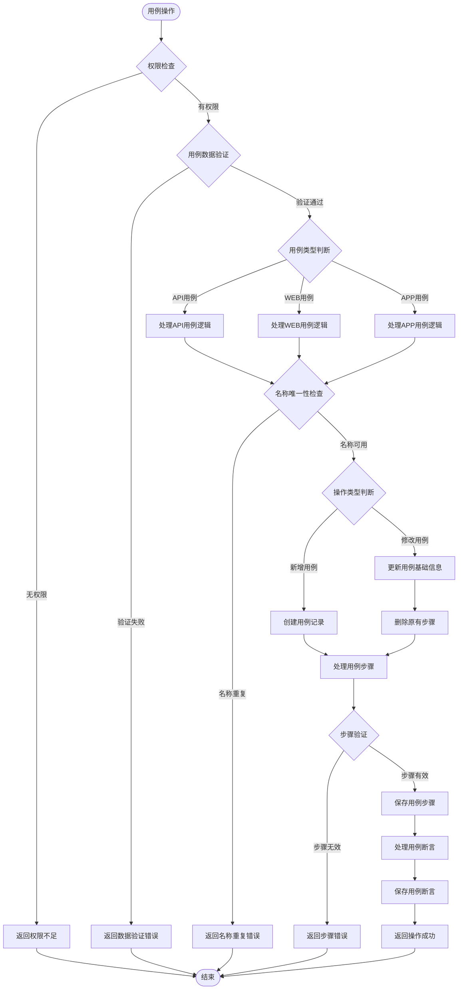
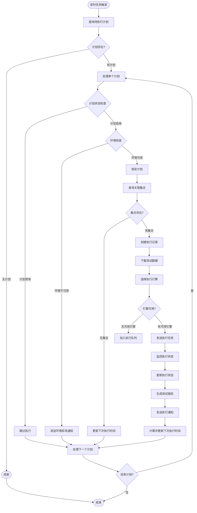
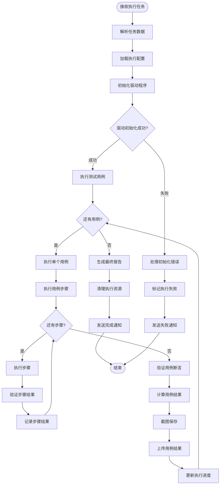

# 测试自动化平台后端 - 业务逻辑设计

## 核心业务流程

### 1. 用户注册登录流程

#### 用户注册业务逻辑



**关键业务规则：**
- 账号格式：字母、数字、下划线，长度6-20位
- 密码强度：必须包含大小写字母和数字，长度8-20位
- 手机号格式：中国大陆手机号格式验证
- 默认角色：普通用户角色，拥有基本操作权限
- 默认项目：系统内置演示项目，用于新手体验

#### 用户登录业务逻辑



**安全机制：**
- 密码验证使用BCrypt算法，支持盐值加密
- JWT Token包含用户ID、项目ID、角色信息，有效期24小时
- 用户信息缓存Redis，TTL设置为25小时
- 登录失败次数限制，防止暴力破解

### 2. 测试用例管理流程

#### 用例创建与编辑业务逻辑



**用例类型差异化处理：**

**API用例特殊逻辑：**
```java
// API用例步骤验证
private void validateAPISteps(List<CaseStep> steps) {
    for (CaseStep step : steps) {
        // 验证HTTP方法
        if (!Arrays.asList("GET", "POST", "PUT", "DELETE", "PATCH").contains(step.getAction())) {
            throw new BusinessException("不支持的HTTP方法: " + step.getAction());
        }
        
        // 验证URL格式
        if (!step.getTarget().matches("^https?://.+")) {
            throw new BusinessException("URL格式不正确: " + step.getTarget());
        }
        
        // 验证参数格式
        if (step.getValue() != null) {
            try {
                // 尝试解析JSON格式
                JSONObject.parseObject(step.getValue());
            } catch (Exception e) {
                throw new BusinessException("请求参数必须是合法的JSON格式");
            }
        }
    }
}
```

**WEB用例特殊逻辑：**
```java
// WEB用例元素验证
private void validateWEBSteps(List<CaseStep> steps) {
    for (CaseStep step : steps) {
        // 验证操作类型
        List<String> webActions = Arrays.asList("open", "click", "input", "select", "assertText");
        if (!webActions.contains(step.getAction())) {
            throw new BusinessException("不支持的WEB操作: " + step.getAction());
        }
        
        // 验证元素选择器
        if ("click".equals(step.getAction()) || "input".equals(step.getAction())) {
            if (StringUtils.isEmpty(step.getTarget())) {
                throw new BusinessException("元素操作必须指定目标元素");
            }
            // 验证选择器格式
            validateElementSelector(step.getTarget());
        }
    }
}
```

**APP用例特殊逻辑：**
```java
// APP用例控件验证
private void validateAPPSteps(List<CaseStep> steps) {
    for (CaseStep step : steps) {
        // 验证平台类型
        if (!Arrays.asList("android", "ios").contains(step.getPlatform())) {
            throw new BusinessException("不支持的移动平台: " + step.getPlatform());
        }
        
        // 验证控件选择器
        if ("click".equals(step.getAction()) || "input".equals(step.getAction())) {
            validateControlSelector(step.getTarget(), step.getPlatform());
        }
    }
}
```

### 3. 测试计划执行流程

#### 计划调度执行逻辑



**并发控制机制：**
```java
// 计划执行锁机制
@Scheduled(cron = "0 */5 * * * ?")
public void executePlans() {
    // 获取分布式锁，防止多实例并发执行
    boolean locked = redisLock.tryLock("plan:execute:lock", 30, TimeUnit.SECONDS);
    if (!locked) {
        log.info("其他实例正在执行计划调度，本次跳过");
        return;
    }
    
    try {
        // 查询待执行的活跃计划
        List<Plan> activePlans = planMapper.selectActivePlansForExecution();
        
        for (Plan plan : activePlans) {
            // 为每个计划获取独立锁，确保串行执行
            String planLockKey = "plan:execute:" + plan.getId();
            boolean planLocked = redisLock.tryLock(planLockKey, 60, TimeUnit.SECONDS);
            
            if (planLocked) {
                try {
                    executeSinglePlan(plan);
                } finally {
                    redisLock.unlock(planLockKey);
                }
            } else {
                log.warn("计划{}获取执行锁失败，可能被其他实例执行", plan.getId());
            }
        }
    } finally {
        redisLock.unlock("plan:execute:lock");
    }
}
```

**环境可用性检查：**
```java
// 环境可用性验证
private boolean checkEnvironmentAvailability(String environmentId) {
    Environment env = environmentMapper.selectById(environmentId);
    if (env == null) {
        return false;
    }
    
    try {
        // 解析环境配置
        EnvironmentConfig config = JSON.parseObject(env.getConfig(), EnvironmentConfig.class);
        
        // 检查数据库连接
        if (config.getDatabase() != null) {
            testDatabaseConnection(config.getDatabase());
        }
        
        // 检查HTTP服务可用性
        if (config.getBaseUrl() != null) {
            testHttpService(config.getBaseUrl());
        }
        
        return true;
    } catch (Exception e) {
        log.error("环境{}可用性检查失败: {}", environmentId, e.getMessage());
        return false;
    }
}
```

### 4. 测试执行引擎流程

#### 用例执行核心逻辑



**步骤执行差异化处理：**

**API步骤执行逻辑：**
```java
// API步骤执行器
public class APIStepExecutor implements StepExecutor {
    
    @Override
    public StepResult executeStep(CaseStep step, Map<String, Object> context) {
        StepResult result = new StepResult();
        
        try {
            // 构建HTTP请求
            HttpRequest request = buildHttpRequest(step, context);
            
            // 发送HTTP请求
            HttpResponse response = httpClient.execute(request);
            
            // 提取响应数据到上下文
            extractResponseData(response, context);
            
            // 验证响应状态
            if (response.getStatusCode() >= 200 && response.getStatusCode() < 300) {
                result.setStatus("PASS");
                result.setMessage("API调用成功");
            } else {
                result.setStatus("FAIL");
                result.setMessage("HTTP状态码异常: " + response.getStatusCode());
            }
            
            result.setResponseData(response.getBody());
            result.setResponseTime(response.getResponseTime());
            
        } catch (Exception e) {
            result.setStatus("ERROR");
            result.setMessage("API执行异常: " + e.getMessage());
            result.setErrorInfo(getStackTrace(e));
        }
        
        return result;
    }
    
    private HttpRequest buildHttpRequest(CaseStep step, Map<String, Object> context) {
        // 替换变量占位符
        String url = replaceVariables(step.getTarget(), context);
        String body = replaceVariables(step.getValue(), context);
        
        return HttpRequest.builder()
            .method(step.getAction())
            .url(url)
            .headers(parseHeaders(step.getHeaders()))
            .body(body)
            .build();
    }
}
```

**WEB步骤执行逻辑：**
```java
// WEB步骤执行器
public class WEBStepExecutor implements StepExecutor {
    
    private WebDriver driver;
    
    @Override
    public StepResult executeStep(CaseStep step, Map<String, Object> context) {
        StepResult result = new StepResult();
        
        try {
            WebElement element = null;
            
            // 根据操作类型执行不同逻辑
            switch (step.getAction()) {
                case "open":
                    driver.get(step.getTarget());
                    break;
                    
                case "click":
                    element = findElement(step.getTarget());
                    element.click();
                    break;
                    
                case "input":
                    element = findElement(step.getTarget());
                    element.clear();
                    element.sendKeys(step.getValue());
                    break;
                    
                case "select":
                    element = findElement(step.getTarget());
                    Select select = new Select(element);
                    select.selectByVisibleText(step.getValue());
                    break;
                    
                case "assertText":
                    String actualText = driver.findElement(By.tagName("body")).getText();
                    if (!actualText.contains(step.getValue())) {
                        throw new AssertionError("页面文本断言失败");
                    }
                    break;
                    
                default:
                    throw new BusinessException("不支持的WEB操作: " + step.getAction());
            }
            
            result.setStatus("PASS");
            result.setMessage("WEB步骤执行成功");
            
            // 截图保存
            if (shouldTakeScreenshot(step.getAction())) {
                String screenshotPath = takeScreenshot();
                result.setScreenshot(screenshotPath);
            }
            
        } catch (Exception e) {
            result.setStatus("FAIL");
            result.setMessage("WEB步骤执行失败: " + e.getMessage());
            
            // 失败时截图
            try {
                String screenshotPath = takeScreenshot();
                result.setScreenshot(screenshotPath);
            } catch (Exception screenshotError) {
                log.error("截图失败: {}", screenshotError.getMessage());
            }
        }
        
        return result;
    }
    
    private WebElement findElement(String selector) {
        // 解析选择器类型
        if (selector.startsWith("id=")) {
            return driver.findElement(By.id(selector.substring(3)));
        } else if (selector.startsWith("xpath=")) {
            return driver.findElement(By.xpath(selector.substring(6)));
        } else if (selector.startsWith("css=")) {
            return driver.findElement(By.cssSelector(selector.substring(4)));
        } else {
            throw new BusinessException("不支持的选择器类型: " + selector);
        }
    }
}
```

## 关键业务规则

### 1. 权限控制规则

#### RBAC权限模型实现

```java
// 权限验证服务
@Service
public class PermissionService {
    
    /**
     * 验证用户是否有指定权限
     */
    public boolean hasPermission(String userId, String projectId, String permissionCode) {
        // 1. 获取用户角色列表
        List<Role> roles = userRoleMapper.selectRolesByUserAndProject(userId, projectId);
        
        // 2. 获取角色对应的权限列表
        Set<String> userPermissions = new HashSet<>();
        for (Role role : roles) {
            List<Permission> permissions = rolePermissionMapper.selectPermissionsByRole(role.getId());
            permissions.forEach(p -> userPermissions.add(p.getCode()));
        }
        
        // 3. 验证权限
        return userPermissions.contains(permissionCode);
    }
    
    /**
     * 验证用户对资源的访问权限
     */
    public boolean canAccess(String userId, String resource, String method) {
        // 获取当前用户所在项目
        String currentProjectId = UserContext.getCurrentProjectId();
        
        // 查询资源对应的权限
        Permission permission = permissionMapper.selectByResourceAndMethod(resource, method);
        if (permission == null) {
            // 未配置的权限默认允许访问
            return true;
        }
        
        // 验证用户是否有该权限
        return hasPermission(userId, currentProjectId, permission.getCode());
    }
}
```

#### 数据权限隔离规则

```java
// 数据权限切面
@Aspect
@Component
public class DataPermissionAspect {
    
    @Before("@annotation(dataPermission)")
    public void doBefore(JoinPoint joinPoint, DataPermission dataPermission) {
        // 获取当前用户
        User currentUser = UserContext.getCurrentUser();
        
        // 获取数据权限类型
        DataPermissionType permissionType = dataPermission.type();
        
        switch (permissionType) {
            case PROJECT:
                // 项目级数据权限
                List<String> projectIds = userProjectMapper.selectProjectIdsByUser(currentUser.getId());
                DataScope.setProjectIds(projectIds);
                break;
                
            case ROLE:
                // 角色级数据权限
                List<String> roleIds = userRoleMapper.selectRoleIdsByUser(currentUser.getId());
                DataScope.setRoleIds(roleIds);
                break;
                
            case DEPARTMENT:
                // 部门级数据权限
                List<String> deptIds = userDepartmentMapper.selectDeptIdsByUser(currentUser.getId());
                DataScope.setDepartmentIds(deptIds);
                break;
        }
    }
}
```

### 2. 数据一致性规则

#### 事务管理策略

```java
// 事务管理配置
@Service
public class PlanService {
    
    /**
     * 保存测试计划 - 涉及多表操作，需要事务保证
     */
    @Transactional(rollbackFor = Exception.class)
    public void savePlan(PlanDTO planDTO) {
        // 1. 保存计划基本信息
        Plan plan = convertToPlan(planDTO);
        if (StringUtils.isEmpty(plan.getId())) {
            plan.setId(UUID.randomUUID().toString());
            planMapper.insert(plan);
        } else {
            planMapper.updateById(plan);
        }
        
        // 2. 删除原有的计划集合关联
        planCollectionMapper.deleteByPlanId(plan.getId());
        
        // 3. 保存新的计划集合关联
        List<String> collectionIds = planDTO.getCollectionIds();
        for (int i = 0; i < collectionIds.size(); i++) {
            PlanCollection pc = new PlanCollection();
            pc.setId(UUID.randomUUID().toString());
            pc.setPlanId(plan.getId());
            pc.setCollectionId(collectionIds.get(i));
            pc.setExecuteOrder(i + 1);
            planCollectionMapper.insert(pc);
        }
        
        // 4. 更新计划通知配置
        updatePlanNotification(plan.getId(), planDTO.getNotifications());
        
        // 5. 重新计算下次执行时间
        recalculateNextExecutionTime(plan);
    }
}
```

#### 并发控制机制

```java
// 乐观锁实现
@Version
private Integer version; // 在实体类中添加版本号字段

// 更新操作
@Transactional
public void updateCase(CaseDTO caseDTO) {
    // 查询当前版本数据
    Case currentCase = caseMapper.selectById(caseDTO.getId());
    if (currentCase == null) {
        throw new BusinessException("用例不存在");
    }
    
    // 检查版本号
    if (!currentCase.getVersion().equals(caseDTO.getVersion())) {
        throw new BusinessException("数据已被其他用户修改，请刷新后重试");
    }
    
    // 执行更新
    Case updateCase = convertToCase(caseDTO);
    updateCase.setVersion(currentCase.getVersion() + 1);
    
    int updatedRows = caseMapper.updateById(updateCase);
    if (updatedRows == 0) {
        throw new BusinessException("更新失败，数据可能已被其他用户修改");
    }
}
```

### 3. 业务验证规则

#### 用例步骤验证规则

```java
// 用例步骤验证器
@Component
public class CaseStepValidator {
    
    public void validateSteps(List<CaseStep> steps, String caseType) {
        if (steps == null || steps.isEmpty()) {
            throw new BusinessException("用例步骤不能为空");
        }
        
        // 检查步骤顺序连续性
        Set<Integer> orders = new HashSet<>();
        for (CaseStep step : steps) {
            if (step.getStepOrder() == null || step.getStepOrder() <= 0) {
                throw new BusinessException("步骤序号必须大于0");
            }
            if (!orders.add(step.getStepOrder())) {
                throw new BusinessException("步骤序号不能重复: " + step.getStepOrder());
            }
        }
        
        // 验证步骤顺序从1开始连续
        for (int i = 1; i <= steps.size(); i++) {
            if (!orders.contains(i)) {
                throw new BusinessException("步骤序号必须连续，缺少序号: " + i);
            }
        }
        
        // 根据用例类型验证具体步骤
        switch (caseType) {
            case "api":
                validateAPISteps(steps);
                break;
            case "web":
                validateWEBSteps(steps);
                break;
            case "app":
                validateAPPSteps(steps);
                break;
            default:
                throw new BusinessException("不支持的用例类型: " + caseType);
        }
    }
    
    private void validateAPISteps(List<CaseStep> steps) {
        for (CaseStep step : steps) {
            // 验证HTTP方法
            if (!isValidHttpMethod(step.getAction())) {
                throw new BusinessException("不支持的HTTP方法: " + step.getAction());
            }
            
            // 验证URL格式
            if (!isValidUrl(step.getTarget())) {
                throw new BusinessException("URL格式不正确: " + step.getTarget());
            }
            
            // 验证请求参数格式
            if (StringUtils.isNotEmpty(step.getValue())) {
                validateJsonFormat(step.getValue());
            }
        }
    }
    
    private boolean isValidHttpMethod(String method) {
        return Arrays.asList("GET", "POST", "PUT", "DELETE", "PATCH", "HEAD", "OPTIONS")
                .contains(method.toUpperCase());
    }
}
```

#### 计划调度验证规则

```java
// Cron表达式验证
public class CronExpressionValidator {
    
    public void validateCronExpression(String cron) {
        if (StringUtils.isEmpty(cron)) {
            throw new BusinessException("Cron表达式不能为空");
        }
        
        // 验证Cron表达式格式
        if (!CronExpression.isValidExpression(cron)) {
            throw new BusinessException("Cron表达式格式错误: " + cron);
        }
        
        // 验证执行频率不能过于频繁（最小间隔5分钟）
        CronExpression expression = new CronExpression(cron);
        Date nextExecution = expression.getNextValidTimeAfter(new Date());
        Date nextNextExecution = expression.getNextValidTimeAfter(nextExecution);
        
        long interval = nextNextExecution.getTime() - nextExecution.getTime();
        if (interval < 5 * 60 * 1000) { // 5分钟
            throw new BusinessException("计划执行频率过高，最小间隔为5分钟");
        }
        
        // 验证执行时间范围（不能早于当前时间）
        if (nextExecution.before(new Date())) {
            throw new BusinessException("计划下次执行时间不能早于当前时间");
        }
    }
}
```

## 异常处理机制

### 1. 分层异常处理策略

#### 全局异常处理器

```java
@RestControllerAdvice
public class GlobalExceptionHandler {
    
    private static final Logger log = LoggerFactory.getLogger(GlobalExceptionHandler.class);
    
    /**
     * 业务异常处理
     */
    @ExceptionHandler(BusinessException.class)
    public ResultVO handleBusinessException(BusinessException e) {
        log.warn("业务异常: {}", e.getMessage());
        return ResultVO.error(e.getCode(), e.getMessage());
    }
    
    /**
     * 参数校验异常处理
     */
    @ExceptionHandler(MethodArgumentNotValidException.class)
    public ResultVO handleValidationException(MethodArgumentNotValidException e) {
        BindingResult bindingResult = e.getBindingResult();
        List<String> errors = new ArrayList<>();
        
        for (FieldError fieldError : bindingResult.getFieldErrors()) {
            errors.add(fieldError.getField() + ": " + fieldError.getDefaultMessage());
        }
        
        log.warn("参数校验失败: {}", errors);
        return ResultVO.error(ResultCode.PARAM_ERROR, String.join(", ", errors));
    }
    
    /**
     * 数据库异常处理
     */
    @ExceptionHandler(DataAccessException.class)
    public ResultVO handleDatabaseException(DataAccessException e) {
        log.error("数据库操作异常", e);
        
        // 根据异常类型返回不同的错误信息
        if (e instanceof DuplicateKeyException) {
            return ResultVO.error(ResultCode.DATA_DUPLICATE, "数据已存在，请勿重复操作");
        } else if (e instanceof DataIntegrityViolationException) {
            return ResultVO.error(ResultCode.DATA_CONSTRAINT, "数据完整性约束违反");
        } else {
            return ResultVO.error(ResultCode.DATABASE_ERROR, "数据库操作失败");
        }
    }
    
    /**
     * 系统异常处理
     */
    @ExceptionHandler(Exception.class)
    public ResultVO handleSystemException(Exception e) {
        log.error("系统异常", e);
        
        // 发送告警通知
        alertService.sendSystemAlert("系统异常", e);
        
        return ResultVO.error(ResultCode.SYSTEM_ERROR, "系统繁忙，请稍后重试");
    }
}
```

#### 业务异常定义

```java
// 业务异常类
public class BusinessException extends RuntimeException {
    
    private Integer code;
    private Object data;
    
    public BusinessException(String message) {
        super(message);
        this.code = ResultCode.BUSINESS_ERROR;
    }
    
    public BusinessException(Integer code, String message) {
        super(message);
        this.code = code;
    }
    
    public BusinessException(Integer code, String message, Object data) {
        super(message);
        this.code = code;
        this.data = data;
    }
    
    // getter方法
    public Integer getCode() {
        return code;
    }
    
    public Object getData() {
        return data;
    }
}
```

### 2. 重试机制实现

#### 带重试的业务方法

```java
// 重试注解
@Target(ElementType.METHOD)
@Retention(RetentionPolicy.RUNTIME)
public @interface Retryable {
    int maxAttempts() default 3;           // 最大重试次数
    long delay() default 1000;             // 重试间隔(毫秒)
    Class<? extends Exception>[] value() default {}; // 需要重试的异常类型
}

// 重试切面
@Aspect
@Component
public class RetryAspect {
    
    private static final Logger log = LoggerFactory.getLogger(RetryAspect.class);
    
    @Around("@annotation(retryable)")
    public Object doRetry(ProceedingJoinPoint joinPoint, Retryable retryable) throws Throwable {
        int maxAttempts = retryable.maxAttempts();
        long delay = retryable.delay();
        Class<? extends Exception>[] retryExceptions = retryable.value();
        
        for (int attempt = 1; attempt <= maxAttempts; attempt++) {
            try {
                return joinPoint.proceed();
            } catch (Exception e) {
                // 检查是否需要重试
                boolean shouldRetry = shouldRetry(e, retryExceptions);
                
                if (shouldRetry && attempt < maxAttempts) {
                    log.warn("方法{}执行失败，第{}次重试，异常: {}", 
                            joinPoint.getSignature().getName(), attempt, e.getMessage());
                    
                    Thread.sleep(delay);
                    delay *= 2; // 指数退避
                } else {
                    // 最后一次重试失败或不需要重试，抛出异常
                    throw e;
                }
            }
        }
        
        throw new RuntimeException("重试次数耗尽");
    }
    
    private boolean shouldRetry(Exception e, Class<? extends Exception>[] retryExceptions) {
        if (retryExceptions.length == 0) {
            // 默认重试运行时异常
            return e instanceof RuntimeException;
        }
        
        // 检查异常类型是否匹配
        for (Class<? extends Exception> retryException : retryExceptions) {
            if (retryException.isAssignableFrom(e.getClass())) {
                return true;
            }
        }
        
        return false;
    }
}
```

### 3. 熔断降级机制

#### 服务熔断器实现

```java
// 熔断器状态枚举
public enum CircuitBreakerState {
    CLOSED,     // 关闭状态，正常执行
    OPEN,       // 开启状态，快速失败
    HALF_OPEN   // 半开状态，尝试恢复
}

// 熔断器组件
@Component
public class CircuitBreaker {
    
    private final int failureThreshold = 5;      // 失败阈值
    private final long timeout = 60000;         // 超时时间(毫秒)
    private final long halfOpenTimeout = 10000; // 半开状态超时时间
    
    private AtomicInteger failureCount = new AtomicInteger(0);
    private AtomicLong lastFailureTime = new AtomicLong(0);
    private AtomicReference<CircuitBreakerState> state = 
            new AtomicReference<>(CircuitBreakerState.CLOSED);
    
    public <T> T execute(Supplier<T> supplier) {
        if (isOpen()) {
            throw new CircuitBreakerOpenException("熔断器已开启");
        }
        
        try {
            T result = supplier.get();
            onSuccess();
            return result;
        } catch (Exception e) {
            onFailure();
            throw e;
        }
    }
    
    private boolean isOpen() {
        CircuitBreakerState currentState = state.get();
        
        if (currentState == CircuitBreakerState.OPEN) {
            // 检查是否应该进入半开状态
            if (System.currentTimeMillis() - lastFailureTime.get() > timeout) {
                state.compareAndSet(CircuitBreakerState.OPEN, CircuitBreakerState.HALF_OPEN);
                return false;
            }
            return true;
        }
        
        return false;
    }
    
    private void onSuccess() {
        failureCount.set(0);
        if (state.get() == CircuitBreakerState.HALF_OPEN) {
            state.compareAndSet(CircuitBreakerState.HALF_OPEN, CircuitBreakerState.CLOSED);
        }
    }
    
    private void onFailure() {
        int failures = failureCount.incrementAndGet();
        lastFailureTime.set(System.currentTimeMillis());
        
        if (failures >= failureThreshold) {
            state.compareAndSet(CircuitBreakerState.CLOSED, CircuitBreakerState.OPEN);
            log.error("熔断器开启，失败次数: {}", failures);
        }
    }
}
```

### 4. 日志记录规范

#### 业务操作日志

```java
// 操作日志注解
@Target(ElementType.METHOD)
@Retention(RetentionPolicy.RUNTIME)
public @interface OperationLog {
    String module();        // 操作模块
    String operation();     // 操作类型
    String description();   // 操作描述
}

// 操作日志切面
@Aspect
@Component
public class OperationLogAspect {
    
    @Around("@annotation(operationLog)")
    public Object doAround(ProceedingJoinPoint joinPoint, OperationLog operationLog) throws Throwable {
        OperationLogEntity logEntity = new OperationLogEntity();
        logEntity.setModule(operationLog.module());
        logEntity.setOperation(operationLog.operation());
        logEntity.setDescription(operationLog.description());
        logEntity.setOperator(UserContext.getCurrentUser().getName());
        logEntity.setIp(RequestContext.getRemoteAddr());
        logEntity.setStartTime(new Date());
        
        try {
            Object result = joinPoint.proceed();
            logEntity.setStatus("SUCCESS");
            logEntity.setResult(JSON.toJSONString(result));
            return result;
        } catch (Exception e) {
            logEntity.setStatus("FAILURE");
            logEntity.setErrorMessage(e.getMessage());
            throw e;
        } finally {
            logEntity.setEndTime(new Date());
            logEntity.setDuration(logEntity.getEndTime().getTime() - logEntity.getStartTime().getTime());
            
            // 异步保存操作日志
            asyncSaveOperationLog(logEntity);
        }
    }
}
```
```

## 总结

测试自动化平台的业务逻辑设计体现了以下核心特点：

1. **分层解耦**：通过Service层封装业务逻辑，Controller层负责接口暴露，Mapper层处理数据访问
2. **类型差异化**：针对API、WEB、APP三种测试类型，实现了差异化的业务处理逻辑
3. **权限精细化**：采用RBAC权限模型，支持项目级数据隔离和细粒度的权限控制
4. **异常体系化**：建立了完整的异常处理机制，包括业务异常、参数校验异常、系统异常等
5. **可靠性保障**：通过事务管理、并发控制、重试机制、熔断降级等手段保障系统稳定性
6. **可观测性**：完善的操作日志和异常日志记录，支持系统运行状态监控和问题追踪

这些业务逻辑设计确保了平台在处理复杂的测试自动化场景时，能够保持稳定、高效、可靠的运行状态。