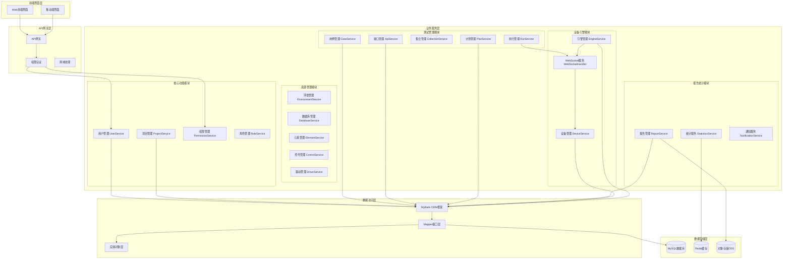
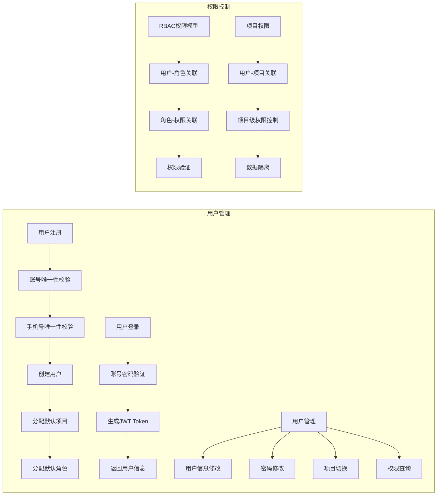
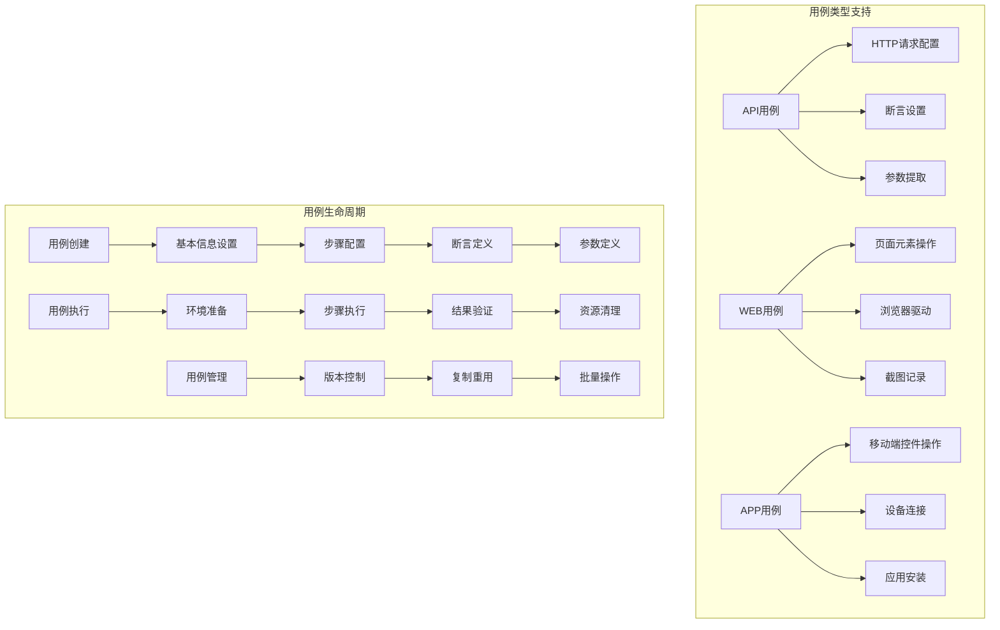
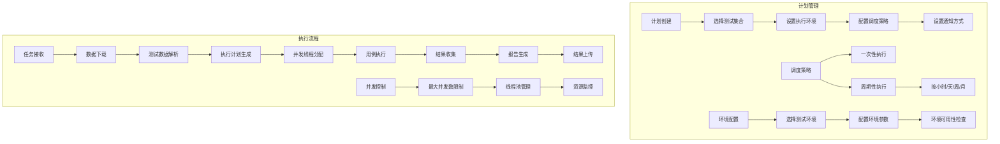
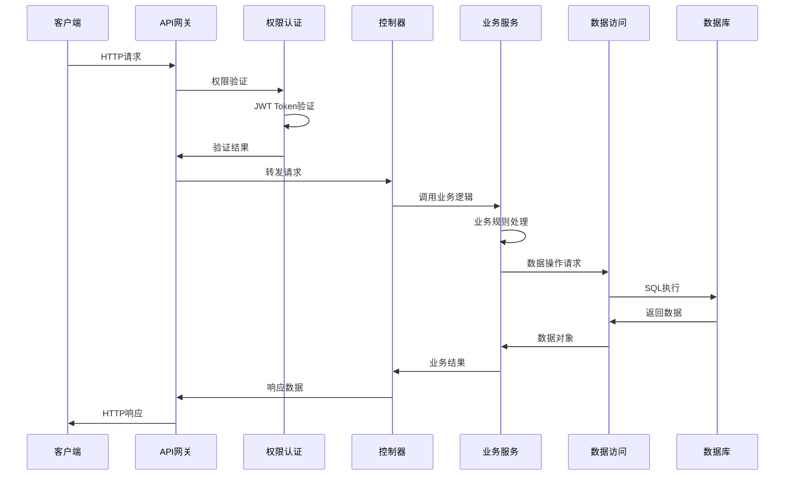
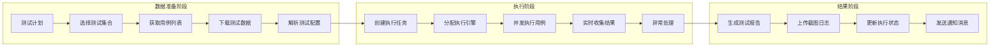
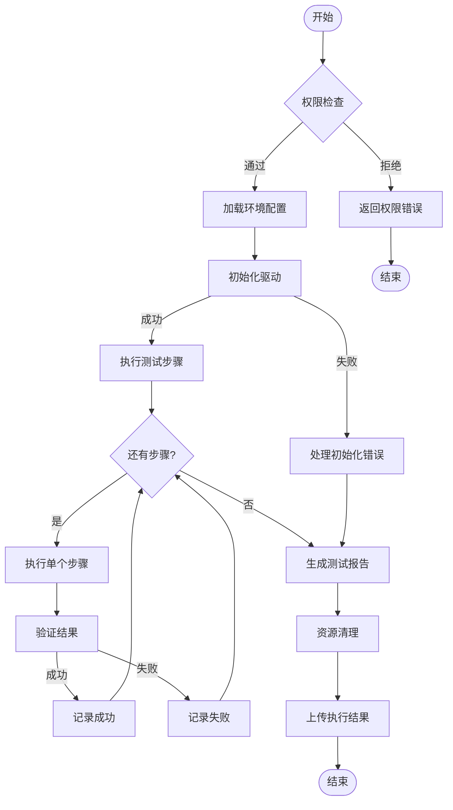
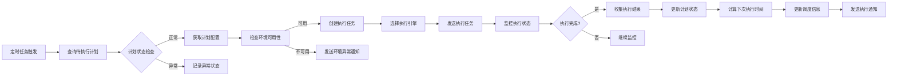

# 测试自动化平台后端 - 系统功能结构图

## 系统整体架构图

## 核心功能模块详细结构图

### 1. 用户权限管理模块

### 2. 测试用例管理模块

### 3. 测试计划与执行模块

## 数据流转图

### 1. 请求处理流程

### 2. 测试执行数据流

## 业务流程图

### 1. 用例执行完整流程

### 2. 计划调度执行流程

## 技术架构说明

### 1. 架构设计原则

**分层架构模式**
- 表现层：RESTful API接口设计
- 业务层：Service层封装业务逻辑
- 数据层：MyBatis ORM框架 + MySQL数据库
- 接口层：WebSocket实时通信

**微服务设计理念**
- 模块化设计，高内聚低耦合
- 服务间通过接口解耦
- 支持水平扩展和负载均衡
- 故障隔离和容错处理

### 2. 核心技术栈

**后端框架**
- Spring Boot 2.x：快速开发框架
- Spring MVC：RESTful API支持
- MyBatis 3.x：ORM数据访问框架
- Spring Transaction：声明式事务管理

**数据存储**
- MySQL 8.0：关系型数据存储
- Redis：缓存和会话管理
- OSS：对象存储（报告截图等）

**安全认证**
- JWT Token：无状态身份认证
- Spring Security：安全框架集成
- RBAC权限模型：基于角色的访问控制

**通信机制**
- HTTP/HTTPS：API接口通信
- WebSocket：实时双向通信
- RESTful：资源导向的API设计

### 3. 性能优化策略

**数据库优化**
- 索引优化：关键字段建立索引
- 查询优化：避免N+1查询问题
- 连接池：数据库连接复用
- 读写分离：主从数据库架构

**缓存策略**
- 用户会话缓存
- 权限数据缓存
- 热点数据缓存
- 查询结果缓存

**并发处理**
- 线程池管理
- 异步任务处理
- 分布式锁机制
- 乐观锁并发控制

### 4. 可靠性保障

**容错机制**
- 服务降级处理
- 熔断器模式
- 重试机制
- 异常日志记录

**监控告警**
- 系统性能监控
- 业务指标监控
- 异常告警机制
- 健康检查接口

**数据安全**
- 数据加密存储
- SQL注入防护
- XSS攻击防护
- 敏感信息脱敏