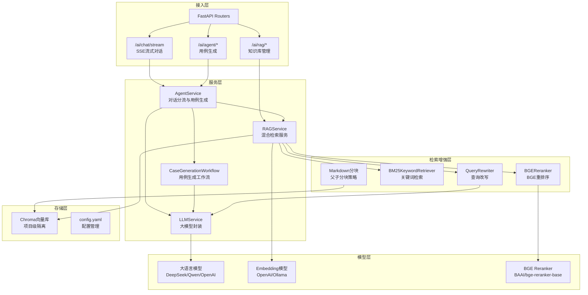
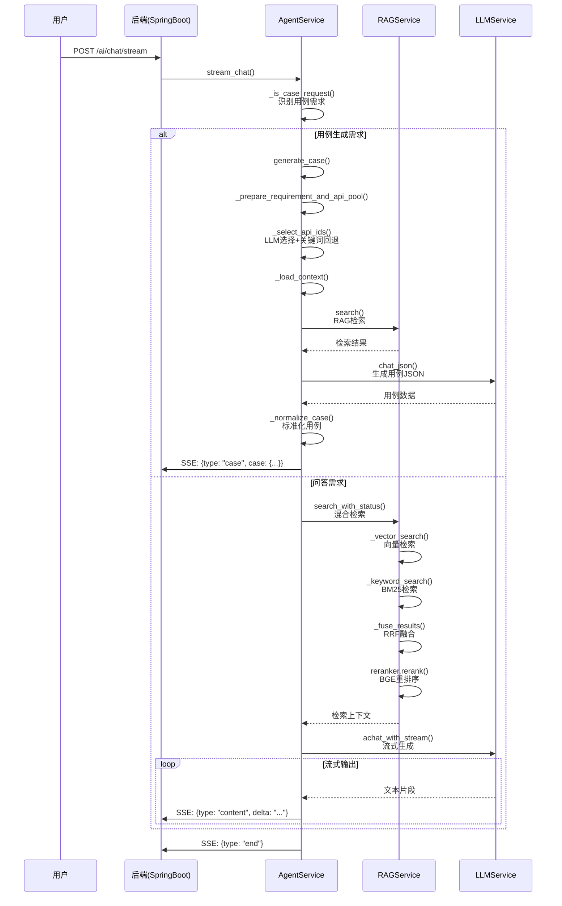
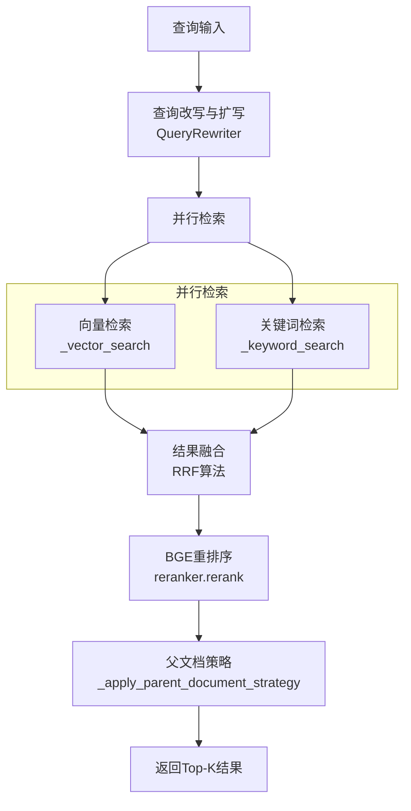
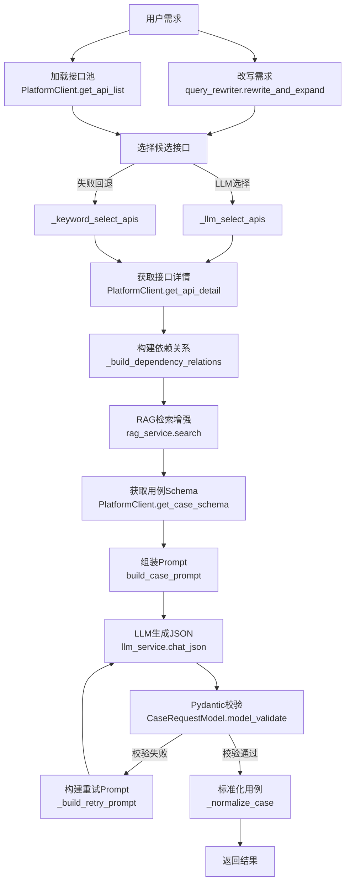
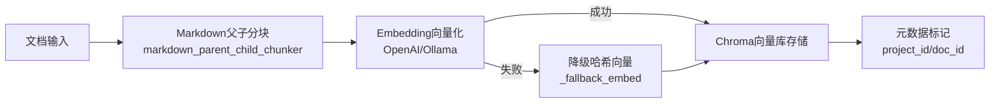

# AI智能测试助手服务

FastAPI + LangChain 1.x + Chroma 向量库实现的 AI 服务，为测试平台提供智能对话、知识库管理、用例智能生成能力。

## 一、项目概述

### 1.1 定位

AI服务是AI智能接口测试平台的核心智能模块，作为独立服务通过 HTTP 与 SpringBoot 后端交互，提供：

- **AI 对话**：基于大模型的智能问答，支持SSE流式输出
- **知识库管理**：项目隔离的文档向量检索（RAG）
- **用例生成**：ReAct Agent 自动生成结构化测试用例

### 1.2 架构特点

| 特性 | 说明 |
|------|------|
| **前后端分离** | 独立 FastAPI 服务，通过 REST API 与后端通信 |
| **单库隔离** | Chroma 使用单集合，元数据实现项目数据隔离 |
| **流式输出** | SSE 协议实现实时流式响应 |
| **降级机制** | Embedding 不可用时自动降级为关键词匹配 |
| **全链路追踪** | 集成 LangSmith 实现调用链追踪 |
| **混合检索** | 向量检索 + BM25关键词检索 + BGE重排序 |

### 1.3 技术架构



---

## 二、项目结构

```
ai-service/
├── app/
│   ├── main.py                      # FastAPI 应用入口
│   ├── config.py                    # 配置管理（Singleton模式）
│   ├── routers/                     # 路由层
│   │   ├── __init__.py
│   │   ├── chat.py                  # AI对话路由（SSE流式）
│   │   ├── knowledge.py             # RAG知识库路由
│   │   └── agent.py                 # 用例生成路由
│   ├── services/                    # 业务逻辑层
│   │   ├── agent_service.py         # Agent核心服务
│   │   ├── llm_service.py           # LLM服务（LCEL实现）
│   │   ├── rag_service.py           # RAG检索服务
│   │   ├── case_workflow.py         # 用例生成工作流
│   │   └── retrieval/               # 检索增强模块
│   │       ├── __init__.py
│   │       ├── bm25.py              # BM25关键词检索
│   │       ├── query_rewrite.py     # 查询改写（LLM驱动）
│   │       └── reranker.py          # BGE重排序
│   ├── tools/
│   │   └── platform_tools.py        # 平台API客户端
│   ├── utils/
│   │   ├── chunking.py              # 文本分块
│   │   └── markdown_parent_child_chunking.py  # Markdown父子分块
│   ├── prompts/
│   │   ├── __init__.py
│   │   └── assistant_prompts.py     # Prompt模板
│   ├── schemas/
│   │   ├── __init__.py
│   │   └── ai_models.py             # Pydantic模型
│   └── observability/               # 可观测性
│       ├── __init__.py
│       ├── logger.py                # Loguru日志
│       ├── langsmith.py             # LangSmith配置
│       └── traceable.py             # 追踪装饰器
├── config.yaml                      # 配置文件
└── requirements.txt                 # 依赖配置
```

---

## 三、核心模块说明

### 3.1 路由层 (routers/)

| 文件 | 路径 | 核心接口 | 说明 |
|------|------|----------|------|
| chat.py | /ai | POST /chat/stream | SSE流式对话，自动识别用例需求 |
| knowledge.py | /ai/rag | POST /add, /delete, /query, GET /stats | 知识库增删改查 |
| agent.py | /ai/agent | POST /generate-case, GET /api-list | 用例生成和接口列表 |

**SSE事件类型：**
```json
{"type": "content", "delta": "..."}       // 文本内容片段
{"type": "case", "case": {...}}           // 生成的用例
{"type": "error", "message": "..."}       // 错误信息
{"type": "end"}                           // 流结束标记
```

### 3.2 服务层 (services/)

#### AgentService (agent_service.py)

对话分流和用例生成的核心服务：

| 方法 | 职责 |
|------|------|
| `stream_chat()` | 流式对话入口，自动分流用例/问答需求 |
| `generate_case()` | 用例生成主入口，执行完整工作流 |
| `_is_case_request()` | 用例需求识别（关键词匹配） |
| `_select_api_ids()` | 接口选择（LLM + 关键词回退） |
| `_build_dependency_relations()` | 构建接口依赖关系 |

#### RAGService (rag_service.py)

检索增强生成服务：

| 方法 | 职责 |
|------|------|
| `add_document()` | 文档切片并写入向量库 |
| `delete_document()` | 删除文档对应向量 |
| `search_with_status()` | 混合检索总入口 |
| `_vector_search()` | 向量语义检索 |
| `_keyword_search()` | BM25关键词检索 |
| `_fuse_results()` | RRF融合结果 |
| `_apply_parent_document_strategy()` | 父文档检索策略 |

#### LLMService (llm_service.py)

大模型统一封装（LangChain 1.x LCEL）：

| 方法 | 职责 |
|------|------|
| `chat()` / `achat()` | 普通对话 |
| `chat_json()` / `achat_json()` | JSON模式对话 |
| `chat_with_stream()` / `achat_with_stream()` | 流式对话 |
| `chat_structured()` / `achat_structured()` | 结构化输出 |

#### CaseGenerationWorkflow (case_workflow.py)

用例生成工作流：

| 阶段 | 方法 | 说明 |
|------|------|------|
| 1 | `_prepare_requirement_and_api_pool()` | 改写需求 + 加载接口池（并行） |
| 2 | `_select_api_ids()` | 选择候选接口 |
| 3 | `_load_context()` | 加载接口详情、RAG、Schema |
| 4 | `_generate_and_validate_with_retry()` | 生成并校验（含重试） |

### 3.3 检索增强层 (services/retrieval/)

#### BM25KeywordRetriever (bm25.py)

基于概率模型的关键词检索：
- 支持中文分词（2-4字词组）
- 停用词过滤
- BM25评分算法

#### QueryRewriter (query_rewrite.py)

LLM驱动的查询改写：
- 同义词扩展
- 查询扩写
- 支持对话历史上下文

#### BGEReranker (reranker.py)

BGE重排序器：
- 使用BAAI/bge-reranker-base模型
- 批量处理提高效率
- 降级策略（模型不可用时使用原始分数）

---

## 四、核心流程

### 4.1 AI对话流程



### 4.2 RAG混合检索流程



### 4.3 用例生成流程



### 4.4 知识库索引流程



---

## 五、配置说明

### 5.1 config.yaml

```yaml
llm:
  provider: deepseek          # LLM提供商: deepseek/qwen/openai
  model: deepseek-chat        # 模型名称
  api_key: sk-xxx             # API Key
  base_url: https://api.deepseek.com/v1
  temperature: 0.7
  max_tokens: 2000

embedding:
  provider: openai            # Embedding提供商: openai/ollama
  model: text-embedding-3-small
  openai_api_key: ""
  openai_base_url: https://api.openai.com/v1
  ollama_url: http://localhost:11434
  ollama_model: nomic-embed-text

vector_store:
  persist_directory: ./chroma_data
  collection_name: knowledge_docs

platform:
  base_url: http://localhost:8080
  timeout: 30

server:
  host: 0.0.0.0
  port: 8001
  cors_origins:
    - http://localhost:5173
    - http://localhost:8080

langsmith:
  api_key: ""
  project: test-platform-ai
  tracing: false
```

### 5.2 环境变量覆盖

| 变量 | 说明 |
|------|------|
| `DEEPSEEK_API_KEY` | DeepSeek API Key |
| `OPENAI_API_KEY` | OpenAI API Key |
| `PLATFORM_BASE_URL` | 平台后端地址 |
| `LANGSMITH_API_KEY` | LangSmith API Key |
| `LANGSMITH_TRACING` | 是否启用追踪 |

---

## 六、启动服务

```bash
cd ai-service

# 安装依赖
pip install -r requirements.txt

# 启动服务
python -m uvicorn app.main:app --reload --port 8001

# 健康检查
curl http://localhost:8001/health
```

---

## 七、核心亮点

### 7.1 混合检索策略

```
查询输入
    ↓
查询改写（LLM驱动）
    ↓
并行执行：
    ├─ 向量检索（语义相似度）
    └─ BM25检索（关键词匹配）
    ↓
RRF融合（Reciprocal Rank Fusion）
    ↓
BGE重排序（精排）
    ↓
父文档策略（子块匹配，父块召回）
    ↓
返回Top-K结果
```

### 7.2 用例生成工作流

- **固定工作流**：明确的阶段划分，便于调试和优化
- **ReAct接口选择**：LLM智能选择 + 关键词回退策略
- **依赖关系分析**：自动识别登录、注册等前置依赖
- **Pydantic校验**：结构化校验 + 失败重试机制
- **RAG增强**：融合知识库上下文，提高生成质量

### 7.3 数据隔离策略

- **项目级隔离**：通过 `project_id` 元数据过滤
- **文档级隔离**：通过 `doc_id` 标识每个文档
- **单集合设计**：Chroma使用单集合，简化管理

### 7.4 降级机制

| 场景 | 降级策略 |
|------|----------|
| Embedding不可用 | 使用哈希向量降级 |
| BGE重排序失败 | 使用原始分数排序 |
| LLM选择接口失败 | 关键词匹配回退 |
| 向量库异常 | 返回错误状态码 |

---

## 八、调试与测试

每个核心模块都包含 `if __name__ == "__main__"` 调试代码：

```bash
# 测试配置模块
python app/config.py

# 测试 LLM 服务
python app/services/llm_service.py

# 测试 RAG 服务
python app/services/rag_service.py

# 测试 Agent 服务
python app/services/agent_service.py

# 测试 BM25 检索
python app/services/retrieval/bm25.py

# 测试查询改写
python app/services/retrieval/query_rewrite.py
```

---

## 九、接口规范

### 9.1 SSE事件格式

```json
// 内容片段
{"type": "content", "delta": "..."}

// 生成的用例
{"type": "case", "case": {...}, "api_ids": [...]}

// 错误信息
{"type": "error", "message": "..."}

// 流结束
{"type": "end"}
```

### 9.2 项目隔离规则

- **向量库**：通过 `project_id` 元数据过滤
- **对话历史**：前端维护，每次请求携带
- **接口查询**：必须携带 `project_id`

---

## 十、LangSmith追踪

集成LangSmith实现全链路追踪：

```python
from app.observability.traceable import traceable

@traceable(name="rag_search", run_type="retriever")
def search_with_status(...):
    # 方法会自动被追踪
    ...
```

追踪范围：
- Agent对话流程
- RAG检索流程
- 用例生成工作流
- LLM调用

---

## 十一、依赖说明

核心依赖：
- `fastapi` - Web框架
- `langchain>=0.1.0` - LLM应用框架
- `chromadb` - 向量数据库
- `transformers` - BGE重排序模型
- `httpx` - HTTP客户端
- `loguru` - 日志
- `pydantic` - 数据校验
