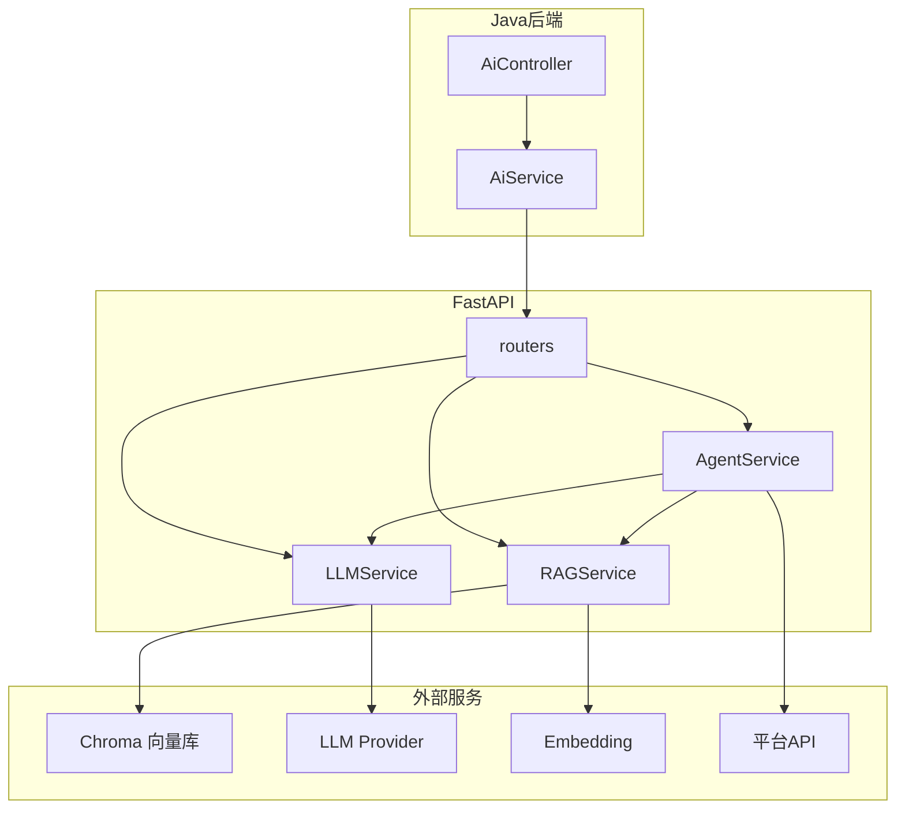
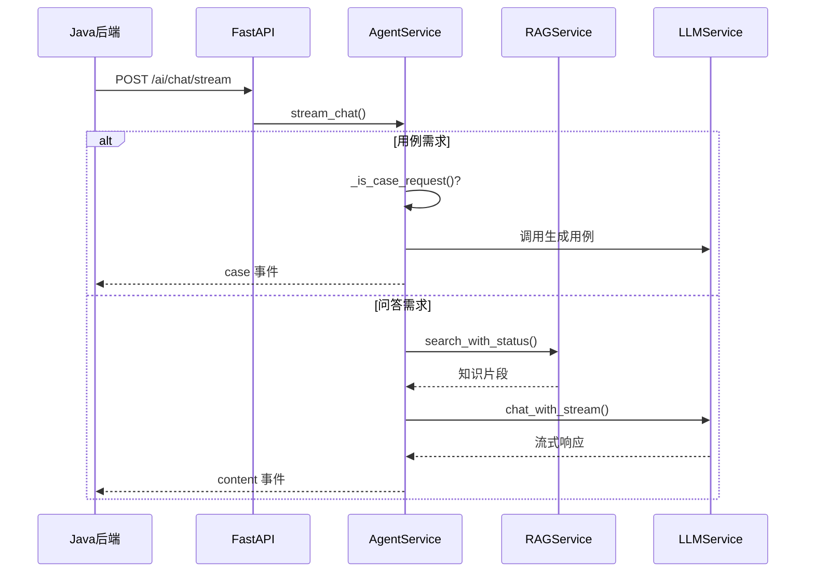
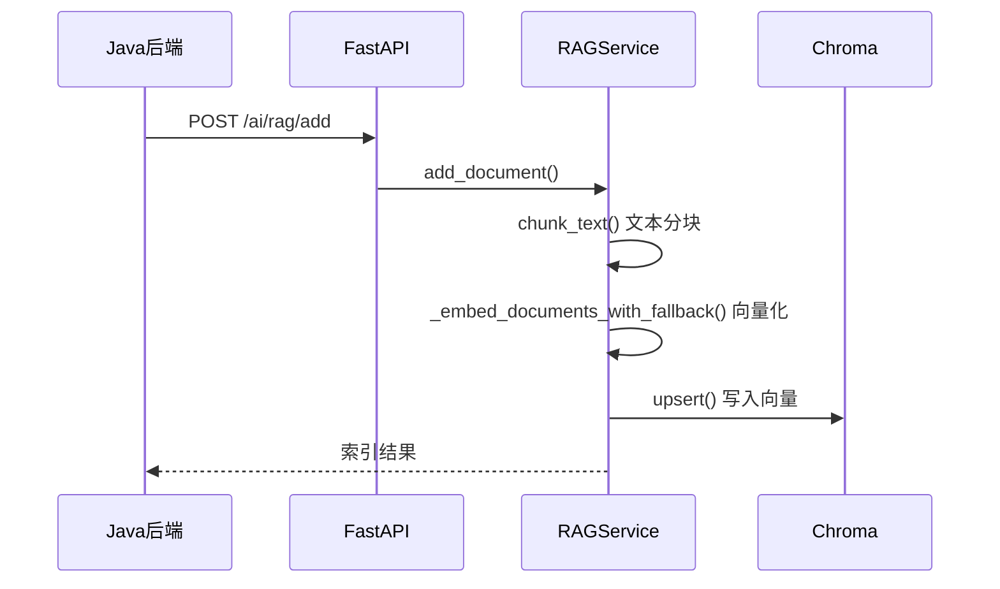
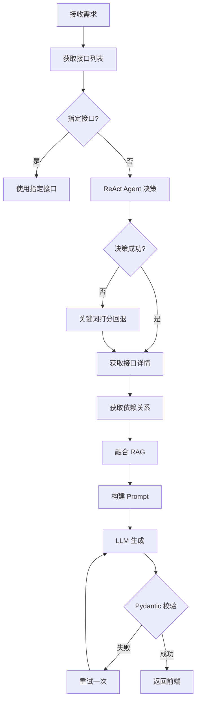

# AI 智能测试助手服务

FastAPI + LangChain + Chroma 向量库实现的 AI 服务，为流马测试平台提供智能对话、知识库管理、用例生成能力。

## 1 项目概述

### 1.1 定位

AI 服务是流马自动化测试平台的重构新增模块，作为独立服务通过 HTTP 与 SpringBoot 后端交互，提供：

- **AI 对话**：基于大模型的智能问答
- **知识库管理**：文档向量检索（RAG）
- **用例生成**：ReAct Agent 自动生成测试用例

### 1.2 架构特点

- **前后端分离**：独立 FastAPI 服务，通过 REST API 与后端通信
- **单库隔离**：Chroma 使用单集合，元数据实现项目数据隔离
- **流式输出**：SSE 协议实现实时流式响应
- **降级机制**：Embedding 不可用时自动降级为关键词匹配

---

## 2 技术架构

### 2.1 技术栈

| 层级 | 技术选型 | 说明 |
|------|----------|------|
| Web 框架 | FastAPI | 高性能异步 API 框架 |
| LLM 集成 | LangChain | 大模型工具链 |
| 向量数据库 | Chroma | 本地持久化向量存储 |
| Embedding | Ollama / OpenAI | 文档向量化 |
| 大模型 | DeepSeek / Qwen / OpenAI | 智能对话与推理 |

### 2.2 目录结构

```
ai-service/
├── app/
│   ├── config.py              # 配置管理（单例模式）
│   ├── main.py                # FastAPI 应用入口
│   ├── routers/               # 路由层
│   │   ├── chat.py           # AI 对话路由
│   │   ├── knowledge.py      # RAG 知识库路由
│   │   └── agent.py          # 用例生成路由
│   ├── services/              # 业务逻辑层
│   │   ├── agent_service.py  # Agent 核心服务（对话、用例生成）
│   │   ├── llm_service.py    # LLM 服务（流式/非流式）
│   │   └── rag_service.py    # RAG 服务（向量检索）
│   ├── tools/                 # 工具模块
│   │   └── platform_tools.py # 平台 API 客户端
│   └── utils/                 # 工具类
│       └── chunking.py       # 文本分块工具
├── assets/                    # 说明文档
│   └── ai服务相关说明/
├── config.yaml               # 配置文件
└── requirements.txt          # Python 依赖
```

### 2.3 整体架构图



---

## 3 功能模块

### 3.1 路由层（routers）

| 文件 | 路径前缀 | 核心接口 |
|------|----------|----------|
| chat.py | /ai | `/chat` 非流式对话、`/chat/stream` SSE 流式对话 |
| knowledge.py | /ai/rag | `/add` 添加文档、`/delete` 删除文档、`/query` 知识检索 |
| agent.py | /ai/agent | `/generate-case` 用例生成、`/api-list` 接口列表 |

### 3.2 服务层（services）

#### AgentService

核心业务逻辑类，负责对话分流和用例生成：

| 方法 | 说明 |
|------|------|
| `chat()` | 非流式对话入口，自动识别用例需求 |
| `stream_chat()` | SSE 流式对话，支持用例事件推送 |
| `generate_case()` | 用例生成主流程 |

**核心逻辑**：

1. **用例需求识别**：`_is_case_request()` 方法识别消息是否包含"用例/测试点/测试场景"+"生成/设计/编写"关键词
2. **私有问题识别**：`_is_project_private_query()` 识别项目私有问题
3. **接口选择**：ReAct Agent 决策 + 关键词打分回退
4. **结果校验**：Pydantic 模型强校验，失败自动重试

#### LLMService

大模型交互服务：

| 方法 | 说明 |
|------|------|
| `chat()` | 非流式对话 |
| `chat_with_stream()` | 流式对话（生成器） |
| `generate()` | 简单 prompt 生成 |

**支持 Provider**：deepseek、openai、qwen

#### RAGService

知识检索服务：

| 方法 | 说明 |
|------|------|
| `add_document()` | 添加文档到向量库 |
| `delete_document()` | 删除向量 |
| `search()` | 知识检索 |
| `search_with_status()` | 带状态检索 |

**核心特性**：
- 混合检索：关键词 + 向量融合
- Embedding 降级：不可用时使用字符编码伪向量
- 项目隔离：元数据过滤 `where={"project_id": project_id}`

### 3.3 工具层（tools）

**PlatformClient**：平台 API 客户端

| 方法 | 说明 |
|------|------|
| `get_api_list()` | 获取项目接口列表 |
| `get_api_detail()` | 获取接口详情 |
| `get_case_schema()` | 获取用例 Schema |
| `get_module_list()` | 获取模块列表 |

### 3.4 工具类（utils）

**TextChunker**：文本分块器

| 方法 | 说明 |
|------|------|
| `chunk_markdown_by_heading()` | 按 Markdown 标题分块 |
| `chunk_by_paragraph()` | 按段落分块 |
| `chunk_by_sentence()` | 按句子分块 |
| `chunk_fixed()` | 固定大小分块 |

---

## 4 核心流程

### 4.1 AI 对话流程



### 4.2 知识库索引流程



### 4.3 用例生成流程



---

## 5 配置说明

### 5.1 config.yaml

```yaml
# LLM 配置
llm:
  provider: deepseek          # 提供商：deepseek/qwen/openai
  model: deepseek-v3.2       # 模型名称
  api_key: sk-xxx            # API 密钥
  base_url: https://api.deepseek.com/v1
  temperature: 0.7
  max_tokens: 2000

# Embedding 配置
embedding:
  provider: ollama           # ollama/openai
  ollama_url: http://localhost:11434
  ollama_model: nomic-embed-text

# 向量库配置
vector_store:
  persist_directory: ./chroma_data
  collection_name: knowledge_docs

# 平台配置
platform:
  base_url: http://localhost:8080
  timeout: 30

# 服务配置
server:
  host: 0.0.0.0
  port: 8001
  cors_origins:
    - http://localhost:5173
    - http://localhost:8080
```

### 5.2 环境变量覆盖

| 环境变量 | 说明 |
|----------|------|
| DEEPSEEK_API_KEY | 覆盖 LLM API Key |
| OPENAI_API_KEY | 覆盖 LLM API Key |
| PLATFORM_BASE_URL | 覆盖平台地址 |

---

## 6 开发规范

### 6.1 接口规范

**请求/响应格式**：

```json
// 请求
{
  "project_id": "必填",
  "message": "必填",
  "use_rag": true,
  "messages": []
}

// 响应（SSE 事件）
{"type": "content", "delta": "..."}
{"type": "case", "case": {...}, "api_ids": []}
{"type": "error", "message": "..."}
{"type": "end"}
```

### 6.2 项目隔离规则

- **向量库**：所有项目共用一个 Collection，通过 `project_id` 元数据过滤
- **对话历史**：由前端维护，每次请求携带全量 messages
- **接口查询**：Agent 调用平台 API 时必须携带 project_id

### 6.3 用例生成约束

1. **只能使用已存在的 apiId**：禁止创建新接口
2. **输出必须是纯 JSON**：不包含 Markdown 标记
3. **必须符合 Schema**：Pydantic 强校验
4. **至少 2 个步骤**：正向 + 异常场景

### 6.4 异常处理

| 场景 | 处理方式 |
|------|----------|
| Embedding 不可用 | 降级为关键词匹配，标记 degraded 状态 |
| JSON 解析失败 | 自动重试一次 |
| 接口列表为空 | 返回明确错误提示 |
| LLM 未配置 | 返回"AI服务未配置" |

---

## 7 快速开始

### 7.1 安装依赖

```bash
cd ai-service
pip3 install -r requirements.txt
```

### 7.2 配置服务

1. 复制 `config.yaml` 并配置 LLM API Key
2. 确保 Embedding 服务可用（Ollama 或 OpenAI）

### 7.3 启动服务

```bash
# 开发模式
python3 -m uvicorn app.main:app --reload --host 0.0.0.0 --port 8001

# 或直接运行
python3 app/main.py
```

### 7.4 健康检查

```bash
curl http://localhost:8001/health
# 返回: {"status": "healthy"}
```

---

## 8 二开指南

### 8.1 新增 LLM Provider

在 `app/services/llm_service.py` 的 `_create_llm()` 方法中添加：

```python
if self._provider == "new_provider":
    return ChatOpenAI(
        model=config.llm_model,
        openai_api_key=config.llm_api_key,
        base_url="https://your-provider-url/v1",
        temperature=config.llm_temperature,
        max_tokens=config.llm_max_tokens,
        streaming=streaming,
    )
```

### 8.2 新增 Agent 工具

在 `AgentService._build_case_selector_executor()` 的 tools 列表中添加：

```python
Tool(
    name="new_tool",
    func=new_tool_function,
    description="工具描述"
)
```

### 8.3 自定义分块策略

在 `app/utils/chunking.py` 中扩展 `TextChunker` 类：

```python
@staticmethod
def chunk_custom(text: str, **kwargs) -> List[str]:
    # 自定义分块逻辑
    pass
```

---

## 9 相关文档

| 文档 | 说明 |
|------|------|
| `assets/ai服务相关说明/PRD.md` | 项目需求说明 |
| `assets/ai服务相关说明/框架设计/系统功能结构图.md` | 技术架构详解 |
| `assets/ai服务相关说明/框架设计/功能模块.md` | 功能模块说明 |
| `assets/ai服务相关说明/框架设计/数据设计.md` | 数据模型设计 |
| `assets/ai服务相关说明/框架设计/业务逻辑设计.md` | 业务流程设计 |
