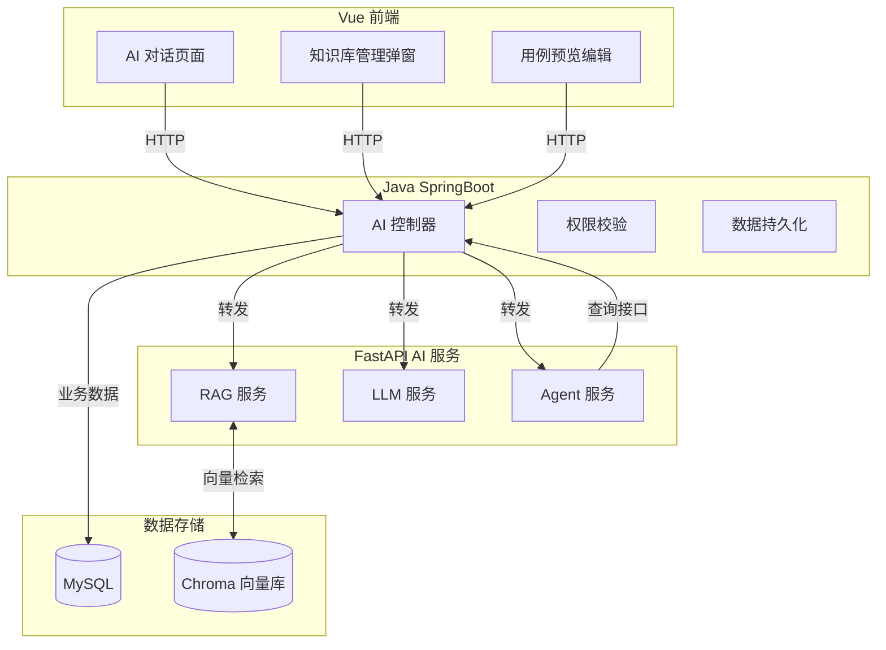
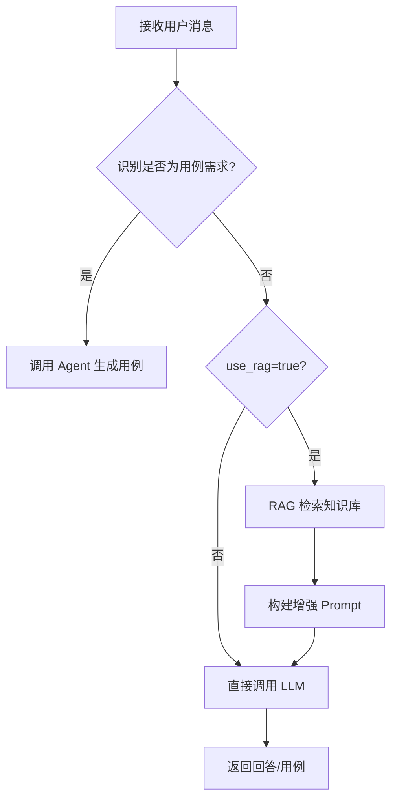
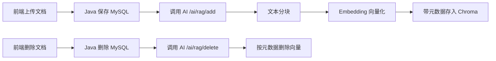
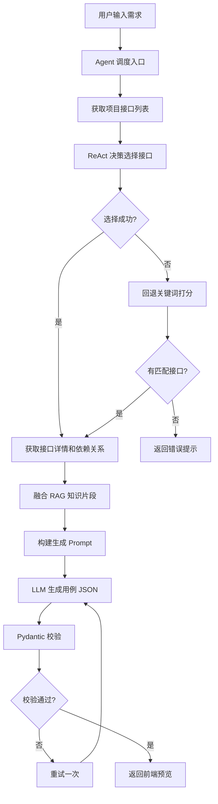

# 测试平台 AI 服务模块 PRD 文档

## 1 项目背景

### 1.1 项目概述

流马自动化测试平台是一款低代码分布式接口自动化测试平台，支持 API/Web/App 三种自动化测试类型。AI 服务模块是平台的重构新增模块，旨在通过大语言模型和 RAG 技术提升测试效率。

### 1.2 重构背景

原 AI 模块存在以下核心问题：

| 问题           | 说明                                              |
| -------------- | ------------------------------------------------- |
| 向量库架构错误 | Chroma 按项目多文件夹隔离，无法并发、无法统一管理 |
| Agent 逻辑过重 | 使用 ReAct 循环自主决策生成接口，不可控           |
| 无格式强约束   | 无 JSON Schema 校验，AI 输出无法直接入库          |
| 对话历史冗余   | 前端 localStorage 与后端对话 ID 逻辑冲突          |
| RAG 检索无隔离 | 未使用元数据过滤，存在项目数据泄露风险            |

### 1.3 重构目标

1. **稳定**：AI 输出 100% 可被后端解析、可直接保存
2. **简洁**：禁止自主创建接口、去掉复杂多轮确认
3. **统一**：Chroma 单库存储，元数据实现项目隔离
4. **清晰**：前端预览 → 编辑 → 保存（用户主动保存方入库）
5. **高效**：RAG 检索精准、快速、安全

---

## 2 系统架构

### 2.1 整体架构



### 2.2 模块职责

| 模块                      | 职责                                                         |
| ------------------------- | ------------------------------------------------------------ |
| **Vue 前端**        | 对话展示、用例预览编辑、localStorage 维护对话历史            |
| **Java 后端**       | 统一鉴权、权限校验、项目隔离、接口查询、数据格式校验、持久化 |
| **FastAPI AI 服务** | RAG 检索、对话历史拼接、用例结构化生成、Pydantic 格式强校验  |
| **Chroma 向量库**   | 单库单集合，元数据：project_id/doc_id/doc_type/doc_name      |

### 2.3 数据流原则

- **Java 掌控所有业务数据**
- **AI 只做理解与结构化输出**
- **AI 不写库、不删库、不自主调用业务接口**
- **用例生成 = 已有接口组装**

---

## 3 功能需求

### 3.1 AI 对话

#### 3.1.1 功能描述

提供基于大语言模型的智能问答服务，支持知识库增强和流式输出。

#### 3.1.2 接口定义

| 接口                | 方法 | 说明         |
| ------------------- | ---- | ------------ |
| `/ai/chat`        | POST | 非流式对话   |
| `/ai/chat/stream` | POST | SSE 流式对话 |

**请求参数（ChatRequest）**

| 字段       | 类型    | 必填 | 说明                      |
| ---------- | ------- | ---- | ------------------------- |
| project_id | string  | 是   | 项目 ID                   |
| message    | string  | 是   | 用户消息                  |
| use_rag    | boolean | 否   | 是否启用 RAG（默认 true） |
| messages   | array   | 否   | 对话历史                  |

**响应格式**

流式输出事件协议：

- `{"type": "content", "delta": "..."}` 增量文本
- `{"type": "case", "case": {...}, "api_ids": [...]}` 用例草稿
- `{"type": "end"}` 正常结束
- `{"type": "error", "message": "..."}` 异常事件

#### 3.1.3 核心逻辑



#### 3.1.4 智能分流规则

- **用例需求识别**：消息包含"用例/测试点/测试场景/测试步骤" + "生成/设计/编写/创建"等关键词
- **RAG 分流**：项目私有问题优先检索知识库，无结果时明确说明"未检索到证据"再给排查建议；公开常识问题直接回答
- **降级处理**：Embedding 不可用时使用关键词匹配降级回答

### 3.2 知识库管理

#### 3.2.1 功能描述

提供知识文档的增删改查和向量检索功能，支持项目级数据隔离。

#### 3.2.2 接口定义

| 接口                           | 方法 | 说明                   |
| ------------------------------ | ---- | ---------------------- |
| `/ai/rag/add`                | POST | 新增/重建知识文档索引  |
| `/ai/rag/delete`             | POST | 删除知识文档向量       |
| `/ai/rag/query`              | POST | 查询知识库并返回上下文 |
| `/ai/rag/stats/{project_id}` | GET  | 获取项目知识库统计     |

**RAG 添加请求（RagAddRequest）**

```json
{
  "project_id": "p1",
  "doc_id": "d1",
  "doc_type": "manual",
  "doc_name": "登录文档",
  "content": "..."
}
```

**RAG 查询请求（RagQueryRequest）**

```json
{
  "project_id": "p1",
  "question": "如何进行登录测试?",
  "top_k": 5,
  "messages": []
}
```

#### 3.2.3 核心流程



#### 3.2.4 文档分块策略

- **分块大小**：1200 字符
- **重叠字符**：80 字符
- **支持 Markdown 标题识别**

#### 3.2.5 检索策略

采用**混合检索**模式：

1. **关键词检索**：基于文档内容和元数据打分
2. **向量检索**：基于 Embedding 相似度
3. **去重融合**：合并结果并去除重复

**检索状态返回值**

| 状态                  | 说明                 |
| --------------------- | -------------------- |
| success               | 正常检索到结果       |
| no_context            | 未检索到相关文档     |
| embedding_unavailable | Embedding 服务不可用 |
| vector_error          | 向量库异常           |

### 3.3 用例生成

#### 3.3.1 功能描述

基于项目已有接口，通过 AI Agent 自动生成符合后端 Schema 的测试用例。

#### 3.3.2 接口定义

| 接口                                | 方法 | 说明               |
| ----------------------------------- | ---- | ------------------ |
| `/ai/agent/generate-case`         | POST | 生成测试用例       |
| `/ai/agent/api-list/{project_id}` | GET  | 获取接口列表供选择 |

**用例生成请求（GenerateCaseRequest）**

```json
{
  "project_id": "p1",
  "user_requirement": "设计登录+注册链路用例",
  "selected_apis": ["1001", "1002"],
  "messages": []
}
```

#### 3.3.3 核心流程



#### 3.3.4 Agent 工具

| 工具名            | 功能                                   |
| ----------------- | -------------------------------------- |
| get_api_list      | 获取当前项目全部接口列表               |
| get_api_detail    | 输入接口 ID，返回接口详细信息          |
| get_api_relation  | 输入接口 ID，返回接口依赖关系          |
| generate_testcase | 输入逗号分隔 api_id，输出 api_ids 数组 |

#### 3.3.5 输出约束

1. **只能使用已存在的 apiId**，禁止创建新接口
2. **输出必须是纯 JSON 对象**，不包含 Markdown 标记
3. **必须符合后端 CaseRequest Schema 结构**
4. **至少生成 2 个步骤**（正向场景 + 异常场景）
5. **流程类需求需串联多个相关接口**

---

## 4 技术实现

### 4.1 配置管理

配置文件：`ai-service/config.yaml`

| 配置项                       | 说明             | 示例值                      |
| ---------------------------- | ---------------- | --------------------------- |
| llm.provider                 | LLM 提供商       | deepseek/qwen/openai        |
| llm.model                    | 模型名称         | deepseek-v3.2               |
| llm.api_key                  | API 密钥         | sk-xxx                      |
| llm.base_url                 | API 地址         | https://api.deepseek.com/v1 |
| embedding.provider           | Embedding 提供商 | ollama/openai               |
| embedding.ollama_url         | Ollama 地址      | http://localhost:11434      |
| embedding.ollama_model       | Embedding 模型   | nomic-embed-text            |
| vector_store.collection_name | 向量库集合名     | knowledge_docs              |
| platform.base_url            | 平台后端地址     | http://localhost:8080       |
| server.port                  | AI 服务端口      | 8001                        |

### 4.2 LLM 服务

**支持 Provider**：

- DeepSeek
- OpenAI（兼容）
- 阿里 Qwen

**核心类**：`app/services/llm_service.py`

```python
class LLMService:
    def chat(messages, system_prompt) -> str          # 非流式对话
    def chat_with_stream(messages, system_prompt)      # 流式对话
    def generate(prompt, system_prompt) -> str          # 简单生成
```

### 4.3 RAG 服务

**向量库**：Chroma（单库单集合）

**Embedding 降级机制**：

- 优先使用配置的 Embedding 服务
- 失败时使用关键词匹配降级
- 降级状态可观测

**核心类**：`app/services/rag_service.py`

```python
class RAGService:
    def add_document(project_id, doc_id, doc_type, doc_name, documents)
    def delete_document(project_id, doc_id)
    def search(project_id, query, top_k) -> List[Dict]
    def search_with_status(project_id, query, top_k) -> Dict  # 带状态返回
    def get_collection_stats(project_id) -> Dict
```

### 4.4 Agent 服务

**核心类**：`app/services/agent_service.py`

```python
class AgentService:
    def chat(project_id, token, message, use_rag, messages)     # 非流式对话
    def stream_chat(project_id, token, message, use_rag, messages) # 流式对话
    def generate_case(project_id, token, requirement, selected_apis, messages)
    def get_api_list_for_selection(project_id, token)
```

### 4.5 平台客户端

**核心类**：`app/tools/platform_tools.py`

```python
class PlatformClient:
    def get_api_list(project_id) -> List[Dict]           # 获取接口列表
    def get_api_detail(api_id) -> Dict                   # 获取接口详情
    def get_case_schema(project_id) -> Dict              # 获取用例 Schema
    def get_environment_list(project_id) -> List          # 获取环境列表
    def get_module_list(project_id) -> List               # 获取模块列表
```

---

## 5 数据模型

### 5.1 向量库元数据

```json
{
  "project_id": "1001",
  "doc_id": "567",
  "doc_type": "接口文档",
  "doc_name": "登录接口说明",
  "chunk_index": 0
}
```

### 5.2 用例生成 Schema

```json
{
  "name": "登录正常流程",
  "projectId": "1001",
  "moduleId": "10",
  "moduleName": "用户模块",
  "type": "API",
  "caseApis": [
    {
      "apiId": "123",
      "index": 1,
      "description": "登录成功",
      "header": [],
      "body": {"type": "json", "json": "{\"username\":\"test\",\"password\":\"123456\"}"},
      "query": [],
      "rest": [],
      "assertion": [{"field": "$.code", "op": "==", "expect": 200}],
      "relation": [],
      "apiMethod": "POST",
      "apiName": "用户登录",
      "apiPath": "/api/login"
    }
  ]
}
```

---

## 6 非功能需求

### 6.1 安全

- 不打印/回显 DeepSeek API-Key
- API Key 仅在服务端配置读取
- 项目数据严格隔离

### 6.2 可观测

- AI 服务提供诊断能力（RAG 状态、Embedding 错误）
- 后端与前端将关键错误呈现为可定位信息
- 日志记录链路时序（首包延迟、事件数量）

### 6.3 异常处理

| 场景                   | 处理方式                           |
| ---------------------- | ---------------------------------- |
| 无相关文档（私有问题） | 先说明"未检索到证据"，再给排查建议 |
| 无相关文档（常识问题） | 直接按通用知识回答                 |
| 向量库异常             | 降级回答，提示稍后重试             |
| 用例生成格式错误       | 自动重试 1 次，失败返回明确错误    |
| 接口列表为空           | 提示"请先创建接口后再生成用例"     |

---

## 7 约束与边界

1. **AI 不能修改任何业务数据**
2. **AI 不能创建/删除接口**
3. **用例仅可使用已存在的 api_id**
4. **所有跨项目数据严格隔离**
5. **对话历史不上报后端（前端 localStorage）**
6. **生成 ≠ 保存，保存必须用户主动触发**

---

## 8 验证标准

| 验证项   | 标准                     |
| -------- | ------------------------ |
| RAG 问答 | 不会跨项目泄露数据       |
| 用例生成 | 100% 合法可保存          |
| 文档删除 | 同步删除向量             |
| 并发安全 | 多用户不串数据           |
| 预览编辑 | 正常渲染、可编辑、可保存 |
| 稳定性   | 无崩溃、无格式报错       |
