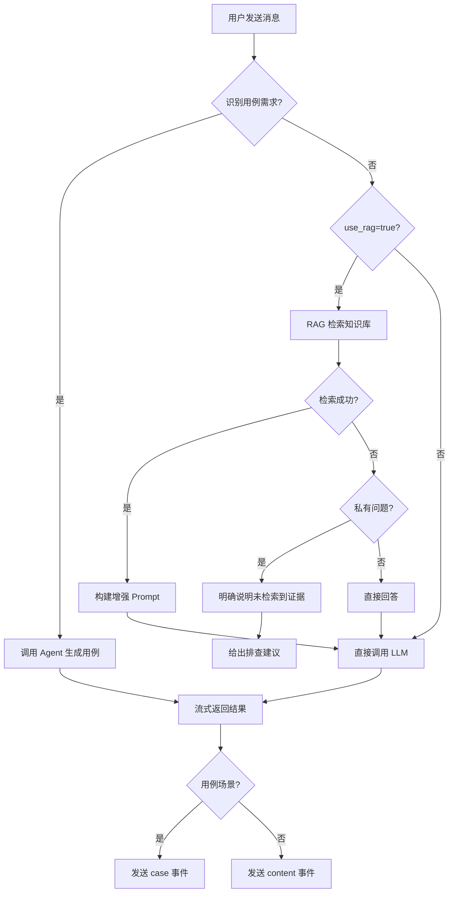
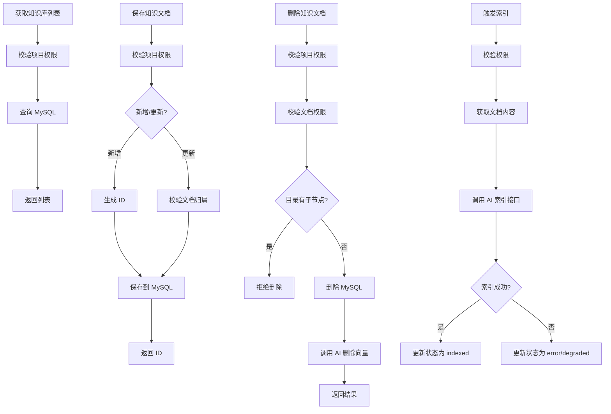
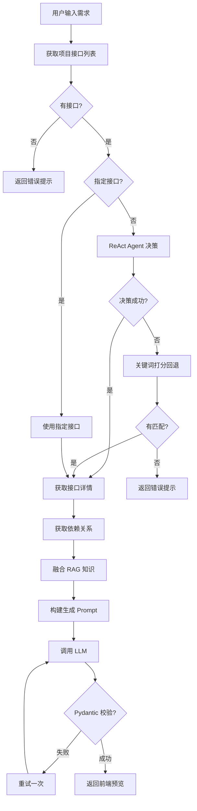
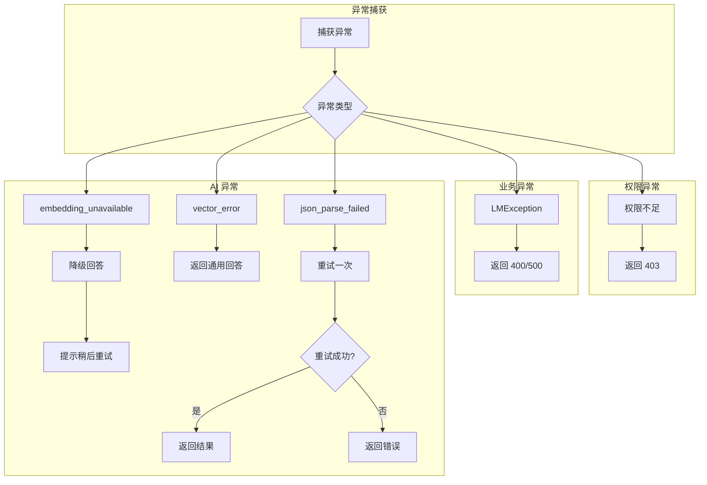

# 业务逻辑设计

## 1 核心业务流程

### 1.1 AI 对话流程



**关键逻辑**:

1. **用例需求识别**: 消息包含"用例/测试点/测试场景/测试步骤" + "生成/设计/编写/创建"
2. **私有问题识别**: 消息包含项目私有关键词（接口、token、login 等）
3. **RAG 分流策略**:
   - 私有问题 + 无知识 → 说明未检索到证据 + 排查建议
   - 私有问题 + 有知识 → 引用知识片段回答
   - 公开问题 → 直接回答

### 1.2 知识库管理流程



**索引状态流转**:

```
active → indexed（成功）
active → degraded（降级）
active → error（失败）
```

### 1.3 用例生成流程



---

## 2 关键业务规则

### 2.1 权限校验规则

| 场景 | 校验逻辑 |
|------|----------|
| 项目访问 | 超级管理员 / 项目成员 |
| 知识管理 | 项目管理员 / 文档创建者 |
| 文档删除 | 需校验目录无子节点 |
| 用例保存 | 校验 apiId 属于当前项目 |

### 2.2 用例生成规则

| 规则 | 说明 |
|------|------|
| 接口来源 | 只能使用项目中已存在的接口 |
| 输出格式 | 必须是纯 JSON 对象 |
| 结构约束 | 符合 CaseRequest Schema |
| 步骤要求 | 至少 2 个步骤（正向 + 异常） |
| 保存校验 | apiId 必须有效且属于当前项目 |

### 2.3 RAG 检索规则

| 规则 | 说明 |
|------|------|
| 项目隔离 | 检索仅返回当前项目文档 |
| 混合检索 | 关键词 + 向量融合 |
| 降级处理 | Embedding 不可用时降级为关键词匹配 |
| 状态回传 | 明确区分 success/no_context/error 状态 |

### 2.4 SSE 流式规则

| 规则 | 说明 |
|------|------|
| 首包延迟 | 记录首包到达时间 |
| 进度日志 | 每 20 个事件记录日志 |
| 异常处理 | 失败时发送 error 事件 |
| 正常结束 | 发送 end 事件 |

---

## 3 异常处理机制

### 3.1 异常分类

| 异常类型 | 来源 | 处理方式 |
|----------|------|----------|
| 权限不足 | 后端 | 返回 403，提示无权限 |
| 资源不存在 | 后端 | 返回 404，提示不存在 |
| 项目 ID 为空 | 后端 | 返回 400 错误 |
| 目录有子节点 | 后端 | 拒绝删除，提示先删除子节点 |
| 接口列表为空 | AI 服务 | 提示先创建接口 |
| 接口不匹配 | AI 服务 | 提示更换描述 |
| JSON 解析失败 | AI 服务 | 自动重试，失败返回错误 |
| Embedding 不可用 | AI 服务 | 降级为关键词匹配 |
| 向量库异常 | AI 服务 | 返回降级回答 |

### 3.2 异常处理策略



### 3.3 降级机制

**Embedding 降级**:

1. 优先使用配置的 Embedding 服务
2. 失败时使用字符 ASCII 码生成的伪向量
3. 状态标记为 degraded，前端提示

**流式降级**:

1. 上游流式失败时
2. 退化为一次性回答
3. 按固定步长切片返回

---

## 4 数据一致性

### 4.1 知识库一致性

| 操作 | 一致性保证 |
|------|------------|
| 文档保存 | 先 MySQL，后向量（异常回滚 MySQL） |
| 文档删除 | 先 MySQL，后向量（异常不影响已删除） |
| 索引重建 | 先删除旧向量，再写入新向量 |

### 4.2 对话历史一致性

| 存储位置 | 说明 |
|----------|------|
| 前端 localStorage | 维护完整对话历史 |
| 每次请求 | 携带全量 messages |
| 后端 | 不存储对话历史 |

---

## 5 性能考虑

### 5.1 并发处理

| 策略 | 说明 |
|------|------|
| 专用线程池 | AI 流式任务使用独立线程池 |
| SSE 长连接 | 5 分钟超时 |
| 连接复用 | HTTP Client 使用连接池 |

### 5.2 优化策略

| 优化点 | 说明 |
|--------|------|
| 延迟初始化 | LLM、Chroma 延迟加载 |
| 向量库单例 | Chroma 使用单例模式 |
| 批量 Embedding | 支持批量向量化 |
| Schema 缓存 | 减少重复抽取 |
