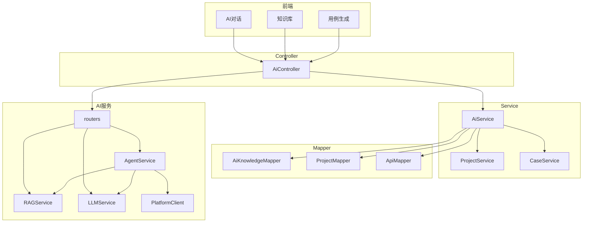

# 功能模块

## 1 模块划分与功能说明

### 1.1 前端模块

#### 1.1.1 AI 对话模块

| 功能 | 说明 |
|------|------|
| 流式对话 | 支持 SSE 接收 AI 回答，实时逐字展示 |
| 对话历史 | localStorage 维护完整对话历史，每次请求携带 |
| RAG 开关 | 可选择是否启用知识库增强 |
| 用例识别 | 自动识别用例生成需求，触发对应流程 |

#### 1.1.2 知识库管理模块

| 功能 | 说明 |
|------|------|
| 目录树展示 | 树形结构展示文档层级 |
| 文档 CRUD | 新建、编辑、删除知识文档 |
| 目录管理 | 支持创建文件夹，删除时校验子节点 |
| 索引状态 | 展示文档索引状态（ready/pending/error/degraded） |
| 重建索引 | 手动触发文档重新向量化 |

#### 1.1.3 用例生成模块

| 功能 | 说明 |
|------|------|
| 接口选择 | 可选是否指定接口 |
| 结果预览 | 解析 JSON 为表单展示 |
| 编辑保存 | 支持修改后手动保存到 MySQL |

---

### 1.2 后端模块

#### 1.2.1 AiController

**位置**: `platform-backend/.../controller/AiController.java`

| 接口 | 方法 | 路径 | 说明 |
|------|------|------|------|
| getKnowledgeList | GET | /autotest/ai/knowledge | 获取知识库列表 |
| getKnowledgeDetail | GET | /autotest/ai/knowledge/{id} | 获取知识库详情 |
| saveKnowledge | POST | /autotest/ai/knowledge | 保存知识文档 |
| deleteKnowledge | DELETE | /autotest/ai/knowledge/{id} | 删除知识文档 |
| indexKnowledge | POST | /autotest/ai/knowledge/index/{id} | 触发索引重建 |
| chatStream | POST | /autotest/ai/chat/stream | SSE 流式对话 |
| generateCase | POST | /autotest/ai/generate/case | 生成测试用例 |
| getAgentApiList | GET | /autotest/ai/agent/api-list/{projectId} | 获取接口列表 |
| saveGeneratedCase | POST | /autotest/ai/generate/case/save | 保存生成的用例 |
| getCaseSchema | GET | /autotest/ai/schema/case | 获取用例 Schema |
| getSchemaByNames | GET | /autotest/ai/schema/extract | 抽取 Schema |

#### 1.2.2 AiService

**位置**: `platform-backend/.../service/AiService.java`

| 方法 | 说明 |
|------|------|
| saveKnowledge | 保存知识库文档（创建/更新） |
| deleteKnowledge | 删除知识库文档（同步删除向量） |
| getKnowledgeList | 获取项目知识库列表 |
| getKnowledgeDetail | 获取知识库详情 |
| indexKnowledge | 触发知识库索引重建 |
| chat | 非流式 AI 对话 |
| streamChat | 流式对话 SSE 转发 |
| generateCase | 调用 Agent 生成用例 |
| getAgentApiList | 获取接口列表供 Agent 使用 |
| validateCaseApiIds | 校验用例步骤中的 apiId 归属 |

#### 1.2.3 权限校验

| 校验规则 | 说明 |
|----------|------|
| 项目访问 | 验证用户是否有项目权限 |
| 知识管理 | 项目管理员或文档创建者可管理 |
| 文档删除 | 目录删除需校验无子节点 |

---

### 1.3 AI 服务模块

#### 1.3.1 路由层 (routers)

| 路由文件 | 路径前缀 | 说明 |
|----------|----------|------|
| chat.py | /ai | AI 对话（SSE 流式） |
| knowledge.py | /ai/rag | RAG 知识库操作 |
| agent.py | /ai/agent | 用例生成 Agent |

#### 1.3.2 AgentService

**位置**: `ai-service/app/services/agent_service.py`

| 方法 | 说明 |
|------|------|
| chat | 非流式对话，自动分流用例需求/RAG 问答 |
| stream_chat | SSE 流式对话，支持用例生成事件 |
| generate_case | 用例生成主流程 |
| get_api_list_for_selection | 获取接口列表供前端选择 |

**核心逻辑**:
- `_is_case_request()`: 识别用例需求
- `_is_project_private_query()`: 识别私有问题
- `_select_api_ids()`: ReAct Agent 决策 + 关键词回退
- `_normalize_case()`: Pydantic 强校验与归一化

#### 1.3.3 LLMService

**位置**: `ai-service/app/services/llm_service.py`

| 方法 | 说明 |
|------|------|
| chat | 非流式对话 |
| chat_with_stream | 流式对话（生成器） |
| generate | 简单 prompt 生成 |

**支持的 Provider**:
- deepseek
- openai（兼容）
- qwen（阿里）

#### 1.3.4 RAGService

**位置**: `ai-service/app/services/rag_service.py`

| 方法 | 说明 |
|------|------|
| add_document | 添加文档到向量库 |
| delete_document | 删除向量 |
| search | 知识检索 |
| search_with_status | 带状态检索 |
| get_collection_stats | 获取统计信息 |

**核心特性**:
- Embedding 降级机制
- 混合检索（关键词 + 向量）
- 项目级数据隔离

#### 1.3.5 PlatformClient

**位置**: `ai-service/app/tools/platform_tools.py`

| 方法 | 说明 |
|------|------|
| get_api_list | 获取项目接口列表 |
| get_api_detail | 获取接口详情 |
| get_case_schema | 获取用例 Schema |
| get_environment_list | 获取环境列表 |
| get_module_list | 获取模块列表 |

---

## 2 模块间依赖关系

### 2.1 依赖关系图



### 2.2 调用链路

| 场景 | 调用链 |
|------|--------|
| 知识库管理 | 前端 → AiController → AiService → AiKnowledgeMapper → MySQL |
| 知识库索引 | 前端 → AiController → AiService → AI(routers/knowledge) → RAGService → Chroma |
| AI 对话 | 前端 → AiController → AiService → AI(routers/chat) → AgentService → LLMService → LLM |
| 用例生成 | 前端 → AiController → AiService → AI(routers/agent) → AgentService → PlatformClient → 后端API |

---

## 3 接口设计规范

### 3.1 请求/响应规范

**统一响应格式**:
```json
{
  "data": {},
  "msg": "成功",
  "status": 0
}
```

**错误响应**:
```json
{
  "message": "错误信息",
  "status": 500
}
```

### 3.2 SSE 事件规范

| 事件类型 | 字段 | 说明 |
|----------|------|------|
| content | delta | 增量文本 |
| case | case, api_ids | 用例生成 |
| error | message | 错误信息 |
| end | - | 正常结束 |

### 3.3 字段映射规范

| 前端字段 | AI 服务字段 | 说明 |
|----------|-------------|------|
| projectId | project_id | 项目 ID |
| useRag | use_rag | 是否启用 RAG |
| messages | messages | 对话历史 |
| userRequirement | user_requirement | 用户需求 |
| selectedApis | selected_apis | 选中的接口 |

---

## 4 异常处理规范

### 4.1 后端异常

| 异常类型 | HTTP 状态码 | 说明 |
|----------|-------------|------|
| LMException | 400/500 | 业务异常 |
| 权限不足 | 403 | 无项目权限 |
| 资源不存在 | 404 | 文档/接口不存在 |

### 4.2 AI 服务异常

| 异常类型 | 返回状态 | 说明 |
|----------|----------|------|
| embedding_unavailable | degraded | Embedding 不可用 |
| vector_error | error | 向量库异常 |
| llm_not_configured | error | LLM 未配置 |
| json_parse_failed | error | JSON 解析失败 |
