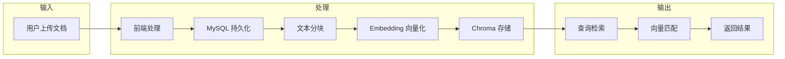
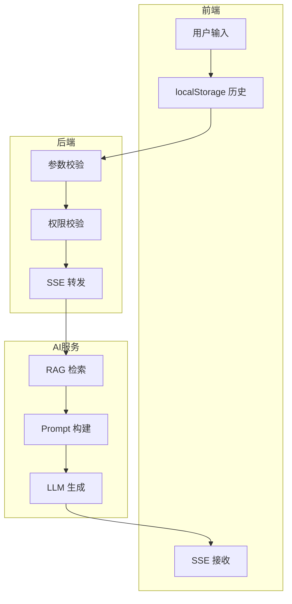

# 数据设计

## 1 主要数据结构

### 1.1 MySQL 数据表

#### 1.1.1 ai_knowledge（知识库文档表）

| 字段 | 类型 | 说明 |
|------|------|------|
| id | varchar(32) | 主键 |
| project_id | varchar(32) | 项目 ID |
| parent_id | varchar(32) | 父节点 ID（0 表示根） |
| name | varchar(255) | 文档名称 |
| content | text | 文档内容 |
| doc_type | varchar(32) | 文档类型（folder/manual） |
| source_type | varchar(32) | 来源类型（manual/import） |
| status | varchar(32) | 索引状态（active/indexed/error/degraded） |
| create_time | bigint | 创建时间 |
| update_time | bigint | 更新时间 |
| create_user | varchar(32) | 创建人 |
| update_user | varchar(32) | 更新人 |

### 1.2 Chroma 向量库

#### 1.2.1 Collection 定义

| 属性 | 值 |
|------|-----|
| Collection Name | knowledge_docs |
| 存储方式 | PersistentClient（文件持久化） |
| Scope | 所有项目共用 |

#### 1.2.2 元数据结构

| 字段 | 类型 | 说明 |
|------|------|------|
| project_id | string | 项目 ID（用于隔离） |
| doc_id | string | 文档 ID |
| doc_type | string | 文档类型 |
| doc_name | string | 文档名称 |
| chunk_index | int | 分块索引 |

#### 1.2.3 ID 格式

```
{project_id}_{doc_id}_{chunk_index}
```

**示例**: `1001_567_0`

---

## 2 数据流转过程

### 2.1 知识库文档流转



### 2.2 对话数据流转



---

## 3 存储方案

### 3.1 MySQL 存储

| 数据类型 | 存储位置 | 说明 |
|----------|----------|------|
| 知识库文档 | ai_knowledge 表 | 结构化文档内容 |
| 用户信息 | users 表 | 已有表 |
| 项目信息 | project 表 | 已有表 |
| 接口信息 | api 表 | 已有表 |
| 用例信息 | case 表 | 已有表 |

### 3.2 Chroma 向量库

| 配置项 | 值 | 说明 |
|--------|-----|------|
| persist_directory | ./chroma_data | 本地持久化目录 |
| collection_name | knowledge_docs | 集合名称 |
| embedding_model | BAAI/bge-small-zh-v1.5 | 默认 Embedding 模型 |

### 3.3 本地存储

| 数据类型 | 存储位置 | 说明 |
|----------|----------|------|
| 对话历史 | localStorage | 前端维护 |
| 项目隔离 | project_id 字段 | 业务隔离 |

---

## 4 接口数据结构

### 4.1 知识库相关

#### AiKnowledgeRequest

```json
{
  "id": "可选",
  "projectId": "必填",
  "parentId": "可选，默认0",
  "name": "必填",
  "content": "必填",
  "docType": "可选，默认manual",
  "sourceType": "可选，默认manual"
}
```

#### RagAddRequest

```json
{
  "project_id": "必填",
  "doc_id": "必填",
  "doc_type": "必填",
  "doc_name": "必填",
  "content": "必填"
}
```

### 4.2 对话相关

#### ChatRequest

```json
{
  "project_id": "必填",
  "message": "必填",
  "use_rag": "可选，默认true",
  "messages": [
    {"role": "user", "content": "..."},
    {"role": "assistant", "content": "..."}
  ]
}
```

#### SSE 事件

```json
// 内容增量
{"type": "content", "delta": "..."}

// 用例生成
{"type": "case", "case": {...}, "api_ids": [...]}

// 错误
{"type": "error", "message": "..."}

// 结束
{"type": "end"}
```

### 4.3 用例生成相关

#### GenerateCaseRequest

```json
{
  "project_id": "必填",
  "user_requirement": "必填",
  "selected_apis": ["可选"],
  "messages": [...]
}
```

#### CaseRequest（输出）

```json
{
  "name": "登录正常流程",
  "projectId": "1001",
  "moduleId": "10",
  "moduleName": "用户模块",
  "type": "API",
  "caseApis": [
    {
      "apiId": "123",
      "index": 1,
      "description": "登录成功",
      "header": [],
      "body": {"type": "json", "json": "..."},
      "query": [],
      "rest": [],
      "assertion": [{"field": "$.code", "op": "==", "expect": 200}],
      "relation": [],
      "apiMethod": "POST",
      "apiName": "用户登录",
      "apiPath": "/api/login"
    }
  ]
}
```

---

## 5 Schema 抽取

### 5.1 CaseRequest Schema

后端通过 `/autotest/ai/schema/case` 接口从 OpenAPI 文档中抽取 CaseRequest 和 CaseApiRequest 的 Schema，供 Agent 生成用例时约束输出格式。

```json
{
  "CaseRequest": {
    "type": "object",
    "properties": {
      "name": {"type": "string"},
      "projectId": {"type": "string"},
      "moduleId": {"type": "string"},
      "moduleName": {"type": "string"},
      "type": {"type": "string"},
      "caseApis": {
        "type": "array",
        "items": {"$ref": "#/CaseApiRequest"}
      }
    }
  },
  "CaseApiRequest": {
    "type": "object",
    "properties": {
      "apiId": {"type": "string"},
      "index": {"type": "integer"},
      "description": {"type": "string"},
      "header": {"type": "array"},
      "body": {"type": "object"},
      "query": {"type": "array"},
      "assertion": {"type": "array"}
    }
  }
}
```
