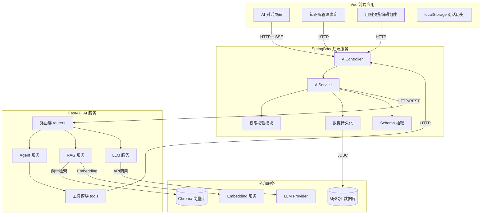
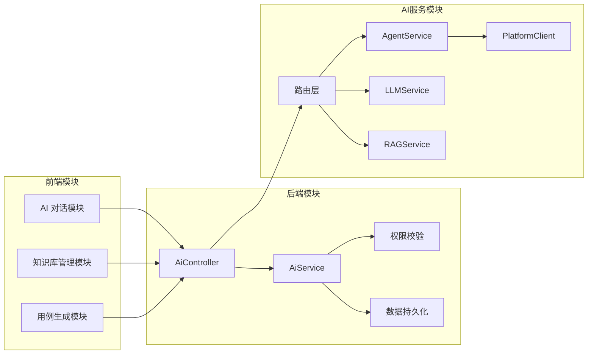
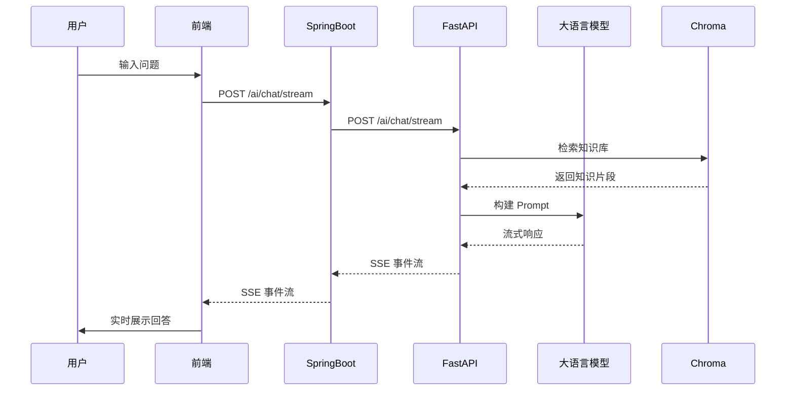
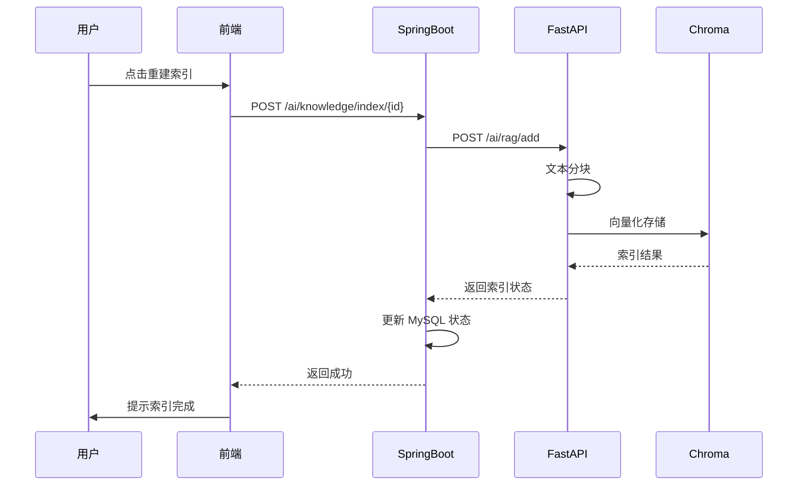
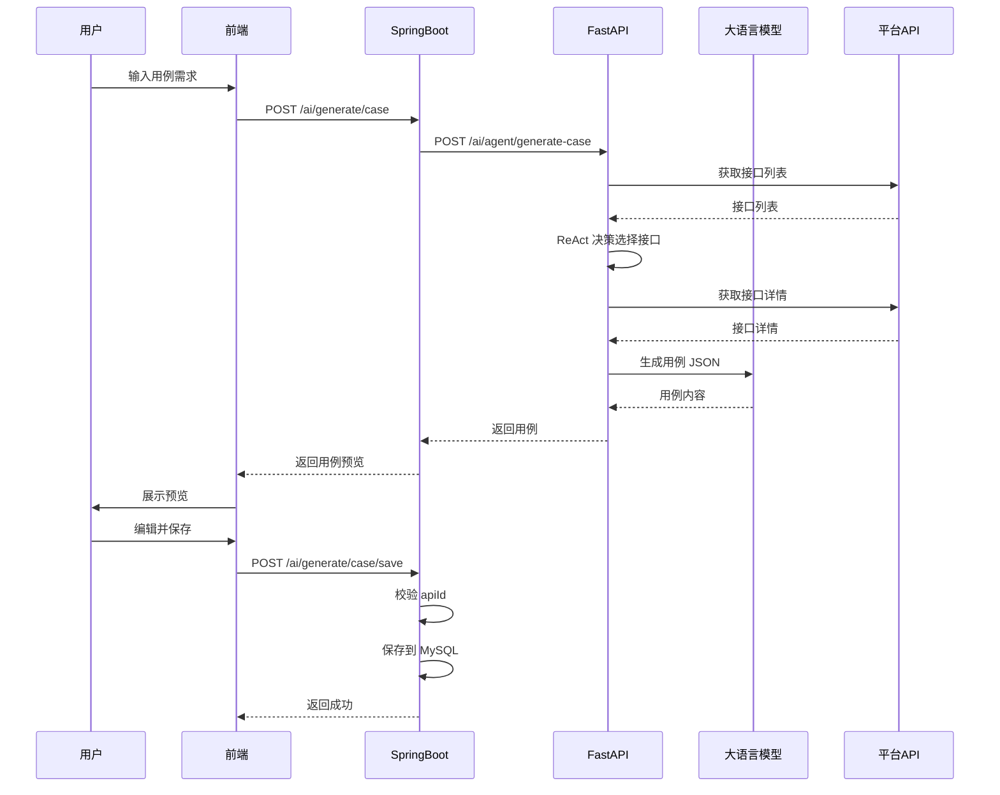
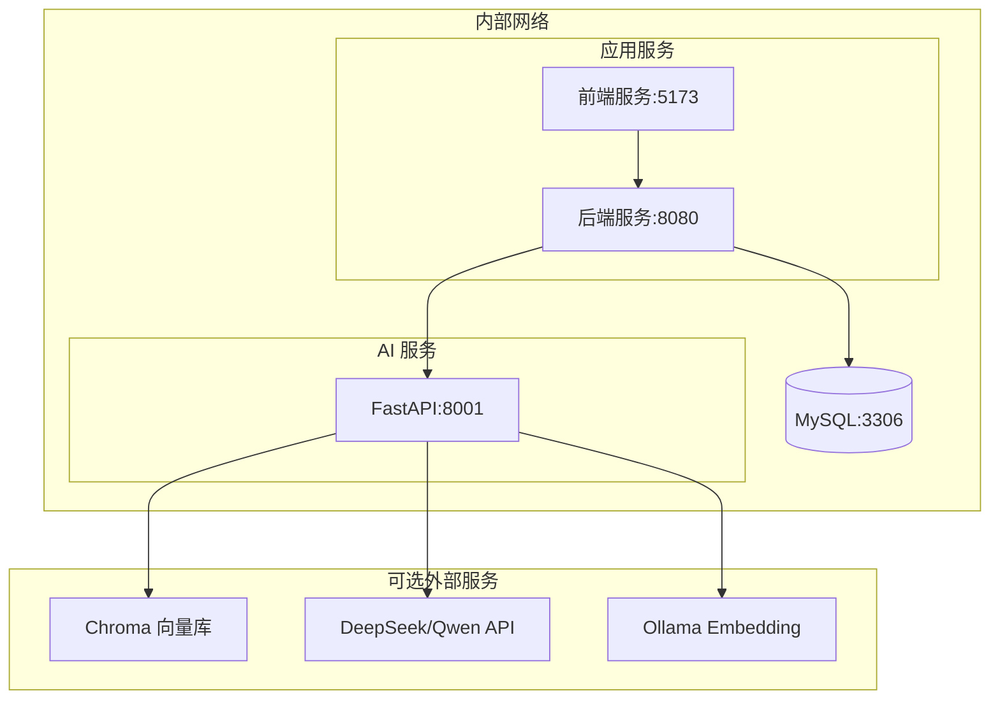

# 系统功能结构图

## 1 技术架构总览

### 1.1 整体技术栈

| 层级 | 技术选型 | 说明 |
|------|----------|------|
| 前端框架 | Vue 2.7 + Element UI | AI 对话页面、知识库管理弹窗 |
| 后端框架 | SpringBoot 2.6 | 业务逻辑、权限校验、数据持久化 |
| AI 服务 | FastAPI (Python) | RAG 检索、LLM 对话、用例生成 Agent |
| 向量数据库 | Chroma | 知识文档向量存储 |
| 大语言模型 | DeepSeek / Qwen / OpenAI | 智能对话与用例生成 |
| Embedding | Ollama / OpenAI | 文档向量化 |

### 1.2 系统整体架构图



---

## 2 核心功能模块

### 2.1 模块详情结构图



### 2.2 前端模块

| 模块 | 职责 | 核心功能 |
|------|------|----------|
| AI 对话页面 | 用户与 AI 交互 | SSE 流式接收、对话历史管理 |
| 知识库管理弹窗 | 文档 CRUD | 目录树展示、新建/编辑/删除、重建索引 |
| 用例预览编辑组件 | 生成结果处理 | JSON 解析、表单填充、手动保存 |

### 2.3 后端模块

| 模块 | 职责 | 核心功能 |
|------|------|----------|
| AiController | HTTP 请求入口 | 路由分发、请求参数校验 |
| AiService | 业务逻辑编排 | AI 服务调用、数据持久化协调 |
| 权限校验 | 项目/用户权限 | 项目访问控制、文档操作权限 |
| 数据持久化 | MySQL 操作 | 知识文档增删改查 |

### 2.4 AI 服务模块

| 模块 | 职责 | 核心功能 |
|------|------|----------|
| routers | 请求路由 | chat、knowledge、agent 路由分发 |
| AgentService | 对话与用例生成 | 智能分流、ReAct Agent、Case 生成 |
| LLMService | 大模型交互 | 流式/非流式对话、Provider 切换 |
| RAGService | 知识检索 | 文本分块、向量检索、混合搜索 |
| PlatformClient | 平台 API 调用 | 接口列表/详情获取、Schema 抽取 |

---

## 3 数据流转图

### 3.1 AI 对话流程



### 3.2 知识库索引流程



### 3.3 用例生成流程



---

## 4 技术架构说明

### 4.1 服务间通信

| 通信链路 | 协议 | 格式 | 特性 |
|----------|------|------|------|
| 前端 → 后端 | HTTP | JSON | RESTful API |
| 后端 → AI 服务 | HTTP | JSON | RESTful API |
| AI → 平台 API | HTTP | JSON | 内部调用 |
| AI → LLM | HTTP | JSON | API 调用 |
| SSE 流式 | HTTP + SSE | text/event-stream | 长连接、流式输出 |

### 4.2 SSE 事件协议

```json
// 文本增量
{"type": "content", "delta": "这是新增的文本..."}

// 用例生成
{"type": "case", "case": {...}, "api_ids": ["123", "456"]}

// 错误事件
{"type": "error", "message": "错误信息"}

// 正常结束
{"type": "end"}
```

### 4.3 配置管理

| 配置项 | 位置 | 说明 |
|--------|------|------|
| AI 服务地址 | application.yml | `ai.service.base-url` |
| LLM Provider | config.yaml | `llm.provider` |
| Embedding 模型 | config.yaml | `embedding.provider` |
| 向量库路径 | config.yaml | `vector_store.persist_directory` |

### 4.4 部署架构


