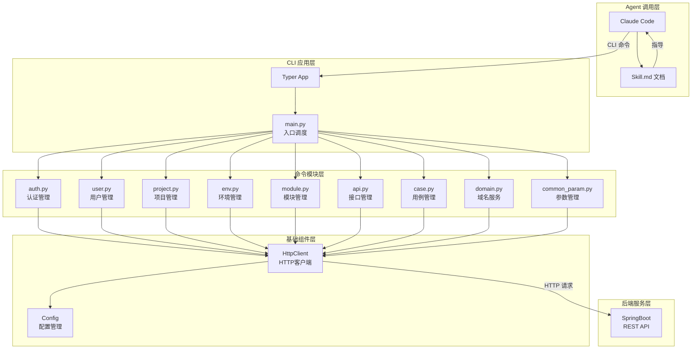
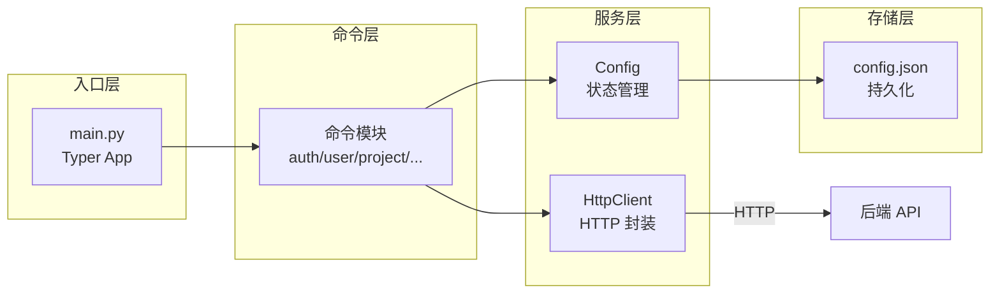
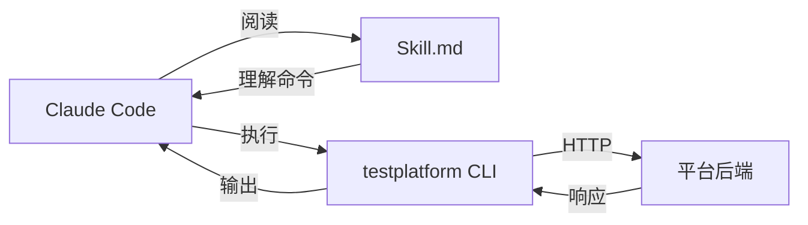
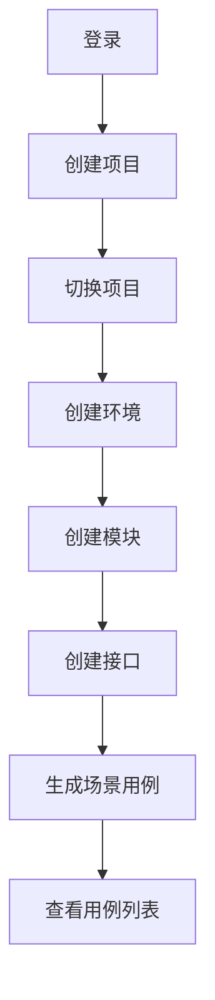
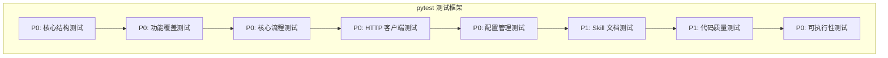
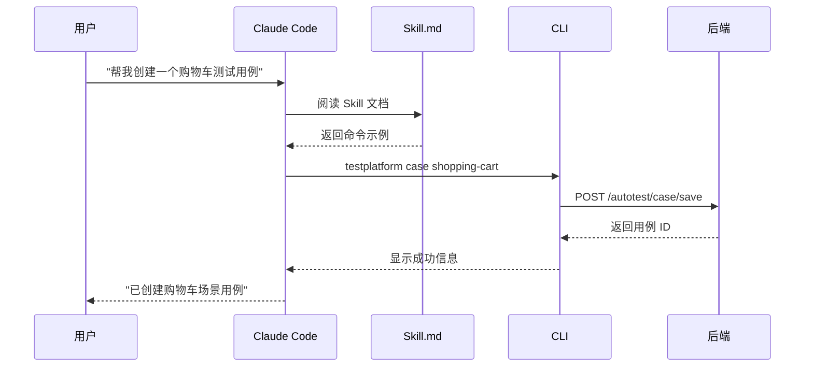

# TestPlatform CLI - 智能测试平台命令行工具

## 一、项目概述

### 1.1 项目定位

TestPlatform CLI 是 AI 智能接口测试平台的命令行工具，基于 **Typer + Rich** 框架构建，为 Agent（如 Claude Code）提供 CUI 交互能力，实现平台全链路自动化操作。

### 1.2 核心特性

| 特性 | 说明 |
|------|------|
| **Agent 友好** | 通过 Skill 文档赋能 Claude Code 等 Agent 自动调用平台接口 |
| **全链路管理** | 覆盖用户、项目、环境、模块、接口、用例、域名、参数等完整生命周期 |
| **自动认证** | Token 自动注入与刷新，Base64 密码编码 |
| **场景用例** | 内置购物车等端到端场景用例一键生成 |
| **状态持久化** | 配置自动保存，支持上下文切换 |
| **Rich 美化** | 表格、树形结构、彩色输出，提升可读性 |

### 1.3 技术架构



### 1.4 技术栈

| 技术 | 版本 | 说明 |
|------|------|------|
| Python | 3.8+ | 运行环境 |
| Typer | 0.9.0+ | CLI 框架 |
| Rich | 13.0.0+ | 终端美化 |
| httpx | 0.25.0+ | HTTP 客户端 |
| Pydantic | 2.0.0+ | 数据校验 |
| PyYAML | 6.0+ | YAML 处理 |
| appdirs | 1.4.4+ | 配置目录管理 |

---

## 二、项目结构

```
cli/
├── solution/                     # CLI 服务实现
│   ├── files/                    # 源码文件
│   │   ├── src/testplatform/
│   │   │   ├── main.py           # CLI 入口
│   │   │   ├── config.py         # 配置管理
│   │   │   ├── commands/         # 命令模块
│   │   │   │   ├── auth.py       # 认证管理
│   │   │   │   ├── user.py       # 用户管理
│   │   │   │   ├── project.py    # 项目管理
│   │   │   │   ├── env.py        # 环境管理
│   │   │   │   ├── module.py     # 模块管理
│   │   │   │   ├── api.py        # 接口管理
│   │   │   │   ├── case.py       # 用例管理
│   │   │   │   ├── domain.py     # 域名服务
│   │   │   │   └── common_param.py # 参数管理
│   │   │   └── utils/
│   │   │       └── http_client.py # HTTP 客户端封装
│   │   ├── pyproject.toml        # 项目配置
│   │   ├── README.md             # 快速入门
│   │   └── Skill.md              # Agent 技能文档
│   └── solve.sh                  # 部署脚本
│
└── tests/                        # 测试验证
    ├── test.sh                   # 测试执行脚本
    └── test_outputs.py           # 端到端测试用例
```

---

## 三、功能模块说明

### 3.1 命令模块总览

| 模块 | 命令 | 功能 | API 端点 |
|------|------|------|----------|
| **认证管理** | `auth` | 登录、登出 | `/autotest/login` |
| **用户管理** | `user` | 用户增删改查 | `/autotest/user/*` |
| **项目管理** | `project` | 项目增删改查、成员管理 | `/autotest/project/*` |
| **环境管理** | `env` | 环境增删改查 | `/autotest/environment/*` |
| **模块管理** | `module` | 模块树形管理 | `/autotest/module/*` |
| **接口管理** | `api` | 接口增删改查 | `/autotest/api/*` |
| **用例管理** | `case` | 用例增删改查、场景生成 | `/autotest/case/*` |
| **域名服务** | `domain` | 域名配置管理 | `/autotest/domain/*` |
| **参数管理** | `param` | 公共参数管理 | `/autotest/commonParam/*` |

### 3.2 核心命令详解

#### 3.2.1 认证管理 (auth)

```bash
# 登录平台
testplatform login -a <account> -p <password> --url <base_url>

# 登出
testplatform logout
```

**技术实现**：
- 密码 Base64 编码传输
- Token 自动保存到配置文件
- 支持多平台地址切换

#### 3.2.2 项目管理 (project)

```bash
# 创建项目
testplatform project create -n "项目名称" -d "项目描述"

# 查询项目列表
testplatform project list

# 切换当前项目
testplatform project use <project_id>

# 查询项目成员
testplatform project members -p <project_id>
```

#### 3.2.3 接口管理 (api)

```bash
# 创建接口
testplatform api create -n "获取商品列表" -m GET --path /api/products

# 查询接口列表
testplatform api list -p <project_id>

# 查看接口详情
testplatform api detail <api_id>
```

#### 3.2.4 用例管理 (case)

```bash
# 创建用例
testplatform case create -n "用例名称" -t API -a <api_id>

# 查询用例列表
testplatform case list -p <project_id>

# 导出用例
testplatform case export <case_id> -o mycase.yaml

# 购物车场景用例（核心亮点）
testplatform case shopping-cart -p <project_id> -m <module_id>
```

**购物车场景用例**：
- 自动创建 4 步骤端到端用例
- 包含：获取商品列表 → 添加商品A → 添加商品B → 验证购物车
- 自动配置断言和请求体

---

## 四、框架设计与实现

### 4.1 架构设计



### 4.2 核心组件

#### 4.2.1 Config 配置管理

```python
class Config:
    """配置管理类 - 负责状态持久化"""
    
    # 配置项
    base_url: str           # 平台地址
    token: Optional[str]    # 认证 Token
    current_project: str    # 当前项目
    current_module: str     # 当前模块
    account: str            # 当前账号
    
    # 核心方法
    def save(self)          # 保存配置
    def set_token(token)    # 设置 Token
    def is_logged_in()      # 检查登录状态
```

**配置文件位置**：`~/.config/testplatform/config.json`

#### 4.2.2 HttpClient HTTP 客户端

```python
class HttpClient:
    """HTTP 客户端 - 封装请求逻辑"""
    
    def _get_headers(self):
        """自动注入 Token 到请求头"""
        headers = {"Content-Type": "application/json"}
        if self.config.token:
            headers["token"] = self.config.token
        return headers
    
    def _handle_response(self, response):
        """自动刷新 Token"""
        new_token = response.headers.get("token")
        if new_token:
            self.config.set_token(new_token)
```

**核心特性**：
- 自动 Token 注入
- 自动 Token 刷新
- 统一异常处理
- 上下文管理器支持

#### 4.2.3 命令模块设计

```python
# 命令模块标准结构
app = typer.Typer(help="模块说明")

@app.command(name="list")
def list_items():
    """查询列表"""
    if not config.is_logged_in():
        console.print("[red]请先登录[/red]")
        raise typer.Exit(1)
    
    with HttpClient() as client:
        response = client.get("/api/endpoint")
        # 处理响应...
```

### 4.3 技术实现亮点

#### 4.3.1 Agent 友好设计



**Skill.md 核心内容**：
- 安装说明
- 命令示例
- 参数说明
- 完整流程示例

#### 4.3.2 自动认证机制

```python
# 登录流程
def login(account, password):
    # 1. Base64 编码密码
    encoded_password = encode_password(password)
    
    # 2. 发送登录请求
    response = client.post("/autotest/login", json={
        "account": account,
        "password": encoded_password
    })
    
    # 3. 自动保存 Token（由 HttpClient 处理）
    # 4. 保存账号信息
    config.set_account(account)
```

#### 4.3.3 场景用例生成

```python
# 购物车场景用例
case_apis = [
    {"index": 0, "description": "获取商品列表", 
     "assertion": [{"type": "status", "value": "200"}]},
    {"index": 1, "description": "添加商品A到购物车",
     "body": {"productId": "A001", "quantity": 1}},
    {"index": 2, "description": "添加商品B到购物车",
     "body": {"productId": "B002", "quantity": 2}},
    {"index": 3, "description": "验证购物车商品数量",
     "assertion": [{"type": "json", "path": "$.data.totalCount", "value": "3"}]}
]
```

---

## 五、快速开始

### 5.1 环境要求

| 环境 | 要求 |
|------|------|
| Python | 3.8+ |
| pip | 最新版 |

### 5.2 安装步骤

```bash
# 进入 CLI 目录
cd cli/solution/files

# 安装 CLI 工具
pip install -e .

# 验证安装
testplatform --help
```

### 5.3 快速使用

```bash
# 1. 登录平台
testplatform login -a LMadmin -p Liuma@123456

# 2. 查看状态
testplatform status

# 3. 创建项目
testplatform project create -n "电商项目" -d "电商平台测试"

# 4. 切换项目
testplatform project use <project_id>

# 5. 创建环境
testplatform env create -n "测试环境" -d "test.example.com"

# 6. 创建模块
testplatform module create -n "购物车模块" -t api

# 7. 创建接口
testplatform api create -n "获取商品列表" -m GET --path /api/products

# 8. 生成购物车场景用例
testplatform case shopping-cart -p <project_id>
```

### 5.4 完整流程示例



---

## 六、开发规范

### 6.1 命令模块开发规范

```python
"""
命令模块模板

提供 XXX 管理功能
"""
import typer
from rich.console import Console
from rich.table import Table

from testplatform.config import Config
from testplatform.utils.http_client import HttpClient

app = typer.Typer(help="模块说明")
console = Console()
config = Config()

@app.command(name="list")
def list_items():
    """查询列表"""
    # 1. 检查登录状态
    if not config.is_logged_in():
        console.print("[red]请先登录[/red]")
        raise typer.Exit(1)
    
    # 2. 获取必要参数
    pid = project_id or config.current_project
    if not pid:
        console.print("[red]请指定项目ID[/red]")
        raise typer.Exit(1)
    
    # 3. 调用后端 API
    with HttpClient() as client:
        response = client.get(f"/api/endpoint/{pid}")
        
        if "error" in response:
            console.print(f"[red]查询失败: {response['error']}[/red]")
            return
        
        # 4. 格式化输出
        table = Table(title="列表")
        table.add_column("ID", style="cyan")
        table.add_column("名称", style="green")
        console.print(table)
```

### 6.2 错误处理规范

```python
# 统一错误处理模式
if "error" in response:
    console.print(f"[red]操作失败: {response['error']}[/red]")
    raise typer.Exit(1)
```

### 6.3 输出格式规范

```python
# 使用 Rich 表格
table = Table(title="标题")
table.add_column("列名", style="颜色")
table.add_row("值1", "值2")
console.print(table)

# 使用 Rich 树形结构
tree = Tree("[cyan]根节点[/cyan]")
tree.add("[green]子节点[/green]")
console.print(tree)

# 使用彩色文本
console.print("[green]成功信息[/green]")
console.print("[red]错误信息[/red]")
console.print("[yellow]警告信息[/yellow]")
```

---

## 七、测试验证

### 7.1 测试架构



### 7.2 测试用例设计

| 优先级 | 测试类 | 测试内容 | 验收标准 |
|--------|--------|----------|----------|
| P0 | TestCoreStructure | CLI 核心结构 | 目录、入口、框架存在 |
| P0 | TestFunctionCoverage | 功能覆盖 | 8 大模块全部实现 |
| P0 | TestCoreWorkflows | 核心流程 | 登录、CRUD、场景用例 |
| P0 | TestHttpClient | HTTP 客户端 | GET/POST、认证处理 |
| P0 | TestConfigurationManagement | 配置管理 | 状态持久化 |
| P0 | TestExecutability | 可执行性 | 可导入、可运行 |
| P1 | TestSkillDocumentation | Skill 文档 | 文档存在、有示例 |
| P1 | TestCodeQuality | 代码质量 | 错误处理、用户反馈 |

### 7.3 验收标准

#### 7.3.1 功能验收

```python
# 验证功能行为，不验证具体实现形式
def test_auth_functionality_exists(self):
    """验证认证功能存在"""
    keywords = ['login', 'auth', '登录', '认证', 'password', 'token']
    assert check_functionality_exists(self.all_content, keywords)

def test_api_crud_workflow_implemented(self):
    """验证接口 CRUD 流程完整实现"""
    required_endpoints = [
        '/autotest/api/save', 
        '/autotest/api/detail', 
        '/autotest/api/list/', 
        '/autotest/api/delete'
    ]
    for endpoint in required_endpoints:
        assert endpoint in self.all_content
```

#### 7.3.2 可执行性验收

```python
def test_cli_can_be_imported(self):
    """验证 CLI 可以正常导入"""
    result = subprocess.run(
        ["python3", "-c", "import testplatform.main"],
        capture_output=True
    )
    assert result.returncode == 0

def test_cli_has_help(self):
    """验证 CLI 有帮助信息"""
    result = subprocess.run(
        ["python3", "-m", "testplatform.main", "--help"],
        capture_output=True
    )
    assert "usage" in result.stdout.lower()
```

### 7.4 测试执行

```bash
# 执行测试
cd cli/tests
bash test.sh

# 测试结果
# - 通过：输出 1 到 /logs/verifier/reward.txt
# - 失败：输出 0 到 /logs/verifier/reward.txt
```

### 7.5 测试用例自测表格

| 测试项 | 测试命令 | 预期结果 | 实际结果 |
|--------|----------|----------|----------|
| CLI 安装 | `pip install -e .` | 安装成功 | ✅ |
| 帮助信息 | `testplatform --help` | 显示帮助 | ✅ |
| 登录命令 | `testplatform login --help` | 显示登录帮助 | ✅ |
| 项目命令 | `testplatform project --help` | 显示项目帮助 | ✅ |
| 用例命令 | `testplatform case --help` | 显示用例帮助 | ✅ |
| 购物车场景 | `testplatform case shopping-cart --help` | 显示场景帮助 | ✅ |
| 状态命令 | `testplatform status` | 显示配置状态 | ✅ |
| 模块导入 | `import testplatform.main` | 无异常 | ✅ |

---

## 八、核心亮点

### 8.1 Agent 赋能设计

通过 Skill.md 文档，让 Claude Code 等 Agent 能够：
- 理解 CLI 命令结构
- 自动组装命令参数
- 完成平台自动化操作



### 8.2 自动认证机制

- **密码编码**：Base64 编码传输，保护敏感信息
- **Token 管理**：自动注入请求头，自动刷新
- **状态持久化**：配置自动保存，无需重复登录

### 8.3 模块化架构

- **命令解耦**：每个模块独立文件，易于维护
- **统一入口**：main.py 统一注册，清晰明了
- **可扩展性**：新增命令模块只需遵循规范

### 8.4 Rich 终端美化

- **表格输出**：数据列表清晰展示
- **树形结构**：模块层级直观呈现
- **彩色文本**：成功/错误/警告一目了然

---

## 九、常见问题

### 9.1 安装问题

**Q: pip install 失败？**
```bash
# 使用国内镜像
pip install -e . -i https://pypi.tuna.tsinghua.edu.cn/simple
```

### 9.2 认证问题

**Q: 登录后 Token 未保存？**
- 检查配置目录权限：`~/.config/testplatform/`
- 检查后端是否返回 Token 响应头

### 9.3 命令问题

**Q: 命令找不到？**
```bash
# 确认安装
pip show testplatform

# 使用模块方式运行
python -m testplatform.main --help
```

---

## 十、版本信息

- **当前版本**：1.0.0
- **更新日期**：2024
- **开源协议**：MIT
