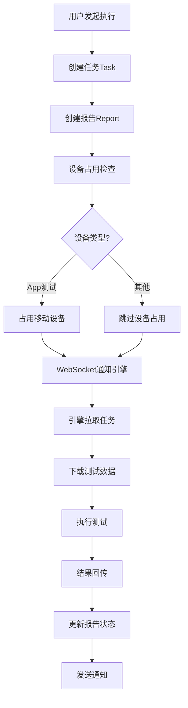
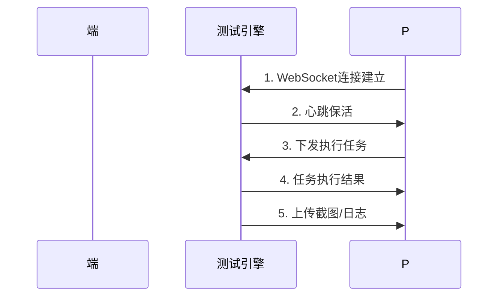

# 流马测试平台 - 后端服务

## 一、项目概述

### 1.1 项目定位

流马测试平台后端服务，采用 SpringBoot + MyBatis 框架构建，为自动化测试平台提供 RESTful API 管理、任务调度、执行引擎通信等核心能力。

### 1.2 技术栈

| 技术 | 版本 | 说明 |
|------|------|------|
| SpringBoot | 2.6.0 | 后端核心框架 |
| MyBatis | 2.2.0 | ORM持久层框架 |
| MySQL | 5.7+ | 关系型数据库 |
| JWT | 3.8.2 | 身份认证 |
| WebSocket | - | 实时通信（引擎/设备） |
| Spring Task | - | 定时任务调度 |
| PageHelper | 1.4.6 | 分页插件 |
| FastJSON | 1.2.83 | JSON处理 |
| Hutool | 4.1.2 | 国产工具箱 |

### 1.3 核心特性

- **前后端分离**：采用 RESTful API 设计，支持多端接入
- **分布式执行**：通过 WebSocket 与测试引擎实时通信
- **定时任务**：基于 Spring Task 的测试计划调度
- **权限管理**：基于 RBAC 模型的细粒度权限控制
- **数据隔离**：支持多项目数据隔离

---

## 二、项目结构

```
platform-backend/
├── src/
│   └── main/
│       ├── java/
│       │   └── com/autotest/
│       │       ├── common/                 # 公共组件
│       │       │   ├── constants/           # 常量定义
│       │       │   ├── exception/           # 异常处理
│       │       │   ├── request/             # 请求拦截
│       │       │   ├── response/            # 响应封装
│       │       │   └── utils/               # 工具类
│       │       ├── controller/              # 控制器层
│       │       ├── service/                 # 业务服务层
│       │       ├── mapper/                  # 数据访问层
│       │       ├── domain/                  # 实体类
│       │       ├── dto/                     # 数据传输对象
│       │       ├── job/                     # 定时任务
│       │       └── websocket/               # WebSocket配置
│       └── resources/
│           ├── mapper/                      # MyBatis XML映射
│           ├── application.yml              # 应用配置
│           └── db/migration/                # Flyway SQL脚本
└── pom.xml                                 # Maven依赖配置
```

---

## 三、核心模块说明

### 3.1 控制器层 (controller/)

| 模块 | 职责 |
|------|------|
| UserController | 用户管理、登录认证 |
| ProjectController | 项目管理 |
| EnvironmentController | 环境配置管理 |
| ApiController | 接口管理 |
| CaseController | 用例管理 |
| CollectionController | 用例集合管理 |
| PlanController | 测试计划管理 |
| RunController | 测试执行控制 |
| ReportController | 测试报告管理 |
| EngineController | 测试引擎管理 |
| DeviceController | 设备管理 |

### 3.2 服务层 (service/)

| 服务 | 职责 |
|------|------|
| RunService | 执行任务触发、引擎通知、设备占用管理 |
| EngineService | 引擎注册、心跳检测、任务分发 |
| ScheduleJobService | 定时任务调度、计划执行触发 |
| CaseService | 用例CRUD、步骤管理 |
| ReportService | 报告生成、结果统计 |
| DeviceService | 设备状态管理、投屏控制 |

### 3.3 数据层 (mapper/)

采用 MyBatis + XML 映射文件方式，每个实体对应一个 Mapper 接口和 XML 文件。

### 3.4 WebSocket 模块

```java
// 核心组件
- WebSocketConfig.java        # WebSocket配置
- WsSessionManager.java       # 会话管理（ConcurrentHashMap）
- WsEngineInterceptor.java    # 引擎拦截器
- EngineHeartBeatHandler.java # 引擎心跳处理
```

---

## 四、核心流程设计

### 4.1 测试执行流程



### 4.2 引擎通信机制



**关键实现**：
- 使用 `ConcurrentHashMap` 管理引擎会话状态
- 心跳机制检测引擎在线状态
- 支持任务实时推送和结果回传

### 4.3 定时任务调度

```java
// Spring Task 配置示例
@Scheduled(cron = "0 */5 * * * ?")
public void executePlans() {
    // 查询待执行计划
    // 触发测试引擎执行
}
```

支持的调度策略：
- Cron表达式定时执行
- 立即执行
- 循环执行

---

## 五、数据模型

### 5.1 核心实体

| 实体 | 说明 |
|------|------|
| User | 用户信息 |
| Project | 项目 |
| Environment | 测试环境 |
| Api | 接口定义 |
| Case | 测试用例 |
| CaseStep | 用例步骤 |
| Collection | 用例集合 |
| Plan | 测试计划 |
| Task | 执行任务 |
| Report | 测试报告 |
| Engine | 测试引擎 |
| Device | 移动设备 |

### 5.2 权限模型

基于 RBAC 模型：
- **用户** ↔ **角色** ↔ **权限**
- 支持项目级数据隔离

---

## 六、开发规范

### 6.1 代码规范

- Controller 层负责请求接收和响应封装
- Service 层负责业务逻辑处理
- Mapper 层负责数据库操作
- 使用 `@Transactional` 保证事务性

### 6.2 接口规范

```java
/**
 * 标准响应格式
 */
{
    "code": 200,           // 状态码
    "msg": "success",      // 提示信息
    "data": {...}          // 响应数据
}
```

### 6.3 异常处理

- 使用全局异常处理器 `ExceptionControllerAdvice`
- 自定义业务异常 `LMException`
- 分类处理：参数异常、权限异常、业务异常

---

## 七、二开指南

### 7.1 添加新功能步骤

1. **定义实体**：在 `domain/` 下创建实体类
2. **创建Mapper**：在 `mapper/` 下创建接口和XML
3. **编写Service**：在 `service/` 下实现业务逻辑
4. **创建Controller**：在 `controller/` 下暴露接口
5. **配置路由**：在 `request/WebMvcConfig.java` 中配置

### 7.2 常见扩展点

- **新增测试类型**：在 `RunService` 中扩展
- **自定义函数**：在 `FunctionService` 中注册
- **通知扩展**：在 `NotificationService` 中实现

---

## 八、相关文档

- [业务逻辑设计](./assets/backend相关说明(按需了解即可)/业务逻辑设计.md)
- [数据设计](./assets/backend相关说明(按需了解即可)/数据设计.md)
- [接口文档](./assets/backend相关说明(按需了解即可)/api/swagger.json)

---

## 九、联系与支持

- 演示平台：http://demo-ee.liumatest.cn
- 官网地址：http://www.liumatest.cn
- 社区地址：http://community.liumatest.cn
