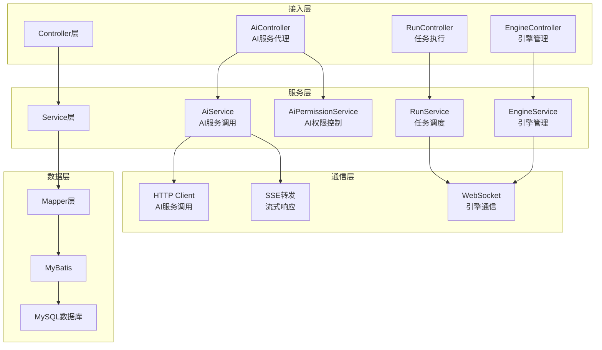
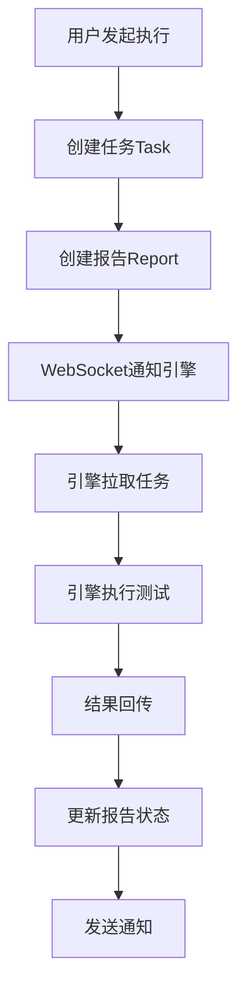
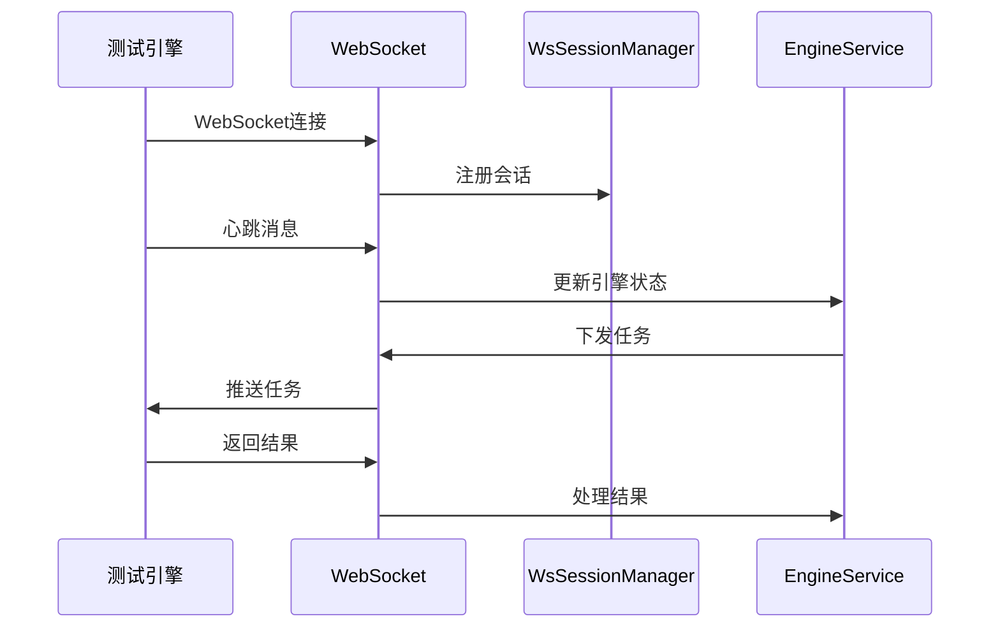
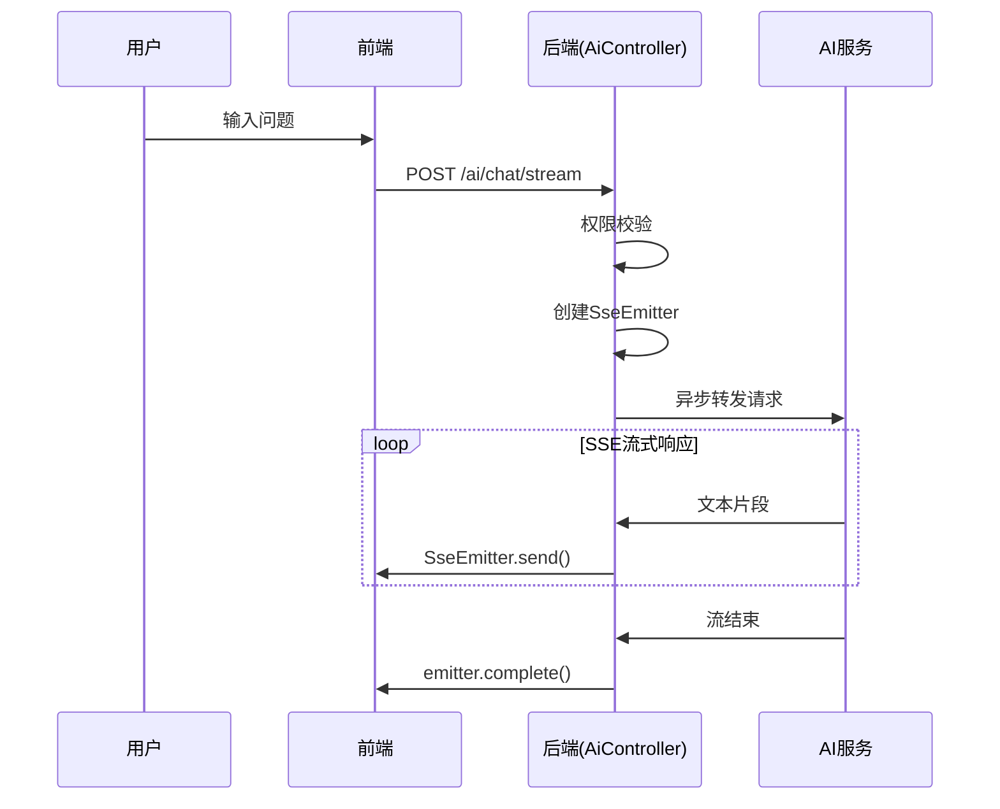
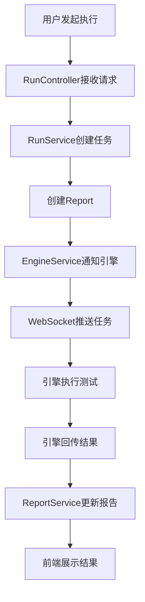
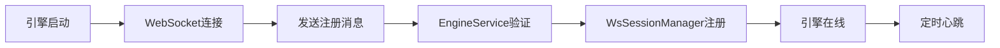

# 测试平台 - 后端服务

SpringBoot + MyBatis 框架构建的后端服务，为AI智能接口测试平台提供RESTful API管理、任务调度、AI服务代理、执行引擎通信等核心能力。

## 一、项目概述

### 1.1 定位

后端服务是AI智能接口测试平台的核心服务端，采用SpringBoot + MyBatis框架构建，负责：

- **RESTful API**：为前端提供业务接口
- **AI服务代理**：转发AI请求，处理SSE流式响应
- **任务调度**：测试任务分发、引擎管理
- **实时通信**：通过WebSocket与测试引擎实时通信

### 1.2 核心特性

| 特性 | 说明 |
|------|------|
| **前后端分离** | RESTful API设计，支持多端接入 |
| **AI服务代理** | SSE流式转发，支持AI对话和用例生成 |
| **分布式执行** | 通过WebSocket与测试引擎实时通信 |
| **定时任务** | 基于Spring Task的测试计划调度 |
| **权限管理** | 基于RBAC模型的细粒度权限控制 |
| **数据隔离** | 支持多项目数据隔离 |

### 1.3 技术架构


```mermaid
flowchart TB
    subgraph 接入层["接入层"]
        CTRL["Controller层"]
        AI_CTRL["AiController<br/>AI服务代理"]
        RUN_CTRL["RunController<br/>任务执行"]
        ENG_CTRL["EngineController<br/>引擎管理"]
    end

    subgraph 服务层["服务层"]
        SVC["Service层"]
        AI_SVC["AiService<br/>AI服务调用"]
        RUN_SVC["RunService<br/>任务调度"]
        ENG_SVC["EngineService<br/>引擎管理"]
        PERM_SVC["AiPermissionService<br/>AI权限控制"]
    end

    subgraph 数据层["数据层"]
        MAPPER["Mapper层"]
        MYBATIS["MyBatis"]
        MYSQL["MySQL数据库"]
    end

    subgraph 通信层["通信层"]
        WS["WebSocket<br/>引擎通信"]
        HTTP["HTTP Client<br/>AI服务调用"]
        SSE["SSE转发<br/>流式响应"]
    end

    CTRL --> SVC
    AI_CTRL --> AI_SVC
    AI_CTRL --> PERM_SVC
    RUN_CTRL --> RUN_SVC
    ENG_CTRL --> ENG_SVC
    SVC --> MAPPER
    AI_SVC --> HTTP
    AI_SVC --> SSE
    RUN_SVC --> WS
    ENG_SVC --> WS
    MAPPER --> MYBATIS
    MYBATIS --> MYSQL
```

### 1.4 技术栈

| 技术 | 版本 | 说明 |
|------|------|------|
| SpringBoot | 2.6.0 | 后端核心框架 |
| MyBatis | 2.2.0 | ORM持久层框架 |
| MySQL | 5.7+ | 关系型数据库 |
| JWT | 3.8.2 | 身份认证 |
| WebSocket | - | 实时通信（引擎/设备） |
| Spring Task | - | 定时任务调度 |
| PageHelper | 1.4.6 | 分页插件 |
| FastJSON | 1.2.83 | JSON处理 |
| Hutool | 4.1.2 | 国产工具箱 |

---

## 二、项目结构

```
platform-backend/
├── src/
│   └── main/
│       ├── java/
│       │   └── com/autotest/
│       │       ├── common/                 # 公共组件
│       │       │   ├── constants/          # 常量定义
│       │       │   ├── exception/          # 异常处理
│       │       │   ├── request/            # 请求拦截
│       │       │   ├── response/           # 响应封装
│       │       │   └── utils/              # 工具类
│       │       ├── controller/             # 控制器层
│       │       │   ├── AiController.java   # AI服务代理
│       │       │   ├── RunController.java  # 测试执行
│       │       │   ├── EngineController.java # 引擎管理
│       │       │   ├── CaseController.java # 用例管理
│       │       │   └── ...
│       │       ├── service/                # 业务服务层
│       │       │   ├── AiService.java      # AI服务调用
│       │       │   ├── RunService.java     # 任务调度
│       │       │   ├── EngineService.java  # 引擎管理
│       │       │   └── ai/
│       │       │       └── AiPermissionService.java # AI权限
│       │       ├── mapper/                 # 数据访问层
│       │       ├── domain/                 # 实体类
│       │       ├── dto/                    # 数据传输对象
│       │       ├── job/                    # 定时任务
│       │       └── websocket/              # WebSocket配置
│       │           ├── WebSocketConfig.java
│       │           ├── WsSessionManager.java
│       │           └── WsEngineInterceptor.java
│       └── resources/
│           ├── mapper/                     # MyBatis XML映射
│           ├── application.yml             # 应用配置
│           └── db/migration/               # Flyway SQL脚本
└── pom.xml                                 # Maven依赖配置
```

---

## 三、核心模块说明

### 3.1 AI服务代理 (AiController)

作为AI服务的代理层，负责转发前端请求到AI服务，并处理SSE流式响应。

| 接口 | 方法 | 说明 |
|------|------|------|
| GET /ai/knowledge | getKnowledgeList | 获取知识库列表 |
| GET /ai/knowledge/{id} | getKnowledgeDetail | 获取知识库详情 |
| POST /ai/knowledge | saveKnowledge | 保存知识库 |
| DELETE /ai/knowledge/{id} | deleteKnowledge | 删除知识库 |
| POST /ai/knowledge/index/{id} | indexKnowledge | 索引知识库文档 |
| POST /ai/generate-case | generateCase | 生成测试用例 |
| GET /ai/agent/api-list/{projectId} | getAgentApiList | 获取Agent接口列表 |
| POST /ai/chat/stream | chatStream | **SSE流式对话** |

**SSE流式转发实现：**

```java
@PostMapping(value = "/chat/stream", produces = MediaType.TEXT_EVENT_STREAM_VALUE)
public SseEmitter chatStream(@RequestBody AiChatStreamRequest request,
        @RequestHeader(value = "token", required = false) String token,
        HttpServletRequest httpRequest,
        HttpServletResponse response) {
    // 权限校验
    aiPermissionService.assertProjectAccess(httpRequest, request.getProjectId());
    
    // 设置SSE响应头
    response.setHeader("Cache-Control", "no-cache");
    response.setHeader("Connection", "keep-alive");
    response.setHeader("X-Accel-Buffering", "no");
    
    // 创建SseEmitter（5分钟超时）
    SseEmitter emitter = new SseEmitter(300000L);
    
    // 异步转发到AI服务
    CompletableFuture.runAsync(() -> {
        aiService.streamChat(buildChatRequest(request), token, emitter);
    }, aiStreamTaskExecutor);
    
    return emitter;
}
```

### 3.2 任务调度 (RunController / RunService)

| 接口 | 方法 | 说明 |
|------|------|------|
| POST /run/case | runCase | 执行用例 |
| POST /run/collection | runCollection | 执行集合 |
| POST /run/plan | runPlan | 执行计划 |

**任务执行流程：**


```mermaid
flowchart TD
    A[用户发起执行] --> B[创建任务Task]
    B --> C[创建报告Report]
    C --> D[WebSocket通知引擎]
    D --> E[引擎拉取任务]
    E --> F[引擎执行测试]
    F --> G[结果回传]
    G --> H[更新报告状态]
    H --> I[发送通知]
```

### 3.3 引擎管理 (EngineController / EngineService)

| 接口 | 方法 | 说明 |
|------|------|------|
| POST /engine/register | register | 引擎注册 |
| POST /engine/heartbeat | heartBeat | 心跳保活 |
| GET /engine/list | getEngineList | 获取引擎列表 |

**引擎通信机制：**


```mermaid
sequenceDiagram
    participant E as 测试引擎
    participant W as WebSocket
    participant M as WsSessionManager
    participant S as EngineService

    E->>W: WebSocket连接
    W->>M: 注册会话
    E->>W: 心跳消息
    W->>S: 更新引擎状态
    S->>W: 下发任务
    W->>E: 推送任务
    E->>W: 返回结果
    W->>S: 处理结果
```

### 3.4 WebSocket模块

**核心组件：**

| 类名 | 职责 |
|------|------|
| `WebSocketConfig` | WebSocket配置 |
| `WsSessionManager` | 会话管理（ConcurrentHashMap） |
| `WsEngineInterceptor` | 引擎拦截器 |
| `EngineHeartBeatHandler` | 引擎心跳处理 |

**会话管理：**

```java
@Component
public class WsSessionManager {
    // 引擎会话 ConcurrentHashMap
    private static final ConcurrentHashMap<String, Session> engineSessions = 
        new ConcurrentHashMap<>();
    
    // 注册会话
    public void registerEngine(String engineCode, Session session) {
        engineSessions.put(engineCode, session);
    }
    
    // 发送消息
    public void sendMessage(String engineCode, String message) {
        Session session = engineSessions.get(engineCode);
        if (session != null && session.isOpen()) {
            session.getBasicRemote().sendText(message);
        }
    }
}
```

### 3.5 定时任务调度 (ScheduleJobService)

基于Spring Task实现测试计划定时执行：

```java
@Scheduled(cron = "0 */5 * * * ?")
public void executePlans() {
    // 查询待执行计划
    // 触发测试引擎执行
}
```

支持的调度策略：
- Cron表达式定时执行
- 立即执行
- 循环执行

---

## 四、核心流程

### 4.1 AI对话流程


```mermaid
sequenceDiagram
    participant U as 用户
    participant F as 前端
    participant B as 后端(AiController)
    participant AI as AI服务

    U->>F: 输入问题
    F->>B: POST /ai/chat/stream
    B->>B: 权限校验
    B->>B: 创建SseEmitter
    B->>AI: 异步转发请求
    loop SSE流式响应
        AI->>B: 文本片段
        B->>F: SseEmitter.send()
    end
    AI->>B: 流结束
    B->>F: emitter.complete()
```

### 4.2 测试执行流程


```mermaid
flowchart TD
    A[用户发起执行] --> B[RunController接收请求]
    B --> C[RunService创建任务]
    C --> D[创建Report]
    D --> E[EngineService通知引擎]
    E --> F[WebSocket推送任务]
    F --> G[引擎执行测试]
    G --> H[引擎回传结果]
    H --> I[ReportService更新报告]
    I --> J[前端展示结果]
```

### 4.3 引擎注册流程


```mermaid
flowchart LR
    A[引擎启动] --> B[WebSocket连接]
    B --> C[发送注册消息]
    C --> D[EngineService验证]
    D --> E[WsSessionManager注册]
    E --> F[引擎在线]
    F --> G[定时心跳]
```

---

## 五、数据模型

### 5.1 核心实体

| 实体 | 说明 |
|------|------|
| User | 用户信息 |
| Project | 项目 |
| Environment | 测试环境 |
| Api | 接口定义 |
| Case | 测试用例 |
| CaseStep | 用例步骤 |
| Collection | 用例集合 |
| Plan | 测试计划 |
| Task | 执行任务 |
| Report | 测试报告 |
| Engine | 测试引擎 |
| AiKnowledge | AI知识库 |

### 5.2 权限模型

基于RBAC模型：
- **用户** ↔ **角色** ↔ **权限**
- 支持项目级数据隔离

**AI权限控制：**

```java
@Service
public class AiPermissionService {
    
    // 校验项目访问权限
    public void assertProjectAccess(HttpServletRequest request, String projectId) {
        // 校验逻辑
    }
    
    // 校验知识库管理权限
    public boolean canManageKnowledge(HttpServletRequest request, String projectId) {
        // 权限判断
    }
    
    // 获取登录用户ID
    public String getLoginUserId(HttpServletRequest request) {
        // 从JWT解析
    }
}
```

---

## 六、配置说明

### 6.1 application.yml

```yaml
server:
  port: 8080

spring:
  datasource:
    url: jdbc:mysql://localhost:3306/liuma
    username: root
    password: password
    driver-class-name: com.mysql.cj.jdbc.Driver
  
  task:
    scheduling:
      pool:
        size: 5

mybatis:
  mapper-locations: classpath:mapper/*.xml
  type-aliases-package: com.autotest.domain

# AI服务配置
ai:
  service:
    url: http://localhost:8001
    timeout: 30000

# JWT配置
jwt:
  secret: your-secret-key
  expiration: 86400000
```

---

## 七、启动服务

```bash
cd platform-backend

# 编译打包
mvn clean package -DskipTests

# 启动服务
java -jar target/AutoTest-1.4.1.jar
```

---

## 八、核心亮点

### 8.1 AI服务代理

- **SSE流式转发**：支持AI对话的实时流式响应
- **异步处理**：使用`CompletableFuture`异步转发，不阻塞主线程
- **权限控制**：细粒度的AI功能权限控制

### 8.2 WebSocket实时通信

- **ConcurrentHashMap**：线程安全的会话管理
- **心跳机制**：定时检测引擎在线状态
- **任务推送**：实时推送任务到引擎

### 8.3 分布式任务调度

- **任务队列**：支持多引擎并发执行
- **状态同步**：实时同步任务执行状态
- **结果回传**：异步处理引擎返回的结果

---

## 九、二开指南

### 9.1 添加新接口步骤

1. **定义实体**：在 `domain/` 下创建实体类
2. **创建Mapper**：在 `mapper/` 下创建接口和XML
3. **编写Service**：在 `service/` 下实现业务逻辑
4. **创建Controller**：在 `controller/` 下暴露接口
5. **配置路由**：在 `request/WebMvcConfig.java` 中配置

### 9.2 添加AI相关接口

```java
@RestController
@RequestMapping("/autotest/ai")
public class AiController {
    
    @PostMapping("/custom")
    public Result customAiFunction(@RequestBody CustomRequest request,
            HttpServletRequest httpRequest) {
        // 权限校验
        aiPermissionService.assertProjectAccess(httpRequest, request.getProjectId());
        
        // 调用AI服务
        return aiService.customFunction(request);
    }
}
```

### 9.3 扩展WebSocket功能

```java
@Component
public class CustomWebSocketHandler {
    
    @OnMessage
    public void onMessage(String message, Session session) {
        // 处理自定义消息
    }
}
```

---

## 十、依赖说明

核心依赖：
- `spring-boot-starter-web` - Web框架
- `spring-boot-starter-websocket` - WebSocket支持
- `mybatis-spring-boot-starter` - MyBatis集成
- `mysql-connector-java` - MySQL驱动
- `jjwt` - JWT认证
- `fastjson` - JSON处理
- `hutool-all` - 工具类
- `pagehelper` - 分页插件
