# 1. 产品简介

## 1.1 技术方案

平台技术栈：前端VUE+ElementUI，后台Java+SpringBoot，测试引擎Python+Unittest，设备代理Python+Tornado。

我们将测试编写和测试执行进行拆分，将用例编写和管理放在管理平台，将用例执行交给测试引擎。而为了让测试执行更加灵活易用，测试引擎可以自由注册。也即是说引擎既可以部署在服务器，也可以部署在任意使用者的电脑上。这样既可以解决测试执行资源拥挤，也方便测试用例的编写，尤其在写UI测试用例，能够实时看到用例的执行及断点。


## 1.2 功能简介

平台目前包括：首页看板、测试管理、公共组件、环境管理、用例中心、测试执行、测试追踪、权限系统、配置中心九大功能模块。在后续文档中将逐一详细介绍其功能及使用。

平台支持API、WEB以及APP测试，其中API测试支持单接口、多接口以及混合场景的测试，支持Mock功能。WEB测试则是在Selenium基础上进行自然语言的封装，实现关键字驱动。APP测试则是基于uiautomator2和facebook-wda基础上进行自然语言的封装，同样实现关键字驱动，同时支持云真机在线编写用例。

此外，为了解决自动化测试的数据、环境等问题，平台支持公共参数，随机函数，环境关联等常用功能，配置灵活，可满足绝大多数使用场景。而用例之上，支持测试集合和测试计划的配置，API用例、WEB用例以及APP用例可以自由选择及切换，满足各类复杂场景。并最终通过OpenAPI或者定时任务，灵活集成到CI/CD。

# 2. 首页看板

## 2.1 工作台

个人工作台主要统计个人的数据情况，并且展示当前代办事项，如需要完成的任务、待处理的缺陷以及待分析的测试报告等。同时支持快速链接到相关页面。

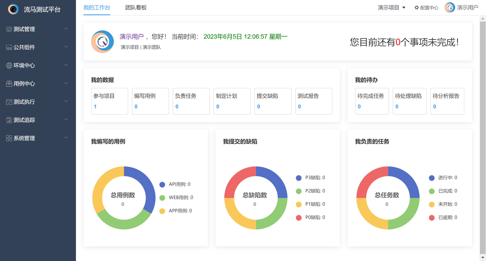

## 2.2 团队看板

团队看板主要统计团队维度的数据，同时也有团队用户的数据排行榜，团队下项目的数据比对。主要包括团队的概览信息、用户数据排行榜和分布图、项目维度的用例新增数据、计划执行数据、用例失败数据以及缺陷处理数据等。

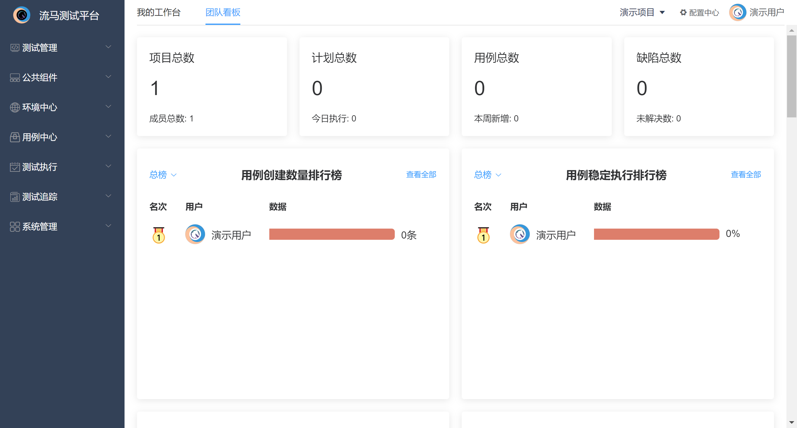

# 3. 测试管理

测试管理仅企业版支持。

## 3.1 迭代管理

在社区版中配置中心有迭代版本的配置，但只是一个很粗糙的概念，并没有挂钩到团队日常迭代中去。因此，在企业版本中我们将迭代版本优化，并作为独立菜单展示在菜单栏，其作用等同于项目开发过程中的迭代，会根据开始结束时间判断当前状态以及当前所处的迭代周期，同时也支持关联第三方id，方便对接第三方的研发管理系统。

同时，集合和计划需要关联迭代版本，且计划创建时需要指定其类型，如定时执行/迭代任务/回归测试，从而有不同的触发执行条件。每个迭代创建不同的测试计划，从而保障我们可以跟踪到每次迭代中自动化测试用例的执行情况，从而保障测试覆盖率及质量。

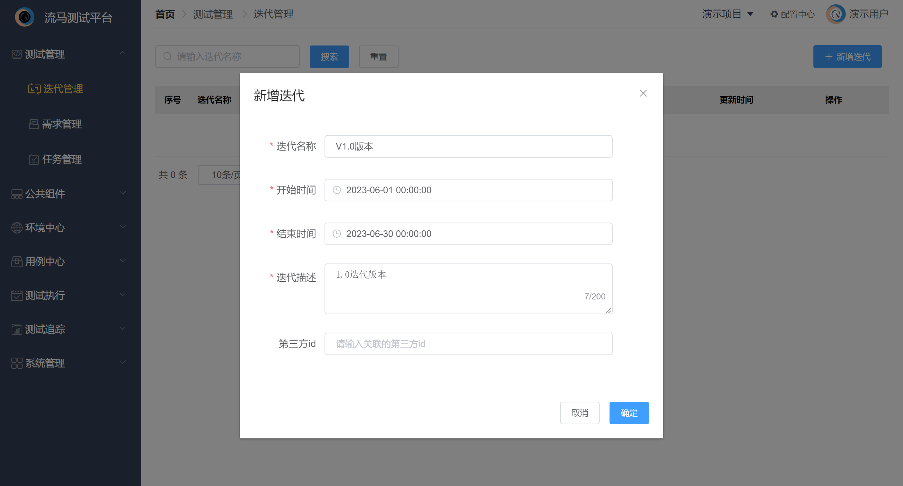

## 3.2 需求管理

需求管理与研发管理中的需求概念一致。每个迭代都有研发需求，同样的，对应到自动化测试来说，每个迭代新增的功能也应当有自动化测试用例研发的需求。在迭代开始时，当需求评审完成后，测试团队也应该评估哪些需求写功能用例，哪些需求适合写自动化用例，从而一开始就避免功能用例与自动化用例重叠的情况，减少人力投入的浪费。

同时，这样也可以将自动化用例与需求绑定，能够更精准化的执行目标用例，不仅可以提升效率，同样也可以提升测试质量。

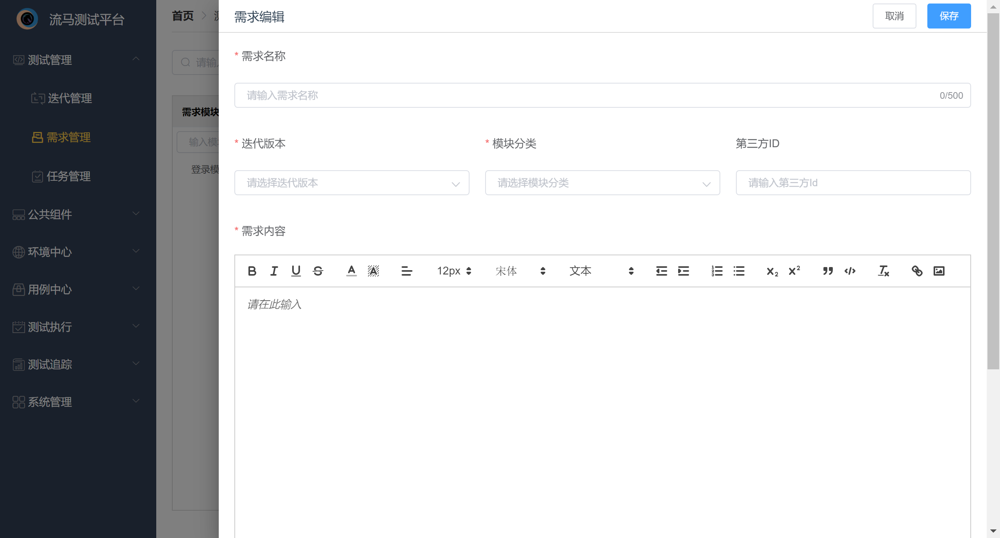

## 3.3 任务管理

前面的需求管理是与业务挂钩，那任务管理便是与人挂钩，同时也是将业务需求与人绑定的桥梁。一个需求可能被拆分为多个自动化用例研发的任务，将每个人任务指定到对应的责任人，同时评估每个任务的用例量。如此我们便能追踪到需求的用例覆盖率以及测试人员的任务完成率，从而解决工作结果输出不够详细且明确的问题。

此外，当用例出现问题时，我们也可以第一时间追踪到其所属的业务需求以及责任人，从而能够快速响应去定位问题，再解决问题。甚至在企业版的团队看板中，我们加入了排行榜功能，将团队中用例输出多、用例质量高的同学展示出来，也有一定的激励作用。

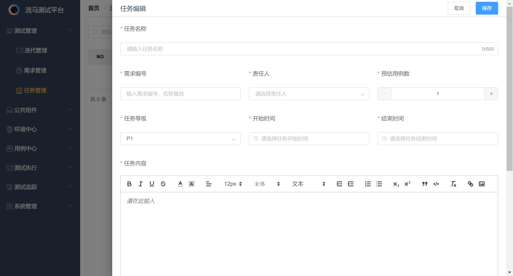

# 4. 公共组件

## 4.1 文件管理

文件管理主要负责测试文件的维护，主要服务于文件上传类接口或WEB测试文件上传组件。

文件上传后会为每个文件生成UUID作为唯一标识，使用时有三种方式：

- 接口通过表单形式或者文件流形式上传文件时，在接口维护时，可直接在请求体内选择已上传的文件。
- 一些需要对文件进行读取加密类的接口，可以通过函数{{@loadfile(UUID)}}的方式加载文件。同时，支持函数嵌套，例如需要对函数进行base64编码，则可以通过{{@b64encode_bytes({{@loadfile(UUID)}})}}或直接使用{{@b64encode_file(UUID)}}进行文件加载。此外，也可以自己定义文件的处理函数，只需要将{{@loadfile(UUID)}}作为函数入参即可。
- 对于WEB上传类前端组件，如果是input类型，则可以直接使用输入操作，输入内容填写{{@savefile(UUID)}}，该函数返回文件本地保存的地址，当然前提是引擎和浏览器在同一机器上。

## 4.2 公共参数

公共参数分为系统参数和自定义参数。其作用如下：

- 系统参数目前默认有两个参数组，即header和proxy。设置这两类参数组的主要目的是为了解决接口的配置，例如有些系统的登录验证是采用token鉴权，那完全可以增加一个header，将token配置在其中，如此API用例只需要导入这个header，就不需要再重复登录，在用例调试时极为方便。而在组合用例时，又可以使用关联参数形式来配置token（见6.4请求头说明）可谓调试与日常执行两不误。
- 自定义参数作用主要是配置一些常用静态变量，例如用户名密码等。在此处配置后，编写用例时先将自定义参数导入用例，再用例具体使用位置通过{{$name}}格式调用。注意的是，同一项目下的自定义参数不能重名。如果变量值与环境挂钩，可配置环境变量，参考5.1.3节。

## 4.3 函数管理

随机函数在自动化测试中经常被使用，本平台支持python-faker库随机函数。同时一些数据处理函数也十分必要，平台也内置了一些随机函数。

但实际使用中，往往都会有一些特殊的数据处理。比如常见的接口加密生成签名，即将所有的请求参数进行加密得到签名，最终服务端对签名进行验证。遇到这类接口请求，必然绕不开对参数的处理，传统工具中，如jmeter，可以通过beanshell进行请求前预处理。但其实一个项目的加密算法往往是一样的，那我们的脚本也完全可以复用，因此，平台支持函数化。以下举例说明：

```
要求：接口/openapi/sign 需要对请求地址和请求参数进行sha256加密，并将加密结果放在sign字段。  

解决：首先在函数管理新增一个函数"sha256"，函数入参有三个，path，body，secret，如下图所示：  
函数新增后，在编写用例时，我们sign字段可以调用函数对其进行赋值。调用方式为：{{@sha256(path, body, secret)}}。但实际上，往往path、body也并非常量，因此不能直接填写，需要动态获取最终值。  
为了解决这类问题，平台支持函数入参动态获取同一接口的其他入参值。参数格式为#{jsonpath}, jsonpath提取对象默认为请求体，支持json/form-data等类型的请求体提取。  
jsonpath最前面可以加$符号，也可以不加，同时也可以写成#{_REQUEST_BODY.jsonpath}的形式。同时，如果想获取请求头或查询参数的单个值，支持#{_REQUEST_HEADER.xxx}或#{_REQUEST_QUERY.xxx}来获取对应值。  
而如果想获取请求域名、请求地址、全部的请求头、查询参数或请求体，则可以应用 #{_REQUEST_URL}，#{_REQUEST_PATH}，#{_REQUEST_BODY}，#{_REQUEST_QUERY}，#{_REQUEST_HEADER}。在最终执行时，会根据jsonpath的依赖关系决定请求参数的先后处理顺序。  
此外，secret字段可能是复用的，如果直接写死不利于用例维护，那么可以使用公参维护，并通过{{secret}}方式应用。  
同时，函数管理中支持使用用例执行过程中的动态变量，sys_get(name)用来获取变量空间的变量(包括关联参数和公共参数，1.2版本之后优先获取关联参数)，sys_put(name, value, true/false)用来回写变量空间的变量，其中第三个参数非必填，默认为false。当为false时变量回写进关联参数空间，当为true时变量回写进公共参数空间。 
```


注：函数最终处理的值以sys_return(value)形式返回。

## 4.4 操作管理

操作也可以称之为关键字， 主要应用于UI测试，包括WEB测试和APP测试。WEB测试是将selenium的操作代码封装成关键字，APP测试是将U2和wda库的操作代码封装成关键字，通过关键字的编排最终实现UI自动化。平台将控件分为六大类：浏览器操作/系统操作、页面操作/视图操作、关联、断言、条件以及场景。

平台已经翻译了大部分原生库的代码，同时也支持用户自定义一些复杂操作。由于UI测试每个动作可能都涉及多个元素及数据入参，因此每个控件支持灵活定义元素和数据。

举例说明，比如需要文本框输入，但这个文本框不能直接定位，需要先定位父元素，再定位文本框，那么可以新增控件，如下图所示：

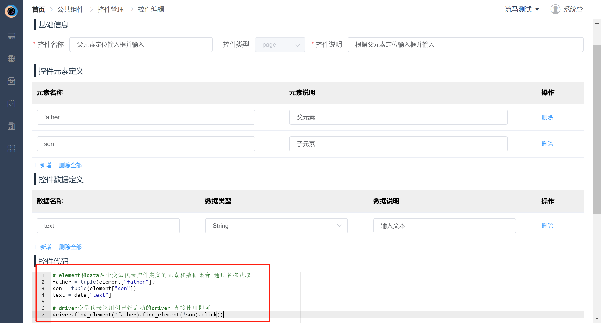

注：浏览器/页面操作无须返回值。关联/断言/条件操作需要将提取值以sys_return(value)形式返回，断言和条件的判断代码无须在自定义代码中实现。

上述例子主要指一些自动化的操作动作。但UI自动化用例往往也需要一些辅助组件，比如对页面进行断言判定是否操作成功、或者提取某个页面元素的值留给后面步骤使用、亦或者对某个结果进行条件判断来确定进行哪一类操作。因此平台提供断言、关联、条件控件，并支持断言结果失败后自动截图保存，也支持关联参数提取的值在后续步骤中通过{{name}}方式引用，同时，针对条件控件，支持true、false的执行分支，条件为真时执行指定行数，条件为假时执行其他行数。

此外，场景控件主要用来自定义一些固定组合操作，比如用户登录，直接在场景中封装后，即可将多个步骤合而为一，提高用例可读性。

在1.1之后的版本中，操作管理中支持使用用例执行过程中的动态变量，sys_get(name)用来获取变量空间的变量(包括关联参数和公共参数，优先获取关联参数)，sys_put(name, value, true/false)用来回写变量空间的变量，其中第三个参数非必填，默认为false。当为false时变量回写进关联参数空间，当为true时变量回写进公共参数空间。

# 5. 环境中心

## 5.1 环境管理

环境管理是自动化测试的重中之重。通常来说，一条合格的自动化测试用例不应该与环境耦合，在任一环境都是可以成功执行的。因此，流马平台的测试用例都不会与环境挂钩，只有在执行的时候才会选择环境。

### 1.域名配置

那么为了解决同一环境下接口请求域名和网站域名多样化的问题，平台支持同一环境下配置多个域名，不同域名的识别方法有两种，即域名标识和路由匹配：

- 路由匹配：通常情况下，即使一个环境有多个微服务带来的多域名，每个接口属于哪个微服务基本可以通过接口地址首个路由参数来区分。例如：我们给路由"/first"配置域名A，当某接口是以"/first"开头时，就会在接口用例执行时自动关联到配置的域名A。
- 域名标识：域名标识是路由匹配的一种补充。因为在有的项目中，极有可能同样的首位路由参数却有两个域名。那么这时我们需要对这类接口直接加域名标识，域名标识枚举可以在配置中心中配置，同时在接口新增时选择某个域名标识。而在环境新增域名时，则需要给该标识添加一个域名，从而在接口用例执行时，对其进行域名匹配。默认域名标识优先级高于路由匹配。

UI用例的"打开网页"操作也需要动态管理环境，因此该控件也支持路由匹配和域名标识，逻辑同接口。此外，如果自定义操作需要进行环境管理，那么该控件需要定义两个数据入参：domain、path。domain用来选择域名标识，path用来定义页面地址。默认以domain进行域名标识匹配，如果domain为空，则会以path匹配。

### 2.数据库配置

在接口测试中，往往需要对数据库进行增删改查。平台内置了主流的四款关系型数据库操作。

通常来说，即便是不同的环境，数据库名都是一样，所以平台以数据库名为标识来识别数据库，环境下的数据库配置主要是配置所需的数据库名以及其数据库类型、地址、端口、用户名密码等链接信息。

在接口前后置sql中，只需要选择对应的数据库名，即可执行相关sql，当然前提条件是执行环境下已经配置了该数据库名的相关链接信息。

### 3.环境变量配置

在实际测试工作中，有些变量会跟随环境变化而变化，因此环境变量不可或缺。

环境变量无需像公共参数那样在用例中导入，在选择环境执行时会自动加载到用例变量空间，只修改当前用例环境变量不会影响其他用例。

如果同一用例下有同名环境变量、公共参数，环境变量优先级低于公共参数。

## 5.2 引擎管理

测试引擎是本平台的核心，我们将测试引擎独立出来并开源[GitHub地址](https://github.com/Chras-fu/Liuma-engine)，方便用户使用的同时，也可以自行对引擎做一些自定义更改。

测试引擎默认会有四个系统引擎，部署在服务器。系统引擎一般提供给用户做体验和调试使用，因此默认系统引擎优先执行用例调试执行，针对集合和计划的时候，只有在没有用例调试和执行任务时才会进行。如果用户希望执行不用排队，可以注册自己的测试引擎，并拉去引擎代码，只需要简单的配置后（参考部署手册），即可使用。

为了让注册的引擎可以项目内公用，平台并未做引擎使用权限限制。而如果别人误用自己注册的引擎，则可以查看引擎执行任务，终止对应的执行任务或一键终止全部，无论是正在执行的还是待执行的测试任务都会被停止。

注：引擎注册后只有本地启动且引擎管理显示在线后，在测试执行时方能选择用户注册的引擎。

## 5.3 设备管理

设备管理主要应用于APP测试，APP测试离不开执行设备，为了方便用户使用，将设备挂载在平台统一管理和调配。

设备管理功能相对简单，一个是设备的状态管理，一个是设备的在线操作。

### 1. 状态管理

设备主要分空闲、离线、占用、测试、冷却五个状态，分别说明如下：

- 空闲：当设备通过agent挂载到平台时，即为在线状态，此种状态可以用来进行执行测试以及在线使用。
- 离线：当设备被拔出或者agent掉线时，设备即为离线。无法测试和使用。
- 占用：指设备被人在线使用时的状态，可以看到使用人，一旦不再使用超过十分钟，设备自动重置。占用状态除占用人外其他人无法测试和使用。
- 测试：当设备被用来执行测试计划时的状态。所有人可以在线查看投屏，但无法操作。管理员账户可以进行强制停止测试。
- 冷却：这是一个中间态， 当停止使用或测试时，设备重置需要一点时间，这期间状态即为冷却。此时也无法测试和使用。

注：当agent端在初始化时配置了设备权限，即所属人和所属项目时，仅有权限的人才能在设备列表查看到对应设备并进行相应使用。

### 2. 在线操作

在线操作目前功能相对简单，仅提供投屏操作、常用功能、控件元素、测试用例的功能，分被说明如下：

- 投屏操作：安卓投屏操作采用scrcpy，苹果投屏操作采用wda。支持远程对手机进行一些简单的操作，内网下安卓很流畅，但苹果相对卡顿。后续会进行优化。
- 常用功能：支持包安装、下载截图等操作，后续会会慢慢扩展。
- 控件元素：即对页面的view进行解析，方便用户对元素进行定位，支持一键新增页面控件，在控件管理中可以查看新增的控件。同时在写用例时直接引用。
- 测试用例：为方便用户写测试用例和直观的查看用例执行过程，在在线操作页面提供用例编写和执行能力。

更多功能后续会持续更新，敬请期待！

# 6. 用例中心

## 6.1 接口管理

接口管理类似于接口文档，对接口进行统一管理。当接口发生改变时，只需要统一维护即可，不再需要逐一修改（当前只有企业版支持该功能）。此外，接口统一管理也可以更清晰的统计到测试用例的接口覆盖率，进而统计到自动化测试的覆盖率。

在企业版中，接口同时支持快捷调试的能力，不再需要创建用例才能执行。

此外，接口关联支持Mock服务，默认返回配置的响应预期。如果需要根据不同请求返回不同的Mock值，则可以使用高级Mock配置智能Mock规则。Mock的结果支持MockJs语法，点击查看[MockJs官方文档](http://mockjs.com/)

接口支持模块化管理，更能清晰地统计各功能模块的测试覆盖率。因此，在新增接口前需要先创建接口模块。模块创建后，即可新增接口，接口分基础信息、请求参数以及响应预期三个模块，详细说明如下：

1)基础信息

- 接口名称：尽量以接口实际功能为名，方便后续识别
  请求协议：目前只支持http协议，未来可能支持dubbo、tcp等协议接口
- 接口请求：接口的请求方法（常见八大类）、请求路由。请求路由指的是以 "/“开头到”?"为止（不含?号）的部分。如果路由参数是动态值，可以书写{name}，name字段需要在请求参数中的路由参数进行维护。
- 接口等级：对接口优先级作出判断
- 域名标识：用以执行时匹配环境。维护时则默认以该标识匹配环境，不维护默认以路由匹配环境。
- 模块分类：接口所属模块，支持搜索
- 接口描述：接口的补充说明

2)请求参数

- 请求头：接口的请求头设置，此处设置后，用例会自动带出。
- 请求体：请求体支持多种类型的入参。其中form-data/file两种格式的请求体支持选择文件管理中维护的文件。此处仅对请求体参数格式进行定义，方便用例直接使用，如不维护也可在用例处直接填写。
- 查询参数：一般用于GET请求。即完整请求地址中"?"后面"name=value"的参数。
- 路由参数：一般请求路由中有动态值，需要配置路由参数。路由参数配置后，在请求地址中以{name}引用。

2)Mock服务
点击响应预期右侧的开关可打开Mock服务，默认关闭。关闭时无法使用当前接口的Mock。针对新建接口时，打开Mock服务只有接口被保存才会生效。

Mock服务依赖响应预期配置，响应预期主要配置响应码、响应体数据类型(支持json、xml、html、text、文件)、响应头、响应体。如果没有配置响应体，默认返回空json。

此外，Mock分为常规Mock和智能Mock，以下分别说明：

- 常规mock：即不论怎么请求，都会返回默认的响应预期。
- 高级Mock：如果配置了智能期望，则返回匹配到的智能期望中的响应预期。如果全都没有匹配到，则返回默认的响应预期。

注1：智能期望按照从上到下依次匹配，匹配到则不在继续匹配。

注2：智能期望中的条件主要针对请求头、请求体、查询参数、路径参数做判断。
注3：当请求体为json时，条件中的参数名支持jsonpath语法。当不填时默认选择的全部参数。

## 6.2 元素管理

元素管理WEB自动化的页面元素进行统一管理，方便唯一使用和维护，当页面元素发生变更时，进行统一修改。

元素管理按照页面层级进行维护，每个元素与页面挂钩。因此新增元素前需要先维护页面模块，页面模块新增后即可进行元素维护。元素维护详细说明如下：

- 元素名称：尽量言简意赅说明该元素的作用，如登录按钮，用户名输入框等。
- 定位方式：即selenium的八种元素定位方式。
- 表达式：即元素的定位表达式。此处需要有一定的页面定位基础，建议初学者可以使用火狐浏览器的firebug功能。
- 所属页面：即元素所属的页面模块，支持搜索筛选。
- 元素描述：元素的补充说明。

## 6.3 控件管理

控件管理对APP自动化的视图元素进行统一管理，方便唯一使用和维护，当视图控件发生变更时，进行统一修改。

控件管理按照视图层级进行维护，每个控件与视图挂钩。因此新增控件前需要先维护视图模块，视图模块新增后即可进行控件维护。控件维护详细说明如下：

- 控件名称：尽量言简意赅说明该元素的作用，如登录按钮，用户名输入框等。
- 定位方式：安卓和苹果主要使用属性定位和Xpath定位，苹果额外支持Predicate定位和Predicate定位。
- 表达式：即控件的定位表达式。属性定位支持多属性的定位方式，其他定位方式即填写表达式。在线操作页支持查看控件属性从而新增控件。
- 所属视图：即控件所属的视图模块，支持搜索筛选。
- 控件描述：控件的补充说明。

## 6.4 用例管理

用例管理即用例编写维护的菜单，支持API与UI用例统一管理。与接口管理和元素管理一样，用例管理也支持模块化管理，需要用户先新增模块后再维护测试用例。

用例维护分三个模块：基础信息、配置信息、用例步骤。以下进行详细说明：

1)基础信息

- 用例名称：尽量以具体测试功能点描述，与日常功能测试用例命名一致。
  用例类型：新增时选择后不能再修改。
  环境标签：用例可在哪些环境下执行，非必选，仅作标签使用。调试时执行环境会默认首个环境。
  用例等级：用例的优先级。
  第三方标识：预留字段，用以对接项目中测试用例管理系统，如禅道等。
  模块分类：用例所属的模块，支持搜索筛选。
  用例描述：用例的补充说明。

2)配置信息

- 前置用例：如果该用例需要前置操作才能执行，在此处可以维护，按照选择顺序执行。如需要登录，可以在此处选择登录用例。仅对单用例执行有效，如果是集合执行，需要集合自行配置执行顺序。此外，前置用例仅支持选择同类型测试用例。该功能仅在企业版支持。
- 后置用例：如果该用例执行完成需要一些公用的后置操作，在此处可以维护，安装选择顺序执行。如需要登出，可以在此处选择登出用例。仅对单用例执行有效，如果是集合执行，需要集合自行配置执行顺序。此外，后置用例仅支持选择同类型测试用例。该功能仅在企业版支持。
- 导入函数：如果该用例需要使用自定义的函数，需要导入该函数。多选、非必选。如果使用系统函数，无须导入。
- 导入公参：如果该用例需要使用公共参数，需要导入该参数。多选。非必选。
- 公用Header：API测试用例，如果所有接口都使用某一个请求头参数，可以维护公共请求头，并在此处选择。如果在接口编辑处维护了同名的请求头参数(不区分大小写)，则会覆盖公用请求头中的参数。
- 公用Proxy：API测试用例，有些环境可能需要代理才能请求，因此可以维护接口请求的代理。
- 启动Driver：WEB测试用例，配置该用例是否启动新的浏览器。如果为否，则在测试集合中使用之前用例启动的driver。注意的是，第一条用例必须要启动driver。
- 关闭Driver：WEB测试用例，配置该用例结束后是否关闭当前浏览器，如果为否，则在测试集合中该driver会一直保存留给下一条的用例使用，直至启动新的driver后才会被关闭。
- Driver参数：WEB测试用例，配置浏览器启动时的启动参数，不选则默认不做任何配置，仅以引擎配置的无头模式、远程模式或常规模式进行执行。
- 被测应用：APP测试用例，配置用例默认启动的APP，配置后不需要在用例中选择打开应用的步骤。
- 启动视图：APP测试用例，仅支持安卓应用，默认打开app时指定打开的视图页面。

3)用例步骤

① API用例

接口选择时，统一接口支持复用，并在选择后进行排序。注意的是，接口选择后需要进行编辑才能使用。对接口请求各TAB详细说明如下：

- 请求头：同接口管理请求头，此处会默认带出接口维护的字段，可重新输入。
- 请求体：同接口管理请求体，此处会默认带出接口维护的字段，可重新输入。
- 查询参数：同接口管理请求体，此处会默认带出接口维护的字段，可重新输入。
- 理由参数：同接口管理请求体，此处会默认带出接口维护的字段，可重新输入。
- 响应断言：对接口进行响应断言，支持对响应码、响应体、响应头进行断言。取值方法支持jsonpath、xpath、正则以及数据库。如不维护，默认对响应码进行200断言。数据库断言主要是先获取数据库的字段值，再进行断言方法选择和预期值设置。
- 关联参数：对接口响应参数进行提取保存。取值方法支持jsonpath/xpath/正则。保存名为关联变量名列维护的字段名。当测试集合统一执行时，如果多个关联变量名同名，默认覆盖为最新保存的参数值
- 前置脚本：支持添加前置Python脚本和前置Sql脚本。注: sql数据库选择只有在环境中配置了数据库才能进行选择。
- 后置脚本：支持添加后置Python脚本和后置Sql脚本。注: sql数据库选择只有在环境中配置了数据库才能进行选择。
- 请求设置：支持做一些接口请求的配置信息。包括如下几个：

注:

```
前后置等待：默认为0，即接口请求前后设置等待时间。  
引用Session：默认不引用，如果当前接口需要登录，且登录信息使用Session管理的，只需要该接口前面接口保存Session后，该接口直接引用Session即可完成登录校验。  
保存Session：默认不保存，如果需要保存登录信息到Session，该配置需要选择为是。  
超时时间：默认关闭，设置接口最大等待响应时间。  
下载缓冲：默认关闭，即大文件下载接口，为避免内存溢出，使用该方法。  
证书验证：默认关闭，即部分https接口需要证书校验，则设为是。  
错误屏蔽：默认关闭，即执行失败不再继续执行，如果希望继续执行，则设置为是。  
网络代理：默认关闭，即开启接口请求的代理，开启后会覆盖用例配置的代理。
```

- 逻辑控制: 主要是条件/循环控制器，在企业版2.2后，该功能被更改作为一个步骤添加到用例中。

注:

```
条件控制器：等效于if语句，但仅对当前接口请求有效，如果条件为真则该接口执行，为假则跳过执行。
循环控制器：即for/while循环，对接下来的多个接口进行循环请求，包括当前接口。
```

注：关于参数引用的使用说明如下：

获取参数使用占位符方式，可以写在任意的位置来获取，如{{name}}。优先从关联参数获取，如没有则从公共参数中获取。获取的参数如果是json数据，支持jsonpath表达式获取具体值，如{{name.jsonpath}}。jsonpath直接写路径，前面不需要加$符。(该功能在1.3.1版本之后支持)

注：关于前后置Python脚本的使用说明如下：

- 脚本可通过sys_get(name)函数获取到公共参数和关联参数，如果二者有相同命名参数时，默认先从关联参数中获取
- 脚本可通过sys_put(name, value, true/false)函数将值回传给关联参数或公共参数，true时传给公参，false时传给关联参数，不填默认为false
- 后置脚本可在代码中直接使用res_code/res_header/res_data/res_cookies/res_bytes变量名来获取响应内容。也可以使用res_request获取全部的请求信息。

注：关于前后置SQL脚本的使用说明如下：

- 查询sql的结果如果需要保存为关联参数，需要配置关联参数名，多个参数逗号隔开，且数量需与查询字段个数保持一致。
- 保存的关联参数是以数组形式保存，即便结果只有一个，使用方式支持下标，即{{name[n]}}，n的值即数组索引。通常与循环控制器或后置脚本联用。同一个sql仅支持一条sql语句，不支持执行多条。

注：关于条件控制器的使用说明如下：

- 条件控制器的判断对象如若使用前面提取的关联参数，需要以{{变量名}}形式使用。
- 条件控制器支持多个条件，仅全部条件全部通过才会执行本接口，如不通过，该接口跳过执行

注：关于循环控制器的使用说明如下：

- 循环索引命名在多重循环内，不得重复。就像代码中嵌套for循环一样，索引值命名一般都不一样
- 接口中使用索引可以通过{{索引名}}形式使用，比如说接口A的某个入参需要前面保存的参数A的第N个值，其中参数A是个列表或数组，则可以通过：{{@indexof({{参数A}}, {{索引名}})}}或者{{参数A[索引名]}}形式调用。当然如果需要的值得索引与循环索引不同，也可以通过四则运算函数来计算，或者使用前置脚本来解决。
- 循环次数如果是动态的，支持使用函数，比如循环次数为参数A的长度，可以通过{{@lenof({{参数A}})}}来获取循环次数。

注： 如果需要多个前后置脚本和sql，将以列表顺序进行执行前置和后置。一般后置脚本或sql将在断言和关联参数提取执行后再执行。

② UI用例

UI用例是将人工点击输入等操作一步步翻译为测试动作，以配置化完成。每一步动作需要维护其操作对象和数据。一个工作一般包括三个模块：操作名称、操作元素、操作数据，详细说明如下：

- 操作名称：即控件管理中的内置控件和自定义控件，按照控件类型进行分类维护，支持筛选。
- 操作元素：选择操作后，会根据该操作是否需要操作元素来决定展示。同时为了方便用户使用，支持在此处新增元素并在用例保存后同步到元素管理。
- 操作数据：选择操作后，会根据该操作是否需要操作数据来决定展示。此处默认domain、assertion两个字段是选择栏，其他均是输入。

注： 操作数据中一些特殊字段的说明：

```
domain：web测试专用，域名标识，选择栏，用例执行时用来匹配执行环境下的域名，如果为空默认以path匹配。
path：web测试专用，通常与domain联合使用。
appId：app测试专用，选择需要打开的应用。
assertion：断言方法，选择栏，选择范围为内置断言方法。
expect：预期值，与assertion联合使用。
continue：断言失败后是否继续执行，默认为否。如果选择是，断言失败后仍会继续执行
true：条件为真时执行接下来的m行。
false: 条件为假时执行接下来的m+1到n行。
steps: 循环操作执行步骤数，即接下来的N行
timeout: 超时时间，单位ms，While循环的超时时间以上字段在自定义操作时如果参数名使用该名称，会默认该参数即对应相应的作用。  
```

# 7. 测试执行

## 7.1 测试集合

测试集合的作用是进行用例的编排，测试集合内的用例在执行时是串联执行，可以控制用例的执行顺序执行，适合一些用例的场景化的编排。而测试集合之间的执行是并发执行的，无法控制彼此之间的执行顺序，适合彼此独立的测试用例，从而提升执行效率。

注意的是：测试集合的执行设备为非必填，但当该集合包含app用例时，执行设备为必填项。且一个集合只能执行安卓或苹果用例，不支持安卓和苹果用例混合执行。

此外，测试集合支持用例复用，一个用例可以在一个测试集合被多次使用，适用于一些工作流类的待测系统。而且测试集合内的关联参数、session、drvier是公用的，说明如下：

- 关联参数：上一条用例保存的参数在下一条用例可以使用，但如果遇到新的用例保存同样命名的关联参数，则之前的参数会被替换掉。
- session：部分系统使用session进行登录验证，而如果不想每条用例重复登录，又不想使用header公参进行管理。可以只写一条登录用例，并保存session，每个集合第一条引用登录用例，之后每个用例均复用session即可。
- driver：即selenium的驱动浏览器的session。如果不想重复开关浏览器，写用例时启动driver/关闭driver选择否，在集合串联执行时就可以复用之前的driver。

## 7.2 测试计划

测试计划一是确定测试执行的全部用例，以测试集合为维度管理。此外测试计划支持定时任务和周期执行。同时测试计划按照版本管理，也支持集成到研发流水线，通过OpenAPI来调用测试计划执行，并异步反馈执行结果。

在企业版里，测试计划做了类型的区分，包括定时执行、迭代任务、回归测试。定时执行才可以配置定时任务，有定时任务自动触发，回归测试一般是由流水线通过openAPI触发，而迭代任务一般是由手动触发。一般来说，迭代任务和回归测试最好是每个迭代都要新增一份测试计划，如此才能更方便统计每个迭代的测试数据。

计划的一些字段说明如下：

- 最大并发数：计划下的集合是并发执行的，但考虑到性能问题，并非并发数越大效率越高，也需要参考负载机的资源情况，因此需要用户根据自身情况设置。
- 失败重试：计划失败后支持重新执行失败的用例，在此处进行开关配置。
  执行环境：如果包含api或者web用例，环境参数为必填，如果全部为app用例，该参数不必填。
- 计划类型：定时任务支持配置执行时间和频率，根据配置时间和频率定时触发任务。

此外，计划支持关联不同的群聊通知，且可以选择是否失败才会发送通知。该配置仅对群聊通知有效，对邮件通知如果后端配置文件开启了邮箱配置则默认为计划执行完成后必发。

# 8. 测试追踪

## 8.1 测试报告

测试报告列表页仅展示测试计划的报告，并不展示测试集合的执行结果。当测试计划执行时，测试报告即会被创建，状态为待执行。

当测试引擎获取到该执行任务时，测试报告状态变为执行中，且测试结果会实时返回并展示。同时，如果测试计划允许失败重试时，测试引擎会在第一次执行完成后将失败的用例重新执行，并再次返回。测试报告默认展示最新一次的结果。

在企业版的测试报告加了全新的升级，除了用例执行状态的筛选外，还额外加入了错误分析功能，原有的报告仅仅只是个结果的展示，但很明显这样并不能形成测试的闭环。

因此，新版本里对失败的用例加入错误处理的功能，由测试人员来评估失败的原因，如缺陷问题、环境问题或用例问题等。如果是缺陷问题，可以直接在平台上提交缺陷，我们也支持将该缺陷同步到第三方缺陷管理系统中(由于第三方系统过多，该功能会根据企业内部使用的具体系统提供定制开发)，同时在质量看板中我们也会统计这些问题的分布情况，更好的了解测试执行的质量。

此外，我们也优化了报告的排版，让结果更清晰明了。同时升级了结果获取的方式，提升了报告展示的性能，且定时清理过期的报告步骤详情，避免数据过于庞大占据磁盘。

在企业版中，我们还支持了变量追踪的能力，即对一个用例内频繁使用变动的关联参数或公共参数进行记录，通过输入参数名即可查询在哪些地方发生了改变。

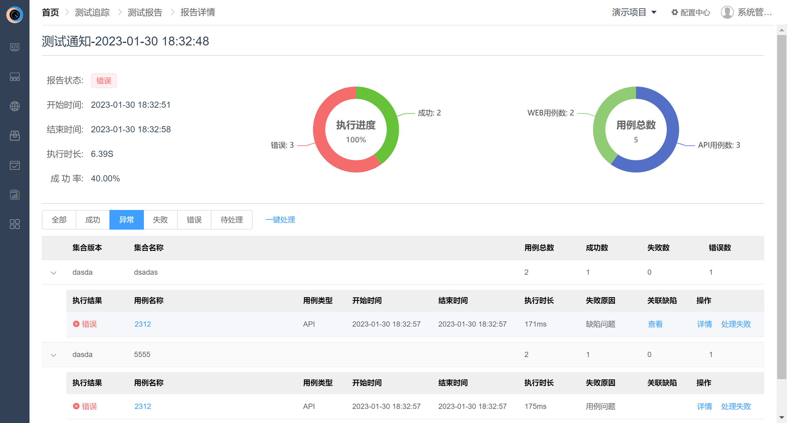

## 8.2 缺陷管理

在企业版里新增缺陷管理，主要用来记录测试执行中发现的bug，从而评估测试质量及自动化测试的价值输出。从报告详情页创建的缺陷会自动关联测试用例，从而在回归时能够更精准的执行相关用例或测试计划，提升效率和质量。

与其他缺陷管理系统一致，2.0版本的缺陷管理有缺陷等级划分、责任人追踪、解决时间追踪、状态追踪等能力。同时在各个维度的报表中，也会统计缺陷的数据情况和分布，进一步提升可视化能力。

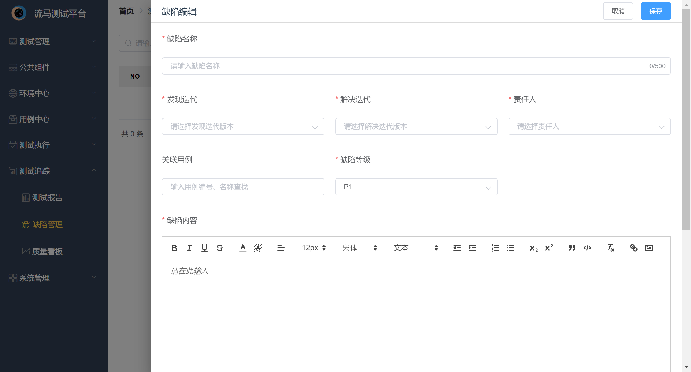

## 8.3 质量看板

在企业版里新增质量看板，主要统计项目维度的数据，同时也会展示当前项目下多个迭代之间的数据比对。主要统计的数据有需求/任务/缺陷/用例的新增和总数情况、迭代中各类数据的对比情况、近期的计划执行情况以及用例失败情况、用例失败原因以及失败类型分布情况等。

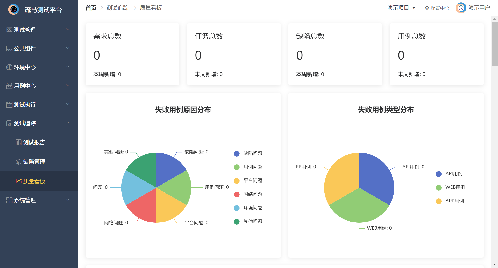

注：所有用例执行的数据在企业版中只统计计划执行的结果，不统计调试或者集合执行等结果

# 9. 配置中心

## 9.1 版本配置

平台支持版本管理，从而方便集成到CI/CD。测试集合和测试计划均需要选择归属版本，在集成到研发流水线时，可以根据版本号动态执行。

版本配置在配置中心中，只有项目管理员才能进行新增/编辑/删除，普通用户只能查看。为避免删除后关联该版本的集合或计划无法进行流水线调用，管理员删除版本时需要慎重。

在企业版里该功能进行升级，并成为独立菜单。见3.1章节。

## 9.2 域名配置

域名标识主要用于区分同一环境下，不同接口或者网页地址所归属的域名（微服务）是路由匹配的一种补充。一般来说域名标识的颗粒度最好细化到具体的微服务，每个微服务配置一个域名标识。

域名标识配置权限同版本配置，只有项目管理员才能进行操作。

## 9.3 应用管理

应用管理主要用于管理APP测试中的被测APP信息，包括所属系统、appId，首页视图等信息。此处配置后，该项目下的所有app用例可以直接使用，如果遇到appId更改，也会全局变化。

应用管理配置权限同版本配置，只有项目管理员才能进行操作。

## 9.4 通知配置

通知配置主要用于计划执行完成后，将执行结果推送到飞书/企微/钉钉群中，支持同一项目下配置不同的平台和不同群聊，可以对配置进行状态管理，失效时则不再进行推送。

通知配置配置权限同版本配置，只有项目管理员才能进行操作。

## 9.5 驱动配置

驱动配置主要用于WEB测试中浏览器启动的配置参数，此处配置后可在每个用例下进行选择，如不选则默认不做多余的配置。

具体配置参数请参考selenium官方文档。

# 10. 权限模块

## 10.1 团队管理

在企业版我们引入了团队概念，建立在项目的上一层级，从而做到对成员的管理，也能更好的统计项目与成员的关系和数据。在多数公司中，测试工作往往不是按照组织架构来的，更多的是一个个测试小团队，每个团队负责的项目不同，数量也不同。

考虑到这一点，为了更方便进行项目和成员管理，我们再项目管理上面加了一层团队管理，每个项目指定所属的团队，团队指定一个管理员，拥有团队所有的权限。而团队成员可以拥有团队内部一个或多个项目的权限，同时会有团队看板功能，可以精确地展示团队成员的成果输出，以及团队下的项目核心数据比对。

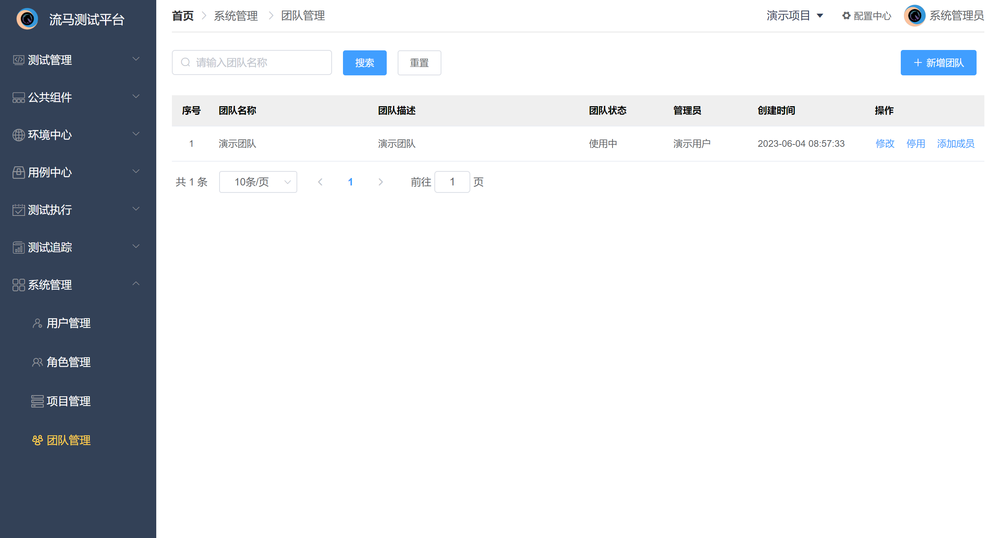

## 10.2 项目管理

平台支持项目维度进行自动化测试，项目之间的数据彼此独立，仅系统管理员拥有项目管理权限（在企业版中，团队管理员也有此权限）。系统管理员为内置用户，不支持新增。项目管理即项目的新增、编辑、停用/启用。同时企业版支持项目所属的团队维护，系统管理员可以修改项目所属的团队。

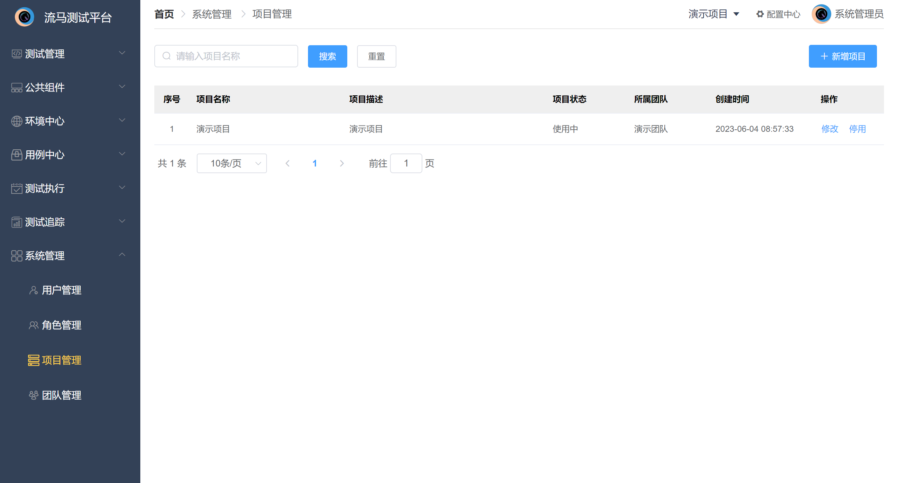

## 10.3 角色管理

平台默认为每个项目添加两个角色，项目管理员和项目普通用户。

项目管理员拥有权限：常规菜单、角色管理、用户管理(企业版不再支持)、配置中心查看及管理。

项目普通用户拥有权限：常规菜单、配置中心查看。

此外，企业版还内置了系统管理员和团队管理员两个角色，系统管理员角色为最大权限，在代码中写死，不支持新增。团队管理员在在团队编辑中指定，支持修改，一个团队只能拥有一个团队管理员。

在角色管理处可以批量添加角色下的用户（用户范围为当前团队下的所有用户），也可以批量删除角色下的用户（仅企业版支持）。

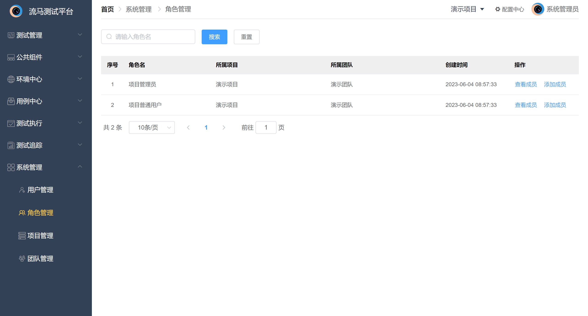

## 10.4 用户管理

社区版中，平台在新增项目时，会指定一个项目管理员。管理员可查看当前项目下的所有用户，并为用户添加/删除角色。

此外，管理员可新增项目用户，目前仅支持精准查找，输入用户账号（注册用户即手机号）可选择对应用户。

企业版中，平台在新增团队时，会指定一个团队管理员。管理员可查看当前团队下的所有用户，也可以将用户从本团队中剔除。

此外，企业版的系统管理员可以创建用户，也可以将用户从整个平台剔除，也可以重置其密码。创建用户或重置密码时密码默认发送到邮箱，如若部署时没有配置邮件服务，则默认密码为12345678。


# 11. OpenAPI

## 11.1 测试执行

平台提供外部调用接口执行测试计划和测试报告，接口文档如下：

1.计划执行

```
接口地址：http://域名或IP:端口 /openapi/exec/test/plan
请求方式：POST
请求类型：application/json
```

请求参数：

| 参数名称      | 参数描述       | 备注                      |
| ------------- | -------------- | ------------------------- |
| planId        | 平台测试计划Id | 必填                      |
| user          | 平台用户账号   | 必填，测试计划执行人      |
| environmentId | 平台测试环境Id | 非必填 默认计划中配置环境 |
| engineId      | 平台测试引擎Id | 非必填 默认计划中配置引擎 |


响应体：

| 参数名称 | 参数描述 | 备注                                   |
| -------- | -------- | -------------------------------------- |
| status   | 响应码   | 成功为0，失败为1000                    |
| message  | 响应信息 |                                        |
| data     | 响应内容 | 成功时为TaskId值，失败时为具体失败信息 |

2.报告获取

```
接口地址：http://域名或IP:端口 /openapi/exec/result/{taskId}
请求方式：GET 
请求类型：application/json
```

路由参数：

| 参数名称 | 参数描述       | 备注               |
| -------- | -------------- | ------------------ |
| taskId   | 执行计划任务Id | 执行成功时的返回值 |


响应体：

| 参数名称 | 参数描述 | 备注                                   |
| -------- | -------- | -------------------------------------- |
| status   | 响应码   | 成功为0，失败为1000                    |
| message  | 响应信息 |                                        |
| data     | 响应内容 | 成功时为report值，失败时为具体失败信息 |


附report主要字段结构：

| 参数名称 | 参数描述   | 备注                                                         |
| -------- | ---------- | ------------------------------------------------------------ |
| progress | 执行进度   | 参数范围0-100，100时为执行完成                               |
| passRate | 测试通过率 | 参数范围0-100，100时为执行成功                               |
| status   | 执行状态   | 成功：success，失败: fail，错误：error,跳过：skip，终止：discontinue,执行中：running，准备执行：prepared |