# 快速入门

本文档主要介绍平台的主要使用流程，共分五个步骤，大约需要十分钟的时间学习。

## 1. 新增环境

页面地址，左侧菜单栏->环境中心->环境管理

第一步：先创建一套被测环境。点击 新增环境 按钮，填写信息，保存。如下图所示：
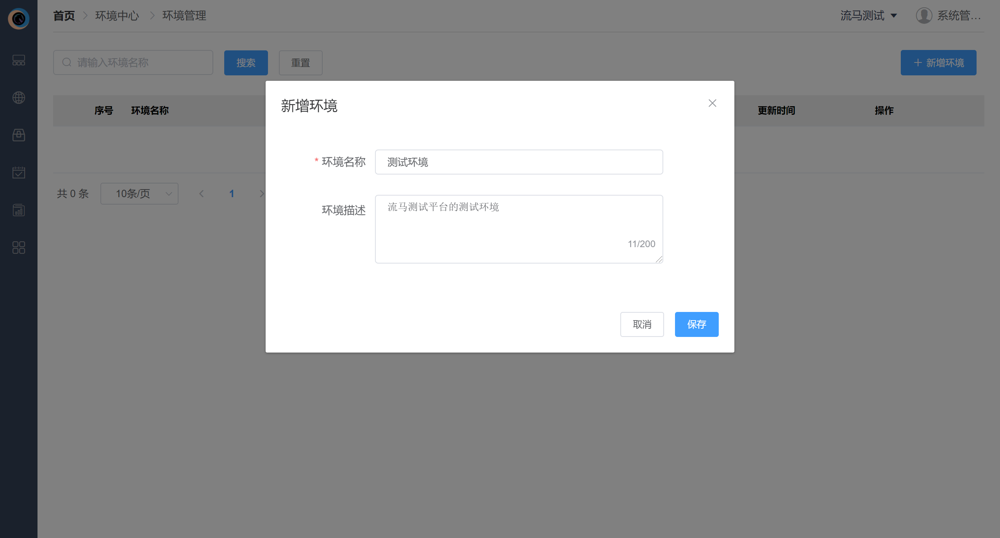

第二步：第一步保存后，列表出现刚新增的环境。通常情况下，一套环境不同端服务或者不同项目服务可能使用多个域名，一般会以接口地址（即路由）来区分。因此我们需要新增一个域名，步骤如下图所示：
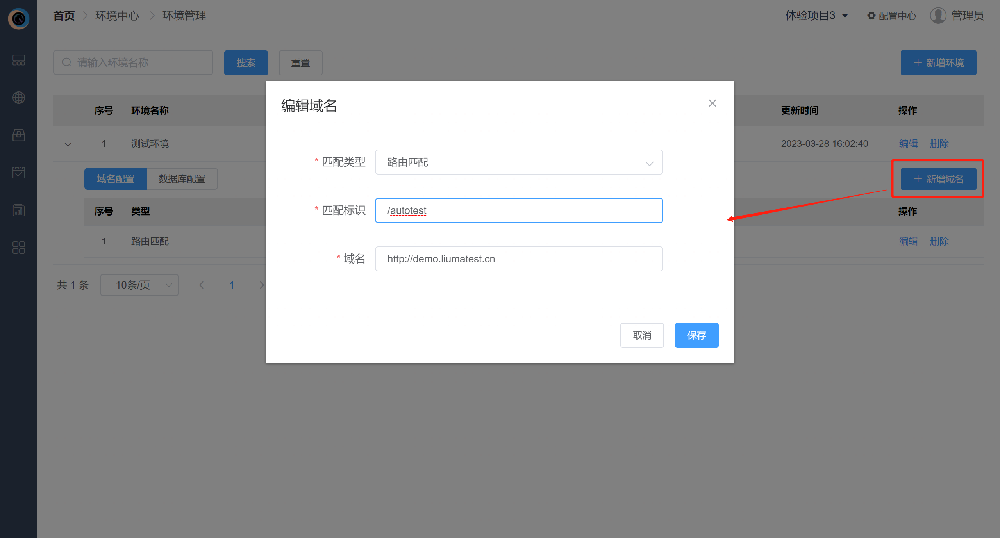

注：匹配类型支持标识匹配和路由匹配，具体请参考使用手册5.1。

## 2. 新增用例

页面地址，左侧菜单栏->用例中心->用例管理

第一步：新增用例。点击 新增用例 按钮，用例类型选择"API"，确定后跳转用例新增用例页，先填写用例基础信息和配置信息，如下图所示：
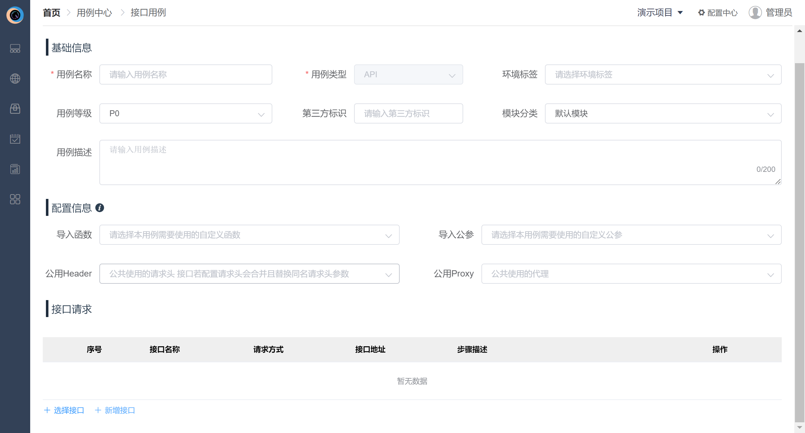

注：本用例不需要任何配置，配置信息具体使用参考使用手册6.4

第二步：点击新增接口，新增测试接口，需要编辑接口基本信息，以及接口的请求信息、断言、提取参数等内容。本例需要编辑基本信息和请求体，如下图所示：
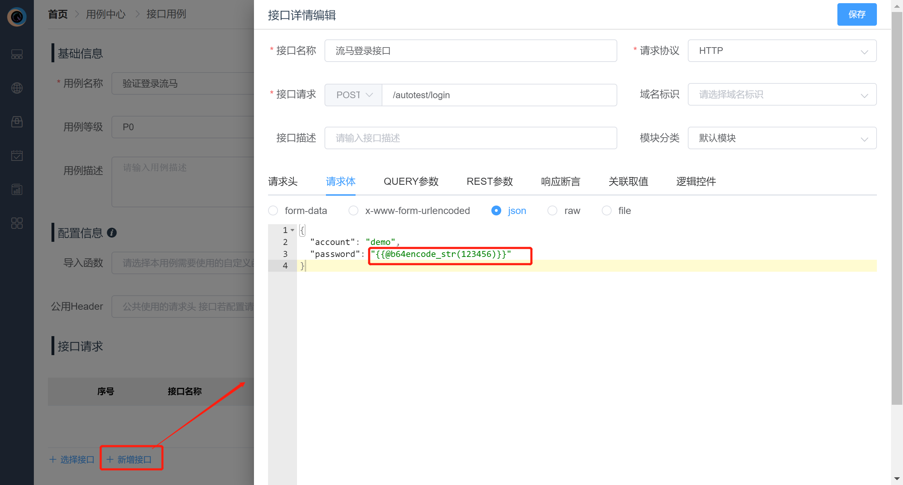

注：平台支持函数功能。本例中密码需要进行base64加密，内置函数"b64encode_str"可以直接使用，使用格式{{@func_name(param)}}。目前已支持的内置函数可以参考公共组件->函数管理，同时也支持自定义函数，具体应用请参考使用手册4.3。

第三步：编辑响应断言。TAB切换断言，如下图所示：
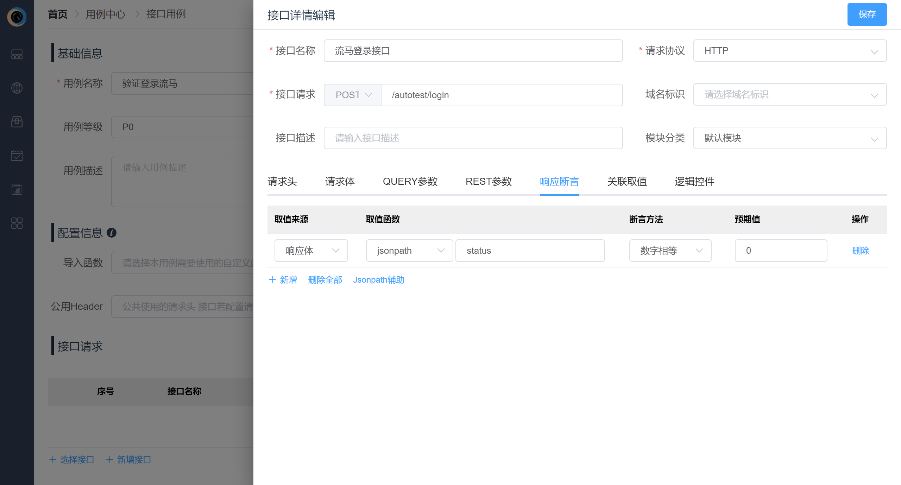

第四步：编辑关联取值。关联取值目的为获取接口响应信息，并保存下来给后续接口使用，如下图所示：
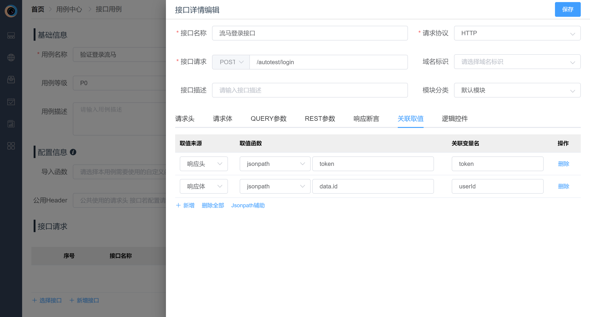

注：关联取值后，后续接口可以通过{{关联变量名}}方式使用该参数，如第八步图中所示。

第五步：保存接口，此时接口会同步保存到接口管理中，后续可直接通过选择接口去使用。

第六步：重复第二到第五步新增 获取用户信息 接口，请求头和REST参数信息以及断言如下图所示：
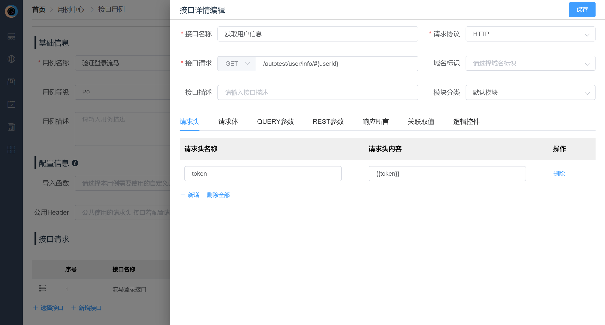

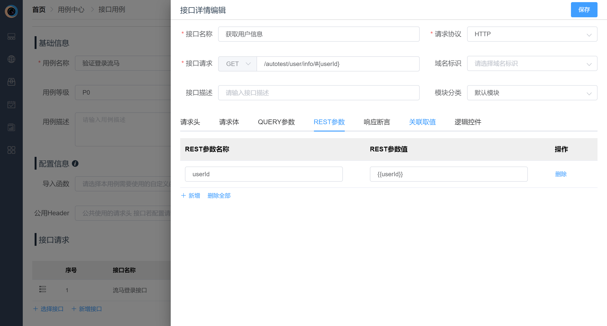

注：REST参数指的是接口地址中的参数。

第七步：调试用例。点击调试按钮，选择执行环境和执行引擎后，确认，等待用例执行结果返回。如下图所示

第八步：查看结果。用例执行完成后，结果按照接口为为维度展示。可以查看请求日志，包含请求各类信息以及断言信息。

第九步：保存用例

## 3. 新增集合

页面地址，左侧菜单栏->计划中心->测试集合

第一步：点击 新增集合 按钮，跳转新增集合页，填写基本信息，如下图所示：
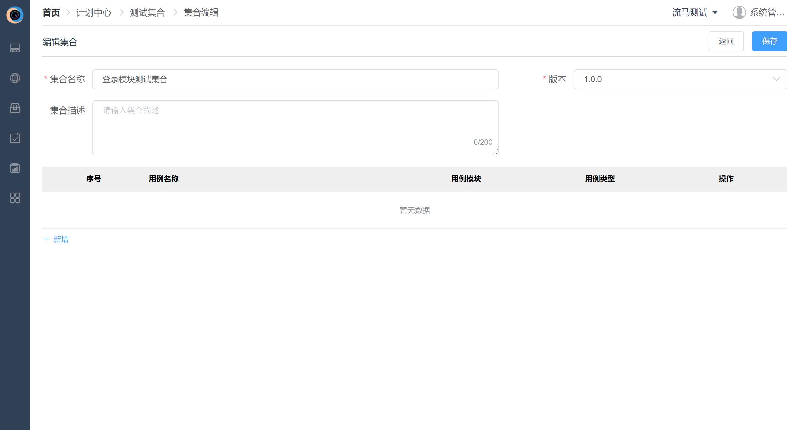

注：社区版版本在配置中心中配置，具体请参考使用手册9.1。企业版版本在迭代管理中配置，具体请参考使用手册3.1

第二步：选择用例。集合内的测试用例将顺序执行，因此可按顺序勾选，或者选择后进行排序，操作步骤如下图所示：
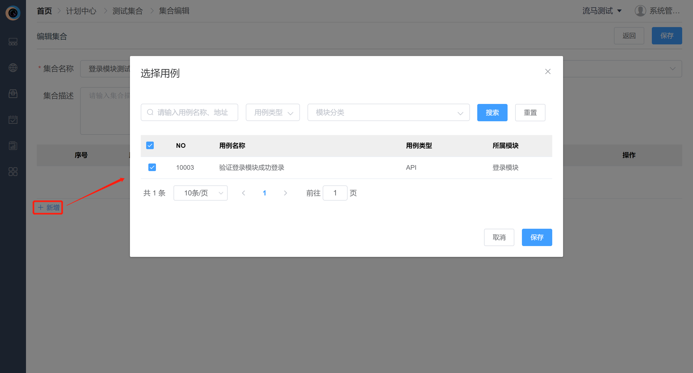

注：同一用例可选择多次，支持复用。

第三步：保存集合。集合也可单独执行，此处不做赘述。

## 4. 新增计划

页面地址，左侧菜单栏->计划中心->测试计划

第一步：点击 新增计划 按钮，跳转新增计划页，填写基本信息和定时任务，如下图所示：
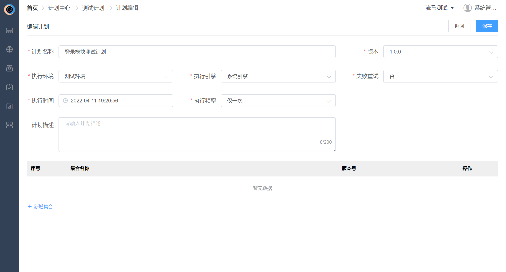

第二步：选择集合。集合不支持重复选择，且无顺序。如下图所示：
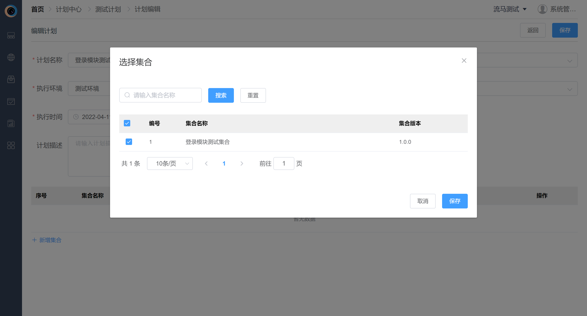

第三步：保存计划并执行。计划执行可定时任务触发，也可手动触发。以手动触发为例，点击计划列表页执行，选择执行引擎和执行环境，如下如所示：
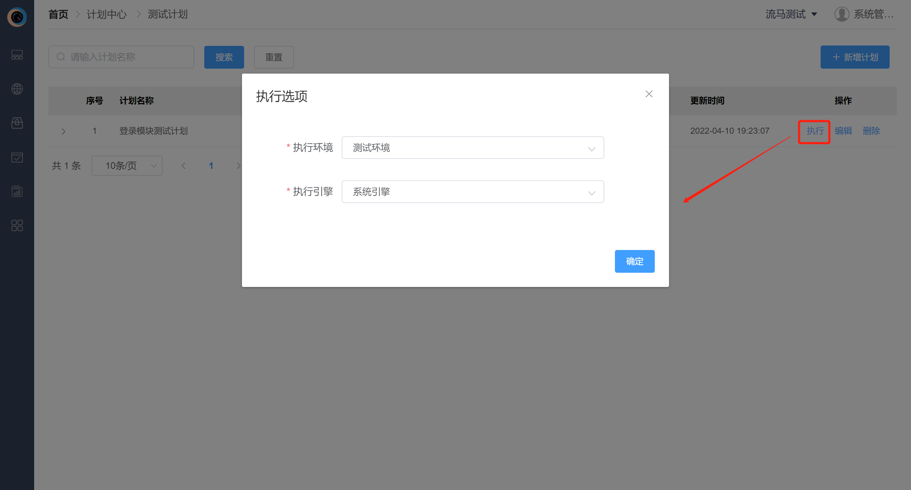

第四步：确定执行，等待报告。

## 5. 查看报告

页面地址，左侧菜单栏->测试追踪->测试报告

第一步：计划执行后，可在测试报告列表页查看到报告执行状态，如下图所示：
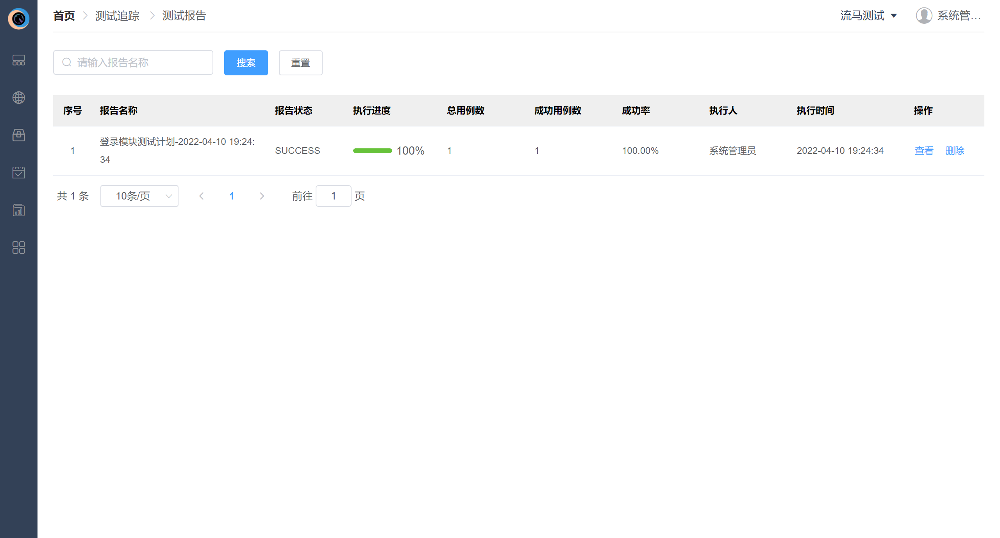

第二步：查看报告详情。如下图所示：
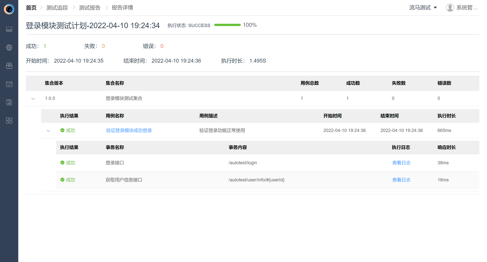