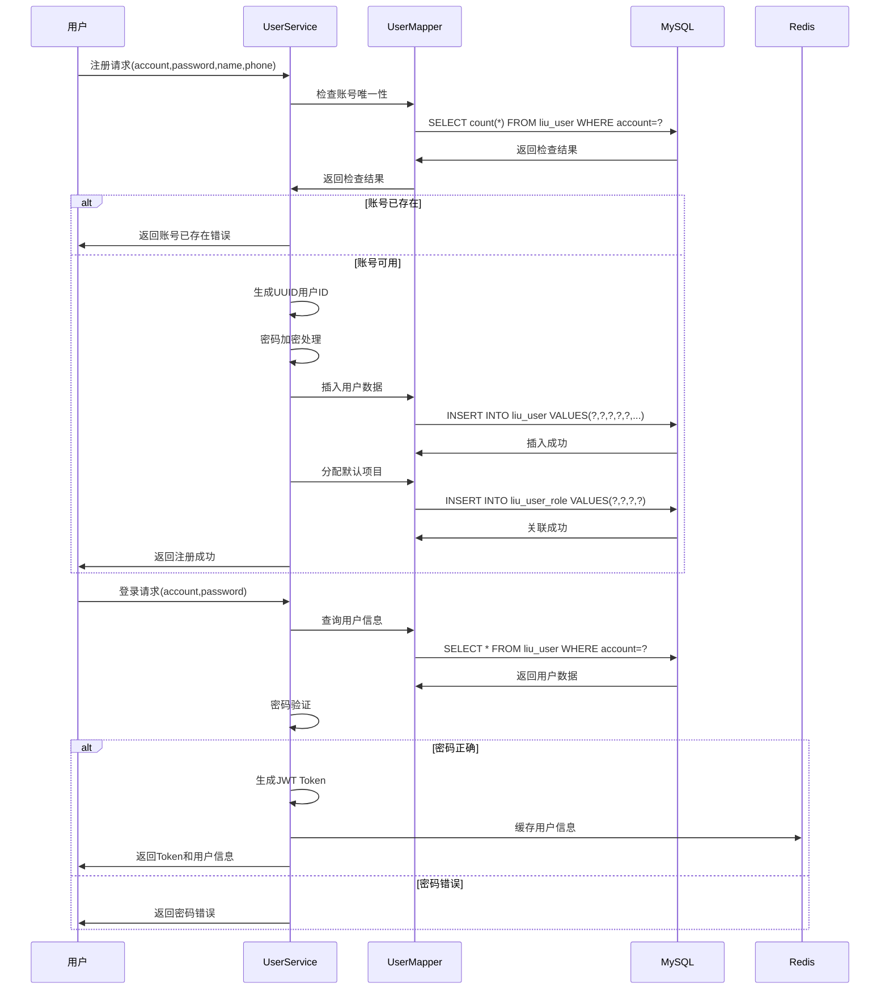
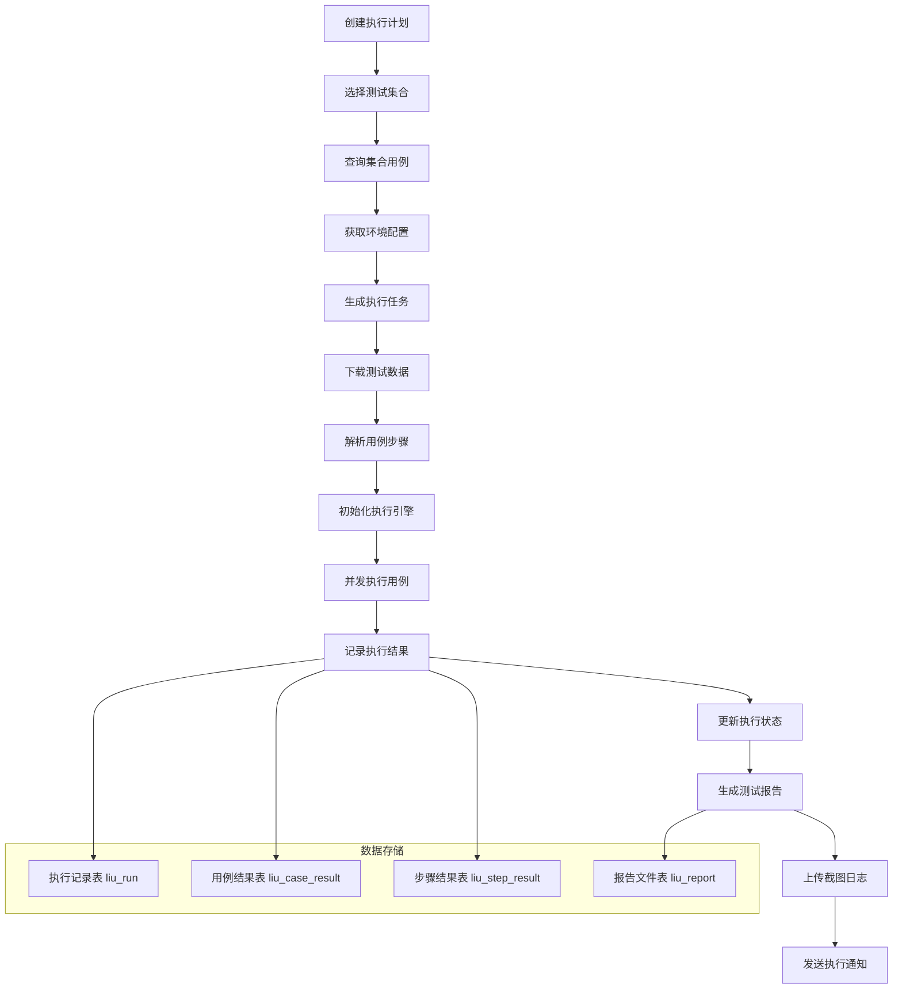
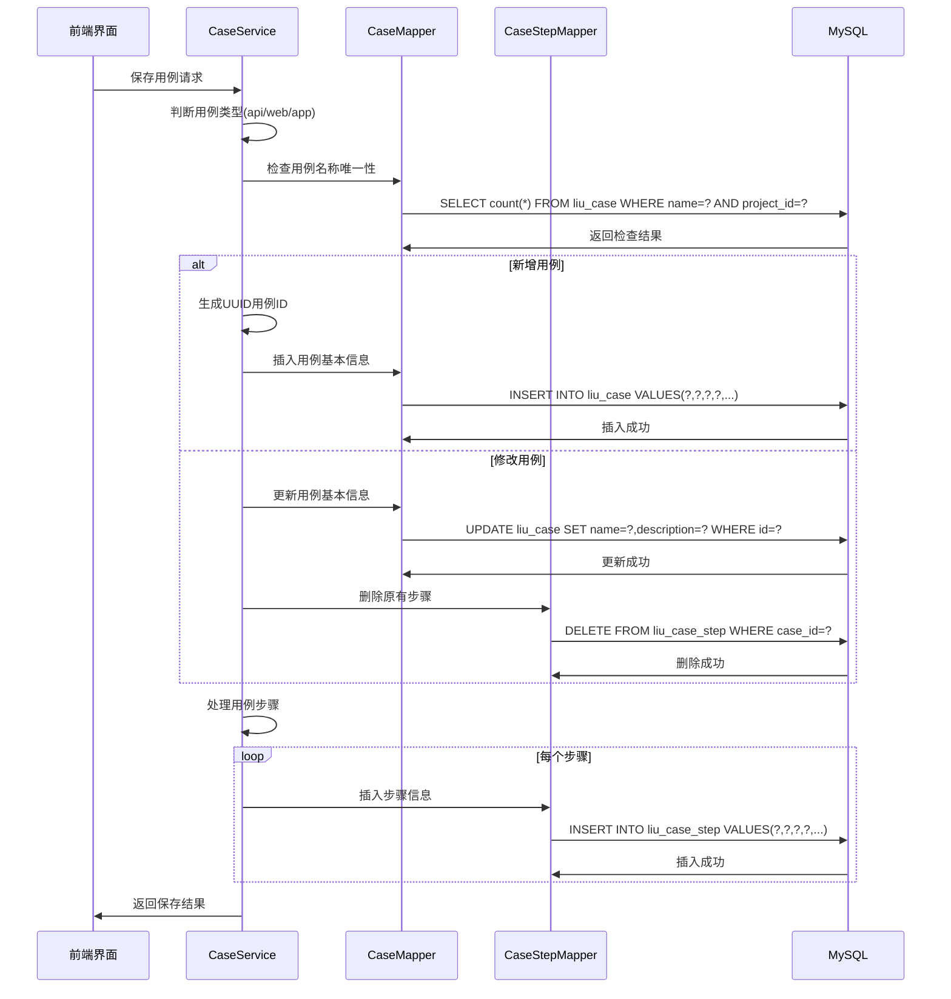

# 测试自动化平台后端 - 数据设计

## 数据模型概述

平台采用关系型数据库MySQL作为核心数据存储，通过MyBatis ORM框架实现对象关系映射。数据模型设计遵循第三范式，确保数据的一致性和完整性，同时针对查询性能进行适当的反范式设计。

## 核心数据实体

### 1. 用户权限相关实体

#### 用户表 (liu_user)
```sql
CREATE TABLE `liu_user` (
  `id` varchar(50) NOT NULL COMMENT '用户ID',
  `account` varchar(50) NOT NULL COMMENT '登录账号',
  `password` varchar(100) NOT NULL COMMENT '登录密码',
  `name` varchar(50) NOT NULL COMMENT '用户姓名',
  `phone` varchar(20) DEFAULT NULL COMMENT '手机号',
  `email` varchar(100) DEFAULT NULL COMMENT '邮箱',
  `status` int(1) NOT NULL DEFAULT '1' COMMENT '状态(0:禁用,1:启用)',
  `create_time` datetime DEFAULT CURRENT_TIMESTAMP COMMENT '创建时间',
  `update_time` datetime DEFAULT CURRENT_TIMESTAMP ON UPDATE CURRENT_TIMESTAMP COMMENT '更新时间',
  PRIMARY KEY (`id`),
  UNIQUE KEY `uk_account` (`account`),
  UNIQUE KEY `uk_phone` (`phone`)
) ENGINE=InnoDB DEFAULT CHARSET=utf8mb4 COMMENT='用户表';
```

**业务逻辑说明：**
- 用户ID采用UUID生成，确保全局唯一性
- 账号和手机号必须唯一，防止重复注册
- 密码采用加密存储，保障安全性
- 支持用户状态管理，可禁用异常用户

#### 角色表 (liu_role)
```sql
CREATE TABLE `liu_role` (
  `id` varchar(50) NOT NULL COMMENT '角色ID',
  `name` varchar(50) NOT NULL COMMENT '角色名称',
  `code` varchar(50) NOT NULL COMMENT '角色编码',
  `description` varchar(200) DEFAULT NULL COMMENT '角色描述',
  `create_time` datetime DEFAULT CURRENT_TIMESTAMP COMMENT '创建时间',
  PRIMARY KEY (`id`),
  UNIQUE KEY `uk_code` (`code`)
) ENGINE=InnoDB DEFAULT CHARSET=utf8mb4 COMMENT='角色表';
```

#### 权限表 (liu_permission)
```sql
CREATE TABLE `liu_permission` (
  `id` varchar(50) NOT NULL COMMENT '权限ID',
  `name` varchar(50) NOT NULL COMMENT '权限名称',
  `code` varchar(50) NOT NULL COMMENT '权限编码',
  `resource` varchar(100) NOT NULL COMMENT '资源路径',
  `method` varchar(10) NOT NULL COMMENT '请求方法',
  `description` varchar(200) DEFAULT NULL COMMENT '权限描述',
  PRIMARY KEY (`id`),
  UNIQUE KEY `uk_code` (`code`)
) ENGINE=InnoDB DEFAULT CHARSET=utf8mb4 COMMENT='权限表';
```

#### 用户角色关联表 (liu_user_role)
```sql
CREATE TABLE `liu_user_role` (
  `id` varchar(50) NOT NULL COMMENT '关联ID',
  `user_id` varchar(50) NOT NULL COMMENT '用户ID',
  `role_id` varchar(50) NOT NULL COMMENT '角色ID',
  `project_id` varchar(50) NOT NULL COMMENT '项目ID',
  PRIMARY KEY (`id`),
  UNIQUE KEY `uk_user_role_project` (`user_id`,`role_id`,`project_id`)
) ENGINE=InnoDB DEFAULT CHARSET=utf8mb4 COMMENT='用户角色关联表';
```

**RBAC权限模型实现：**
- 支持用户在不同项目中拥有不同角色
- 角色与权限多对多关联，实现灵活的权限配置
- 通过用户ID+项目ID确定用户在该项目的权限范围

### 2. 项目管理相关实体

#### 项目表 (liu_project)
```sql
CREATE TABLE `liu_project` (
  `id` varchar(50) NOT NULL COMMENT '项目ID',
  `name` varchar(100) NOT NULL COMMENT '项目名称',
  `code` varchar(50) NOT NULL COMMENT '项目编码',
  `description` varchar(500) DEFAULT NULL COMMENT '项目描述',
  `create_user` varchar(50) NOT NULL COMMENT '创建人',
  `create_time` datetime DEFAULT CURRENT_TIMESTAMP COMMENT '创建时间',
  PRIMARY KEY (`id`),
  UNIQUE KEY `uk_code` (`code`)
) ENGINE=InnoDB DEFAULT CHARSET=utf8mb4 COMMENT='项目表';
```

#### 环境表 (liu_environment)
```sql
CREATE TABLE `liu_environment` (
  `id` varchar(50) NOT NULL COMMENT '环境ID',
  `project_id` varchar(50) NOT NULL COMMENT '项目ID',
  `name` varchar(100) NOT NULL COMMENT '环境名称',
  `type` varchar(20) NOT NULL COMMENT '环境类型(dev/test/staging/prod)',
  `config` text COMMENT '环境配置JSON',
  `create_time` datetime DEFAULT CURRENT_TIMESTAMP COMMENT '创建时间',
  PRIMARY KEY (`id`),
  KEY `idx_project_id` (`project_id`)
) ENGINE=InnoDB DEFAULT CHARSET=utf8mb4 COMMENT='测试环境表';
```

**环境配置说明：**
- 支持项目级环境隔离，不同项目环境独立配置
- 环境配置采用JSON格式存储，包含URL、数据库连接等信息
- 支持开发、测试、预发布、生产等多种环境类型

### 3. 测试用例相关实体

#### 测试用例表 (liu_case)
```sql
CREATE TABLE `liu_case` (
  `id` varchar(50) NOT NULL COMMENT '用例ID',
  `project_id` varchar(50) NOT NULL COMMENT '项目ID',
  `collection_id` varchar(50) DEFAULT NULL COMMENT '集合ID',
  `name` varchar(200) NOT NULL COMMENT '用例名称',
  `type` varchar(20) NOT NULL COMMENT '用例类型(api/web/app)',
  `description` varchar(500) DEFAULT NULL COMMENT '用例描述',
  `priority` int(1) DEFAULT '3' COMMENT '优先级(1:高,2:中,3:低)',
  `status` int(1) DEFAULT '1' COMMENT '状态(0:禁用,1:启用)',
  `create_user` varchar(50) NOT NULL COMMENT '创建人',
  `create_time` datetime DEFAULT CURRENT_TIMESTAMP COMMENT '创建时间',
  `update_time` datetime DEFAULT CURRENT_TIMESTAMP ON UPDATE CURRENT_TIMESTAMP COMMENT '更新时间',
  PRIMARY KEY (`id`),
  KEY `idx_project_id` (`project_id`),
  KEY `idx_collection_id` (`collection_id`)
) ENGINE=InnoDB DEFAULT CHARSET=utf8mb4 COMMENT='测试用例表';
```

#### 用例步骤表 (liu_case_step)
```sql
CREATE TABLE `liu_case_step` (
  `id` varchar(50) NOT NULL COMMENT '步骤ID',
  `case_id` varchar(50) NOT NULL COMMENT '用例ID',
  `step_order` int(3) NOT NULL COMMENT '步骤序号',
  `name` varchar(200) NOT NULL COMMENT '步骤名称',
  `action` varchar(50) NOT NULL COMMENT '操作类型',
  `target` varchar(500) DEFAULT NULL COMMENT '操作目标',
  `value` text COMMENT '输入值',
  `description` varchar(500) DEFAULT NULL COMMENT '步骤描述',
  PRIMARY KEY (`id`),
  KEY `idx_case_id` (`case_id`),
  KEY `idx_step_order` (`case_id`,`step_order`)
) ENGINE=InnoDB DEFAULT CHARSET=utf8mb4 COMMENT='用例步骤表';
```

**用例步骤设计特点：**
- 支持多步骤顺序执行，通过step_order控制执行顺序
- 不同用例类型(api/web/app)对应不同的action操作集
- 支持参数化输入，value字段可存储变量表达式

#### 用例断言表 (liu_case_assertion)
```sql
CREATE TABLE `liu_case_assertion` (
  `id` varchar(50) NOT NULL COMMENT '断言ID',
  `case_id` varchar(50) NOT NULL COMMENT '用例ID',
  `step_id` varchar(50) DEFAULT NULL COMMENT '步骤ID',
  `assert_type` varchar(50) NOT NULL COMMENT '断言类型',
  `target` varchar(500) NOT NULL COMMENT '断言目标',
  `operator` varchar(20) NOT NULL COMMENT '操作符',
  `expected_value` text COMMENT '期望值',
  `description` varchar(500) DEFAULT NULL COMMENT '断言描述',
  PRIMARY KEY (`id`),
  KEY `idx_case_id` (`case_id`)
) ENGINE=InnoDB DEFAULT CHARSET=utf8mb4 COMMENT='用例断言表';
```

### 4. 测试执行相关实体

#### 测试计划表 (liu_plan)
```sql
CREATE TABLE `liu_plan` (
  `id` varchar(50) NOT NULL COMMENT '计划ID',
  `project_id` varchar(50) NOT NULL COMMENT '项目ID',
  `environment_id` varchar(50) NOT NULL COMMENT '环境ID',
  `name` varchar(200) NOT NULL COMMENT '计划名称',
  `description` varchar(500) DEFAULT NULL COMMENT '计划描述',
  `cron` varchar(100) DEFAULT NULL COMMENT 'Cron表达式',
  `next_time` datetime DEFAULT NULL COMMENT '下次执行时间',
  `status` int(1) DEFAULT '1' COMMENT '状态(0:禁用,1:启用)',
  `create_user` varchar(50) NOT NULL COMMENT '创建人',
  `create_time` datetime DEFAULT CURRENT_TIMESTAMP COMMENT '创建时间',
  PRIMARY KEY (`id`),
  KEY `idx_project_id` (`project_id`)
) ENGINE=InnoDB DEFAULT CHARSET=utf8mb4 COMMENT='测试计划表';
```

#### 计划集合关联表 (liu_plan_collection)
```sql
CREATE TABLE `liu_plan_collection` (
  `id` varchar(50) NOT NULL COMMENT '关联ID',
  `plan_id` varchar(50) NOT NULL COMMENT '计划ID',
  `collection_id` varchar(50) NOT NULL COMMENT '集合ID',
  `execute_order` int(3) DEFAULT '1' COMMENT '执行顺序',
  PRIMARY KEY (`id`),
  UNIQUE KEY `uk_plan_collection` (`plan_id`,`collection_id`)
) ENGINE=InnoDB DEFAULT CHARSET=utf8mb4 COMMENT='计划集合关联表';
```

#### 测试执行记录表 (liu_run)
```sql
CREATE TABLE `liu_run` (
  `id` varchar(50) NOT NULL COMMENT '执行ID',
  `plan_id` varchar(50) DEFAULT NULL COMMENT '计划ID',
  `project_id` varchar(50) NOT NULL COMMENT '项目ID',
  `environment_id` varchar(50) NOT NULL COMMENT '环境ID',
  `name` varchar(200) NOT NULL COMMENT '执行名称',
  `status` varchar(20) NOT NULL COMMENT '执行状态',
  `start_time` datetime DEFAULT NULL COMMENT '开始时间',
  `end_time` datetime DEFAULT NULL COMMENT '结束时间',
  `total_case` int(10) DEFAULT '0' COMMENT '总用例数',
  `pass_case` int(10) DEFAULT '0' COMMENT '通过用例数',
  `fail_case` int(10) DEFAULT '0' COMMENT '失败用例数',
  `create_user` varchar(50) NOT NULL COMMENT '创建人',
  `create_time` datetime DEFAULT CURRENT_TIMESTAMP COMMENT '创建时间',
  PRIMARY KEY (`id`),
  KEY `idx_plan_id` (`plan_id`),
  KEY `idx_project_id` (`project_id`)
) ENGINE=InnoDB DEFAULT CHARSET=utf8mb4 COMMENT='测试执行记录表';
```

#### 用例执行结果表 (liu_case_result)
```sql
CREATE TABLE `liu_case_result` (
  `id` varchar(50) NOT NULL COMMENT '结果ID',
  `run_id` varchar(50) NOT NULL COMMENT '执行ID',
  `case_id` varchar(50) NOT NULL COMMENT '用例ID',
  `status` varchar(20) NOT NULL COMMENT '执行状态',
  `start_time` datetime DEFAULT NULL COMMENT '开始时间',
  `end_time` datetime DEFAULT NULL COMMENT '结束时间',
  `duration` int(10) DEFAULT '0' COMMENT '执行耗时(毫秒)',
  `error_message` text COMMENT '错误信息',
  `screenshot` varchar(500) DEFAULT NULL COMMENT '截图URL',
  PRIMARY KEY (`id`),
  KEY `idx_run_id` (`run_id`),
  KEY `idx_case_id` (`case_id`)
) ENGINE=InnoDB DEFAULT CHARSET=utf8mb4 COMMENT='用例执行结果表';
```

### 5. 资源管理相关实体

#### 元素表 (liu_element)
```sql
CREATE TABLE `liu_element` (
  `id` varchar(50) NOT NULL COMMENT '元素ID',
  `project_id` varchar(50) NOT NULL COMMENT '项目ID',
  `name` varchar(200) NOT NULL COMMENT '元素名称',
  `type` varchar(50) NOT NULL COMMENT '元素类型',
  `selector` varchar(500) NOT NULL COMMENT '选择器',
  `description` varchar(500) DEFAULT NULL COMMENT '元素描述',
  `create_user` varchar(50) NOT NULL COMMENT '创建人',
  `create_time` datetime DEFAULT CURRENT_TIMESTAMP COMMENT '创建时间',
  PRIMARY KEY (`id`),
  KEY `idx_project_id` (`project_id`)
) ENGINE=InnoDB DEFAULT CHARSET=utf8mb4 COMMENT='页面元素表';
```

#### 控件表 (liu_control)
```sql
CREATE TABLE `liu_control` (
  `id` varchar(50) NOT NULL COMMENT '控件ID',
  `project_id` varchar(50) NOT NULL COMMENT '项目ID',
  `name` varchar(200) NOT NULL COMMENT '控件名称',
  `type` varchar(50) NOT NULL COMMENT '控件类型',
  `platform` varchar(50) NOT NULL COMMENT '平台类型(android/ios)',
  `selector` varchar(500) NOT NULL COMMENT '选择器',
  `description` varchar(500) DEFAULT NULL COMMENT '控件描述',
  `create_user` varchar(50) NOT NULL COMMENT '创建人',
  `create_time` datetime DEFAULT CURRENT_TIMESTAMP COMMENT '创建时间',
  PRIMARY KEY (`id`),
  KEY `idx_project_id` (`project_id`)
) ENGINE=InnoDB DEFAULT CHARSET=utf8mb4 COMMENT='移动端控件表';
```

## 数据流转过程

### 1. 用户注册登录数据流



### 2. 测试执行数据流



### 3. 用例管理数据流



## 存储方案

### 1. 数据库存储策略

**主从分离架构**
```
主库(Master) -> 从库(Slave1)
     |         -> 从库(Slave2)
     |         -> 从库(Slave3)
```
- 主库负责：写操作(INSERT/UPDATE/DELETE)
- 从库负责：读操作(SELECT)
- 通过MySQL主从复制实现数据同步

**分库分表策略**
```
用户库(user_db) -> 用户相关表
项目库(project_db) -> 项目相关表  
测试库(test_db) -> 测试相关表
日志库(log_db) -> 日志相关表
```
- 按业务模块进行数据库拆分
- 减少单库压力，提高并发能力
- 支持业务模块独立扩展

### 2. 缓存存储方案

**Redis缓存架构**
```
缓存层：
├── 用户会话缓存 (user:session:{userId})
├── 权限数据缓存 (permission:{userId}:{projectId})
├── 项目配置缓存 (project:config:{projectId})
├── 环境配置缓存 (environment:{envId})
└── 热点数据缓存 (hot:data:{key})
```

**缓存更新策略**
- 写操作：更新数据库 + 删除缓存
- 读操作：查询缓存 -> 缓存未命中 -> 查询数据库 -> 写入缓存
- 过期时间：根据数据特性设置不同TTL

### 3. 文件存储方案

**OSS对象存储**
```
存储结构：
liu-test-platform/
├── reports/          # 测试报告
│   ├── {projectId}/
│   │   └── {runId}/
│   │       ├── report.html
│   │       └── data.json
├── screenshots/      # 测试截图
│   ├── {projectId}/
│   │   └── {caseResultId}/
│   │       ├── step1.png
│   │       └── step2.png
└── logs/            # 执行日志
    └── {projectId}/
        └── {runId}.log
```

**CDN加速配置**
- 静态资源通过CDN分发
- 减少服务器带宽压力
- 提高用户访问速度

### 4. 数据备份策略

**定期备份机制**
```
全量备份：每天凌晨2点执行
增量备份：每4小时执行一次
日志备份：实时备份到异地
```

**备份存储策略**
- 本地备份：保留7天
- 异地备份：保留30天
- 云端备份：保留90天
- 支持按时间点恢复数据

### 5. 数据安全方案

**数据加密**
```
传输加密：HTTPS/TLS 1.3
存储加密：
├── 用户密码：BCrypt加密
├── 敏感信息：AES256加密
└── 数据库连接：SSL加密
```

**访问控制**
- 数据库访问：IP白名单 + 账号权限控制
- 缓存访问：密码认证 + 网络隔离
- 文件存储：STS临时凭证 + 权限控制