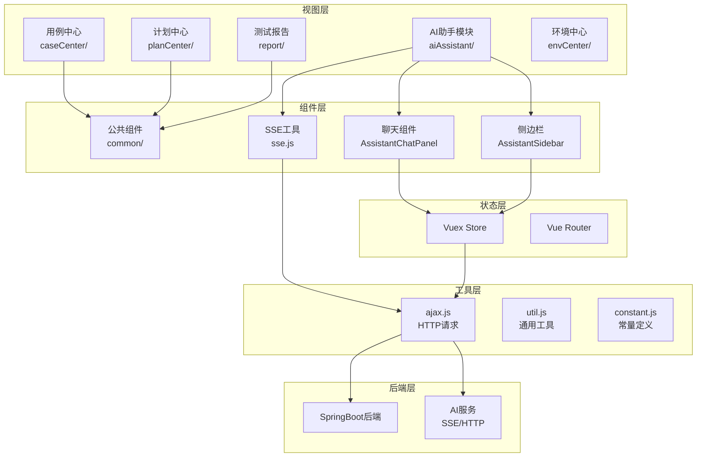
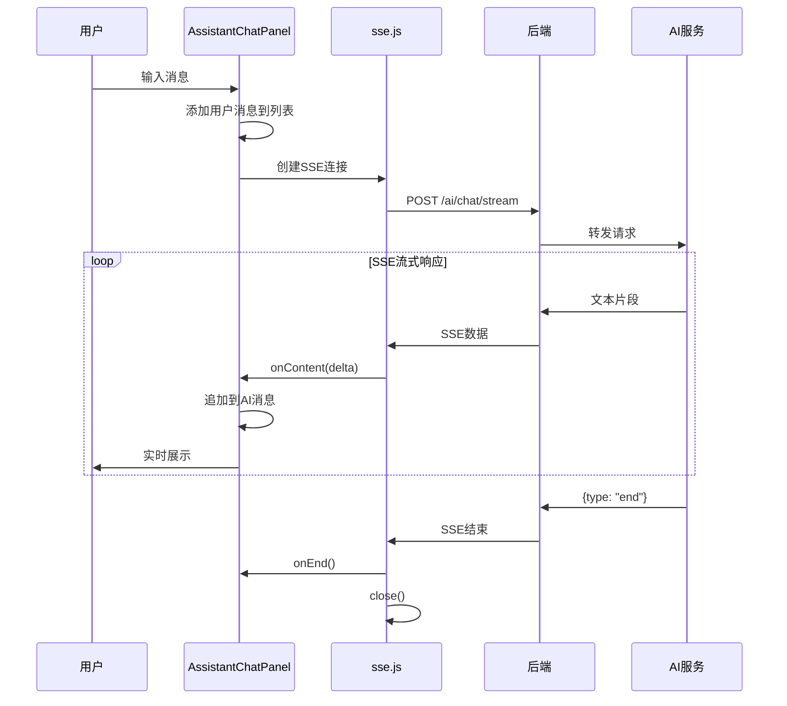
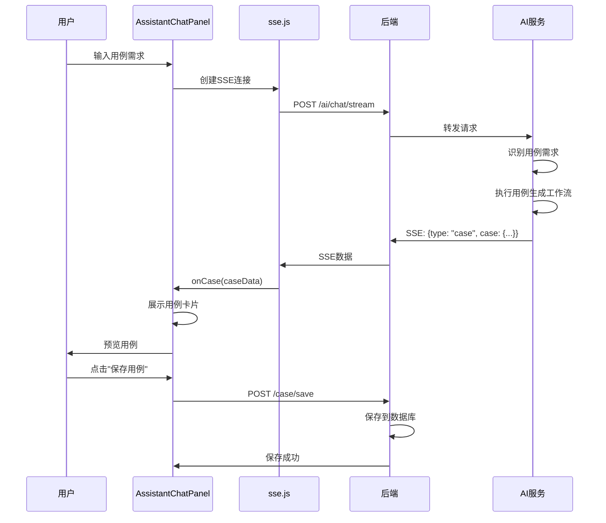
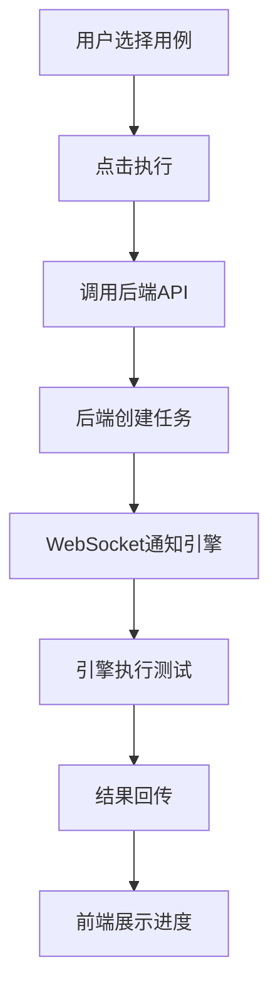

# 测试平台 - 前端应用

Vue 2 + Element UI 构建的前端应用，为AI智能接口测试平台提供可视化操作界面。

## 一、项目概述

### 1.1 定位

前端应用是AI智能接口测试平台的可视化操作界面，采用 Vue 2 + Element UI 构建，提供：

- **AI智能助手**：智能对话、知识库管理、用例智能生成
- **用例管理**：API用例可视化编辑
- **计划管理**：测试计划配置、定时任务
- **测试报告**：执行结果查看、详情分析

### 1.2 核心特性

| 特性 | 说明 |
|------|------|
| **低代码设计** | 可视化配置，降低使用门槛 |
| **AI助手集成** | 智能对话、知识库、用例生成 |
| **SSE流式响应** | AI对话实时流式展示 |
| **组件化开发** | 基于 Element UI 的业务组件封装 |
| **响应式布局** | 适配不同屏幕尺寸 |
| **实时通信** | WebSocket 实时查看执行进度 |

### 1.3 技术架构



### 1.4 技术栈

| 技术 | 版本 | 说明 |
|------|------|------|
| Vue | 2.7.16 | 渐进式前端框架 |
| Vue Router | 3.6.5 | 路由管理 |
| Vuex | 3.6.2 | 状态管理 |
| Element UI | 2.15.13 | UI组件库 |
| Vite | 4.5.0 | 构建工具 |
| Axios | 1.6.2 | HTTP请求 |
| ECharts | 5.4.3 | 图表可视化 |
| Sass | 1.69.5 | CSS预处理 |

---

## 二、项目结构

```
platform-frontend/
├── src/
│   ├── main.js                 # 入口文件
│   ├── App.vue                 # 根组件
│   ├── router/
│   │   └── index.js            # 路由配置
│   ├── vuex/
│   │   └── store.js            # 状态管理
│   ├── utils/
│   │   ├── ajax.js             # HTTP请求封装
│   │   ├── base64.js           # Base64工具
│   │   ├── constant.js         # 常量定义
│   │   ├── jsonpath.js         # JSONPath工具
│   │   └── util.js             # 通用工具
│   └── views/                  # 页面视图
│       ├── caseCenter/         # 用例中心
│       │   ├── caseManage.vue  # 用例列表
│       │   ├── apiCaseEdit.vue # API用例编辑
│       │   ├── interfaceManage.vue # 接口管理
│       │   └── common/         # 公共组件
│       │       ├── requestBody.vue
│       │       ├── requestHeader.vue
│       │       └── assertion.vue
│       ├── aiAssistant/        # AI助手模块
│       │   ├── index.vue       # 主页面
│       │   ├── components/
│       │   │   ├── AssistantChatPanel.vue  # 聊天面板
│       │   │   └── AssistantSidebar.vue    # 侧边栏
│       │   └── utils/
│       │       └── sse.js      # SSE工具
│       ├── planCenter/         # 计划中心
│       │   ├── testPlan.vue
│       │   ├── testCollection.vue
│       │   └── planEdit.vue
│       ├── report/             # 测试报告
│       │   ├── testReport.vue
│       │   └── reportDetail.vue
│       ├── envCenter/          # 环境中心
│       │   ├── envManage.vue
│       │   └── engineManage.vue
│       ├── system/             # 系统管理
│       ├── common/             # 公共组件
│       ├── login.vue           # 登录页
│       └── index.vue           # 首页
├── static/                     # 静态资源
├── index.html                  # HTML模板
├── vite.config.js              # Vite配置
└── package.json                # 依赖配置
```

---

## 三、核心模块说明

### 3.1 AI助手模块 (aiAssistant/)

AI助手模块提供智能对话、知识库管理、用例生成功能。

#### 3.1.1 主页面 (index.vue)

| 功能 | 说明 |
|------|------|
| 布局管理 | 左侧边栏 + 右侧聊天面板 |
| 状态管理 | 管理当前会话、消息列表 |
| 事件处理 | 处理发送消息、接收响应 |

#### 3.1.2 聊天面板 (AssistantChatPanel.vue)

| 功能 | 说明 |
|------|------|
| 消息展示 | 用户消息、AI回复、用例卡片 |
| 输入框 | 支持多行输入、快捷发送 |
| 流式展示 | 实时展示AI回复内容 |
| 用例预览 | 展示生成的测试用例 |

#### 3.1.3 侧边栏 (AssistantSidebar.vue)

| 功能 | 说明 |
|------|------|
| 知识库管理 | 文档列表、上传、删除 |
| 会话历史 | 历史对话记录 |
| 快捷操作 | 新建对话、清空历史 |

#### 3.1.4 SSE工具 (sse.js)

封装SSE（Server-Sent Events）请求处理：

```javascript
// sse.js 核心功能
export class SSEClient {
    constructor(url, options = {}) {
        this.url = url;
        this.options = options;
        this.eventSource = null;
    }

    connect() {
        this.eventSource = new EventSource(this.url);
        
        // 处理消息
        this.eventSource.onmessage = (event) => {
            const data = JSON.parse(event.data);
            this.handleMessage(data);
        };
        
        // 处理错误
        this.eventSource.onerror = (error) => {
            this.handleError(error);
        };
    }

    // 处理不同类型的消息
    handleMessage(data) {
        switch(data.type) {
            case 'content':
                // 文本内容片段
                this.onContent && this.onContent(data.delta);
                break;
            case 'case':
                // 生成的用例
                this.onCase && this.onCase(data.case);
                break;
            case 'error':
                // 错误信息
                this.onError && this.onError(data.message);
                break;
            case 'end':
                // 流结束
                this.onEnd && this.onEnd();
                this.close();
                break;
        }
    }

    close() {
        if (this.eventSource) {
            this.eventSource.close();
        }
    }
}
```

### 3.2 用例中心 (caseCenter/)

| 页面 | 功能 |
|------|------|
| caseManage.vue | 用例列表管理 |
| apiCaseEdit.vue | API用例可视化编辑 |
| interfaceManage.vue | 接口管理 |

**核心组件：**
- `requestBody.vue` - 请求体配置
- `requestHeader.vue` - 请求头配置
- `assertion.vue` - 断言配置

### 3.3 计划中心 (planCenter/)

| 页面 | 功能 |
|------|------|
| testPlan.vue | 测试计划列表 |
| testCollection.vue | 测试集合管理 |
| planEdit.vue | 计划编辑、Cron表达式配置 |

### 3.4 测试报告 (report/)

| 页面 | 功能 |
|------|------|
| testReport.vue | 报告列表 |
| reportDetail.vue | 报告详情、步骤展示 |

---

## 四、核心流程

### 4.1 AI对话流程



### 4.2 用例生成流程



### 4.3 测试执行流程



---

## 五、HTTP请求封装

### 5.1 ajax.js

```javascript
import axios from 'axios';
import { Message } from 'element-ui';

const service = axios.create({
    baseURL: process.env.VUE_APP_BASE_API,
    timeout: 30000
});

// 请求拦截器
service.interceptors.request.use(
    config => {
        const token = localStorage.getItem('token');
        if (token) {
            config.headers['Authorization'] = 'Bearer ' + token;
        }
        return config;
    },
    error => Promise.reject(error)
);

// 响应拦截器
service.interceptors.response.use(
    response => response.data,
    error => {
        Message.error(error.message);
        return Promise.reject(error);
    }
);

export default service;
```

### 5.2 AI相关API

```javascript
// AI服务API封装
export const aiApi = {
    // SSE流式对话
    chatStream(data, onMessage, onError, onEnd) {
        const client = new SSEClient('/autotest/ai/chat/stream', {
            method: 'POST',
            body: JSON.stringify(data),
            headers: {
                'Content-Type': 'application/json',
                'Authorization': 'Bearer ' + localStorage.getItem('token')
            }
        });
        
        client.onContent = onMessage;
        client.onError = onError;
        client.onEnd = onEnd;
        
        client.connect();
        return client;
    },

    // 获取知识库列表
    getKnowledgeList(projectId) {
        return request.get('/autotest/ai/knowledge', { params: { projectId } });
    },

    // 保存知识库
    saveKnowledge(data) {
        return request.post('/autotest/ai/knowledge', data);
    },

    // 删除知识库
    deleteKnowledge(id, projectId) {
        return request.delete(`/autotest/ai/knowledge/${id}`, { params: { projectId } });
    },

    // 索引知识库
    indexKnowledge(id, projectId) {
        return request.post(`/autotest/ai/knowledge/index/${id}`, null, { params: { projectId } });
    },

    // 获取Agent接口列表
    getAgentApiList(projectId) {
        return request.get(`/autotest/ai/agent/api-list/${projectId}`);
    }
};
```

---

## 六、状态管理

### 6.1 Vuex Store

```javascript
// vuex/store.js
export default new Vuex.Store({
    state: {
        user: {},
        project: {},
        token: '',
        permissions: [],
        // AI助手相关状态
        aiSession: {
            messages: [],
            currentConversation: null,
            knowledgeList: []
        }
    },
    mutations: {
        SET_USER(state, user) {
            state.user = user;
        },
        SET_TOKEN(state, token) {
            state.token = token;
            localStorage.setItem('token', token);
        },
        ADD_AI_MESSAGE(state, message) {
            state.aiSession.messages.push(message);
        },
        SET_AI_CONVERSATION(state, conversation) {
            state.aiSession.currentConversation = conversation;
        }
    },
    actions: {
        login({ commit }, userInfo) {
            // 登录逻辑
        },
        sendAiMessage({ commit }, message) {
            commit('ADD_AI_MESSAGE', message);
        }
    }
});
```

---

## 七、路由配置

### 7.1 路由守卫

```javascript
// router/index.js
router.beforeEach((to, from, next) => {
    const token = localStorage.getItem('token');
    if (to.path === '/login') {
        next();
    } else {
        if (token) {
            next();
        } else {
            next('/login');
        }
    }
});
```

### 7.2 AI助手路由

```javascript
{
    path: '/ai-assistant',
    component: Layout,
    children: [{
        path: '',
        name: 'AIAssistant',
        component: () => import('@/views/aiAssistant/index'),
        meta: { title: 'AI助手', icon: 'ai' }
    }]
}
```

---

## 八、启动服务

```bash
cd platform-frontend

# 安装依赖
npm install

# 启动开发服务
npm run dev

# 生产构建
npm run build
```

---

## 九、核心亮点

### 9.1 AI助手集成

- **SSE流式展示**：实时展示AI回复，提升用户体验
- **用例卡片**：可视化展示生成的测试用例
- **知识库管理**：文档上传、索引状态实时展示

### 9.2 组件化开发

- **业务组件封装**：requestBody、assertion等组件复用
- **公共组件**：统一的消息提示、加载状态

### 9.3 状态管理

- **Vuex集中管理**：用户、项目、AI会话状态统一管理
- **本地持久化**：Token、用户偏好本地存储

---

## 十、二开指南

### 10.1 新增页面步骤

1. 在 `views/` 下创建页面目录和组件
2. 在 `router/index.js` 中配置路由
3. 在左侧导航配置中注册菜单

### 10.2 新增组件步骤

1. 在对应模块的 `common/` 目录下创建组件
2. 在页面中 import 并注册使用
3. 如需全局注册，在 `main.js` 中全局注册

### 10.3 API调用示例

```javascript
// 在组件中调用API
import { aiApi } from '@/api/ai';

export default {
    methods: {
        async sendMessage() {
            const client = aiApi.chatStream(
                {
                    projectId: this.projectId,
                    message: this.inputMessage,
                    messages: this.historyMessages
                },
                (delta) => {
                    // 处理文本片段
                    this.currentMessage += delta;
                },
                (error) => {
                    // 处理错误
                    this.$message.error(error);
                },
                () => {
                    // 流结束
                    this.loading = false;
                }
            );
        }
    }
}
```

---

## 十一、依赖说明

核心依赖：
- `vue` - 前端框架
- `vue-router` - 路由管理
- `vuex` - 状态管理
- `element-ui` - UI组件库
- `axios` - HTTP请求
- `echarts` - 图表可视化
- `sass` - CSS预处理
