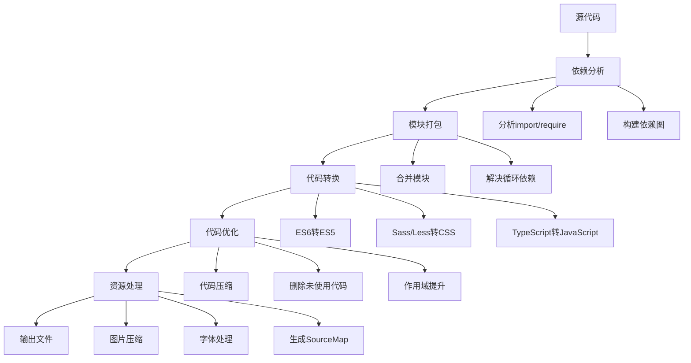

# 前端工程化与构建工具

## 什么是前端工程化？

前端工程化是指将软件工程的原理和方法应用到前端开发中，通过工具化、自动化、规范化的手段，提高开发效率、代码质量和项目可维护性。

**英文原意**：Frontend Engineering
**中文理解**：把前端开发从"手工作坊"变成"现代化工厂"

**生活类比**：就像从手工制作面包变成工业化生产面包，需要标准化流程、专业工具和质量控制。

## 前端工程化的发展历程

| 时期 | 特点 | 工具 | 类比 |
|------|------|------|------|
| **石器时代** (2005年前) | 纯HTML+CSS+JS | 记事本、Dreamweaver | 手工制作 |
| **青铜时代** (2005-2010) | jQuery时代 | jQuery、YUI | 简单工具 |
| **铁器时代** (2010-2015) | 模块化、预处理器 | RequireJS、Sass/Less | 电动工具 |
| **工业时代** (2015-2020) | 组件化、自动化 | Webpack、Vue/React | 流水线 |
| **智能时代** (2020至今) | 智能化、云开发 | Vite、ESBuild | 智能制造 |

## 核心概念详解

### 1. 模块化开发（Modular Development）

**英文原意**：模块化开发
**技术含义**：将复杂的代码拆分成独立、可复用的模块

**生活类比**：就像乐高积木，每个积木块都是独立的模块，可以组合成复杂的作品。

#### 模块化规范

```javascript
// 1. CommonJS规范（Node.js使用）
// math.js
function add(a, b) {
  return a + b;
}

function multiply(a, b) {
  return a * b;
}

module.exports = {
  add,
  multiply
};

// main.js
const { add, multiply } = require('./math');
console.log(add(2, 3)); // 5

// 2. ES6模块规范（现代浏览器支持）
// math.js
export function add(a, b) {
  return a + b;
}

export function multiply(a, b) {
  return a * b;
}

// main.js
import { add, multiply } from './math.js';
console.log(add(2, 3)); // 5

// 3. AMD规范（RequireJS使用，已过时）
// math.js
define(function() {
  return {
    add: function(a, b) {
      return a + b;
    },
    multiply: function(a, b) {
      return a * b;
    }
  };
});

// main.js
require(['math'], function(math) {
  console.log(math.add(2, 3)); // 5
});
```

### 2. 包管理（Package Management）

**英文原意**：包管理
**技术含义**：管理项目依赖的第三方库和工具

**生活类比**：就像超市的货架管理系统，需要知道每种商品的库存、版本和依赖关系。

#### npm包管理器

```json
// package.json - 项目配置文件
{
  "name": "liuma-frontend",
  "version": "1.4.1",
  "description": "liuma frontend",
  "main": "index.js",
  "scripts": {
    "dev": "webpack-dev-server --inline --progress --config build/webpack.dev.conf.js",
    "start": "npm run dev",
    "build": "node build/build.js"
  },
  "dependencies": {
    "vue": "^2.6.14",
    "element-ui": "^2.15.13",
    "jquery": "^3.6.0"
  },
  "devDependencies": {
    "webpack": "^4.46.0",
    "babel-core": "^6.26.3",
    "eslint": "^7.32.0"
  }
}
```

#### 常用npm命令

```bash
# 安装依赖
npm install                    # 安装所有依赖
npm install vue                # 安装生产依赖
npm install -D webpack         # 安装开发依赖

# 版本管理
npm update                     # 更新依赖
npm outdated                   # 检查过时的依赖
npm audit                      # 安全审计

# 脚本执行
npm run dev                    # 运行开发服务器
npm run build                  # 构建生产版本
npm run test                   # 运行测试
```

### 3. 代码规范（Code Standards）

**英文原意**：代码规范
**技术含义**：统一代码风格和质量标准

**生活类比**：就像交通法规，让所有人按照统一规则行驶，避免混乱。

#### ESLint代码检查

```javascript
// .eslintrc.js - ESLint配置文件
module.exports = {
  root: true,
  parserOptions: {
    parser: 'babel-eslint',
    ecmaVersion: 2018,
    sourceType: 'module'
  },
  env: {
    browser: true,
    node: true,
    es6: true
  },
  extends: [
    'plugin:vue/essential',
    'eslint:recommended'
  ],
  rules: {
    // 自定义规则
    'indent': ['error', 2],                    // 缩进2个空格
    'quotes': ['error', 'single'],             // 使用单引号
    'semi': ['error', 'never'],                // 不使用分号
    'no-console': process.env.NODE_ENV === 'production' ? 'warn' : 'off',
    'no-debugger': process.env.NODE_ENV === 'production' ? 'warn' : 'off'
  }
}
```

#### Prettier代码格式化

```javascript
// .prettierrc.js - Prettier配置文件
module.exports = {
  printWidth: 80,              // 每行最大长度
  tabWidth: 2,                 // 缩进宽度
  useTabs: false,              // 使用空格而不是制表符
  semi: false,                 // 不使用分号
  singleQuote: true,           // 使用单引号
  quoteProps: 'as-needed',     // 对象属性引号
  trailingComma: 'none',       // 尾随逗号
  bracketSpacing: true,        // 对象括号空格
  jsxBracketSameLine: false,   // JSX括号换行
  arrowParens: 'avoid',        // 箭头函数参数括号
  endOfLine: 'lf'              // 换行符
}
```

### 4. 构建工具（Build Tools）

**英文原意**：构建工具
**技术含义**：将源代码转换成可部署的生产代码

**生活类比**：就像工厂的生产线，把原材料（源代码）加工成成品（可部署代码）。

#### 构建过程详解



## 主流构建工具对比

| 工具 | 发布时间 | 特点 | 适用场景 | 学习曲线 |
|------|----------|------|----------|----------|
| **Webpack** | 2012年 | 功能强大、配置灵活 | 大型复杂项目 | ⭐⭐⭐⭐ |
| **Vite** | 2020年 | 快速启动、即时热更新 | 现代项目、开发体验优先 | ⭐⭐ |
| **Rollup** | 2015年 | 输出代码质量高、Tree Shaking好 | 库开发、小型项目 | ⭐⭐ |
| **Parcel** | 2017年 | 零配置、自动优化 | 快速原型、小型项目 | ⭐ |
| **ESBuild** | 2020年 | 极速构建、Go语言编写 | 追求构建速度 | ⭐⭐ |

### Webpack详解

#### 核心概念

```javascript
// webpack.config.js - Webpack配置文件
const path = require('path')
const HtmlWebpackPlugin = require('html-webpack-plugin')
const { CleanWebpackPlugin } = require('clean-webpack-plugin')

module.exports = {
  // 入口配置
  entry: {
    app: './src/main.js',
    vendor: ['vue', 'element-ui']  // 第三方库单独打包
  },
  
  // 输出配置
  output: {
    path: path.resolve(__dirname, 'dist'),
    filename: '[name].[contenthash].js',  // 使用内容哈希
    publicPath: '/'
  },
  
  // 模块配置
  module: {
    rules: [
      // JavaScript处理
      {
        test: /\.js$/,
        exclude: /node_modules/,
        use: {
          loader: 'babel-loader',
          options: {
            presets: ['@babel/preset-env']
          }
        }
      },
      
      // Vue文件处理
      {
        test: /\.vue$/,
        loader: 'vue-loader'
      },
      
      // CSS处理
      {
        test: /\.css$/,
        use: ['style-loader', 'css-loader']
      },
      
      // SCSS处理
      {
        test: /\.scss$/,
        use: [
          'style-loader',
          'css-loader',
          'sass-loader'
        ]
      },
      
      // 图片处理
      {
        test: /\.(png|jpe?g|gif|svg)$/,
        use: {
          loader: 'url-loader',
          options: {
            limit: 8192,  // 小于8KB的图片转为base64
            name: 'images/[name].[hash:8].[ext]'
          }
        }
      },
      
      // 字体处理
      {
        test: /\.(woff2?|eot|ttf|otf)$/,
        use: {
          loader: 'url-loader',
          options: {
            name: 'fonts/[name].[hash:8].[ext]'
          }
        }
      }
    ]
  },
  
  // 插件配置
  plugins: [
    new CleanWebpackPlugin(),  // 清理dist目录
    new HtmlWebpackPlugin({
      template: './public/index.html',
      favicon: './public/favicon.ico'
    })
  ],
  
  // 优化配置
  optimization: {
    splitChunks: {
      chunks: 'all',  // 代码分割
      cacheGroups: {
        vendor: {
          test: /[\\/]node_modules[\\/]/,
          name: 'vendors',
          priority: 10
        }
      }
    }
  },
  
  // 开发服务器配置
  devServer: {
    contentBase: path.join(__dirname, 'dist'),
    compress: true,
    port: 8080,
    hot: true,  // 热更新
    open: true,  // 自动打开浏览器
    proxy: {
      '/api': {
        target: 'http://localhost:3000',
        changeOrigin: true
      }
    }
  },
  
  // SourceMap配置
  devtool: process.env.NODE_ENV === 'production' ? 'source-map' : 'eval-cheap-module-source-map'
}
```

#### Webpack Loader详解

```javascript
// 1. babel-loader - JavaScript转译
{
  test: /\.js$/,
  exclude: /node_modules/,
  use: {
    loader: 'babel-loader',
    options: {
      presets: [
        ['@babel/preset-env', {
          targets: {
            browsers: ['> 1%', 'last 2 versions']
          },
          useBuiltIns: 'usage',  // 按需引入polyfill
          corejs: 3
        }]
      ],
      plugins: [
        '@babel/plugin-transform-runtime'  // 避免重复引入helper
      ]
    }
  }
}

// 2. css-loader - CSS处理
{
  test: /\.css$/,
  use: [
    'style-loader',  // 将CSS插入到页面
    {
      loader: 'css-loader',
      options: {
        importLoaders: 1,  // @import文件也经过postcss-loader
        modules: true,     // 启用CSS Modules
        localIdentName: '[name]__[local]__[hash:base64:5]'
      }
    },
    'postcss-loader'  // 自动添加浏览器前缀
  ]
}

// 3. file-loader - 文件处理
{
  test: /\.(png|jpe?g|gif|svg)$/,
  use: {
    loader: 'file-loader',
    options: {
      name: '[name].[hash:8].[ext]',  // 文件名格式
      outputPath: 'images/',          // 输出目录
      publicPath: '/assets/'          // 公共路径
    }
  }
}

// 4. url-loader - 小文件转base64
{
  test: /\.(png|jpe?g|gif|svg)$/,
  use: {
    loader: 'url-loader',
    options: {
      limit: 8192,  // 小于8KB的文件转为base64
      fallback: 'file-loader'  // 超过限制使用file-loader
    }
  }
}
```

#### Webpack Plugin详解

```javascript
// 1. HtmlWebpackPlugin - HTML文件处理
const HtmlWebpackPlugin = require('html-webpack-plugin')

new HtmlWebpackPlugin({
  template: './public/index.html',  // 模板文件
  filename: 'index.html',            // 输出文件名
  inject: 'body',                  // 脚本插入位置
  minify: {
    removeComments: true,            // 移除注释
    collapseWhitespace: true,       // 压缩空格
    removeRedundantAttributes: true  // 移除多余属性
  },
  chunks: ['app'],                 // 包含的chunk
  excludeChunks: ['vendor']          // 排除的chunk
})

// 2. MiniCssExtractPlugin - CSS提取
const MiniCssExtractPlugin = require('mini-css-extract-plugin')

new MiniCssExtractPlugin({
  filename: 'css/[name].[contenthash].css',  // CSS文件名
  chunkFilename: 'css/[name].[contenthash].css'  // 分块CSS文件名
})

// 3. DefinePlugin - 环境变量
const webpack = require('webpack')

new webpack.DefinePlugin({
  'process.env.NODE_ENV': JSON.stringify(process.env.NODE_ENV),
  'process.env.API_URL': JSON.stringify(process.env.API_URL || 'http://localhost:3000')
})

// 4. CopyWebpackPlugin - 复制文件
const CopyWebpackPlugin = require('copy-webpack-plugin')

new CopyWebpackPlugin({
  patterns: [
    { from: 'public/favicon.ico', to: 'favicon.ico' },
    { from: 'public/manifest.json', to: 'manifest.json' }
  ]
})
```

### Vite详解

#### Vite的核心优势

```javascript
// vite.config.js - Vite配置文件
import { defineConfig } from 'vite'
import vue from '@vitejs/plugin-vue'
import { resolve } from 'path'

export default defineConfig({
  // 插件配置
  plugins: [
    vue(),  // Vue插件
    // 其他插件...
  ],
  
  // 路径别名
  resolve: {
    alias: {
      '@': resolve(__dirname, 'src'),
      'components': resolve(__dirname, 'src/components'),
      'utils': resolve(__dirname, 'src/utils')
    }
  },
  
  // 服务器配置
  server: {
    port: 3000,
    open: true,
    proxy: {
      '/api': {
        target: 'http://localhost:8080',
        changeOrigin: true,
        rewrite: (path) => path.replace(/^\/api/, '')
      }
    }
  },
  
  // 构建配置
  build: {
    outDir: 'dist',
    assetsDir: 'assets',
    sourcemap: true,
    rollupOptions: {
      input: {
        main: resolve(__dirname, 'index.html'),
        // 多页面配置
        admin: resolve(__dirname, 'admin.html')
      }
    }
  },
  
  // CSS配置
  css: {
    preprocessorOptions: {
      scss: {
        additionalData: `@import "@/styles/variables.scss";`
      }
    }
  },
  
  // 优化配置
  optimizeDeps: {
    include: ['vue', 'element-ui', 'axios']  // 预构建依赖
  }
})
```

#### Vite的工作原理

```javascript
// 1. 开发服务器 - 基于原生ES模块
// 浏览器请求：import { createApp } from 'vue'
// Vite响应：返回vue的ES模块代码

// 2. 模块热更新（HMR）
// 文件修改 -> Vite检测到变化 -> 只更新变化的模块 -> 浏览器热替换

// 3. 依赖预构建
// 将CommonJS模块转换为ES模块
// 将多个内部模块合并为单个模块

// 4. 生产构建
// 使用Rollup进行打包优化
// 代码分割、Tree Shaking、压缩等
```

## 在LiuMa项目中的应用

### 1. 项目构建配置分析

```javascript
// build/webpack.base.conf.js - 基础配置
'use strict'
const path = require('path')
const utils = require('./utils')
const config = require('../config')
const vueLoaderConfig = require('./vue-loader.conf')

function resolve (dir) {
  return path.join(__dirname, '..', dir)
}

const createLintingRule = () => ({
  test: /\.(js|vue)$/,
  loader: 'eslint-loader',
  enforce: 'pre',
  include: [resolve('src'), resolve('test')],
  options: {
    formatter: require('eslint-friendly-formatter'),
    emitWarning: !config.dev.showEslintErrorsInOverlay
  }
})

module.exports = {
  context: path.resolve(__dirname, '../'),
  entry: {
    app: './src/main.js'  // 应用入口文件
  },
  output: {
    path: config.build.assetsRoot,
    filename: '[name].js',
    publicPath: process.env.NODE_ENV === 'production'
      ? config.build.assetsPublicPath
      : config.dev.assetsPublicPath
  },
  resolve: {
    extensions: ['.js', '.vue', '.json'],  // 自动解析的扩展名
    alias: {
      'vue$': 'vue/dist/vue.esm.js',      // Vue完整版
      '@': resolve('src'),                 // src目录别名
      'assets': resolve('src/assets'),     // assets目录别名
      'components': resolve('src/components') // components目录别名
    }
  },
  module: {
    rules: [
      ...(config.dev.useEslint ? [createLintingRule()] : []),
      {
        test: /\.vue$/,
        loader: 'vue-loader',
        options: vueLoaderConfig
      },
      {
        test: /\.js$/,
        loader: 'babel-loader',
        include: [resolve('src'), resolve('test'), resolve('node_modules/webpack-dev-server/client')]
      },
      {
        test: /\.(png|jpe?g|gif|svg)(\?.*)?$/,
        loader: 'url-loader',
        options: {
          limit: 10000,  // 小于10KB的图片转为base64
          name: utils.assetsPath('img/[name].[hash:7].[ext]')
        }
      },
      {
        test: /\.(mp4|webm|ogg|mp3|wav|flac|aac)(\?.*)?$/,
        loader: 'url-loader',
        options: {
          limit: 10000,
          name: utils.assetsPath('media/[name].[hash:7].[ext]')
        }
      },
      {
        test: /\.(woff2?|eot|ttf|otf)(\?.*)?$/,
        loader: 'url-loader',
        options: {
          limit: 10000,
          name: utils.assetsPath('fonts/[name].[hash:7].[ext]')
        }
      }
    ]
  },
  node: {
    // 防止webpack注入无用的node模块
    setImmediate: false,
    dgram: 'empty',
    fs: 'empty',
    net: 'empty',
    tls: 'empty',
    child_process: 'empty'
  }
}
```

### 2. 开发环境配置

```javascript
// build/webpack.dev.conf.js - 开发环境配置
'use strict'
const utils = require('./utils')
const webpack = require('webpack')
const config = require('../config')
const merge = require('webpack-merge')
const path = require('path')
const baseWebpackConfig = require('./webpack.base.conf')
const CopyWebpackPlugin = require('copy-webpack-plugin')
const HtmlWebpackPlugin = require('html-webpack-plugin')
const FriendlyErrorsPlugin = require('friendly-errors-webpack-plugin')
const portfinder = require('portfinder')

const HOST = process.env.HOST
const PORT = process.env.PORT && Number(process.env.PORT)

const devWebpackConfig = merge(baseWebpackConfig, {
  module: {
    rules: utils.styleLoaders({ sourceMap: config.dev.cssSourceMap, usePostCSS: false })
  },
  // 开发工具 - 增强调试
  devtool: config.dev.devtool,
  
  devServer: {
    clientLogLevel: 'warning',
    historyApiFallback: {
      rewrites: [
        { from: /.*/, to: path.posix.join(config.dev.assetsPublicPath, 'index.html') },
      ],
    },
    hot: true,  // 热更新
    contentBase: false,
    compress: true,
    host: HOST || config.dev.host,
    port: PORT || config.dev.port,
    open: config.dev.autoOpenBrowser,
    overlay: config.dev.errorOverlay
      ? { warnings: false, errors: true }
      : false,
    publicPath: config.dev.assetsPublicPath,
    proxy: config.dev.proxyTable,  // 代理配置
    quiet: true, // 使用FriendlyErrorsPlugin
    watchOptions: {
      poll: config.dev.poll,
    }
  },
  plugins: [
    new webpack.DefinePlugin({
      'process.env': require('../config/dev.env')
    }),
    new webpack.HotModuleReplacementPlugin(),  // 热替换插件
    new webpack.NamedModulesPlugin(), // HMR shows correct file names
    new webpack.NoEmitOnErrorsPlugin(),
    // 将index.html作为入口，注入html代码后输出index.html文件
    new HtmlWebpackPlugin({
      filename: 'index.html',
      template: 'index.html',
      inject: true
    }),
    // 复制静态资源
    new CopyWebpackPlugin([
      {
        from: path.resolve(__dirname, '../static'),
        to: config.dev.assetsSubDirectory,
        ignore: ['.*']
      }
    ])
  ]
})

module.exports = new Promise((resolve, reject) => {
  portfinder.basePort = process.env.PORT || config.dev.port
  portfinder.getPort((err, port) => {
    if (err) {
      reject(err)
    } else {
      // 发布新的端口
      process.env.PORT = port
      // 添加端口到devServer配置
      devWebpackConfig.devServer.port = port

      // 添加友好错误提示
      devWebpackConfig.plugins.push(new FriendlyErrorsPlugin({
        compilationSuccessInfo: {
          messages: [`Your application is running here: http://${devWebpackConfig.devServer.host}:${port}`],
        },
        onErrors: config.dev.notifyOnErrors
        ? utils.createNotifierCallback()
        : undefined
      }))

      resolve(devWebpackConfig)
    }
  })
})
```

### 3. 生产环境配置

```javascript
// build/webpack.prod.conf.js - 生产环境配置
'use strict'
const path = require('path')
const utils = require('./utils')
const webpack = require('webpack')
const config = require('../config')
const merge = require('webpack-merge')
const baseWebpackConfig = require('./webpack.base.conf')
const CopyWebpackPlugin = require('copy-webpack-plugin')
const HtmlWebpackPlugin = require('html-webpack-plugin')
const ExtractTextPlugin = require('extract-text-webpack-plugin')
const OptimizeCSSAssetsPlugin = require('optimize-css-assets-webpack-plugin')
const UglifyJsPlugin = require('uglifyjs-webpack-plugin')

const env = require('../config/prod.env')

const webpackConfig = merge(baseWebpackConfig, {
  module: {
    rules: utils.styleLoaders({
      sourceMap: config.build.productionSourceMap,
      extract: true,
      usePostCSS: true
    })
  },
  devtool: config.build.productionSourceMap ? config.build.devtool : false,
  output: {
    path: config.build.assetsRoot,
    filename: utils.assetsPath('js/[name].[chunkhash].js'),  // 使用chunkhash
    chunkFilename: utils.assetsPath('js/[id].[chunkhash].js')
  },
  plugins: [
    // 定义环境变量
    new webpack.DefinePlugin({
      'process.env': env
    }),
    
    // JS压缩
    new UglifyJsPlugin({
      uglifyOptions: {
        compress: {
          warnings: false
        }
      },
      sourceMap: config.build.productionSourceMap,
      parallel: true
    }),
    
    // CSS提取
    new ExtractTextPlugin({
      filename: utils.assetsPath('css/[name].[contenthash].css'),
      allChunks: true,
    }),
    
    // CSS压缩
    new OptimizeCSSAssetsPlugin({
      cssProcessorOptions: config.build.productionSourceMap
        ? { safe: true, map: { inline: false } }
        : { safe: true }
    }),
    
    // 根据模块相对路径生成四位数hash值作为模块id
    new webpack.HashedModuleIdsPlugin(),
    
    // 将vendor模块分离到单独的文件
    new webpack.optimize.CommonsChunkPlugin({
      name: 'vendor',
      minChunks (module) {
        // 依赖位于node_modules中的模块
        return (
          module.resource &&
          /\.js$/.test(module.resource) &&
          module.resource.indexOf(
            path.join(__dirname, '../node_modules')
          ) === 0
        )
      }
    }),
    
    // 提取webpack运行时和模块清单到单独文件
    new webpack.optimize.CommonsChunkPlugin({
      name: 'manifest',
      minChunks: Infinity
    }),
    
    // 生成HTML文件
    new HtmlWebpackPlugin({
      filename: config.build.index,
      template: 'index.html',
      inject: true,
      minify: {
        removeComments: true,
        collapseWhitespace: true,
        removeAttributeQuotes: true
      },
      chunksSortMode: 'dependency'  // 按依赖顺序引入chunk
    }),
    
    // 复制静态资源
    new CopyWebpackPlugin([
      {
        from: path.resolve(__dirname, '../static'),
        to: config.build.assetsSubDirectory,
        ignore: ['.*']
      }
    ])
  ]
})

// 如果开启了gzip压缩，则使用压缩插件
if (config.build.productionGzip) {
  const CompressionWebpackPlugin = require('compression-webpack-plugin')

  webpackConfig.plugins.push(
    new CompressionWebpackPlugin({
      asset: '[path].gz[query]',
      algorithm: 'gzip',
      test: new RegExp(
        '\\.(' +
        config.build.productionGzipExtensions.join('|') +
        ')$'
      ),
      threshold: 10240,  // 只有大小大于该值的资源会被处理
      minRatio: 0.8     // 只有压缩率小于这个值的资源才会被处理
    })
  )
}

// 如果启动了bundle分析器，则配置分析插件
if (config.build.bundleAnalyzerReport) {
  const BundleAnalyzerPlugin = require('webpack-bundle-analyzer').BundleAnalyzerPlugin
  webpackConfig.plugins.push(new BundleAnalyzerPlugin())
}

module.exports = webpackConfig
```

### 4. 环境配置

```javascript
// config/index.js - 环境配置
'use strict'
const path = require('path')

module.exports = {
  dev: {
    // 开发环境配置
    assetsSubDirectory: 'static',
    assetsPublicPath: '/',
    proxyTable: {
      '/api': {
        target: 'http://localhost:8080',
        changeOrigin: true,
        pathRewrite: {
          '^/api': '/api'
        }
      }
    },
    host: 'localhost',
    port: 8080,
    autoOpenBrowser: false,
    errorOverlay: true,
    notifyOnErrors: true,
    poll: false,
    useEslint: true,
    showEslintErrorsInOverlay: false,
    devtool: 'cheap-module-eval-source-map',
    cacheBusting: true,
    cssSourceMap: true
  },
  
  build: {
    // 生产环境配置
    index: path.resolve(__dirname, '../dist/index.html'),
    assetsRoot: path.resolve(__dirname, '../dist'),
    assetsSubDirectory: 'static',
    assetsPublicPath: './',
    productionSourceMap: true,
    devtool: '#source-map',
    productionGzip: false,
    productionGzipExtensions: ['js', 'css'],
    bundleAnalyzerReport: process.env.npm_config_report
  }
}
```

### 5. 构建脚本

```javascript
// build/build.js - 构建脚本
'use strict'
require('./check-versions')()  // 检查Node和npm版本

process.env.NODE_ENV = 'production'

const ora = require('ora')
const rm = require('rimraf')
const path = require('path')
const chalk = require('chalk')
const webpack = require('webpack')
const webpackConfig = require('./webpack.prod.conf')

const spinner = ora('building for production...')
spinner.start()

// 删除旧的dist目录
rm(path.join(path.resolve(__dirname, '../dist'), 'static'), err => {
  if (err) throw err
  
  // 执行webpack构建
  webpack(webpackConfig, (err, stats) => {
    spinner.stop()
    if (err) throw err
    
    process.stdout.write(stats.toString({
      colors: true,
      modules: false,
      children: false,
      chunks: false,
      chunkModules: false
    }) + '\n\n')

    if (stats.hasErrors()) {
      console.log(chalk.red('  Build failed with errors.\n'))
      process.exit(1)
    }

    console.log(chalk.cyan('  Build complete.\n'))
    console.log(chalk.yellow(
      '  Tip: built files are meant to be served over an HTTP server.\n' +
      '  Opening index.html over file:// won\'t work.\n'
    ))
  })
})
```

## 最佳实践

### 1. 项目结构规范

```
project/
├── public/                    # 静态资源
│   ├── index.html            # HTML模板
│   ├── favicon.ico           # 网站图标
│   └── manifest.json         # PWA配置
├── src/                      # 源代码
│   ├── api/                  # API接口
│   ├── assets/               # 资源文件
│   ├── components/           # 公共组件
│   ├── router/               # 路由配置
│   ├── store/                # 状态管理
│   ├── styles/               # 全局样式
│   ├── utils/                # 工具函数
│   ├── views/                # 页面组件
│   ├── App.vue               # 根组件
│   └── main.js               # 入口文件
├── build/                    # 构建配置
│   ├── webpack.base.conf.js  # 基础配置
│   ├── webpack.dev.conf.js   # 开发配置
│   ├── webpack.prod.conf.js  # 生产配置
│   └── utils.js              # 构建工具函数
├── config/                   # 环境配置
│   ├── index.js              # 主配置
│   ├── dev.env.js            # 开发环境
│   └── prod.env.js           # 生产环境
├── .babelrc                  # Babel配置
├── .eslintrc.js             # ESLint配置
├── .gitignore                # Git忽略文件
├── package.json              # 项目依赖
└── README.md                 # 项目说明
```

### 2. 构建优化策略

```javascript
// 1. 代码分割优化
optimization: {
  splitChunks: {
    chunks: 'all',
    cacheGroups: {
      // 第三方库
      vendor: {
        name: 'vendor',
        test: /[\\/]node_modules[\\/]/,
        priority: 10,
        chunks: 'all'
      },
      // 公共代码
      common: {
        name: 'common',
        minChunks: 2,  // 被引用2次以上的代码
        chunks: 'all',
        priority: 5,
        reuseExistingChunk: true
      }
    }
  }
}

// 2. 懒加载优化
const Home = () => import(/* webpackChunkName: "home" */ '@/views/Home.vue')
const About = () => import(/* webpackChunkName: "about" */ '@/views/About.vue')

// 3. 预加载优化
const HeavyComponent = () => import(
  /* webpackChunkName: "heavy" */
  /* webpackPrefetch: true */
  '@/components/HeavyComponent.vue'
)

// 4. 缓存优化
output: {
  filename: '[name].[contenthash:8].js',  // 内容哈希
  chunkFilename: '[name].[contenthash:8].chunk.js'
}
```

### 3. 性能监控

```javascript
// 构建性能分析
const BundleAnalyzerPlugin = require('webpack-bundle-analyzer').BundleAnalyzerPlugin

// 在webpack配置中添加
plugins: [
  new BundleAnalyzerPlugin({
    analyzerMode: 'static',  // 生成静态报告
    reportFilename: 'bundle-report.html',
    openAnalyzer: false
  })
]

// 构建时间分析
const SpeedMeasurePlugin = require('speed-measure-webpack-plugin')
const smp = new SpeedMeasurePlugin()

module.exports = smp.wrap(webpackConfig)
```

## 常见问题解答

### Q1：Webpack和Vite有什么区别？

**A**：
- **构建原理**：
  - Webpack：基于打包，所有文件都打包成bundle
  - Vite：基于原生ES模块，按需编译

- **开发体验**：
  - Webpack：启动慢，热更新速度一般
  - Vite：启动快（毫秒级），热更新极快

- **生产构建**：
  - Webpack：成熟稳定，插件生态丰富
  - Vite：基于Rollup，构建优化好

- **适用场景**：
  - Webpack：大型复杂项目，需要高度定制
  - Vite：现代项目，追求开发体验

### Q2：如何优化构建速度？

**A**：
1. **使用更快的工具**：
   - Vite替代Webpack
   - ESBuild替代Babel
   - SWC替代TypeScript编译器

2. **优化配置**：
```javascript
// 1. 缓存优化
module.exports = {
  cache: {
    type: 'filesystem',  // 使用文件系统缓存
    buildDependencies: {
      config: [__filename]  // 配置文件改变时重新构建
    }
  }
}

// 2. 并行处理
module.exports = {
  module: {
    rules: [
      {
        test: /\.js$/,
        use: [
          {
            loader: 'thread-loader',
            options: {
              workers: 2  // 使用2个工作线程
            }
          },
          'babel-loader'
        ]
      }
    ]
  }
}

// 3. 减少搜索范围
module.exports = {
  resolve: {
    modules: ['node_modules'],  // 只搜索node_modules
    extensions: ['.js', '.vue'] // 减少扩展名尝试
  },
  module: {
    noParse: /jquery|lodash/  // 不解析这些库
  }
}
```

### Q3：如何减小打包体积？

**A**：
1. **代码分割**：
```javascript
// 路由懒加载
const routes = [
  {
    path: '/home',
    component: () => import(/* webpackChunkName: "home" */ './views/Home.vue')
  }
]
```

2. **Tree Shaking**：
```javascript
// 只导入需要的函数
import { debounce } from 'lodash-es'

// 而不是
import _ from 'lodash'
```

3. **CDN引入**：
```html
<!-- index.html -->
<script src="https://cdn.jsdelivr.net/npm/vue@2.6.14/dist/vue.min.js"></script>

<!-- webpack配置 -->
externals: {
  vue: 'Vue'
}
```

4. **图片优化**：
```javascript
// 自动压缩图片
{
  test: /\.(png|jpe?g|gif|svg)$/,
  use: [
    {
      loader: 'image-webpack-loader',
      options: {
        mozjpeg: { progressive: true, quality: 65 },
        optipng: { enabled: false },
        pngquant: { quality: [0.65, 0.90], speed: 4 },
        gifsicle: { interlaced: false }
      }
    }
  ]
}
```

### Q4：如何处理跨域问题？

**A**：
1. **开发环境代理**：
```javascript
// webpack配置
devServer: {
  proxy: {
    '/api': {
      target: 'http://localhost:8080',
      changeOrigin: true,
      pathRewrite: {
        '^/api': '/api'
      }
    }
  }
}

// vite配置
server: {
  proxy: {
    '/api': {
      target: 'http://localhost:8080',
      changeOrigin: true,
      rewrite: (path) => path.replace(/^\/api/, '')
    }
  }
}
```

2. **生产环境Nginx代理**：
```nginx
server {
  listen 80;
  server_name your-domain.com;
  
  location /api/ {
    proxy_pass http://backend-server:8080/;
    proxy_set_header Host $host;
    proxy_set_header X-Real-IP $remote_addr;
  }
  
  location / {
    root /var/www/html;
    index index.html;
    try_files $uri $uri/ /index.html;
  }
}
```

### Q5：如何配置多环境？

**A**：
```javascript
// config/env.js - 环境配置
const env = process.env.NODE_ENV

const envConfig = {
  development: {
    API_URL: 'http://localhost:8080',
    MOCK: true,
    DEBUG: true
  },
  testing: {
    API_URL: 'http://test-api.example.com',
    MOCK: false,
    DEBUG: true
  },
  staging: {
    API_URL: 'http://staging-api.example.com',
    MOCK: false,
    DEBUG: false
  },
  production: {
    API_URL: 'https://api.example.com',
    MOCK: false,
    DEBUG: false
  }
}

module.exports = envConfig[env]

// package.json脚本
"scripts": {
  "dev": "cross-env NODE_ENV=development webpack serve",
  "build:test": "cross-env NODE_ENV=testing webpack",
  "build:staging": "cross-env NODE_ENV=staging webpack",
  "build:prod": "cross-env NODE_ENV=production webpack"
}
```

## 下一步学习

掌握了前端工程化基础后，建议继续学习：
1. **现代构建工具** - Vite、ESBuild、SWC
2. **CI/CD自动化** - GitHub Actions、Jenkins
3. **性能优化** - 代码分割、懒加载、缓存策略
4. **微前端架构** - Module Federation、qiankun
5. **云开发** - Serverless、边缘计算

## 面试常见问题

1. **Webpack的构建流程是怎样的？**
2. **Loader和Plugin有什么区别？**
3. **如何实现代码分割和懒加载？**
4. **Webpack的热更新原理是什么？**
5. **如何优化Webpack的构建速度？**
6. **Vite为什么比Webpack快？**
7. **如何处理构建过程中的跨域问题？**
8. **如何配置多环境打包？**
9. **什么是Tree Shaking？如何配置？**
10. **如何分析打包体积和优化？**