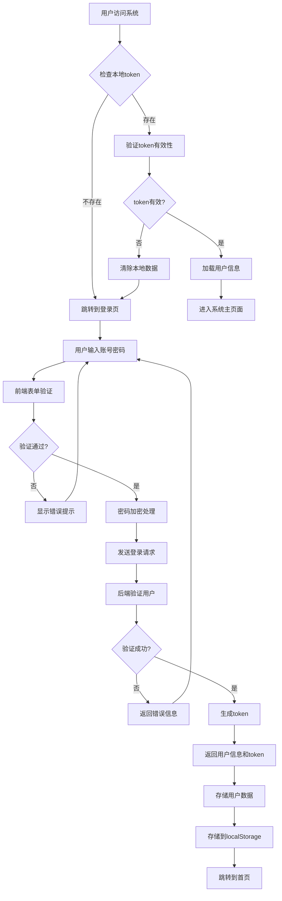
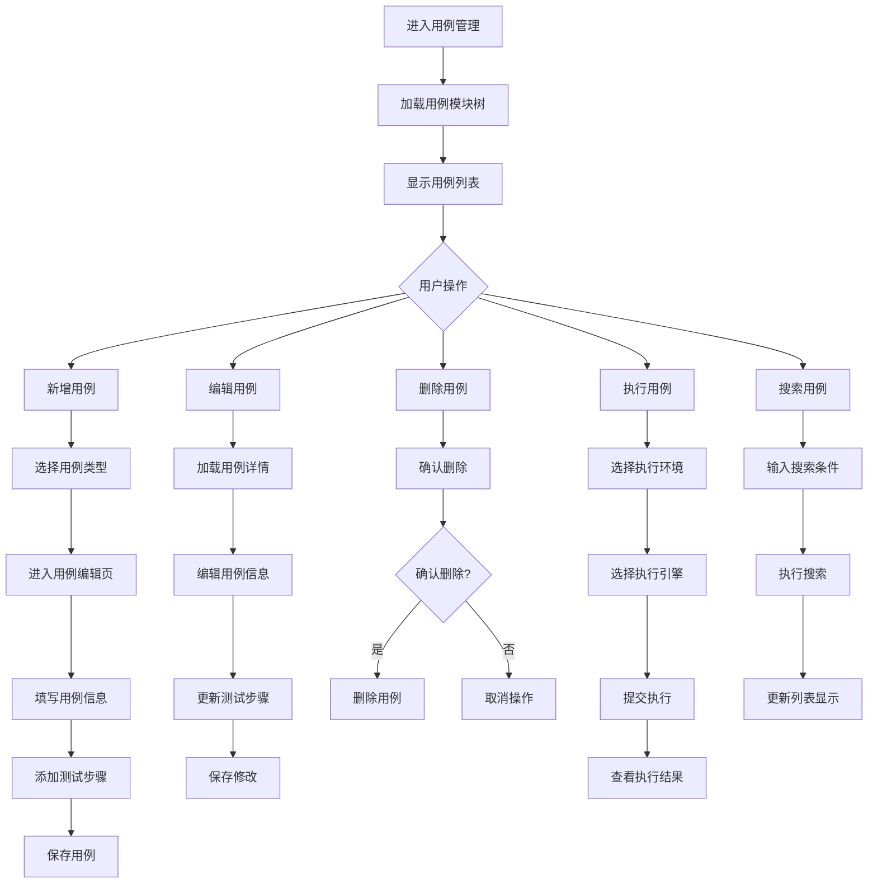
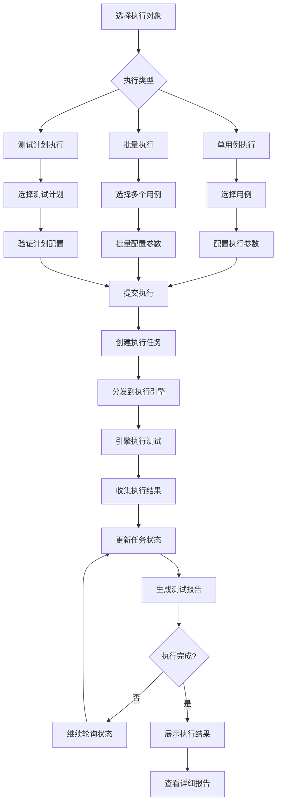
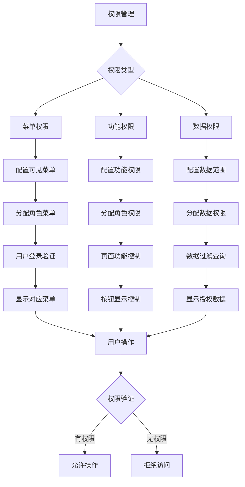

# 业务逻辑设计

## 核心业务流程

### 1. 用户登录认证流程



#### 登录业务规则

1. **表单验证规则**
   - 用户名：必填，长度3-20位，支持字母、数字、下划线
   - 密码：必填，长度6-20位，必须包含字母和数字
   - 记住密码：可选，勾选后保存加密后的密码到本地

2. **安全验证规则**
   - 密码传输前进行Base64编码，防止明文传输
   - 登录失败3次后启用验证码机制
   - 同一IP短时间内多次登录失败进行限制

3. **会话管理规则**
   - token有效期为24小时，过期需要重新登录
   - 用户主动退出时清除所有本地存储数据
   - 记住密码功能最长保存7天

### 2. 用例管理业务流程



#### 用例管理业务规则

1. **用例创建规则**
   - 用例名称：必填，同一模块下名称不能重复
   - 用例编号：自动生成，格式为项目编码+模块编码+序号
   - 用例类型：API/WEB/APP，不同类型对应不同的编辑界面
   - 用例等级：P0（核心）、P1（重要）、P2（一般）、P3（次要）

2. **用例编辑规则**
   - 只有用例创建人和项目管理员可以编辑用例
   - 用例被测试计划引用时，关键信息修改需要确认
   - 支持富文本编辑用例描述和预期结果
   - 步骤编辑支持拖拽排序

3. **用例删除规则**
   - 已关联测试计划的用例不能直接删除
   - 删除用例需要二次确认
   - 删除后数据进入回收站，30天内可恢复
   - 物理删除需要管理员权限

### 3. 测试执行业务流程



#### 测试执行业务规则

1. **执行参数配置规则**
   - 必须选择执行环境，环境类型需要与用例类型匹配
   - 可选择执行引擎，不选择时系统自动分配
   - 支持设置执行超时时间，默认30分钟
   - 支持设置重试次数，失败后自动重试

2. **执行排队规则**
   - 同一引擎同时只能执行一个任务
   - 任务按照提交时间排队执行
   - 支持任务优先级设置，高优先级任务可插队
   - 支持取消排队中的任务

3. **结果收集规则**
   - 实时收集执行日志，支持在线查看
   - 失败用例自动截图保存
   - 执行结果包含每个步骤的详细信息
   - 支持导出PDF格式的测试报告

### 4. 权限管理业务流程



## 关键业务规则

### 1. 数据一致性规则

1. **项目数据一致性**
   - 用户切换项目时，所有列表数据需要重新加载
   - 项目删除时，关联数据需要逻辑删除
   - 项目编码修改时，相关用例编号需要同步更新

2. **用例数据一致性**
   - 模块删除时，子模块和用例需要处理
   - 用例类型修改时，需要验证步骤兼容性
   - 用例删除时，关联的执行记录保留但显示已删除标记

3. **执行数据一致性**
   - 环境删除时，关联的执行历史保留
   - 引擎删除时，未完成的任务需要重新分配
   - 用户删除时，其创建的执行记录保留但显示创建人已删除

### 2. 并发控制规则

1. **编辑冲突控制**
   - 同一用例同时只能有一个用户编辑
   - 编辑前检查版本号，版本冲突时提示用户
   - 自动保存草稿，防止意外丢失

2. **执行并发控制**
   - 同一用例不能同时执行多次
   - 环境被占用时，后续任务需要排队
   - 支持任务抢占，管理员可中止正在执行的任务

3. **数据更新控制**
   - 批量操作需要事务控制
   - 删除操作需要软删除，支持数据恢复
   - 重要操作需要记录操作日志

### 3. 数据验证规则

1. **输入验证规则**
   - 所有用户输入都需要前端验证
   - 特殊字符需要进行转义处理
   - 文件上传需要类型和大小验证
   - 数值输入需要范围验证

2. **业务逻辑验证**
   - 用例步骤需要完整性验证
   - 测试计划需要包含有效用例
   - 环境配置需要连通性验证
   - 定时任务需要时间格式验证

3. **权限验证规则**
   - 每个API调用都需要权限验证
   - 数据查询需要数据权限过滤
   - 敏感操作需要二次验证
   - 管理员操作需要审计记录

## 异常处理机制

### 1. 前端异常处理

```javascript
// 全局异常处理
Vue.config.errorHandler = function (err, vm, info) {
    console.error('全局错误:', err);
    
    // 错误分类处理
    if (err.name === 'ApiError') {
        // API错误处理
        handleApiError(err);
    } else if (err.name === 'NetworkError') {
        // 网络错误处理
        handleNetworkError(err);
    } else if (err.name === 'ValidationError') {
        // 验证错误处理
        handleValidationError(err);
    } else {
        // 其他错误处理
        handleUnknownError(err);
    }
    
    // 记录错误日志
    logError(err, vm, info);
};

// API错误处理函数
function handleApiError(error) {
    switch (error.code) {
        case 401:
            // 未授权，跳转到登录页
            router.push('/login');
            Message.error('登录已过期，请重新登录');
            break;
        case 403:
            // 无权限，显示权限不足提示
            Message.error('您没有权限执行此操作');
            break;
        case 404:
            // 资源不存在
            Message.error('请求的资源不存在');
            break;
        case 500:
            // 服务器错误
            Message.error('服务器内部错误，请稍后重试');
            break;
        default:
            // 其他错误
            Message.error(error.message || '操作失败');
    }
}

// 网络错误处理函数
function handleNetworkError(error) {
    if (error.message.includes('timeout')) {
        Message.error('请求超时，请检查网络连接');
    } else if (error.message.includes('Network Error')) {
        Message.error('网络连接错误，请检查网络设置');
    } else {
        Message.error('网络异常，请稍后重试');
    }
}
```

### 2. 业务异常处理

#### 用例执行异常处理
```javascript
// 执行异常分类处理
function handleExecuteError(error, taskId) {
    const errorType = classifyError(error);
    
    switch (errorType) {
        case 'ENVIRONMENT_ERROR':
            // 环境配置错误
            showEnvironmentErrorDialog(error);
            break;
        case 'SCRIPT_ERROR':
            // 测试脚本错误
            showScriptErrorDialog(error);
            break;
        case 'ELEMENT_NOT_FOUND':
            // 元素定位失败
            showElementErrorDialog(error);
            break;
        case 'ASSERTION_ERROR':
            // 断言失败
            showAssertionErrorDialog(error);
            break;
        case 'TIMEOUT_ERROR':
            // 超时错误
            showTimeoutErrorDialog(error);
            break;
        default:
            // 未知错误
            showUnknownErrorDialog(error);
    }
    
    // 记录异常信息
    logExecuteError(error, taskId);
}
```

#### 数据操作异常处理
```javascript
// 数据操作异常处理
function handleDataError(error, operation) {
    if (error.code === 'DUPLICATE_KEY') {
        // 唯一键冲突
        const field = extractFieldFromError(error);
        Message.error(`${field}已存在，请使用其他值`);
    } else if (error.code === 'FOREIGN_KEY_CONSTRAINT') {
        // 外键约束错误
        Message.error('该数据已被其他数据引用，无法删除');
    } else if (error.code === 'DATA_NOT_FOUND') {
        // 数据不存在
        Message.error('数据不存在或已被删除');
        // 刷新列表
        this.loadData();
    } else if (error.code === 'VERSION_CONFLICT') {
        // 版本冲突
        Message.error('数据已被其他用户修改，请刷新后重试');
    } else {
        // 其他错误
        Message.error('数据操作失败：' + error.message);
    }
}
```

### 3. 用户友好提示

#### 操作成功提示
```javascript
// 成功提示封装
function showSuccess(message, duration = 3000) {
    Message.success({
        message: message,
        duration: duration,
        showClose: true
    });
}

// 使用示例
this.$api.saveCase(caseData).then(response => {
    showSuccess('用例保存成功');
    this.loadCaseList();
}).catch(error => {
    handleDataError(error, 'save');
});
```

#### 操作确认对话框
```javascript
// 删除确认对话框
function showDeleteConfirm(message = '此操作将永久删除该数据，是否继续？') {
    return this.$confirm(message, '提示', {
        confirmButtonText: '确定',
        cancelButtonText: '取消',
        type: 'warning',
        center: true
    });
}

// 使用示例
handleDelete(row) {
    showDeleteConfirm().then(() => {
        return this.$api.deleteCase(row.id);
    }).then(() => {
        showSuccess('删除成功');
        this.loadData();
    }).catch(() => {
        // 用户取消操作
    });
}
```

### 4. 错误恢复机制

#### 自动重试机制
```javascript
// 自动重试封装
function retryRequest(requestFunc, maxRetries = 3) {
    return new Promise((resolve, reject) => {
        let attempts = 0;
        
        function attempt() {
            attempts++;
            requestFunc()
                .then(resolve)
                .catch(error => {
                    if (attempts < maxRetries && isRetryableError(error)) {
                        // 延迟后重试
                        setTimeout(attempt, 1000 * attempts);
                    } else {
                        reject(error);
                    }
                });
        }
        
        attempt();
    });
}

// 判断是否需要重试
function isRetryableError(error) {
    return error.code === 'NETWORK_ERROR' || 
           error.code === 'TIMEOUT' || 
           error.status >= 500;
}
```

#### 数据恢复机制
```javascript
// 表单数据自动保存和恢复
const formAutoSave = {
    save(formName, formData) {
        const key = `form_draft_${formName}`;
        localStorage.setItem(key, JSON.stringify({
            data: formData,
            timestamp: Date.now()
        }));
    },
    
    restore(formName) {
        const key = `form_draft_${formName}`;
        const saved = localStorage.getItem(key);
        
        if (saved) {
            const parsed = JSON.parse(saved);
            // 检查数据有效期（24小时）
            if (Date.now() - parsed.timestamp < 24 * 60 * 60 * 1000) {
                return parsed.data;
            }
        }
        
        return null;
    },
    
    clear(formName) {
        const key = `form_draft_${formName}`;
        localStorage.removeItem(key);
    }
};
```

## 性能优化策略

### 1. 数据加载优化

#### 分页和懒加载
```javascript
// 虚拟滚动实现
function virtualScroll(list, itemHeight, visibleCount) {
    const startIndex = Math.floor(scrollTop / itemHeight);
    const endIndex = startIndex + visibleCount;
    
    return {
        visibleData: list.slice(startIndex, endIndex),
        offsetY: startIndex * itemHeight
    };
}

// 分页请求封装
async function loadPageData(pageNum, pageSize, filters) {
    const cacheKey = `page_${pageNum}_${pageSize}_${JSON.stringify(filters)}`;
    
    // 检查缓存
    const cached = cacheManager.get(cacheKey);
    if (cached) {
        return cached;
    }
    
    // 请求数据
    const response = await this.$api.getList({
        pageNum,
        pageSize,
        ...filters
    });
    
    // 缓存结果
    cacheManager.set(cacheKey, response.data);
    
    return response.data;
}
```

### 2. 组件性能优化

#### 组件缓存策略
```javascript
// 路由缓存配置
const routerConfig = {
    path: '/case',
    component: CaseManage,
    meta: {
        keepAlive: true,  // 启用缓存
        cacheKey: 'case_manage' // 缓存键
    }
};

// 组件内部缓存
export default {
    name: 'CaseManage',
    data() {
        return {
            // 缓存数据
            cacheData: new Map()
        };
    },
    
    methods: {
        // 带缓存的数据获取
        async getCachedData(key, fetchFunc) {
            if (this.cacheData.has(key)) {
                return this.cacheData.get(key);
            }
            
            const data = await fetchFunc();
            this.cacheData.set(key, data);
            
            return data;
        }
    }
};
```

### 3. 网络请求优化

#### 请求合并和防抖
```javascript
// 请求防抖
function debounceRequest(requestFunc, delay = 300) {
    let timeoutId;
    
    return function(...args) {
        return new Promise((resolve, reject) => {
            clearTimeout(timeoutId);
            
            timeoutId = setTimeout(() => {
                requestFunc.apply(this, args)
                    .then(resolve)
                    .catch(reject);
            }, delay);
        });
    };
}

// 请求合并
class RequestMerger {
    constructor() {
        this.pendingRequests = new Map();
    }
    
    async mergeRequest(key, requestFunc) {
        // 检查是否有相同请求在进行
        if (this.pendingRequests.has(key)) {
            return this.pendingRequests.get(key);
        }
        
        // 创建新的请求
        const request = requestFunc()
            .finally(() => {
                this.pendingRequests.delete(key);
            });
        
        this.pendingRequests.set(key, request);
        
        return request;
    }
}
```