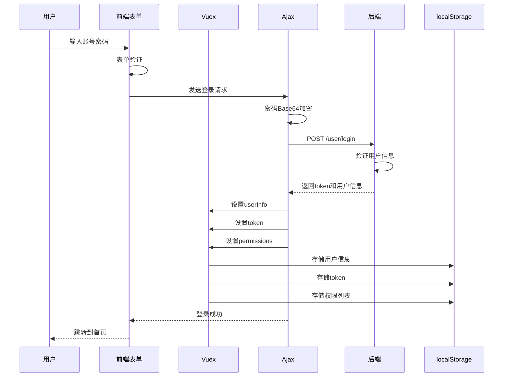
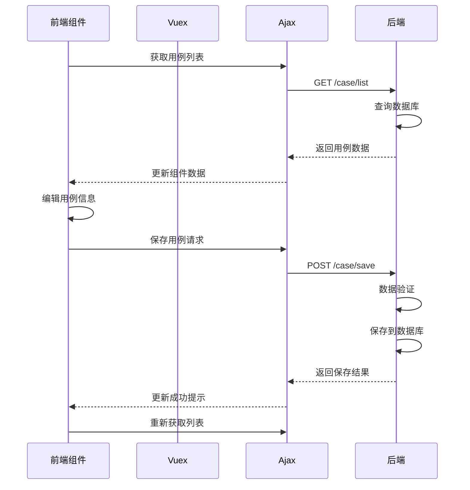
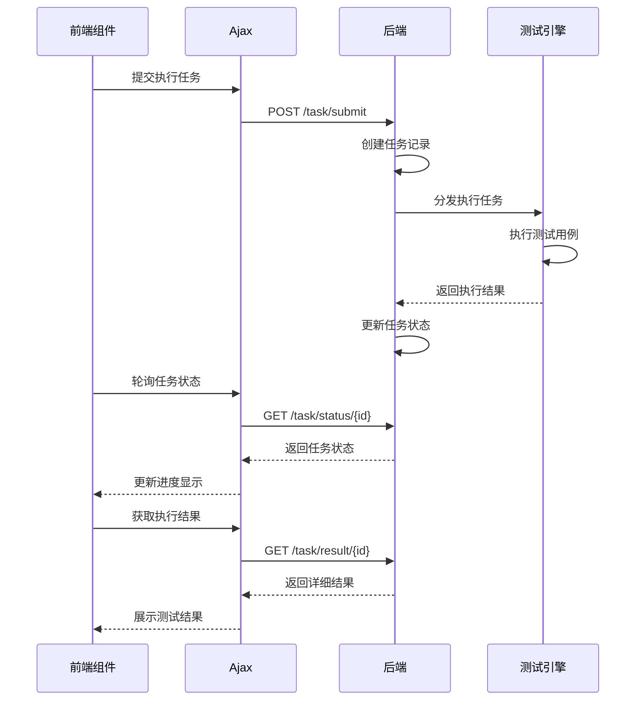

# 数据设计

## 主要数据结构

### 1. 用户相关数据结构

#### 用户登录信息
```javascript
// 存储在Vuex store和localStorage中的用户数据
userInfo: {
    id: number,              // 用户ID
    username: string,        // 用户名
    nickname: string,        // 昵称
    email: string,           // 邮箱
    phone: string,           // 手机号
    roleIds: Array<number>, // 角色ID列表
    projectIds: Array<number>, // 项目ID列表
    createTime: string,      // 创建时间
    updateTime: string       // 更新时间
}

token: string,               // JWT令牌，用于API认证
permissions: Array<string>   // 权限标识列表，用于功能权限控制
```

#### 权限数据结构
```javascript
permissions: [
    'user:list',      // 用户列表
    'user:add',       // 添加用户
    'user:edit',      // 编辑用户
    'user:delete',    // 删除用户
    'role:list',      // 角色列表
    'role:add',       // 添加角色
    // ... 其他权限标识
]
```

### 2. 项目相关数据结构

#### 项目信息
```javascript
projectInfo: {
    id: number,              // 项目ID
    name: string,            // 项目名称
    code: string,            // 项目编码
    description: string,     // 项目描述
    status: number,          // 项目状态：0-禁用，1-启用
    createUser: string,        // 创建人
    createTime: string,      // 创建时间
    updateTime: string       // 更新时间
}

// 存储在Vuex中的当前项目ID
currentProjectId: number
```

### 3. 用例相关数据结构

#### 用例基本信息
```javascript
caseInfo: {
    id: number,              // 用例ID
    num: string,             // 用例编号
    name: string,            // 用例名称
    type: string,            // 用例类型：API/WEB/APP
    level: string,           // 用例等级：P0/P1/P2/P3
    system: string,          // 操作系统：ANDROID/APPLE（APP用例）
    moduleId: number,        // 所属模块ID
    moduleName: string,        // 所属模块名称
    description: string,     // 用例描述
    steps: Array<step>,       // 用例步骤
    tags: Array<string>,     // 标签列表
    status: number,          // 状态：0-禁用，1-启用
    createUser: string,      // 创建人
    createTime: string,      // 创建时间
    updateTime: string,      // 更新时间
    updateUser: string       // 更新人
}
```

#### 用例步骤结构
```javascript
step: {
    id: number,              // 步骤ID
    caseId: number,          // 用例ID
    stepNo: number,          // 步骤序号
    operation: string,       // 操作类型
    target: string,          // 操作目标
    data: string,            // 输入数据
    expectedResult: string,  // 预期结果
    description: string,     // 步骤描述
    waitTime: number,        // 等待时间（秒）
    screenshot: boolean      // 是否截图
}
```

#### 用例模块结构
```javascript
moduleInfo: {
    id: number,              // 模块ID
    name: string,            // 模块名称
    parentId: number,        // 父模块ID
    projectId: number,       // 项目ID
    level: number,           // 层级
    path: string,            // 路径
    sort: number,            // 排序
    createTime: string,     // 创建时间
    children: Array<moduleInfo> // 子模块
}
```

### 4. 环境相关数据结构

#### 环境配置
```javascript
environment: {
    id: number,              // 环境ID
    name: string,            // 环境名称
    code: string,            // 环境编码
    type: string,            // 环境类型：API/WEB/APP
    config: Object,          // 环境配置
    projectId: number,       // 项目ID
    status: number,          // 状态
    createTime: string,      // 创建时间
    updateTime: string       // 更新时间
}

// API环境配置
apiConfig: {
    baseUrl: string,         // 基础URL
    headers: Object,         // 请求头
    timeout: number,         // 超时时间
    retry: number            // 重试次数
}

// WEB环境配置
webConfig: {
    browser: string,           // 浏览器类型
    driverPath: string,        // 驱动路径
    options: Array<string>,   // 启动参数
    windowSize: string        // 窗口大小
}

// APP环境配置
appConfig: {
    platform: string,          // 平台：ANDROID/IOS
    deviceName: string,        // 设备名称
    deviceId: string,          // 设备ID
    appPackage: string,        // 应用包名
    appActivity: string,       // 应用Activity
    automationName: string     // 自动化引擎
}
```

### 5. 测试执行数据结构

#### 测试任务
```javascript
taskInfo: {
    id: number,              // 任务ID
    name: string,            // 任务名称
    type: string,            // 任务类型：CASE/PLAN/COLLECTION
    executeType: string,     // 执行类型：IMMEDIATE/SCHEDULED
    status: string,          // 任务状态
    totalCases: number,      // 总用例数
    passCases: number,       // 通过用例数
    failCases: number,       // 失败用例数
    skipCases: number,       // 跳过用例数
    startTime: string,       // 开始时间
    endTime: string,         // 结束时间
    duration: number,        // 执行时长（秒）
    executor: string,          // 执行人
    environmentId: number,   // 环境ID
    engineId: number,        // 引擎ID
    createTime: string        // 创建时间
}
```

#### 执行结果
```javascript
resultInfo: {
    id: number,              // 结果ID
    taskId: number,          // 任务ID
    caseId: number,          // 用例ID
    caseName: string,        // 用例名称
    status: string,          // 执行状态：PASS/FAIL/SKIP
    errorMessage: string,    // 错误信息
    executeTime: string,     // 执行时间
    duration: number,        // 执行时长
    screenshot: string,      // 截图路径
    log: string,             // 执行日志
    stepResults: Array<stepResult> // 步骤执行结果
}
```

### 6. 公共组件数据结构

#### 公共参数
```javascript
parameter: {
    id: number,              // 参数ID
    name: string,            // 参数名称
    code: string,            // 参数编码
    type: string,            // 参数类型：STRING/NUMBER/BOOLEAN/DATE
    value: string,           // 参数值
    description: string,     // 参数描述
    projectId: number,       // 项目ID
    scope: string,           // 作用域：GLOBAL/PROJECT
    createTime: string       // 创建时间
}
```

#### 函数管理
```javascript
function: {
    id: number,              // 函数ID
    name: string,            // 函数名称
    code: string,            // 函数编码
    category: string,        // 函数分类：STRING/DATE/NUMBER/RANDOM
    params: Array<param>,    // 函数参数
    script: string,          // 函数脚本
    description: string,     // 函数描述
    examples: string,        // 使用示例
    createTime: string       // 创建时间
}
```

#### 元素管理
```javascript
element: {
    id: number,              // 元素ID
    name: string,            // 元素名称
    code: string,            // 元素编码
    type: string,            // 元素类型：ID/XPATH/CSS/CLASS
    value: string,           // 元素定位值
    description: string,     // 元素描述
    moduleId: number,        // 模块ID
    projectId: number,       // 项目ID
    createTime: string       // 创建时间
}
```

## 数据流转过程

### 1. 用户登录数据流转



### 2. 用例管理数据流转



### 3. 测试执行数据流转



## 存储方案

### 1. 前端存储方案

#### localStorage存储结构
```javascript
// 用户会话数据
localStorage: {
    'userInfo': JSON.stringify(userInfo),      // 用户信息
    'token': token,                            // 访问令牌
    'permissions': JSON.stringify(permissions), // 权限列表
    'currentProjectId': projectId,             // 当前项目ID
    'rememberMe': boolean,                     // 记住登录状态
    'username': username,                      // 记住的用户名
    'password': password                       // 记住的密码（加密）
}

// 系统配置数据
localStorage: {
    'sidebarCollapsed': boolean,               // 侧边栏折叠状态
    'theme': string,                          // 主题配置
    'language': string                        // 语言设置
}
```

#### sessionStorage存储结构
```javascript
// 临时会话数据
sessionStorage: {
    'searchConditions': JSON.stringify(conditions), // 搜索条件
    'pageParams': JSON.stringify(params),       // 分页参数
    'selectedItems': JSON.stringify(items),     // 选中项
    'formDraft': JSON.stringify(formData)      // 表单草稿
}
```

### 2. Vuex状态管理

#### State结构
```javascript
state: {
    userInfo: Object,        // 用户信息
    token: String,           // 访问令牌
    permissions: Array,      // 权限列表
    projectId: Number,       // 当前项目ID
    menuList: Array,         // 菜单列表
    isLoading: Boolean,      // 全局加载状态
    errorMessage: String,    // 错误信息
    successMessage: String   // 成功信息
}
```

#### Getters定义
```javascript
getters: {
    isLoggedIn: state => !!state.token,                    // 是否已登录
    hasPermission: state => permission => {                // 检查权限
        return state.permissions.includes(permission);
    },
    currentProject: state => state.projectId,             // 当前项目
    userRoles: state => state.userInfo.roleIds || [],     // 用户角色
    menuTree: state => buildMenuTree(state.menuList)      // 菜单树结构
}
```

### 3. 组件数据管理

#### 列表组件数据结构
```javascript
data() {
    return {
        // 表格数据
        tableData: [],
        loading: false,
        
        // 分页参数
        pageParam: {
            pageNum: 1,
            pageSize: 10,
            total: 0
        },
        
        // 搜索条件
        searchForm: {
            condition: '',
            status: '',
            type: '',
            dateRange: []
        },
        
        // 选中数据
        selectedRows: [],
        
        // 对话框状态
        dialogVisible: false,
        dialogTitle: '',
        
        // 表单数据
        formData: {},
        
        // 表单验证规则
        formRules: {
            name: [{ required: true, message: '请输入名称', trigger: 'blur' }],
            code: [{ required: true, message: '请输入编码', trigger: 'blur' }]
        }
    };
}
```

#### 树形组件数据结构
```javascript
data() {
    return {
        // 树数据
        treeData: [],
        
        // 默认展开节点
        defaultExpandedKeys: [],
        
        // 当前选中节点
        currentNode: null,
        currentNodeKey: '',
        
        // 树配置
        treeProps: {
            children: 'children',
            label: 'name',
            id: 'id'
        },
        
        // 右键菜单
        contextMenuVisible: false,
        contextMenuNode: null
    };
}
```

### 4. 数据缓存策略

#### API响应缓存
```javascript
// 缓存管理器
const cacheManager = {
    cache: new Map(),
    
    set(key, data, expireTime = 300000) { // 默认5分钟过期
        this.cache.set(key, {
            data: data,
            expireTime: Date.now() + expireTime
        });
    },
    
    get(key) {
        const cached = this.cache.get(key);
        if (cached && cached.expireTime > Date.now()) {
            return cached.data;
        }
        this.cache.delete(key);
        return null;
    },
    
    clear() {
        this.cache.clear();
    }
};
```

#### 数据同步机制
```javascript
// 数据同步管理
const dataSync = {
    // 监听数据变化
    watchDataChanges() {
        window.addEventListener('storage', (event) => {
            if (event.key === 'userInfo') {
                // 用户信息变更，重新加载权限
                this.reloadPermissions();
            }
        });
    },
    
    // 跨标签页通信
    broadcastMessage(type, data) {
        localStorage.setItem('broadcast', JSON.stringify({
            type: type,
            data: data,
            timestamp: Date.now()
        }));
    }
};
```

## 数据安全考虑

### 1. 敏感数据处理
- 用户密码在前端进行Base64编码，不存储明文密码
- Token等敏感信息使用HTTPS传输
- 用户权限信息不暴露给未授权用户

### 2. 数据验证
- 所有表单输入都进行前端验证
- API请求参数进行格式和长度验证
- 文件上传进行类型和大小限制

### 3. 数据脱敏
- 用户手机号、邮箱等敏感信息显示时进行脱敏处理
- 错误信息不暴露系统内部结构和敏感信息
- 日志中不记录用户密码等敏感信息