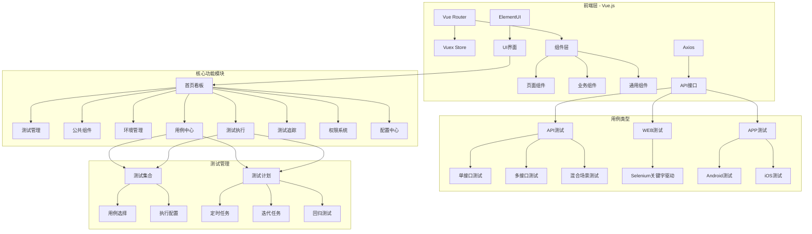
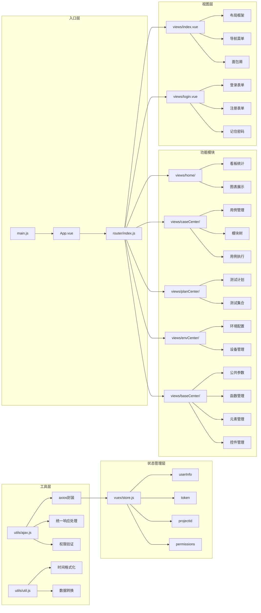
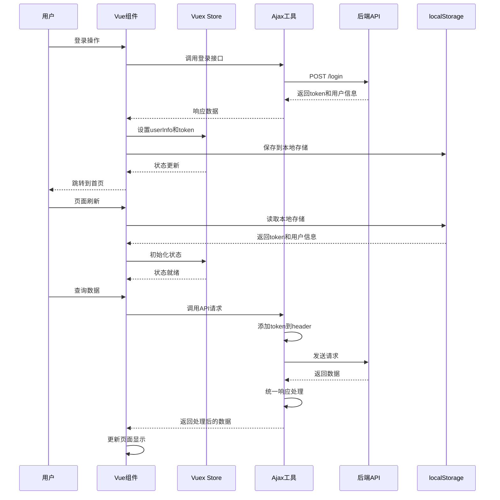
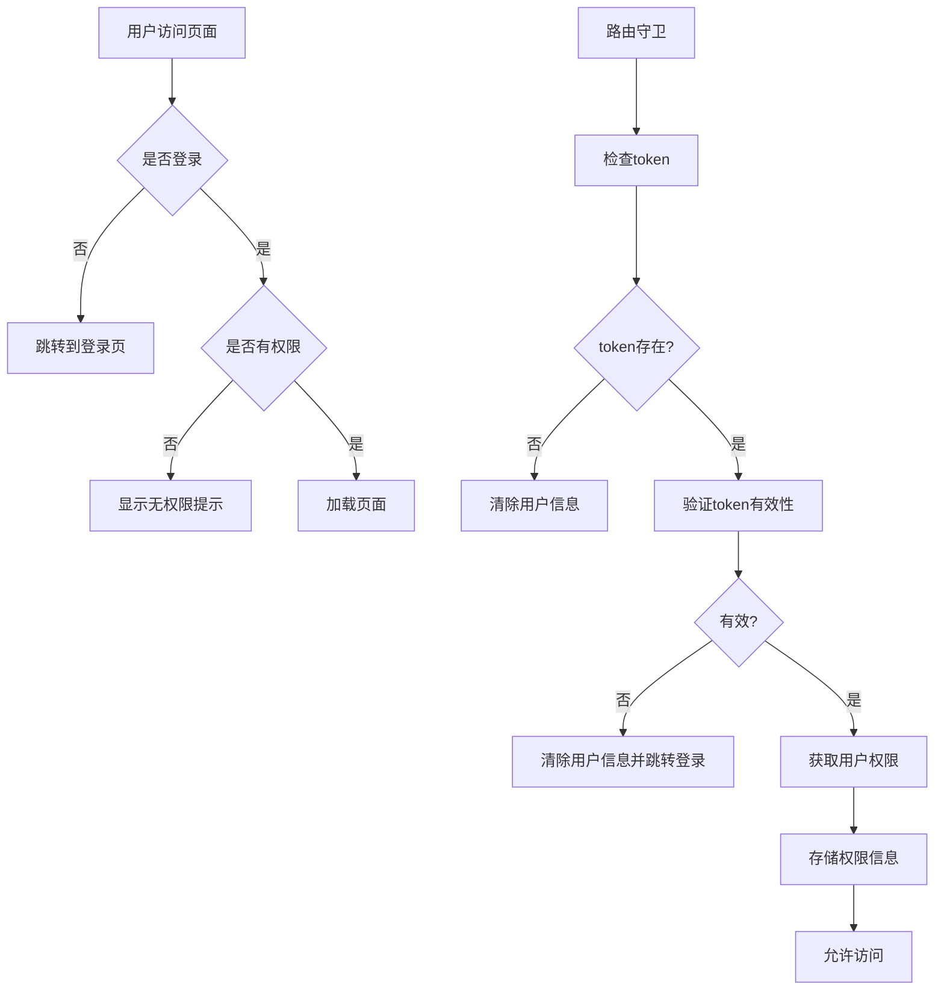

# 系统功能结构图

## 系统整体架构图

## 前端架构详细结构图

## 数据流转图

## 权限控制流程图

## 技术架构说明

### 前端技术栈

1. **Vue.js 2.x**: 核心前端框架，提供响应式数据绑定和组件化开发
2. **Vue Router**: 路由管理，实现单页面应用的路由跳转和权限控制
3. **Vuex**: 状态管理，统一管理应用状态，包括用户信息、权限、项目ID等
4. **ElementUI**: UI组件库，提供丰富的界面组件和交互效果
5. **Axios**: HTTP请求库，用于与后端API进行数据交互
6. **ECharts**: 图表库，用于数据可视化和看板展示
7. **vue2-ace-editor**: 代码编辑器组件，用于测试脚本编辑

### 架构特点

1. **模块化设计**: 按功能模块划分目录结构，便于维护和扩展
2. **组件化开发**: 页面拆分为可复用的组件，提高开发效率
3. **统一状态管理**: 通过Vuex集中管理应用状态，确保数据一致性
4. **权限控制**: 基于角色的权限控制，支持页面级和功能级权限
5. **响应式布局**: 适配不同屏幕尺寸，提供良好的用户体验

### 核心功能模块说明

#### 1. 首页看板模块
- **功能**: 展示系统整体数据统计、个人工作台、团队看板
- **技术实现**: 使用ECharts进行数据可视化，通过API获取实时数据
- **数据流转**: 组件挂载时调用API获取数据，存储到组件data中，渲染图表

#### 2. 用例中心模块
- **功能**: 测试用例的创建、编辑、管理和执行
- **技术实现**: 树形结构展示用例模块，表格展示用例列表，支持增删改查
- **数据流转**: 通过模块树筛选用例，支持分页查询和条件搜索

#### 3. 测试执行模块
- **功能**: 测试用例的执行、结果展示和报告生成
- **技术实现**: 选择执行引擎和环境，异步执行测试任务，实时展示执行结果
- **数据流转**: 提交执行任务，轮询获取执行状态，展示执行日志和结果

#### 4. 环境管理模块
- **功能**: 测试环境配置、设备管理、代理配置
- **技术实现**: 表单配置环境参数，支持环境分组和设备绑定
- **数据流转**: 环境配置保存到后端，执行时选择对应环境

#### 5. 权限系统模块
- **功能**: 用户管理、角色管理、权限分配
- **技术实现**: 基于RBAC模型的权限控制，支持菜单级和功能级权限
- **数据流转**: 登录时获取用户权限，路由守卫验证权限，组件内控制功能显示

### 数据存储方案

1. **用户会话数据**: 使用localStorage存储token和用户信息，实现会话保持
2. **应用状态数据**: 使用Vuex存储应用状态，页面刷新时从localStorage恢复
3. **业务数据**: 通过API与后端交互，不存储敏感数据到前端
4. **配置数据**: 部分配置数据存储到localStorage，减少重复请求

### 异常处理机制

1. **网络异常**: 统一封装Axios响应拦截器，处理网络错误和超时
2. **权限异常**: 路由守卫检测权限，无权限时给出友好提示
3. **业务异常**: 后端返回错误码时，前端统一处理并显示错误信息
4. **数据异常**: 表单验证和数据校验，确保数据完整性和正确性

### 性能优化策略

1. **组件懒加载**: 使用Vue Router的懒加载功能，按需加载组件
2. **数据缓存**: 合理使用localStorage缓存不频繁变化的数据
3. **分页查询**: 大量数据使用分页展示，减少单次数据加载量
4. **防抖节流**: 搜索和输入操作使用防抖节流，减少API调用频率